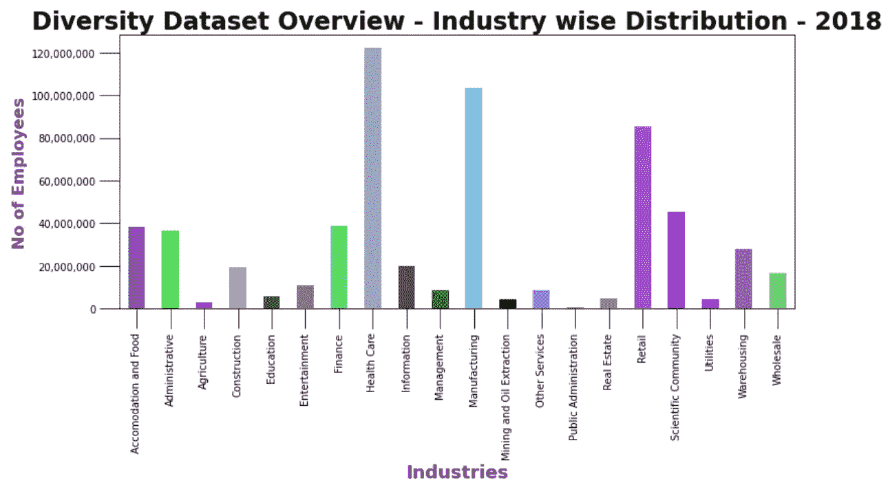
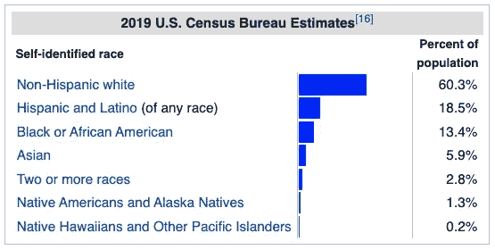
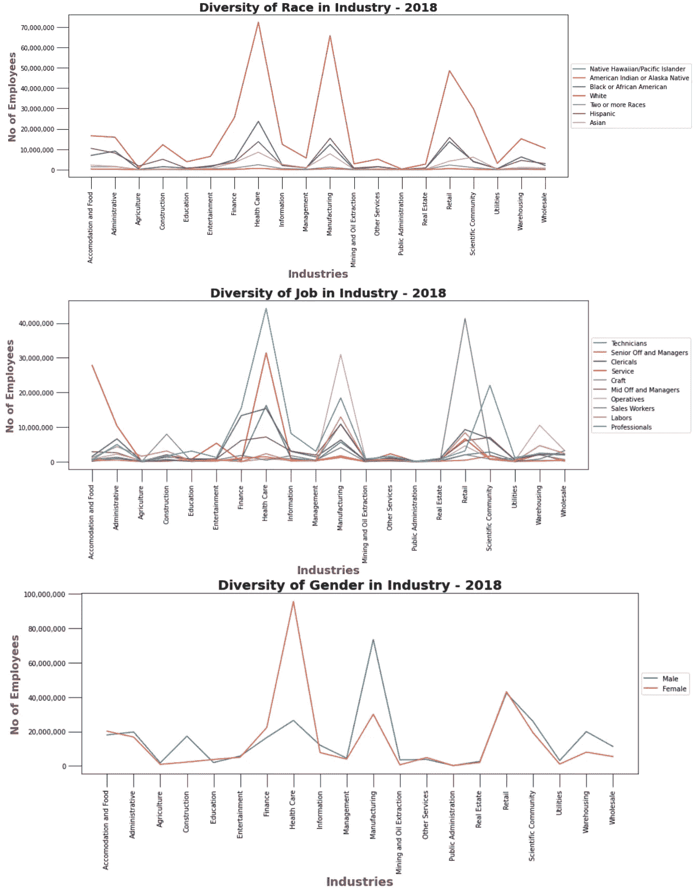
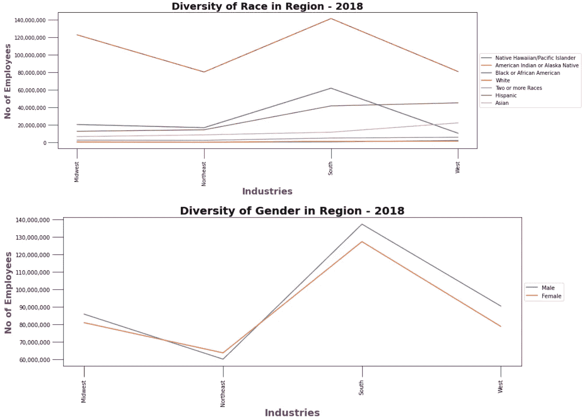
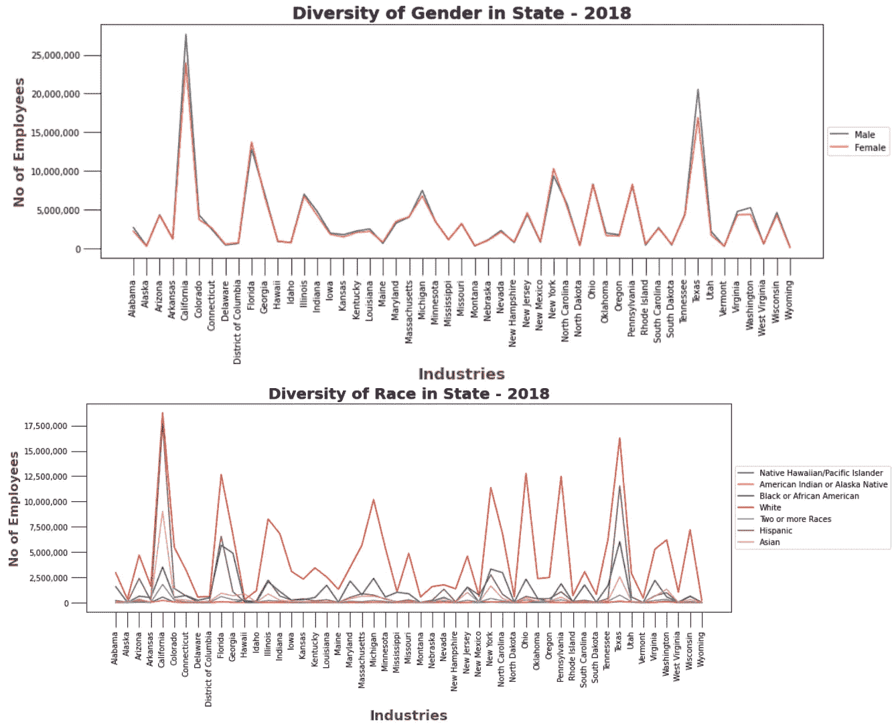

# 分析美国的种族/性别/工作多样性

> 原文：<https://medium.com/nerd-for-tech/analyzing-diversity-in-the-us-eca0ed5edcbc?source=collection_archive---------31----------------------->

# 目录

1.  **简介**
2.  **关于数据集**
3.  **技术栈**
4.  **方法论**
5.  **有趣的见解**
6.  **未来范围**
7.  **经验和重要环节**

# **简介**

随着去年有关种族歧视的抗议浪潮，许多公司发誓要更加“多样化”、“包容”和“平等”。事实证明，新冠肺炎本身对少数民族比对富人更苛刻。世界正慢慢意识到自己的世界性和多样性。然而，我们仍然需要几十年的增量工作来完全包容人才。监测这些变化的一种方法是通过分析美国不同行业、地区和州的不同种族、民族和性别的在职专业人士的数量。在检查这些数据时，我可以提出 13 个有趣的见解，希望你也会感兴趣。

# **关于数据集**

作为 1964 年《民权法案》规定的任务的一部分，平等就业机会委员会要求公共/私营/工会/劳工雇主提交定期报告，按性别、种族和工作简介说明其劳动力的构成。数据集是-

> 私营企业中少数民族和妇女的工作模式(EEO-1: 2017/2018)

由于这一举措，每年从拥有 100 名或 100 名以上雇员的近 75 000 家私营雇主或拥有 50 名或 50 名以上雇员的联邦承包商那里收集数据。该数据集总共有大约 2000 万个数据点。

以下是各行业员工的分布汇总，让您对数据集有所了解:

图 EE01 2018 数据集员工的行业分布

以下是用于执行此分析的属性:

*   *地区*:表示员工的地区构成——中西部、东北、南部、西部
*   *州*:表示各州雇员的构成——所有 50 个州
*   *行业/北美行业分类系统(NAICS)* :表示美国 20 个不同类型的行业

以下是用于执行此分析的色谱柱:

*   种族:表示美国不同的种族——白人、亚洲人、黑人或非裔美国人、混血儿、夏威夷原住民或其他太平洋岛民、西班牙裔或美国印第安人或阿拉斯加原住民
*   性别:表示美国不同的种族——男性、女性
*   *工作简介*:表示 20 种不同的工作级别——劳工、服务、文书、技术员、销售人员、中级和经理、操作工、专业人员、高级和经理、技工

在运行时，根据每个用例，使用一个数据子集来创建不同的视图。

# 技术栈

在 Jupyter 笔记本的帮助下，编写了 Python 代码，并在 Github 上开源。Pandas 数据框架和 python 范例有助于实现轻量级、可扩展和高效的代码。为了可视化不同的比较，像“matplotlib”这样的 Python 库非常方便，特别是使用相同的子例程创建不同的图形。数据结构和算法的有效使用在整个代码库中非常普遍，这有助于快速绘制各种图形。

# **方法论**

由于数据集很大，不可能对每个场景进行详尽的搜索，然后得出见解。对于这个分析，我更多地关注于聚合级信息。数据集提供了地区、州和行业类型等属性，使我们能够汇总每种类型的所有可用信息。这种有重点的方法将有助于对美国不同行业、地区和州的多样性有一个统一的看法。该数据集还提供了种族、性别和工作简介等属性，以比较少数民族和多数民族的数据，并突出少数民族需要帮助的领域。

首先，我绘制了图表，总结了美国不同行业类型的 2017/2018 年数据集。随着行业内数据的细微年度变化和多样化的代表性，很明显，美国在每个领域都有不同类型的稳定企业提供大量就业机会。
有趣的是，该数据集拥有来自医疗保健、制造和零售行业的最大数据，显示这三个行业提供了全国最多的工作岗位。然而，农业、教育、采矿和石油开采、公共管理、房地产和公用事业在总劳动力中所占比例不到 500 万。

阻力指数是根据种族/性别/工作概况对少数民族进行的综合研究。

图 2:维基百科页面片段——美国的种族和民族

该数据集乐观地统计了美国大中型企业的所有员工。很大一部分人口仍未被计算在内。根据美国人口普查局的估计，所有的人口统计数据都在这个[统计数据](https://en.wikipedia.org/wiki/Race_and_ethnicity_in_the_United_States)中。

# **有趣的见解**

让我们进一步分解这一分析，以深入理解它——

图 3:2018 年种族/性别/工作概况与行业

## 全行业比较

1.  除了农业和公共管理，所有行业似乎都由白人主导。医疗保健、制造和零售等行业拥有最多的员工。然而，在这些行业中，超过一半的行业是由白人主导的。
2.  好消息是，在白人占主导地位的领域，少数族裔的数量最多，这表明多样性与该行业的工作岗位数量成正比。
3.  在白人之后，黑人/非洲裔美国人和西班牙裔美国人似乎在少数民族阵营中人数最多。该数据集涵盖了数百万亚洲人和混血儿。由于他们只占美国人口的 1.5%，夏威夷土著人/太平洋岛民/美洲印第安人/阿拉斯加土著人是美国最缺乏代表性的少数民族。
4.  毫不奇怪，由于过多的印度学生选择在美国学术机构从事研究，亚洲人在科学界是最占主导地位的少数民族。
5.  建筑、制造和仓储等行业严重依赖男性。妇女继续在医疗保健领域占据主导地位。这些趋势流行了几十年，因为它们的起源似乎深深植根于我们的社会偏见。

图 4:2018 年种族/性别与地区

## 全区域比较

1.  同样，白人在美国所有四个地区都占主导地位，因为他们占总人口的 60%。除了美国西部，黑人/非裔美国人是最主要的少数民族。在西部，由于与墨西哥接壤，西班牙裔人数众多。
2.  在美国的四个地区，性别多样性非常好，保持在接近 50%的比例。

图 5:2018 年种族/性别对比各州

## 全州范围的比较

1.  为了进一步挖掘数据集隐藏的宝藏，我们可以查看每个州级的差异。尽管白人在美国各州都占主导地位，但加州和德克萨斯州似乎是美国最多元化的州，因为在这些州有大量的西班牙裔人。
2.  像纽约、俄亥俄、宾夕法尼亚、华盛顿、佛罗里达和伊利诺伊这样的州有各种各样的少数族裔，但他们和多数族裔之间的差距太大了。而康涅狄格、爱荷华、堪萨斯、肯塔基、内布拉斯加、新罕布什尔和威斯康星等州几乎没有少数民族人口。
3.  同样，数据支持所有州的男女就业人数几乎相等。

## *一般见解*

1.  2017 年和 2018 年之间的数据有微小的变化。
2.  在各行各业中，专业工作仍然非常抢手。同一特定行业的大多数就业水平达到峰值。因此，似乎越多的工作会导致每个技能/层级的员工越多。
3.  有趣的是，由于这些数据集包含了美国和新冠肺炎疫情种族歧视导致的包容性和多样性浪潮之前的数据，因此很难预测 2019/2020/2021 年的类似运动。但与此同时，当最终的数据集可用时，有趣的是看到由于全球各地的艰苦努力，哪些少数民族导致了种族/性别/工作岗位多样性的增加。

# 未来范围

正如《一般见解#3》中所强调的，当 COVID 之后收集的数据到达时，我们可以确定抗议给多样性的整体图景带来了多大的变化。做时间序列分析将有助于我们带来先进的分析工具，来预测我们在各种意义上真正多样化的估计时间。

然而，这个数据集仍然包含无限的隐藏见解。虽然我只触及了表面，但我希望我能与其他爱好者合作，在未来更深入地挖掘这个数据集。

# 经验和重要环节

这个项目是我迄今为止最满意的努力之一。因为这个令人难以置信的数据集，我对这个国家的人口统计数据更加熟悉。此外，我还在数据科学领域尝试了熊猫数据框架和开源技术的真正力量。作为一名每天处理大规模数据集的工程师同事，我仍然对数据如何继续为社区提供支持感到惊讶。

我非常感谢美国平等就业机会委员会不辞辛苦地创建了这个数据集。此外，我想对**Aru nima Singh**小姐在产生深刻见解和开发强大的图表布局方面所做的贡献表示诚挚的感谢。

> 我们在多样性中达到统一的能力将是我们文明的美丽和考验——圣雄甘地

[多样性分析笔记本](https://github.com/singh96aman/Diversity-Analysis---EE01-Dataset/blob/main/Diversity%20Analysis.ipynb) || [Github 代码库](https://github.com/singh96aman/Diversity-Analysis---EE01-Dataset) || [数据集](https://www.eeoc.gov/statistics/employment/jobpatterns/eeo1)