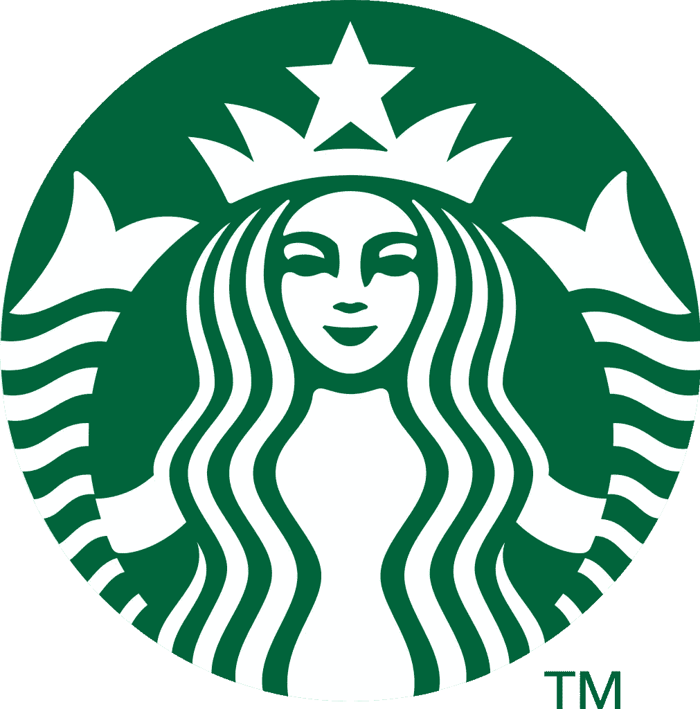
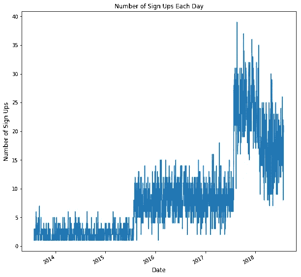
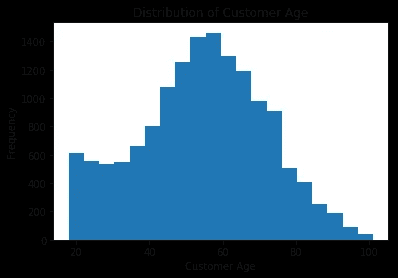
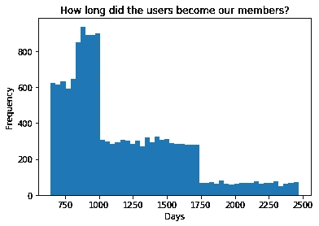
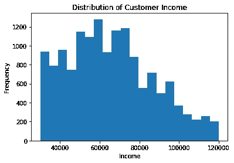
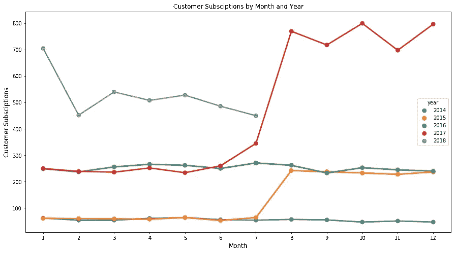
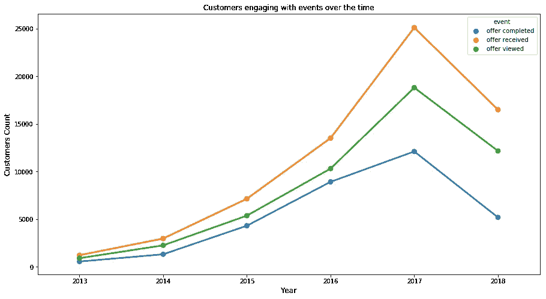
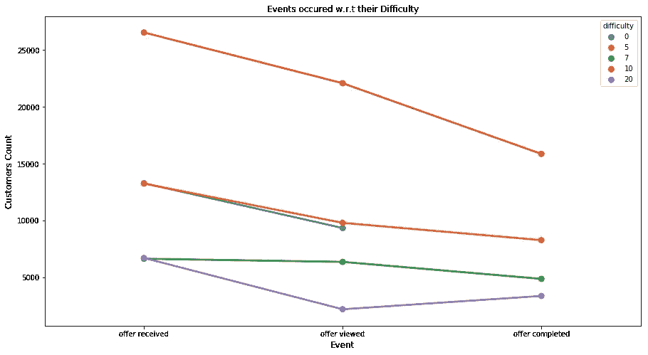

# 为商业智能分析星巴克客户数据

> 原文：<https://medium.com/nerd-for-tech/analyzing-starbucks-customer-data-for-business-intelligence-f74d480580cc?source=collection_archive---------0----------------------->

# 介绍

数据科学正在推动当今企业的战略规划。人工智能和数据科学的出现正被跨国公司广泛用于获取关于商业智能的见解。在本文中，我们将使用星巴克提供的数据来分析这些年来顾客对不同优惠和其他类似细节的反应。

# 项目概述

提供的样本数据集包含模拟星巴克奖励移动应用程序上的客户行为的模拟数据。每隔几天，星巴克就会向手机应用程序的用户发出一次报价。优惠可以仅仅是饮料的广告，也可以是实际的优惠，如折扣或 BOGO(买一送一)。某些用户可能在特定的几周内收不到任何报价。并非所有用户都收到相同的报价，这是这个数据集要解决的挑战。我们的任务是将交易、人口统计和优惠数据结合起来，以确定哪些人口统计群体对哪种优惠类型的反应最好。在要约到期之前，每个要约都有一个有效期。例如，BOGO 的报价可能只有 5 天的有效期。我们将在数据集中看到，信息提供有一个有效期，即使这些广告仅仅是提供有关产品的信息；例如，如果信息性报价有 7 天的有效期，您可以假设客户在收到广告后的 7 天内感受到了报价的影响。我们还获得了显示用户在应用程序上购买的交易数据，包括购买的时间戳和购买的金额。该交易数据还包含用户收到的每个要约的记录，以及用户实际查看要约的记录。当用户完成报价时，也有记录。

# 数据集概述

数据包含在三个文件中:

*   portfolio . JSON——包含要约 id 和关于每个要约的元数据(期限、类型等)。)
*   profile.json —每个客户的人口统计数据
*   transcript.json 记录交易、收到的报价、查看的报价和完成的报价

以下是文件中每个变量的模式和解释:

**portfolio.json**

*   id(字符串)—优惠 id
*   offer_type (string) —优惠的类型，如 BOGO、折扣、信息
*   难度(int) —完成报价所需的最低花费
*   奖励(int) —为完成一项提议而给予的奖励
*   duration(int)-报价开放的时间，以天为单位
*   频道(字符串列表)

**profile.json**

*   年龄(整数)—客户的年龄
*   成为会员日期(整数)—客户创建应用程序帐户的日期
*   性别(str) —客户的性别(请注意，有些条目包含“O”代表其他，而不是 M 或 F)
*   id (str) —客户 id
*   收入(浮动)—客户的收入

**抄本. json**

*   事件(str) —记录描述(即交易、收到的报价、查看的报价等。)
*   人员(字符串)—客户 id
*   时间(整数)—测试开始后的时间，以小时为单位。数据开始于时间 t=0
*   value —(字符串字典)—报价 id 或交易金额，具体取决于记录

# 问题陈述

在这个项目中，我们将解决的问题是检查星巴克推出的优惠的有效性，并分析客户资料，为客户推荐优惠。

# 解决问题的方法

我们将清理、转换和可视化数据，以了解客户对我们产品的反应，以及我们需要关注的客户类别。为了向客户推荐产品，我们将创建用户矩阵，并使用 FunkSVD 进行推荐。

# **接近**

我们采取了以下步骤来获得我们的见解。

## 1.**导入**所需库，读取 json 文件。

## 2.**探索**三个文件全部使用。头()和。描述()方法。

## 3.**数据清理**

a. **Clean_portfolio()** :此函数通过以下方式清理投资组合数据帧

**b. clean_profile():** 此函数通过以下方式清理配置文件数据帧

**c . clean _ 转录本()**:此函数通过以下方式清除转录本数据帧

## 4.浏览已清理的数据。头()和。描述()方法

## 5.数据转换方式

## 6.绘图数据

## 7.创建用户矩阵

## 8.制作培训和测试矩阵

## 9.通过调整潜在特征参数来评估我们的模型。

## 10.获取特定客户的报价

## 11.获得最畅销的优惠

# 数据建模

我们建模数据的主要目标是搜索记录模式:收到的报价、查看的报价、完成的报价。我们可以通过遍历报价和用户来实现我们的目标，获得特定用户和特定报价的所有记录。我们遍历所有记录，如果有任何匹配的模式，我们就在 user-item 矩阵中的特定位置添加一个。否则，我们把零放在那个位置。如果用户从未收到该报价，我们将其保留为 NaN。经过长时间的计算，我们得到了一个包含一些 NaN 和许多 0 的备用矩阵。我们最终可以构建我们需要进一步分析的信息。

## 算法

在我们的模型中，我们将使用 FunkSVD 算法将矩阵分为用户矩阵、潜在特征矩阵和报价矩阵。我们使用 FunkSVD 是因为矩阵中有缺失值，而普通的 SVD 不起作用。

## 韵律学

我们将通过计算均方差来评估我们的模型。我们将通过使用潜在特征值 15、20 和 30 来调整我们的参数，以选择哪一个是最好的。我们对每个模型使用 150 次迭代，学习率为 0.005。对于 15 个潜在值，我们得到 MSE = 0.02422，对于 20 个潜在特征，我们得到 MSE = 0.021273，对于 30 个潜在特征，我们得到 MSE = 0.014342，实现最低 MSE。

## 估价

我们通过在 15、20 和 30 之间改变潜在特征的值来调整我们的模型。运行我们的模型后，我们得到了以下观察结果。

1.  latent_feature = 15 给出最差 MSE = 0.314692，最佳 MSE = 0.02422。
2.  latent_feature =20 给出最差 MSE = 0.329035，最佳 MSE = 0.021273。
3.  latent_feature =30 表示最差 MSE = 0.377391，最佳 MSE =0.014342。

## 丰富

我们使用了 FunckSVD 算法，但这在冷启动情况下对新用户的推荐没有帮助。此外，每个用户收到多个报价，因此可以改善培训和测试之间的分割。

# 视觉效果

我们从这些数据中得到了以下结果

1.  我们已经看到星巴克的大多数顾客年龄在 50-70 岁之间。

2.大多数会员都是 3 年前成为会员的。

3.大多数会员的收入在 5 万到 7 万美元之间

4.我们见证了 2017 年客户的大幅增长，但 2018 年客户数量有所下降。

5.2017 年，活动(即已查看的报价、已收到的报价和已完成的报价)有所增加，但这一活动在 2018 年大幅下降。

6.几乎所有收到难度为 7 的报价的人都会查看报价，并且大多数查看者会完成报价。

7.完成难度 20 的人比观众多。

8.其他难度的所有报价在收到报价、浏览报价和完成报价的图表中逐渐下降

# 结论

从以上结果我们可以得出以下结论。

1.我们的大多数顾客都是老年人，收入可观。这意味着我们需要增加对我们的产品更感兴趣的年轻顾客。

2.2017 年取得了巨大的进步，但我们无法在 2018 年保持这种进步。这意味着我们应该改进我们的优惠活动，提高客户参与度。

3.难度为 7 的优惠更有可能吸引人，因此这类优惠应该更多。

# 注意

所有的源代码都可以在 https://github . com/NomanNasirMinhas/Starbucks-Capstone-Project 找到