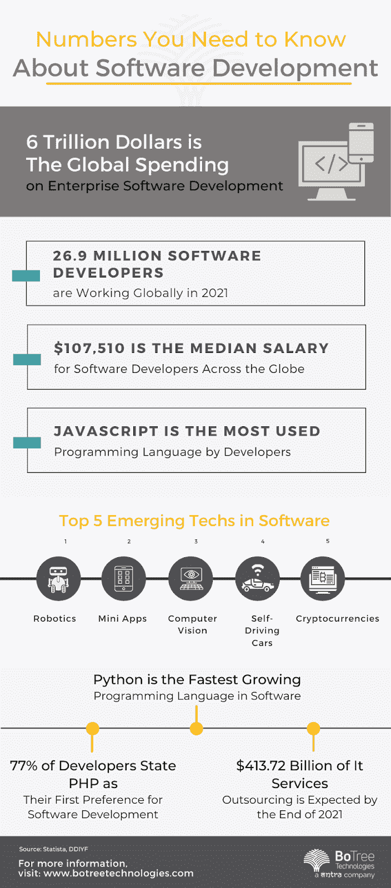

# 分析有史以来最重要的软件开发指标

> 原文：<https://medium.com/nerd-for-tech/analyzing-the-top-software-development-metrics-of-all-time-103644f04aac?source=collection_archive---------4----------------------->

软件开发过程的有效性是任何软件开发和商业成功的基本点。这样，利用正确的软件开发度量和评估来评估开发团队的后果并找出进一步开发工作过程的方法是至关重要的。尽管如此，经常地，当度量软件生产率出现时，几乎每个软件开发公司都放松了。

为什么？一些人看不到软件生产率度量的需求，因为他们“接受”他们的软件是一流的。其他人希望使用数字工具量化他们的软件开发最佳实践，但是他们几乎不知道如何量化。

成熟的组织认识到了在软件开发中度量生产力的需要，并认为这是一个承诺的问题。无论如何，衡量[软件开发](https://botreetechnologies.medium.com/top-10-custom-software-development-companies-in-2022-5045e31cadd3)和生产力不仅仅是常规。

# 为什么度量对于软件开发很重要？

密切关注软件开发度量和 KPI 将会识别出[软件开发过程](https://www.botreetechnologies.com/blog/steps-to-define-software-development-process/)是如何进行的，并且结果将会在需要开发的地方突出任何缺失的组件。入门级团队放弃跟踪正确的软件开发 KPI 和度量。正因为如此，他们对他们的软件开发进度没有明确的定义。

[软件开发度量](https://www.botreetechnologies.com/blog/software-product-engineering-best-practices/)是一些分数，用来调查软件开发过程是否符合同事们提出的目标。这些指标将有助于在事件发生时区分问题。有数百个软件开发度量的例子可以帮助你的过程达到最好的结果。

不管结果是积极的还是消极的，[软件工程](https://www.tntra.io/engineering)度量将帮助团队升级一般的开发过程。当结果是积极的时候，团队会得到更好的赞赏，从而提升他们的表现。同样，万一结果是负面的，它将激励开发团队尽快修复问题，以改进[软件开发方法](https://www.botreetechnologies.com/blog/top-software-development-methodologies-developers-should-know/)。

# 软件开发的顶级指标

考虑到这一现实，这里有一些主要的软件开发度量标准，应该被理解以促进整个软件开发过程

**1。交付时间和周期时间**

*   **交付周期**——你从构思到交付软件所需要的时间。如果你想更容易接受你的客户，通过改进决策和减少待命时间来减少你的准备时间。提前期包括周期时间。
*   周期时间(Cycle Time)——对你的软件框架进行变更并交付到产品中所需要的时间。利用持续交付的团队可以将周期时间估计为几分钟甚至几秒钟，而不是几个月。

**2。代码量**

*   开发团队可以看看这个软件指标，也称为千行代码(KLOC)，来决定应用程序的大小。假设这个 KPI 很高，它可以证明工程师在他们的编码项目中是有用的。
*   尽管如此，当一个开发团队试图查看用不同编程语言编写的两个项目时，这种度量是没有帮助的。此外，请记住，更多的代码不一定会产生强大的代码，这可能会导致以后的返工。

**3。正在进行的工作**

*   在软件设置中，WIP 是团队已经开始处理的开发工作，也就是说，在这一点上，不在 backlog 中。团队可以在燃尽图中交流 WIP。敏捷和 Scrum 运行的典型工具，这些关键的软件工程度量显示了团队已经完成了多少工作，还有多少工作要做。

**4。冲刺目标成功率**

*   软件工程师做了一个 sprint backlog，其中有一些来自软件构建的东西，团队稍后会处理这些东西。sprint 目标成功率计算团队在 sprint backlog 中完成的任务的比例。
*   有时团队可能会实现目标，但也有可能失败。不管团队是否不能达到他们的冲刺目标，他们在过程中取得的进展可以被认为是完成了。

**5。吞吐量**

*   它是最好的软件工程度量之一。吞吐量显示团队产出的所有增值工作。它通常由团队在设定的时间框架内完成的工作单元(票证)来解决。您应该根据您正在进行的业务目标来调整您的吞吐量指标。万一你想在这个 sprint 中发布新的无 bug 模块，你应该会看到大部分的缺陷单被解决等等。
*   度量吞吐量另外有助于区分当吞吐量度量下降时团队受到阻碍。此外，它还有助于理解团队何时负担过重，因为您很少有机会根据正在进行的职责来分析典型的吞吐量。

**6。测量会议时间**

*   事实上，团队在处理任务时需要协调，而这种协调是通过 Scrum 会议来完成的。一个[软件开发团队](https://www.botreetechnologies.com/blog/how-to-hire-a-dedicated-software-development-team-in-2022/)有长时间的定期会议，这很可能是计划 sprint 故事失败的一个迹象。此外，这很可能表明团队需要在会议中投入更多的时间来检查积压工作整理过程中的故事。
*   尽管如此，参加 Scrum 会议的同事数量也应该被分析。当整个团队在聚会中不自由的时候，你将得到的最终结果可能不会使整个团队的表现合法化。

**7。平均恢复时间**

*   平均恢复时间(MTTR)显示了故障后恢复零件所需的典型时间。如果高可用性装置中任何基本部件的 MTTR 值超过 RTO(恢复时间目标),那么系统故障可能会带来任何不令人满意的业务干扰。这意味着您无法在特定的 RTO 值内重建系统。
*   MTTR 包含四个不同的指针:修复、回答、解决和恢复。虽然这四个亮点相互交叉，但各有其意义和特点。

# 结论

我们忠诚的团队利用广泛的技术、流程和方法，提供各种各样的软件开发服务。我们专注于所有关键的软件工程指标，以确保产品按时交付并具有最高的质量。通过遵循[软件开发最佳实践](https://www.botreetechnologies.com/blog/7-best-software-development-practices-to-follow-in-2022/)，我们确保您的软件开发项目产生适当的产出。

BoTree Technologies 是一家领先的[企业软件开发公司](https://www.botreetechnologies.com/enterprise-software-development-company)，它跟踪最新的指标并帮助企业实现他们的软件目标。请立即联系我们进行免费咨询。

*原载于 2022 年 12 月 14 日*[*https://techcarter.com*](https://techcarter.com/analyzing-the-top-software-development-metrics-of-all-time/)*。*