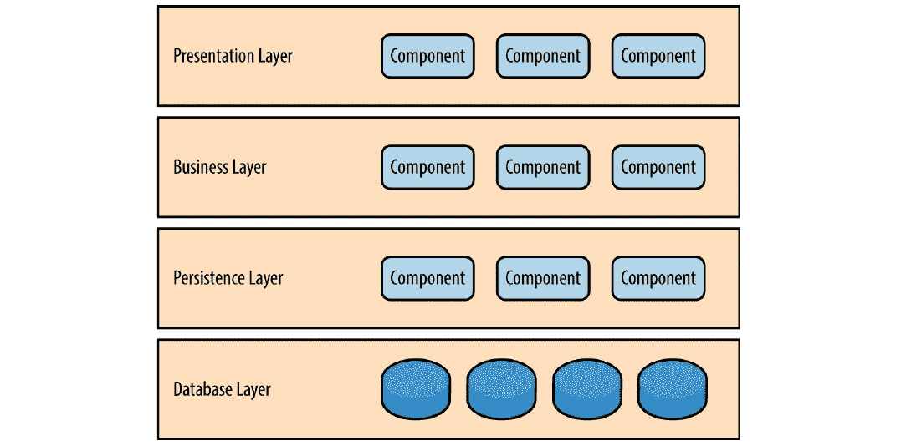
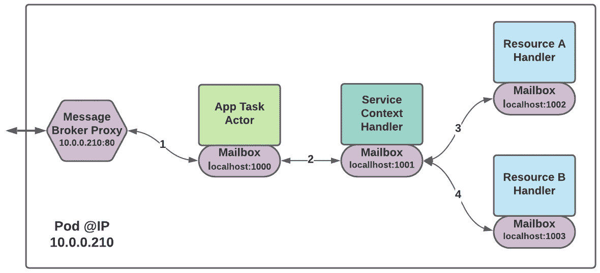
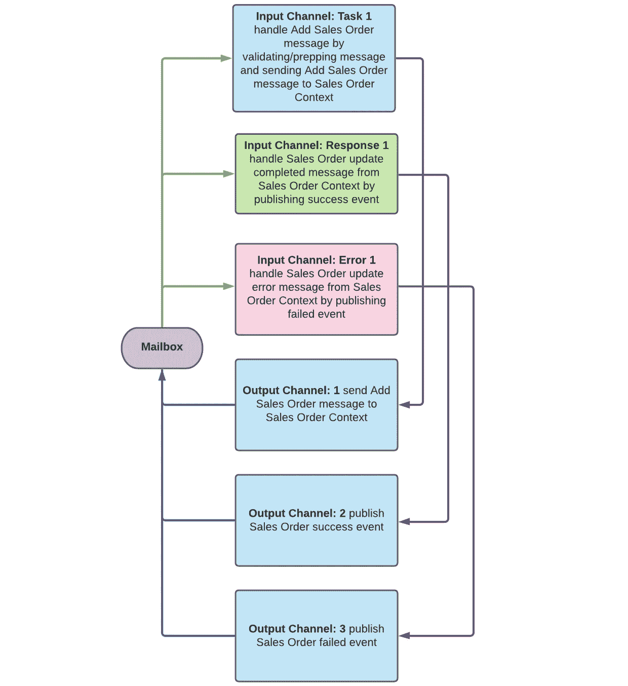
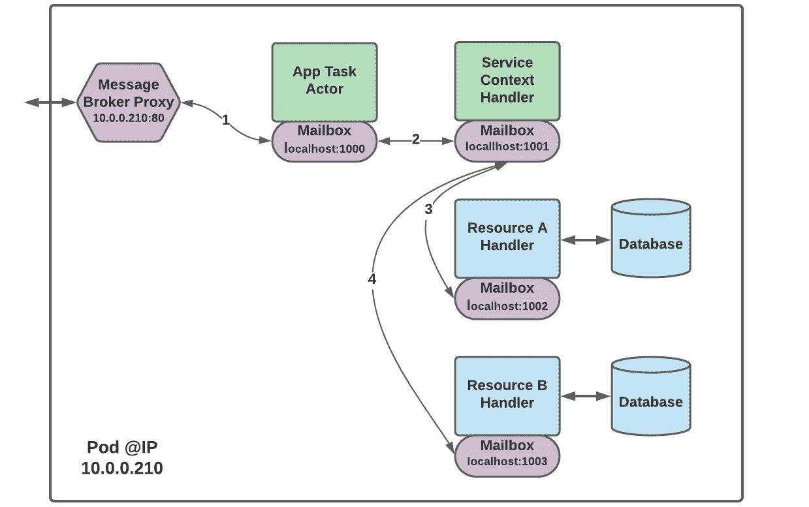
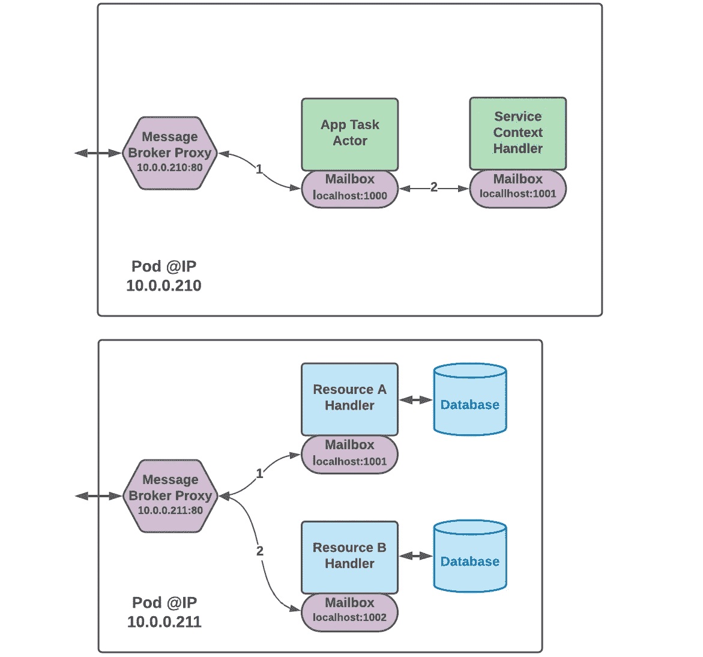
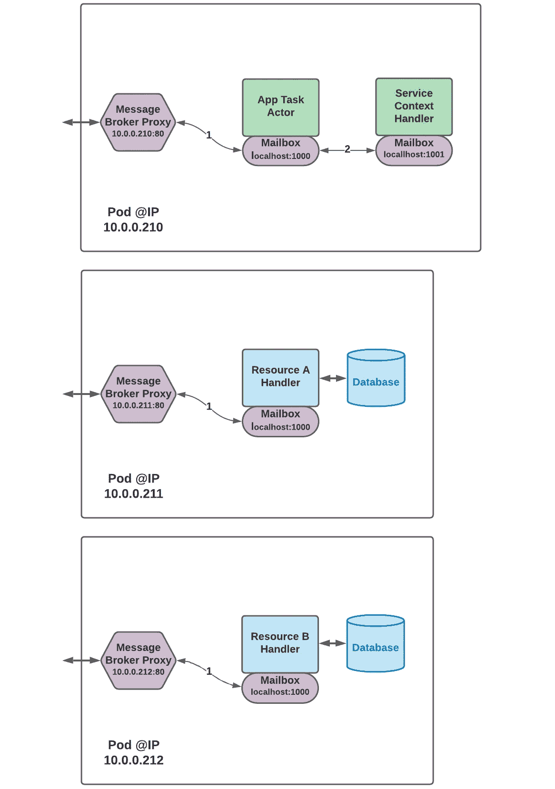

# 微服务剖析

> 原文：<https://medium.com/nerd-for-tech/anatomy-of-a-microservice-c52b3cb30d30?source=collection_archive---------4----------------------->

## 微服务如何工作

***微服务是软件*** [***乐高***](https://en.wikipedia.org/wiki/Lego) ***我们需要它们来构建可靠的、可扩展的、支持云的应用——因为它们简单、有意义，并且可以整合在一起构建更大的东西。我们将单独剖析一个微服务参与者，以便了解它是如何工作的。***

## **什么是微服务，为什么要关注微服务？**

微服务架构模式提供了一种有效的方法，将应用程序的功能分解为可管理的、可独立部署的组件，这些组件可以连接在一起形成一个集成的应用程序。微服务解决了当今一些更紧迫的软件开发、部署和操作需求。

一个[微服务](/nerd-for-tech/designing-microservices-4130bc41c046#4ef7) 被创建为一个无状态的、可重入的、可独立部署的软件组件。它通过执行逻辑、发送消息或发布事件来对收到的消息做出反应。如果它是一个 [*资源处理器角色*](/nerd-for-tech/designing-microservices-4130bc41c046#12ac) ，它也可以从永久存储器中读取和写入。如果想了解更多关于微服务的内容，请查看 [***设计微服务***](/nerd-for-tech/designing-microservices-4130bc41c046) ***。*** 在本文中，我们特别关注微服务剖析——一个典型的微服务 [*应用任务参与者*](/nerd-for-tech/designing-microservices-4130bc41c046#87c0) 内部发生了什么。

## 应用程序任务参与者

在旧的 [*分层架构模式*](/nerd-for-tech/software-architecture-for-the-cloud-c9226150c1f3#c5f5)*中，一个应用任务执行者会落在*业务层*中。*

**

***图 1:分层架构模式***

*应用程序任务参与者从用户的角度实现离散的应用程序任务。他们往往是开发和修改最频繁的参与者，也是应用程序功能涉及最多的微服务。任务参与者只能通过 [*上下文处理者参与者*](/nerd-for-tech/designing-microservices-4130bc41c046#a5c9) 来访问、创建和修改持久数据，这些都在分层架构的*持久层*中。*

**

***图 2:微服务参与者类型之间的关系***

## *消息和事件*

*微服务参与者的形状是由其主要目的决定的。微服务参与者的核心是一个 [*反应式*](https://www.reactivemanifesto.org/) 异步消息处理器。它被设计和优化为使用单线程一次处理一条消息，尽可能地快速高效。很像[***node . js***](https://nodejs.org/en/about/)*它是一个高性能、异步的消息处理器。这个 YouTube 视频， [***什么是反应式系统？***](https://www.youtube.com/watch?v=eRxLfUIMJwk) ，很好的解释了为什么反应系统这么快。**

**微服务优化处理的消息属于 [*代表性状态转移*](https://docs.google.com/document/d/16bSPSb-_gzi3QZADhdU4NceHSoXjuldXfPldfCBLbCA/edit?usp=sharing) (REST)架构风格。有三种基本的消息类别:任务(请求)、响应和错误。这些信息可以通过以下两种方式之一传递:**

1.  **作为异步 REST 消息。**
2.  **作为 [*事件承载的状态转移*](https://prateek-ashtikar512.medium.com/microservices-design-patterns-event-carried-state-transfer-c4b66a58df00) (ECST)事件。**

***消息总是异步发送或作为事件发布。没有同步消息传递。每条消息都被发送到微服务逻辑地址或发布到事件主题。本文的重点不是如何将消息传输到正确的目标，而是微服务在接受、发送或发布消息时对消息做什么。***

****

****图 3:演员解剖****

## **一个微服演员有哪些部分？**

*   **一个 m **ailbox** 附在每一个微服务演员身上。它负责为参与者接收和发送消息。**
*   ****智能适配器**是基于规则的消息解析器适配器，在将消息传递到输入通道(*前置条件*)之前以及从输出通道(*后置条件*)接收到消息时，由邮箱调用。**
*   **i **nput 通道**是 Java 微服务 actor 的*静态方法。每种输入消息类型都有一个输入通道。它负责对消息类型做出反应。***
*   **一个**输出通道**是一个 Java 微服务 actor 的*静态方法。每种输出消息类型都有一个输出通道。它负责发送或发布消息类型。***

## **邮筒**

**从 20 世纪 70 年代早期开始使用 actor 模型，邮箱就与 actor 配对，以便为 actor 接收和缓冲传入的消息。对于*微服务参与者模型*，我们将邮箱扩展为双向的，并处理传入和传出消息。我们这样做是为了促进 Kubernetes 集群内部和之间的[自组织消息传递](/nerd-for-tech/designing-microservices-4130bc41c046#126e)。**

****

****图 4:行动中的演员邮箱****

**在启动时，每个 pod 的微服务参与者的邮箱向 pod 的*消息代理服务器*注册它，后者又向最近的*消息代理服务器*注册微服务参与者。这可能会将它连接到云集群中所有其他注册的微服务参与者。**

**pod 中的微服务参与者通过他们的邮箱相互通信。它们通过 pod 的消息代理与 pod 外部的参与者进行通信。邮箱知道哪些微服务在 pod 内，哪些在外部。**

**在启动时，邮箱还设置任何为其微服务参与者的消息类型配置的智能适配器。它通过为单个消息类型选择的适配器传递传入和传出消息。**

## **智能适配器**

**智能适配器完成了大量重复的消息处理工作，例如:**

*   **验证消息的数据内容和格式。**
*   **将一种格式的消息内容转换成另一种格式的消息。**
*   **从大消息中提取数据，为更具体的目的创建更小的消息。**

**在一个典型的应用程序中，这些功能经常会在整个应用程序中重复多次——每个实例都是由不同的程序员从不同的角度使用不精确或不完整的规范编写的。这充其量是浪费宝贵资源的重复努力。在最坏的情况下，这是一个容易出错且需要大量维护的工作。**

**与通常用于实现这些任务的过程代码不同，智能适配器使用声明性规范来完成这些任务。根据声明性规范，智能适配器执行实现它们所必需的过程步骤——在整个应用程序中，只要需要，就会使用同一个智能适配器。**

**从上面的 [*图 4:行动中的演员邮箱*](https://medium.com/p/c52b3cb30d30/edit#6574) **，**中可以看出，微服务演员的邮箱使用智能适配器在将消息传递到输入通道之前强制执行*前置条件*，并使用智能适配器在从输出通道接受消息之前强制执行*后置条件*。对于更复杂的处理，智能适配器可以作为管道链接在一起。**

**总而言之，智能适配器:**

*   **实施邮件验证和格式规则。**
*   **减少劳动力、重复劳动和组件维护。**
*   **执行微服务前提条件和后期条件的实时测试。**
*   **保证相同的数据处理规则适用于整个系统。**

## **输入通道**

**微服务对于它接受的每种消息类型都有一个输入通道。输入通道被实现为一个静态 Java 方法，该方法接受一个参数——实现它的特定类型的消息。它是反应式的、完全可重入的、线程安全的。它只能通过向适当的上下文处理器微服务发送消息来读写持久数据。**

**输入通道从其参与者的邮箱中调用，并在邮箱分配的线程中执行。邮箱使用智能适配器来保证在调用输入通道之前满足所有消息的前提条件。**

***复杂的任务可以通过一个或多个参与者中的多个输入通道来实现——每个参与者通过对消息做出反应来执行其任务部分。***

**输入通道是微服务在实现应用任务时的工蜂。当输入通道对消息做出反应时，它完成自己的工作，然后调用输出通道来:**

*   **向另一个微服务发送请求消息。**
*   **将事件发布到主题。**
*   **向另一个微服务发送成功消息。**
*   **将成功事件发布到主题。**
*   **向另一个微服务发送错误消息。**
*   **将错误事件发布到主题。**

## **输出通道**

**微服务对于它发送或发布的每种消息类型都有一个输出通道。输出通道被实现为一个静态 Java 方法，该方法接受一个参数，即实现它的特定类型的消息。它是反应式的、完全可重入的、线程安全的。默认情况下，输出通道会准备一条消息，并将其发送到邮箱进行输出。但是，它可以执行任何所需的逻辑，在将输入发送到邮箱之前对其进行转换，或者将其发送到另一个输出通道。**

## **把所有的放在一起**

**这种微服务方法的真正优势是我们在从 actor 模型微服务组合应用程序时所拥有的能力和灵活性。Kubernetes 的最小部署、故障转移和扩展单元是 pod。**

**通过这种特定微服务架构模式的动态服务发现和自组织，您可以将微服务放入不同的容器中，微服务将会找到彼此，建立连接，并开始对消息做出反应。因为它们是反应式的和无状态的，相同类型的单个微服务实例是完全可以互换的。**

***这也意味着该模型可以使用 Kubernetes 来扩展处理或通过启动新的 pods 来实施故障转移，然后动态配置和使用这些 pods。***

**每个联合消息代理将了解哪个微服务实例对其消息的响应最快，并将选择它们。从单个代理的角度来看，这些代理将始终选择平均消息延迟最低的微服务实例，从而不断优化整体系统消息传递路径，以响应不断变化的可用性、负载和消息模式。**

## **优化微服务部署**

**因为相同类型的微服务实例是可互换的，并且服务发现是动态的，所以我们在如何将相关的微服务打包到 pods 中时具有很大的灵活性。我们可以根据需要满足的运行时目标来制定决策——调整原始性能、网络性能、水平可伸缩性、可靠性和故障转移、数据库性能和镜像等的组合。**

**以下三幅图显示了不同的 pod 配置。由于动态发现和自组织，它们无需任何额外配置即可发挥各自的功能。在上面列出的运行时目标中，它们每一个都有偏差，但是它们都可以工作。**

****

****图 5:一个吊舱部署****

****

****图 6:两个吊舱展开****

****

****图 7:三个吊舱部署****

**微服务架构模式的许多好处来自于它的组件可以被实现和部署的细粒度。实际上，部署和管理真正的微服务需要[容器化](/nerd-for-tech/designing-microservices-4130bc41c046#ff29)和容器编排( [Kubernetes](https://kubernetes.io/docs/tutorials/kubernetes-basics/) )的力量。**

***Kubernetes 可以部署在云和本地数据中心，也可以部署在 Linux、Windows 和 Mac 电脑上。***

**单个微服务参与者被封装在容器中。简单来说，*容器*是一个虚拟化的可执行映像。该映像可以被推送到一个集中的容器注册中心，Kubernetes 使用该注册中心将容器实例部署到集群的 pod。**

**一个 *pod* 可以被看作是容器实例的一种包装器。每个 pod 都有自己的 IP 地址，通过该地址它可以与群集中的其他 pod 进行交互。通常，一个 pod 只包含一个容器。但是如果容器需要共享资源，一个 pod 可以包含多个容器。如果一个 pod 中有多个容器，这些容器通过 *localhost* IP 地址相互通信。**

**在实现这种微服务架构模式时，一个 pod 至少包含一个应用程序容器和一个 [*message broker 代理*](/nerd-for-tech/designing-microservices-4130bc41c046#126e) sidecar 容器(以将其连接到其余的应用程序微服务)。通常，主微服务容器将与它直接发送消息的任何从属微服务容器一起打包在一个 pod 中。**

***关于微服务的一个常见问题是多个容器的运行时开销以及它们之间连接的延迟。实际上，对于设计合理的微服务来说，这很少是个问题。***

> *****讨论:*** *微服务被设计为水平扩展以满足性能目标。对于某些应用程序用例来说，这不是一个选项，在这些用例中，直接优化 CPU、内存、I/O 或网络资源的使用是满足性能要求的唯一方法。这些用例可能不适合微服务架构模式。***

## **推荐阅读**

**如果您觉得这篇文章有趣，我们想推荐以下内容:**

*   **[***设计微服务***](/nerd-for-tech/designing-microservices-4130bc41c046)**
*   **[***微服务架构***](/nerd-for-tech/microservice-architecture-622e4148f1)**
*   **[***云软件架构***](/nerd-for-tech/software-architecture-for-the-cloud-c9226150c1f3)**
*   **[***集装箱化微服务***](/nerd-for-tech/containerized-microservices-a5dce87fab82)**