# Android 架构组件教程

> 原文：<https://medium.com/nerd-for-tech/android-architecture-components-tutorial-7e822cdf2f00?source=collection_archive---------8----------------------->

> Android 架构组件是一个库集合，可以帮助你设计健壮的、可测试的、可维护的应用。从管理 UI 组件生命周期和处理数据持久性的类开始。([https://developer.android.com/topic/libraries/architecture](https://developer.android.com/topic/libraries/architecture))

本教程将涵盖 Android 架构组件中的`LiveData`、`ViewModel`、`Room`、`DataBinding`等一些特性，并根据[应用架构指南](https://developer.android.com/jetpack/guide)中的最佳实践构建一个照片浏览器应用。

# 先决条件

这个应用程序将从 [Pexels](https://www.pexels.com/) 获取照片，所以在开始构建应用程序之前，如果你没有 Pexels 帐户，我们需要创建一个。我们不会关注如何创建 Pexels 帐户，因为这超出了本教程的范围。但是根据 Pexels 上的说明创建新帐户是相当容易的。

我们需要将`Authorization Token`保存在安全的地方，这是访问 Pexels API 的关键，将在应用程序中使用。

然后，我们可以用 Postman 对 Pexels API 进行一些测试，以确保我们的`Authorization Token`是正确的，并且我们能够为 Pexels 获取照片。

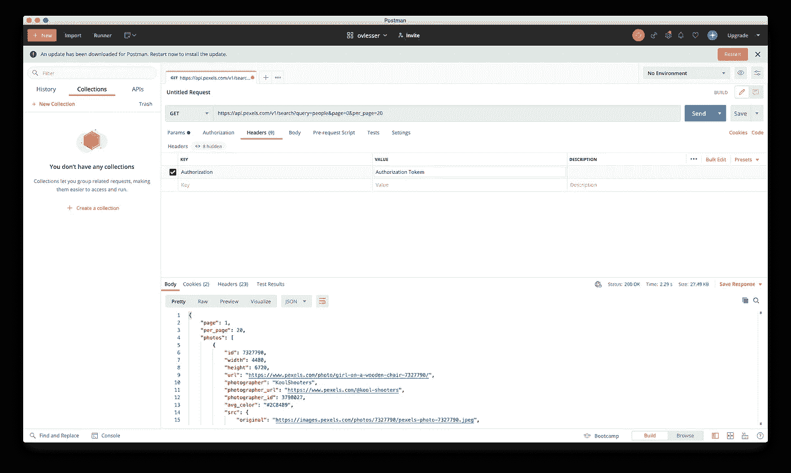

请注意，您需要用创建 Pexels 帐户时获得的实际值替换`Headers`中的`Authorization Token`。

如果幸运的话，我们会得到如下 JSON 格式的响应:

```
{
 "page": 1,
 "per_page": 2,
 "photos": [{
   "id": 6546164,
   "width": 3265,
   "height": 5000,
   "url": "[https://www.pexels.com/photo/person-taking-bowl-with-hawaiian-dish-6546164/](https://www.pexels.com/photo/person-taking-bowl-with-hawaiian-dish-6546164/)",
   "photographer": "Larissa Deruzzi",
   "photographer_url": "[https://www.pexels.com/@deruzzi](https://www.pexels.com/@deruzzi)",
   "photographer_id": 20198481,
   "avg_color": "#BE695C",
   "src": {
    "original": "[https://images.pexels.com/photos/6546164/pexels-photo-6546164.jpeg](https://images.pexels.com/photos/6546164/pexels-photo-6546164.jpeg)",
    "large2x": "[https://images.pexels.com/photos/6546164/pexels-photo-6546164.jpeg?auto=compress&cs=tinysrgb&dpr=2&h=650&w=940](https://images.pexels.com/photos/6546164/pexels-photo-6546164.jpeg?auto=compress&cs=tinysrgb&dpr=2&h=650&w=940)",
    "large": "[https://images.pexels.com/photos/6546164/pexels-photo-6546164.jpeg?auto=compress&cs=tinysrgb&h=650&w=940](https://images.pexels.com/photos/6546164/pexels-photo-6546164.jpeg?auto=compress&cs=tinysrgb&h=650&w=940)",
    "medium": "[https://images.pexels.com/photos/6546164/pexels-photo-6546164.jpeg?auto=compress&cs=tinysrgb&h=350](https://images.pexels.com/photos/6546164/pexels-photo-6546164.jpeg?auto=compress&cs=tinysrgb&h=350)",
    "small": "[https://images.pexels.com/photos/6546164/pexels-photo-6546164.jpeg?auto=compress&cs=tinysrgb&h=130](https://images.pexels.com/photos/6546164/pexels-photo-6546164.jpeg?auto=compress&cs=tinysrgb&h=130)",
    "portrait": "[https://images.pexels.com/photos/6546164/pexels-photo-6546164.jpeg?auto=compress&cs=tinysrgb&fit=crop&h=1200&w=800](https://images.pexels.com/photos/6546164/pexels-photo-6546164.jpeg?auto=compress&cs=tinysrgb&fit=crop&h=1200&w=800)",
    "landscape": "[https://images.pexels.com/photos/6546164/pexels-photo-6546164.jpeg?auto=compress&cs=tinysrgb&fit=crop&h=627&w=1200](https://images.pexels.com/photos/6546164/pexels-photo-6546164.jpeg?auto=compress&cs=tinysrgb&fit=crop&h=627&w=1200)",
    "tiny": "[https://images.pexels.com/photos/6546164/pexels-photo-6546164.jpeg?auto=compress&cs=tinysrgb&dpr=1&fit=crop&h=200&w=280](https://images.pexels.com/photos/6546164/pexels-photo-6546164.jpeg?auto=compress&cs=tinysrgb&dpr=1&fit=crop&h=200&w=280)"
   },
   "liked": false
  },
  {
   "id": 6805855,
   "width": 5126,
   "height": 4101,
   "url": "[https://www.pexels.com/photo/group-of-tourists-walking-on-snowy-hilly-terrain-6805855/](https://www.pexels.com/photo/group-of-tourists-walking-on-snowy-hilly-terrain-6805855/)",
   "photographer": "Harry Cooke",
   "photographer_url": "[https://www.pexels.com/@harry-cooke](https://www.pexels.com/@harry-cooke)",
   "photographer_id": 3933683,
   "avg_color": "#738080",
   "src": {
    "original": "[https://images.pexels.com/photos/6805855/pexels-photo-6805855.jpeg](https://images.pexels.com/photos/6805855/pexels-photo-6805855.jpeg)",
    "large2x": "[https://images.pexels.com/photos/6805855/pexels-photo-6805855.jpeg?auto=compress&cs=tinysrgb&dpr=2&h=650&w=940](https://images.pexels.com/photos/6805855/pexels-photo-6805855.jpeg?auto=compress&cs=tinysrgb&dpr=2&h=650&w=940)",
    "large": "[https://images.pexels.com/photos/6805855/pexels-photo-6805855.jpeg?auto=compress&cs=tinysrgb&h=650&w=940](https://images.pexels.com/photos/6805855/pexels-photo-6805855.jpeg?auto=compress&cs=tinysrgb&h=650&w=940)",
    "medium": "[https://images.pexels.com/photos/6805855/pexels-photo-6805855.jpeg?auto=compress&cs=tinysrgb&h=350](https://images.pexels.com/photos/6805855/pexels-photo-6805855.jpeg?auto=compress&cs=tinysrgb&h=350)",
    "small": "[https://images.pexels.com/photos/6805855/pexels-photo-6805855.jpeg?auto=compress&cs=tinysrgb&h=130](https://images.pexels.com/photos/6805855/pexels-photo-6805855.jpeg?auto=compress&cs=tinysrgb&h=130)",
    "portrait": "[https://images.pexels.com/photos/6805855/pexels-photo-6805855.jpeg?auto=compress&cs=tinysrgb&fit=crop&h=1200&w=800](https://images.pexels.com/photos/6805855/pexels-photo-6805855.jpeg?auto=compress&cs=tinysrgb&fit=crop&h=1200&w=800)",
    "landscape": "[https://images.pexels.com/photos/6805855/pexels-photo-6805855.jpeg?auto=compress&cs=tinysrgb&fit=crop&h=627&w=1200](https://images.pexels.com/photos/6805855/pexels-photo-6805855.jpeg?auto=compress&cs=tinysrgb&fit=crop&h=627&w=1200)",
    "tiny": "[https://images.pexels.com/photos/6805855/pexels-photo-6805855.jpeg?auto=compress&cs=tinysrgb&dpr=1&fit=crop&h=200&w=280](https://images.pexels.com/photos/6805855/pexels-photo-6805855.jpeg?auto=compress&cs=tinysrgb&dpr=1&fit=crop&h=200&w=280)"
   },
   "liked": false
  }
 ],
 "total_results": 8000,
 "next_page": "[https://api.pexels.com/v1/search/?page=2&per_page=2&query=people](https://api.pexels.com/v1/search/?page=2&per_page=2&query=people)"
}
```

如果我们分析 JSON 对象，我们会得到模式是

```
{
  page: Int,
  per_page: Int,
  photos: List<Photo>,
  total_result: Int,
  next_page: String
}
```

而`Photo`的模式是

```
{
  id: Int,
  width: Int,
  height: Int,
  url: String,
  photographer: String,
  photographer_url: String,
  photographer_id: Int,
  avg_color: String,
  src: Src,
  liked: Boolean,
}
```

而`Src`的模式是

```
{
  original: String,
  large2x: String,
  large: String,
  medium: String,
  small: String,
  portrait: String,
  landscape: String,
  tiny: String
}
```

当我们创建数据模型时，我们需要这些模式

一旦我们验证了 Pexels API 是可访问的，我们就可以开始构建应用程序了。

# 创建新项目

让我们打开`Android Studio`并从菜单中选择`Create a new project`或启动向导并选择`Bottom Navigation Activity`模板


点击`next`，完成如下配置页面:

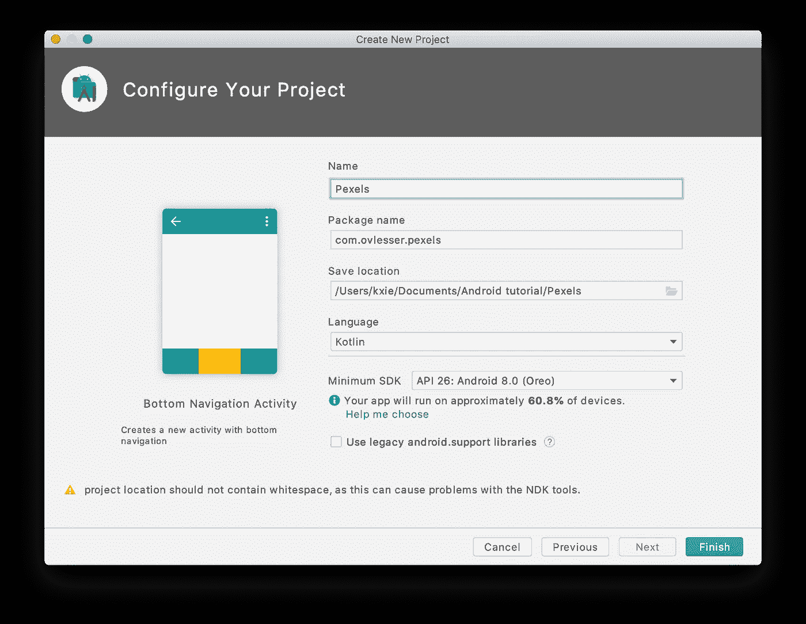

然后点击`finish`按钮。

然后`Android Studio`将开始构建这个新项目并下载一些依赖项。这可能需要几分钟。

## 运行空应用程序

如果没有模拟器，我们需要创建一个新的模拟器，启动模拟器，然后运行应用程序。它会显示这样的用户界面:

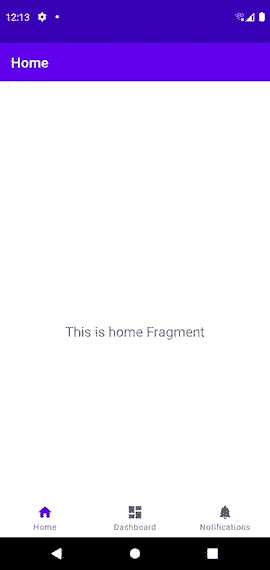

这是一个来自`Bottom Navigation Activity`模板的空应用，包含 3 个页面，`Home`，`Dashboard`和`Notification`，应用启动时显示的是`Home`页面。

然后我们将在接下来的章节中一步一步实现这个应用

# 创建数据模型

我们将在 MVVM 架构上构建这个应用程序，所以让我们先实现`Model`。

首先，我们需要向`Build.gradle(Module: Pexels.app)`添加以下依赖项

```
*// Moshi* implementation 'com.squareup.moshi:moshi-kotlin:1.9.3'
```

按照`Android Studio`的指示

其次，为了整个项目的整洁，让我们创建一个新的包，`data`。

然后我们需要根据在`Prerequisite`步骤中得到的 JSON 对象的模式创建几个数据类`Data`、`Data.Photo`和`Data.Photo.Src`。

因此，让我们在`data`包中创建一个新文件`Data.kt`，并添加如下数据类:

```
package com.ovlesser.pexels.data

data class Data(
    val page: Int,
    @Json(name = "per_page") val perPage: Int,
    val photos: List<Photo>,
    @Json(name = "total_results") val totalResults: Int,
    @Json(name = "next_page") val nextPage: String
) {
    data class Photo(
        val id: Int,
        val width: Int,
        val height: Int,
        val url: String,
        val photographer: String,
        @Json(name = "photographer_url") val photographerUrl: String,
        @Json(name = "photographer_id") val photographerId: Int,
        @Json(name = "avg_color") val avgColor: String,
        val src: Src,
        val liked: Boolean,
    ) {
        data class Src(
            val original: String,
            val large2x: String,
            val large: String,
            val medium: String,
            val small: String,
            val portrait: String,
            val landscape: String,
            val tiny: String
        )
    }
}
```

小心像`@Json(name = "photographer_url")`这样的注释，它将 JSON 对象中的名称映射到数据类中的名称

然后我们创建了数据模型，并完成了 MVVM 的`Model`。我们将在下一章实现`ViewModel`

# 为`Home`页面创建视图模型

您可能会注意到在`./ui/home`包中有一个名为`HomeViewModel.kt`的文件，它是默认的 ViewModel 和模板一起生成的。我们需要将`HomeViewModel`类的代码替换为

```
*// The internal MutableLiveData Data that stores the most recent data* private val _data = MutableLiveData<Data>()

*// The external immutable LiveData for the response Data* val data: LiveData<Data>
    get() = _data

init {
    getDataFromSample()
}

private fun getDataFromSample() {
    _data.value = Data(0, 0, *emptyList*(), 0, "")
}
```

而`Android Studio`可能会要求你通过导入`com.ovlesser.pexels.data.Data`来解决`Data`，照做就是了。

下一步，我们将用更有意义的数据修改 getDataFromSample 方法。还记得我们用 Postman 测试 Pexels API 时的反应吗？我们可以利用这种反应。

让我们在`data`包中创建一个新文件`SampleData.kt`，并在其中定义一个变量`sampleData`，将响应复制并粘贴为该字符串的值，如下所示:

```
package com.ovlesser.pexelsval *sampleData* =
    """
{
    "page": 1,
    "per_page": 2,
    "photos": [
        {
            "id": 6546164,
            "width": 3265,
            "height": 5000,
            "url": "https://www.pexels.com/photo/person-taking-bowl-with-hawaiian-dish-6546164/",
            "photographer": "Larissa Deruzzi",
            "photographer_url": "https://www.pexels.com/@deruzzi",
            "photographer_id": 20198481,
            "avg_color": "#BE695C",
            "src": {
                "original": "https://images.pexels.com/photos/6546164/pexels-photo-6546164.jpeg",
                "large2x": "https://images.pexels.com/photos/6546164/pexels-photo-6546164.jpeg?auto=compress&cs=tinysrgb&dpr=2&h=650&w=940",
                "large": "https://images.pexels.com/photos/6546164/pexels-photo-6546164.jpeg?auto=compress&cs=tinysrgb&h=650&w=940",
                "medium": "https://images.pexels.com/photos/6546164/pexels-photo-6546164.jpeg?auto=compress&cs=tinysrgb&h=350",
                "small": "https://images.pexels.com/photos/6546164/pexels-photo-6546164.jpeg?auto=compress&cs=tinysrgb&h=130",
                "portrait": "https://images.pexels.com/photos/6546164/pexels-photo-6546164.jpeg?auto=compress&cs=tinysrgb&fit=crop&h=1200&w=800",
                "landscape": "https://images.pexels.com/photos/6546164/pexels-photo-6546164.jpeg?auto=compress&cs=tinysrgb&fit=crop&h=627&w=1200",
                "tiny": "https://images.pexels.com/photos/6546164/pexels-photo-6546164.jpeg?auto=compress&cs=tinysrgb&dpr=1&fit=crop&h=200&w=280"
            },
            "liked": false
        },
        {
            "id": 6805855,
            "width": 5126,
            "height": 4101,
            "url": "https://www.pexels.com/photo/group-of-tourists-walking-on-snowy-hilly-terrain-6805855/",
            "photographer": "Harry Cooke",
            "photographer_url": "https://www.pexels.com/@harry-cooke",
            "photographer_id": 3933683,
            "avg_color": "#738080",
            "src": {
                "original": "https://images.pexels.com/photos/6805855/pexels-photo-6805855.jpeg",
                "large2x": "https://images.pexels.com/photos/6805855/pexels-photo-6805855.jpeg?auto=compress&cs=tinysrgb&dpr=2&h=650&w=940",
                "large": "https://images.pexels.com/photos/6805855/pexels-photo-6805855.jpeg?auto=compress&cs=tinysrgb&h=650&w=940",
                "medium": "https://images.pexels.com/photos/6805855/pexels-photo-6805855.jpeg?auto=compress&cs=tinysrgb&h=350",
                "small": "https://images.pexels.com/photos/6805855/pexels-photo-6805855.jpeg?auto=compress&cs=tinysrgb&h=130",
                "portrait": "https://images.pexels.com/photos/6805855/pexels-photo-6805855.jpeg?auto=compress&cs=tinysrgb&fit=crop&h=1200&w=800",
                "landscape": "https://images.pexels.com/photos/6805855/pexels-photo-6805855.jpeg?auto=compress&cs=tinysrgb&fit=crop&h=627&w=1200",
                "tiny": "https://images.pexels.com/photos/6805855/pexels-photo-6805855.jpeg?auto=compress&cs=tinysrgb&dpr=1&fit=crop&h=200&w=280"
            },
            "liked": false
        }
    ],
    "total_results": 8000,
    "next_page": "https://api.pexels.com/v1/search/?page=2&per_page=2&query=people"
}
    """.*trimIndent*()
```

我们将在不实现网络模块的情况下用这个样本数据测试 app。

所以让我们修改一下`getDataFromSample`函数，如下所示:

```
private fun getDataFromSample() {
    val moshi = Moshi.Builder()
        .add(KotlinJsonAdapterFactory())
        .build()
    val jsonAdapter = moshi.adapter(Data::class.*java*)
    val sampleData = jsonAdapter.fromJson(*sampleData*)
    _data.*value* = sampleData ?: Data(0, 0, *emptyList*(), 0, "")
}
```

我们用`Moshi`将样本数据从 JSON 字符串转换成一个`Data`对象。稍后，我们将使用相同的方法将数据从 Pexels API 转换为`Data`对象。

现在，我们已经实现了`Home`页面的`ViewModel`的框架。我们将在下一章实现`View`

# 构建主页的视图

我们将使用`Home`片段作为主页，在主页中我们将显示带有网格布局的照片。

首先，我们需要添加一些 UI 相关的依赖项。让我们打开`Build.gradle(Module: Pexels.app)`文件，在`plugins`部分添加几个额外的行，如下所示:

插件**{** id ' com . Android . application '
id ' kotlin-Android '
`**id 'kotlin-android-extensions'
id 'kotlin-kapt'**` **}**

新增了**粗体**行。

我们还需要通过在`buildTypes`部分下添加以下行来启用`DataBinding`，

```
buildTypes **{** release **{** minifyEnabled false
        proguardFiles getDefaultProguardFile('proguard-android-optimize.txt'), 'proguard-rules.pro'
    **}
}
buildFeatures {
    dataBinding true
}** compileOptions **{** sourceCompatibility JavaVersion.*VERSION_1_8* targetCompatibility JavaVersion.*VERSION_1_8* **}** kotlinOptions **{** jvmTarget = '1.8'
**}**
```

并将以下依赖关系添加到`dependencies`部分。

```
*//RecyclerView* implementation "androidx.recyclerview:recyclerview:1.1.0"
*// For control over item selection of both touch and mouse driven selection* implementation "androidx.recyclerview:recyclerview-selection:1.1.0"
```

我们需要点击`Sync now`。

其次，我们需要定义照片网格中列表项的布局。

让我们在`layout`文件夹中创建一个名为`grid_view_item.xml`的新布局文件，并用以下代码替换其内容

```
*<?*xml version="1.0" encoding="utf-8"*?>* <layout
    xmlns:android="http://schemas.android.com/apk/res/android"
    xmlns:app="http://schemas.android.com/apk/res-auto"
    xmlns:tools="http://schemas.android.com/tools">

    <data>
        <variable
            name="photo"
            type="com.ovlesser.pexels.data.Data.Photo" />
    </data>

    <FrameLayout
        android:layout_width="match_parent"
        android:layout_height="wrap_content"
        android:padding="4dp"
        android:minHeight="100dp">

        <ImageView
            android:id="@+id/pexel_image"
            android:layout_width="match_parent"
            android:layout_height="wrap_content"
            android:minHeight="100dp"
            android:minWidth="100dp"
            android:scaleType="fitXY"
            android:adjustViewBounds="true"
            app:imageUrl="@{photo.src.medium}"
            android:background="@color/teal_700"
            tools:src="@tools:sample/backgrounds/scenic"/>

    </FrameLayout>
</layout>
```

您可能注意到我们声明了一个类型为`com.ovlesser.pexels.data.Data.Photo`的变量`photo`，它将把 photo 的值传递给这个布局文件。

如果您构建应用程序，将会失败，因为我们还没有实现`imageUrl`的数据绑定。我们稍后会修理它。

然后我们需要修改页面本身的布局。让我们打开`fragment_home.xml`并将整个`TextView`部分替换为

```
<androidx.recyclerview.widget.RecyclerView
    android:id="@+id/photos_grid"
    android:layout_width="0dp"
    android:layout_height="0dp"
    android:padding="6dp"
    android:clipToPadding="false"
   app:layoutManager="androidx.recyclerview.widget.StaggeredGridLayoutManager"
    app:layout_constraintBottom_toBottomOf="parent"
    app:layout_constraintLeft_toLeftOf="parent"
    app:layout_constraintRight_toRightOf="parent"
    app:layout_constraintTop_toTopOf="parent"
    app:spanCount="2"
    tools:itemCount="16"
    tools:listitem="@layout/grid_view_item" />
```

这是一个带有`StaggeredGridLayoutManager`的`RecyclerView`，照片将在其中显示。

我们还需要将整个`ConstraintLayout`部分包装在一个`layout`标签中，并将`ConstraintLayout`的属性移动到`layout`标签中，如下所示，以便使用`DataBinding`

```
*<?*xml version="1.0" encoding="utf-8"*?>* **<layout
    xmlns:android="http://schemas.android.com/apk/res/android"
    xmlns:app="http://schemas.android.com/apk/res-auto"
    xmlns:tools="http://schemas.android.com/tools">** 
    <androidx.constraintlayout.widget.ConstraintLayout
        android:layout_width="match_parent"
        android:layout_height="match_parent"
        tools:context=".ui.home.HomeFragment"> ...... </androidx.constraintlayout.widget.ConstraintLayout>
**</layout>**
```

下一步是修改`HomeFragment.kt`，它是`Home`片段的 UI 部分。

我们需要将属性`homeViewModel`的定义从

```
*private lateinit var homeViewModel: HomeViewModel*
```

到

```
private val homeViewModel: HomeViewModel by *lazy* **{** ViewModelProvider(this).get(HomeViewModel::class.*java*)
**}**
```

我们还需要用以下内容替换`onCreateView`方法中的内容

```
val binding = FragmentHomeBinding.inflate(inflater)

*// Allows Data Binding to Observe LiveData with the lifecycle of this Fragment* binding.*lifecycleOwner* = this

return binding.*root*
```

这段代码意味着我们将使用`DataBinding`在源代码和布局之间传递数据。

我们将在下一步为`RecyclerView`实现一个适配器，它将照片列表映射到列表项中。

让我们创建一个新文件，`PhotoGridAdapter`，并按如下方式实现它:

```
class PhotoGridAdapter: ListAdapter<Data.Photo, PhotoGridAdapter.PhotoGridViewHolder>(DiffCallback) {

    class PhotoGridViewHolder(private var binding: GridViewItemBinding): RecyclerView.ViewHolder(binding.*root*) {
        fun bind(photo: Data.Photo) {
            binding.photo = photo
            binding.executePendingBindings()
        }
    }

    override fun onCreateViewHolder(parent: ViewGroup, viewType: Int): PhotoGridViewHolder {
        return PhotoGridViewHolder( GridViewItemBinding.inflate( LayoutInflater.from( parent.*context*)))
    }

    override fun onBindViewHolder(holder: PhotoGridViewHolder, position: Int) {
        val photo = getItem(position)
        holder.bind(photo)
    }

    companion object DiffCallback: DiffUtil.ItemCallback<Data.Photo>() {
        override fun areItemsTheSame(oldItem: Data.Photo, newItem: Data.Photo): Boolean {
            return oldItem.id === newItem.id
        }

        override fun areContentsTheSame(oldItem: Data.Photo, newItem: Data.Photo): Boolean {
            return oldItem == newItem
        }

    }
}
```

然后我们需要创建另一个文件`BindingAdapters.kt`，并实现一个带有注释`BindingAdapter("liveData")`的函数，这将把适配器绑定到 RecyclerView。

```
@BindingAdapter("listData")
fun bindRecyclerView(recyclerView: RecyclerView,
                     photos: List<Data.Photo>?) {
    val adapter = recyclerView.*adapter* as PhotoGridAdapter
    adapter.submitList(photos)
}
```

然后让我们打开`fragment_home.xml`并在所有组件上方添加`data`部分，并在`RecyclerView`内添加`app:listData="@{viewModel.data.photos}"`以将视图模型绑定到视图，如下所示:

```
*<?*xml version="1.0" encoding="utf-8"*?>* <layout
    xmlns:android="http://schemas.android.com/apk/res/android"
    xmlns:app="http://schemas.android.com/apk/res-auto"
    xmlns:tools="http://schemas.android.com/tools">

 **<data>
        <variable
            name="viewModel"
            type="com.ovlesser.pexels.ui.home.HomeViewModel" />
    </data>** 
    <androidx.constraintlayout.widget.ConstraintLayout
        android:layout_width="match_parent"
        android:layout_height="match_parent"
        tools:context=".ui.home.HomeFragment">

        <androidx.recyclerview.widget.RecyclerView
            ......
            app:spanCount="2"
            tools:itemCount="16"
 **app:listData="@{viewModel.data.photos}"**            tools:listitem="@layout/grid_view_item" />
    </androidx.constraintlayout.widget.ConstraintLayout>
</layout>
```

RecyclerView 中的名称和 BindingAdapter 的名称必须相同，在本例中为`listData`

然后，我们需要打开`HomeFragment.kt`并将下面几行添加到`onCreateView`方法中，如下所示。

```
val binding = FragmentHomeBinding.inflate(inflater)

*// Allows Data Binding to Observe LiveData with the lifecycle of this Fragment* binding.*lifecycleOwner* = this

***// Giving the binding access to the OverviewViewModel* binding.viewModel = homeViewModel

binding.photosGrid.*adapter* = PhotoGridAdapter()** 
return binding.*root*
```

现在，ViewModel 绑定到了`Home`页面的视图，一个适配器绑定到了 RecyclerView。

下一步，我们将通过将`grid_view_item`布局中的`imageUrl`与另一个 BindingAdapter 绑定，在 RecyclerView 中显示照片。

首先，我们需要给`build.gradle(Module:Pexels.app)`添加以下依赖项

```
*// Glide* implementation 'com.github.bumptech.glide:glide:4.11.0'
```

其次，我们需要在`BindingAdapters.kt`中添加以下`BindingAdapter`

```
@BindingAdapter("imageUrl")
fun bindImageView(imageView: ImageView, imageUrl: String?) {
    imageUrl?.*let* **{** val imageUri = imageUrl.*toUri*().buildUpon().scheme("https").build()
        Glide.with(imageView.*context*)
            .load(imageUri)
            .apply(
                RequestOptions()
                .placeholder(R.drawable.loading_animation)
                .error(R.drawable.ic_broken_image))
            .into(imageView)
    **}** }
```

您可能会注意到图像`loading_animation`和`ic_broken_image`丢失了，所以让我们创建它们，或者您可以下载到其他地方。

让我们创建一个新的 drawable，`loading_animation`,并用

```
*<?*xml version="1.0" encoding="utf-8"*?>* <animated-rotate xmlns:android="http://schemas.android.com/apk/res/android"
    android:drawable="@drawable/loading_img"
    android:pivotX="50%"
    android:pivotY="50%" />
```

并创建另一个 drawable，`loading_img`并将其内容替换为

```
<vector android:height="24dp" android:viewportHeight="72"
    android:viewportWidth="72" android:width="24dp" xmlns:android="http://schemas.android.com/apk/res/android">
    <path android:fillColor="#cccccf"
        android:pathData="M36.06,28.92L36.06,32.18"
        android:strokeColor="#e7e7e7" android:strokeLineCap="round" android:strokeWidth="1"/>
    <path android:fillColor="#c8c8cc"
        android:pathData="M39.45,29.88L37.82,32.71"
        android:strokeColor="#cacaca" android:strokeLineCap="round" android:strokeWidth="1"/>
    <path android:fillColor="#bbbbbe"
        android:pathData="M42.12,32.32L39.3,33.95"
        android:strokeColor="#cdcdcd" android:strokeLineCap="round" android:strokeWidth="1"/>
    <path android:fillColor="#b2b2b7"
        android:pathData="M39.8,35.98L43.06,35.98"
        android:strokeColor="#cbcbcb" android:strokeLineCap="round" android:strokeWidth="1"/>
    <path android:fillColor="#d0d0d4"
        android:pathData="M32.77,29.99L34.4,32.81"
        android:strokeColor="#ededed" android:strokeLineCap="round" android:strokeWidth="1"/>
    <path android:fillColor="#949497"
        android:pathData="M30.1,32.42L32.92,34.05"
        android:strokeColor="#525252" android:strokeLineCap="round" android:strokeWidth="1"/>
    <path android:fillColor="#97979b"
        android:pathData="M32.42,35.98L29.16,35.98"
        android:strokeColor="#6e6e6e" android:strokeLineCap="round" android:strokeWidth="1"/>
    <path android:fillColor="#a8a8ac"
        android:pathData="M36.06,43.08L36.06,39.82"
        android:strokeColor="#a0a0a0" android:strokeLineCap="round" android:strokeWidth="1"/>
    <path android:fillColor="#cacaca"
        android:pathData="M39.7,41.99L38.07,39.16"
        android:strokeColor="#cacaca" android:strokeLineCap="round" android:strokeWidth="1"/>
    <path android:fillColor="#b6b6ba"
        android:pathData="M42.19,39.4L39.37,37.77"
        android:strokeColor="#ccc" android:strokeLineCap="round" android:strokeWidth="1"/>
    <path android:fillColor="#a1a1a5"
        android:pathData="M32.46,41.98L34.09,39.16"
        android:strokeColor="#909090" android:strokeLineCap="round" android:strokeWidth="1"/>
    <path android:fillColor="#9d9da0"
        android:pathData="M29.85,39.4L32.67,37.77"
        android:strokeColor="#7a7a7a" android:strokeLineCap="round" android:strokeWidth="1"/>
</vector>
```

而第三个 drawable，`ic_broken_image`，将其内容替换为

```
<vector xmlns:android="http://schemas.android.com/apk/res/android"
    android:width="24dp"
    android:height="24dp"
    android:tint="#A9A9AC"
    android:viewportWidth="24.0"
    android:viewportHeight="24.0">
    <path
        android:fillColor="#FF000000"
        android:pathData="M21,5v6.59l-3,-3.01 -4,4.01 -4,-4 -4,4 -3,-3.01L3,5c0,-1.1 0.9,-2 2,-2h14c1.1,0 2,0.9 2,2zM18,11.42l3,3.01L21,19c0,1.1 -0.9,2 -2,2L5,21c-1.1,0 -2,-0.9 -2,-2v-6.58l3,2.99 4,-4 4,4 4,-3.99z" />
</vector>
```

好的。`bindImageView`功能中丢失符号的错误被修复。

在我们修复了`grid_view_item.xml`中`imageUrl`丢失的绑定后，它应该可以构建了。

现在我们已经将所有的`HomeViewModel`和`Data`和`HomeFragment`及其适配器绑定在一起。所以你可能想运行它。但是它会因为一个错误`Permission denied (missing INTERNET permission?)`而失败。让我们在下一章解决它。

# 更新用户权限

让我们打开`AndroidManifest.xml`并在`application`部分上方添加权限，如下所示:

```
<manifest xmlns:android="http://schemas.android.com/apk/res/android"
    ......

    **<uses-permission android:name="android.permission.INTERNET" />**
    <application
        ......
```

再次运行它，它将显示如下:

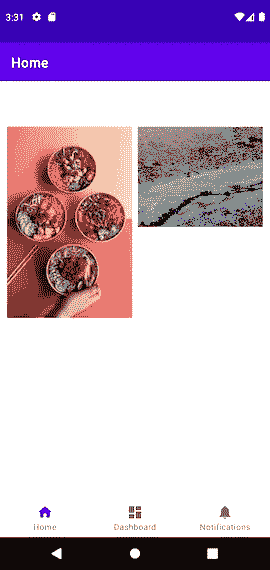

但是要小心，照片是我们的`sampleData`。我们将在下一章添加实际的网络操作。

# 添加网络操作

虽然数据是假的，但我们已经在前一章用网格展示了 MVVM 建筑的数据绑定照片。所以让我们在运行时从 Pexels API 获取真实的照片。要实现它，我们需要集成`Retrofit`。

首先，我们需要将以下依赖项添加到`build.gradle(Modules:Pexels.app)`

```
*// Retrofit* implementation 'com.squareup.retrofit2:retrofit:2.9.0'
implementation 'com.squareup.retrofit2:converter-scalars:2.9.0'
implementation 'com.squareup.retrofit2:converter-moshi:2.9.0'
```

`Sync Now`

其次，我们需要实现一个网络服务。让我们创建一个新的包，`network,`来保持代码的整洁，然后在这个包中创建一个新的接口，`PexelsApiService`，并用下面的代码替换它

```
private val *BASE_URL* = "https://api.pexels.com/v1/"

private val *moshi* = Moshi.Builder()
    .add(KotlinJsonAdapterFactory())
    .build()

private val *retrofit* = Retrofit.Builder()
    .addConverterFactory(MoshiConverterFactory.create(*moshi*))
    .baseUrl(*BASE_URL*)
    .build()

interface PexelsApiService {
    @GET("search")
    @Headers("Authorization:563492ad6f917000010000011a5094093e6e4ee3978287979ad139ac")
    fun getData(@Query("query") keyword: String,
                @Query("page") pageIndex: Int = 0,
                @Query("per_page") perPage: Int = 20): Call<Data>
}

object PexelApi {
    val retrofitService: PexelsApiService by *lazy* **{** *retrofit*.create(PexelsApiService::class.*java*)
    **}** }
```

我们需要在`HomeViewModel`类的 init 块中调用这个网络 API

让我们添加一个新方法`getDataFromNetwork`到`HomeViewModel`类中，实现如下

```
private fun getDataFromNetwork() {
    PexelApi.retrofitService.getData(keyword = "panda").enqueue(
        object: Callback<Data> {
            override fun onResponse(call: Call<Data>, response: Response<Data>) {
                _data.*value* = response.body()
            }

            override fun onFailure(call: Call<Data>, t: Throwable) {
                _data.*value* = Data(0, 0, *emptyList*(), 0, "")
            }
        }
    )
}
```

并将`init`块中的`getDataFromSample`更换为新的`getDataFromNetwork`功能

你会看到很多熊猫的照片，这是现在的硬编码关键词，显示在屏幕上，就像这样:

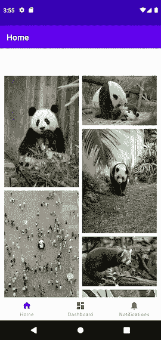

正如我们所见，我们已经实现了第一个版本的网络操作，并将其集成到我们的应用程序中。它与传统的改进回调一起工作，但是让我们在下一章实现同一个 API 的协程版本

## 网络 API 的协同程序版本

我们都知道协程可以让 Kotlin 代码更具可读性，所以让我们来试试。

让我们将另一个方法`getDataCoroutine`添加到`PexelsApiService`中，如下所示:

```
@GET("search")
@Headers("Authorization:563492ad6f917000010000011a5094093e6e4ee3978287979ad139ac")
suspend fun getDataCoroutine(@Query("query") keyword: String,
                             @Query("page") pageIndex: Int = 0,
                             @Query("per_page") perPage: Int = 20): Data
```

它是一个挂起函数，返回`Data`对象而不是`Call<Data>`。

让我们创建另一个方法，`getDataFromNetworkCoroutine`，在`HomeViewModel`类中实现如下

```
private fun getDataFromNetworkCoroutine() {
    *viewModelScope*.*launch* **{** try {
            _data.*value* = PexelApi.retrofitService.getDataCoroutine(keyword = "panda")
        } catch (e: Exception) {
            _data.*value* = Data(0, 0, *emptyList*(), 0, "")
        }
    **}** }
```

并在`init`块中调用它而不是`getDataFromNetwork`。

如果我们再次运行该应用程序，我们会得到相同的结果。

现在我们已经用`coroutine`实现了网络操作。没什么神奇的，很简单。

现在我们已经能够从 Pexels API 获取照片，但是如果网络不可用或后端宕机会发生什么？所以在下一章，我们将在`HomeViewModel`类中添加更多的属性来处理网络状态。

# 将状态添加到 HomeViewModel

让我们打开`HomeViewModel.kt`并添加一个枚举类`PexelsApiStatus`，如下所示:

```
**enum class PexelsApiStatus { *LOADING*, *ERROR*, *DONE*}**

class HomeViewModel : ViewModel() {
    ......
```

并将两个新属性`response`和`status`添加到`HomeViewModel`类中，如下所示:

```
*// The internal MutableLiveData Data that stores the most recent data* private val _data = MutableLiveData<Data>()
**private val _response = MutableLiveData<String>()
private val _status = MutableLiveData<PexelsApiStatus>()** 
*// The external immutable LiveData for the response Data* val data: LiveData<Data>
    get() = _data

**val response: LiveData<String>
    get() = _response

val status: LiveData<PexelsApiStatus>
    get() = _status**
```

并像这样用`getDataFromSample`方法更新这两个 LiveData:

```
private fun getDataFromSample() {
    val moshi = Moshi.Builder()
        .add(KotlinJsonAdapterFactory())
        .build()
    val jsonAdapter = moshi.adapter(Data::class.*java*)
    val sampleData = jsonAdapter.fromJson(*sampleData*)
    _data.*value* = sampleData ?: Data(0, 0, *emptyList*(), 0, "")
 **_response.*value* = "Success: init with sample data"
    _status.*value* = PexelsApiStatus.*DONE***}
```

同样更新`getDataFromNetwork`

```
private fun getDataFromNetwork() {
    val keyword = "panda"
    _status.*value* = PexelsApiStatus.*LOADING* PexelApi.retrofitService.getData(keyword = keyword).enqueue(
        object: Callback<Data> {
            override fun onResponse(call: Call<Data>, response: Response<Data>) {
                _data.*value* = response.body()
 **_response.*value* = "Success: Pexel data about ${keyword} is fetched"
                _status.*value* = PexelsApiStatus.*DONE***}

            override fun onFailure(call: Call<Data>, t: Throwable) {
                _data.*value* = Data(0, 0, *emptyList*(), 0, "")
 **_response.*value* = "Failure: ${t.message}"
                _status.*value* = PexelsApiStatus.*ERROR***}
        }
    )
}
```

与`getDataFromNetworkCoroutine`的更新相同

```
private fun getDataFromNetworkCoroutine() {
    val keyword = "panda"
    _status.*value* = PexelsApiStatus.*LOADING
    viewModelScope*.*launch* **{** try {
            _data.*value* = PexelApi.retrofitService.getDataCoroutine(keyword = keyword)
 **_response.*value* = "Success: Pexel data about ${keyword} is fetched"
            _status.*value* = PexelsApiStatus.*DONE***} catch (e: Exception) {
            _data.*value* = Data(0, 0, *emptyList*(), 0, "")
 **_response.*value* = "Failure: ${e.message}"
            _status.*value* = PexelsApiStatus.*ERROR***}
    **}** }
```

如果网络请求失败，我们使用`response`保存错误消息，使用`status`保存网络请求的状态。

因此，如果网络请求成功或失败，我们需要向用户显示一些差异。

我们需要做的第一步是在`BindingAdapters.kt`中添加另一个绑定适配器`bindStatus`，如下所示:

```
@BindingAdapter("marsApiStatus")
fun bindStatus(statusImageView: ImageView,
               status: PexelsApiStatus) {
    when (status) {
        PexelsApiStatus.*LOADING* -> {
            statusImageView.*visibility* = View.*VISIBLE* statusImageView.setImageResource(R.drawable.*loading_animation*)
        }
        PexelsApiStatus.*ERROR* -> {
            statusImageView.*visibility* = View.*VISIBLE* statusImageView.setImageResource(R.drawable.ic_connection_error)
        }
        PexelsApiStatus.*DONE* -> {
            statusImageView.*visibility* = View.*GONE* }
    }
}
```

我们需要另一个 drawable，`ic_connection_error`，你可以用

```
<vector xmlns:android="http://schemas.android.com/apk/res/android"
    android:width="100dp"
    android:height="100dp"
    android:tint="#A9A9AC"
    android:viewportWidth="24.0"
    android:viewportHeight="24.0">
    <path
        android:fillColor="#A9A9AC"
        android:pathData="M19.35,10.04C18.67,6.59 15.64,4 12,4c-1.48,0 -2.85,0.43 -4.01,1.17l1.46,1.46C10.21,6.23 11.08,6 12,6c3.04,0 5.5,2.46 5.5,5.5v0.5H19c1.66,0 3,1.34 3,3 0,1.13 -0.64,2.11 -1.56,2.62l1.45,1.45C23.16,18.16 24,16.68 24,15c0,-2.64 -2.05,-4.78 -4.65,-4.96zM3,5.27l2.75,2.74C2.56,8.15 0,10.77 0,14c0,3.31 2.69,6 6,6h11.73l2,2L21,20.73 4.27,4 3,5.27zM7.73,10l8,8H6c-2.21,0 -4,-1.79 -4,-4s1.79,-4 4,-4h1.73z" />
</vector>
```

或者去类似[材质设计](https://material.io/develop/android)的地方下载。

然后我们在`HomeViewModel`中实现了状态的更新，并将其绑定到布局文件中的属性`pexelsApiStatus`，但是属性在哪里呢？还是加到`fragment_home.xml`吧

让我们在`RecyclerView`部分下添加以下`ImageView`

```
<androidx.constraintlayout.widget.ConstraintLayout
    android:layout_width="match_parent"
    android:layout_height="match_parent"
    tools:context=".ui.home.HomeFragment">

    <androidx.recyclerview.widget.RecyclerView
    ......
    tools:listitem="@layout/grid_view_item" />

    <ImageView
        android:id="@+id/status_image"
        android:layout_width="200dp"
        android:layout_height="200dp"
        app:layout_constraintBottom_toBottomOf="parent"
        app:layout_constraintLeft_toLeftOf="parent"
        app:layout_constraintRight_toRightOf="parent"
        app:layout_constraintTop_toTopOf="parent"
        app:pexelsApiStatus="@{viewModel.status}" />

</androidx.constraintlayout.widget.ConstraintLayout>
```

然后我们可以打开飞行模式并运行应用程序。

它会首先显示一个加载微调，和`connection_error`图标，而不是像这样的照片:

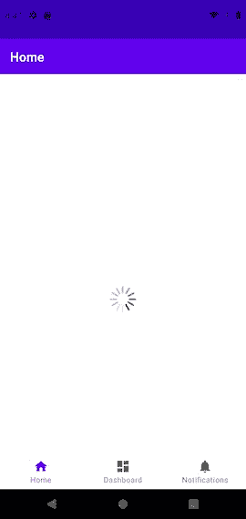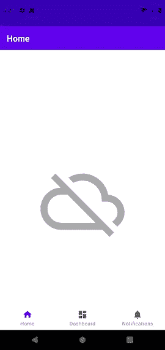

我们已经实现了这个照片应用程序的所有强制功能。让我们考虑一下我们能做些什么改进？

我们可以做的一个改进是添加一个持久存储来缓存以前获取的数据，并在应用程序启动时显示这些缓存的数据。同时发送网络请求，当获取新数据时，应用程序会刷新列表以显示新照片。在网络不可用的情况下，应用程序仍然可以显示缓存的数据。这将是一个更好的用户体验。

# 添加持久存储

我们将引入`Room`来保存数据。

> Room persistence 库在 SQLite 上提供了一个抽象层，允许流畅的数据库访问，同时充分利用 SQLite 的强大功能。特别是，Room 提供了以下好处:
> 
> SQL 查询的编译时验证。
> 
> 最大限度减少重复和容易出错的样板代码的便利注释。
> 
> 简化的数据库迁移路径。
> 
> 出于这些考虑，我们强烈建议您使用 Room，而不是直接使用 SQLite API。

([https://developer.android.com/training/data-storage/room](https://developer.android.com/training/data-storage/room))

首先，我们需要将以下依赖项添加到`build.gradle(Project:Pexels)`

```
*// Room* implementation 'androidx.room:room-runtime:2.3.0-rc01'
kapt 'androidx.room:room-compiler:2.3.0-rc01'
```

和`Sync Now`

其次，我们需要创建`entity`类。让我们创建一个新的包`database`，其中包含所有与数据库相关的文件。

我们需要创建一个数据库实体类，如下所示:

```
class DatabasePexelsPhoto constructor(
    @PrimaryKey
    val id: String,
    val width: Int = 0,
    val height: Int = 0,
    val url: String = "",
    val photographer: String = "",
    val photographerUrl: String = "",
    val photographerId: Int = 0,
    val avgColor: String = "",
    val src: String = "",
    val liked: Boolean = false)
```

而且我们会只在数据库中保存照片，而不是整个`Data`对象，因为在数据库中保存其他类似`page`、`perPage`、`totalResults`和`nextPage`的属性是没有意义的。

我们还需要实现一个数据转换功能，因为`DatabasePexelsPhoto`中的字段类型与`Data.Photo`中的不同。我们需要将 DB 中的`String`转换成`Data.Photo.Src`对象。

我们在第`src = jsonAdapter.fromJson(it.src),`行出错。别管它，我们以后会修理它。

我们还需要在`Data.kt`中实现另一个转换函数，将照片数据从`Data.Photo`转换到`DatabasePexelsPhoto`，如下所示:

```
fun List<Data.Photo>.asDatabaseModel(): List<DatabasePexelsPhoto> {
    val moshi = Moshi.Builder()
        .add(KotlinJsonAdapterFactory())
        .build()
    val jsonAdapter = moshi.adapter(Data.Photo.Src::class.*java*)

    return *map* **{** DatabasePexelsPhoto(
            id = **it**.id.toString(),
            width = **it**.width,
            height = **it**.height,
            url = **it**.url,
            photographer = **it**.photographer,
            photographerUrl = **it**.photographerUrl,
            photographerId = **it**.photographerId,
            avgColor = **it**.avgColor,
            src =jsonAdapter.toJson(**it**.src),
            liked = **it**.liked
        )
    **}** }
```

并将行`val src: Src,`更新为`val src: Src?,`以修复之前的错误。

然后是时候造道了。让我们在`database`包中新建一个文件`Room.kt`并声明一个接口`PexelsPhotoDao`，有两个方法`getPhotos`和`insertAll`。当这些方法被调用时，`Room`将从/向数据库获取/插入数据。

```
@Dao
interface PexelsPhotoDao {
    @Query("select * from databasepexelsphoto")
    fun getPhotos(): LiveData<List<DatabasePexelsPhoto>>

    @Insert(onConflict = OnConflictStrategy.*REPLACE*)
    fun insertAll(photos: List<DatabasePexelsPhoto>)
}
```

我们需要创建一个 Room 实例，`INSTANCE`如下所示，它是整个应用程序中的单例对象。

```
@Database(entities = [DatabasePexelsPhoto::class], version = 1)
abstract class PexelsPhotoDatabase: RoomDatabase() {
    abstract val pexelsPhotoDao: PexelsPhotoDao
}

private lateinit var *INSTANCE*: PexelsPhotoDatabase

fun getDatabase(context: Context): PexelsPhotoDatabase {
    *synchronized*(PexelsPhotoDatabase::class.*java*) **{** if (!::*INSTANCE*.*isInitialized*) {
            *INSTANCE* = Room.databaseBuilder(context.*applicationContext*,
                PexelsPhotoDatabase::class.*java*,
                "pexelsphoto").build()
        }
    **}** return *INSTANCE* }
```

现在我们已经实现了一个接口，用 Room 从/向数据库中获取/放入数据，但它与网络接口是隔离的。我们需要整合它们。

根据[应用架构指南](https://developer.android.com/jetpack/guide)，它建议单一来源的事实，所以我们将只从数据库获取数据。即使从网络接口获取的新数据将被保存到数据库中而不是直接显示。所以我们需要添加一个存储库模块。

让我们创建一个新的包，`repository`，并在这个包中创建一个新的存储库类，`PexelsPhotoReposiroty`。我们还需要实现一个属性`data`，它从数据库中读取数据并封装在一个 LiveData 中，还需要实现一个方法，在该方法中进行一个`PexelApi`调用并将提取的数据保存到数据库中。

```
class PexelsPhotoRepository(private val database: PexelsPhotoDatabase) {

    val data: LiveData<Data>
        get() {
            val photos = database.pexelsPhotoDao.getPhotos()
            return Transformations.map(photos) **{** Data(
                    page = 0,
                    perPage = 0,
                    photos = **it**.*asDomainModel*(),
                    totalResults = **it**.size,
                    nextPage = ""
                )
            **}** }

    suspend fun refreshPexelsPhoto(keyword: String) {
        withContext(Dispatchers.IO) **{** val data = PexelApi.retrofitService.getDataCoroutine(keyword)
            database.pexelsPhotoDao.insertAll(data.photos.*asDatabaseModel*())
        **}** }
}
```

我们用工厂函数`Transformations.map()`将`LiveData<List<DatabasePexelsPhoto>>`绑定到`LiveData<Data>`，工厂函数`Transformations.map()`观察输入 LiveData 的变化，并相应地更新输出 LiveData。

然后我们将修改`HomeViewModel`类，让它从存储库而不是网络 API 获取数据。

我们需要调用`HomeViewModel`中的`getDatabse`来获取`PexelsPhotoDatabse`的实例，并基于这个数据库对象实例化一个`PexelsPhotoRepository`的对象。让我们在`HomeViewModel`类的开头添加下面一行

```
private val pexelsPhotoRepository = PexelsPhotoRepository(*getDatabase*(application))
```

您会注意到，到目前为止我们还没有应用程序实例，所以我们需要用

```
class HomeViewModel : ViewModel()
```

到

```
class HomeViewModel(application: Application) : AndroidViewModel(application)
```

改变台词

```
val data: LiveData<Data>
    get() = _data
```

到

```
val data = pexelsPhotoRepository.data
```

正如我之前提到的，我们从存储库中获取数据，而不是从数据的后台获取数据，后者将直接从网络 API 更新。

是时候抛弃我们从网络 API 获取数据的代码了。我们不再需要`getDataFromNetwork`和`getDataFromNetworkCoroutine`了。

但是我们需要实现另一个方法 refreshRepository，如下所示:

```
private fun refreshRepository() {
    val keyword = "panda"
    _status.*value* = PexelsApiStatus.*LOADING
    viewModelScope*.*launch* **{** try {
            pexelsPhotoRepository.refreshPexelsPhoto(keyword)
            _response.*value* = "Success: Pexel data about ${keyword} is fetched"
            _status.*value* = PexelsApiStatus.*DONE* } catch (e: Exception) {
            _data.*value* = Data(0, 0, *emptyList*(), 0, "")
            _response.*value* = "Failure: ${e.message}"
            _status.*value* = PexelsApiStatus.*ERROR* }
    **}** }
```

并在`init`块中调用它，而不是调用`getDataFromNetwork`或`getDataFromNetworkCoroutine`

有了这段代码，我们将在应用程序启动时发送网络请求来刷新数据库中的数据。

我们还需要在`HomeViewModel`类中添加一个内部类`Factory`，如下所示:

```
class Factory(val app: Application): ViewModelProvider.Factory {
    override fun <T : ViewModel?> create(modelClass: Class<T>): T {
        if (modelClass.isAssignableFrom(HomeViewModel::class.*java*)) {
            @Suppress("UNCHECKED_CAST")
            return HomeViewModel(app) as T
        }
        throw IllegalArgumentException("Unable to construct viewmodel")
    }
}
```

当我们在`HomeFragment`类中实例化`HomeViewModel`对象时，将使用这个类

我们还需要在`HomeFragment`类中进行最后的修改来替换

```
private val homeViewModel: HomeViewModel by lazy {
        ViewModelProvider(this)
            .get(HomeViewModel::class.java)
    }
```

到

```
private val homeViewModel: HomeViewModel by lazy {
        val activity = requireNotNull( this.activity) {
            "You can only access the viewModel after onActivityCreated()"
        }
        ViewModelProvider(this, HomeViewModel.Factory(activity.application))
            .get(HomeViewModel::class.java)
    }
```

当我们实例化`HomeViewModel`对象时。

现在我们会注意到，当应用程序启动时，属性`PexelsPhotoRepository.data.get()`将被调用来更新`HomeViewModel.data`，而方法`PexelsPhotoRepository.refreshPexelsPhoto()`将被调用来更新数据库。

先用网络连接运行 app 吧。它会像往常一样加载照片，如下所示:

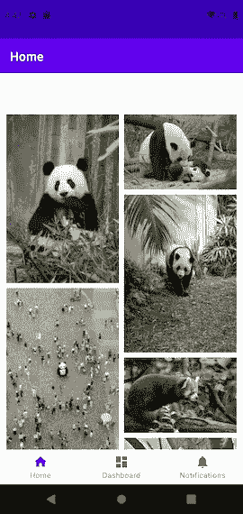

然后我们关掉应用程序，打开飞行模式，再次启动应用程序。你会发现从数据库中读取的数据将首先显示，所以应用程序会知道照片的 url，然后一些缓存的照片由`Retrofit`可以显示如下 2 截图。

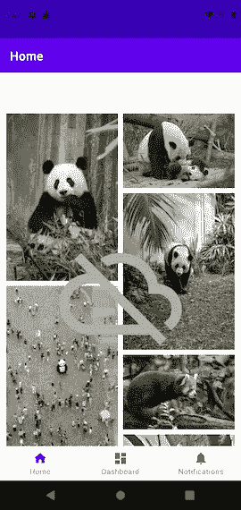

但是如果你向下滚动，你会发现一些照片一直在加载。这是因为尽管这些照片的网址是正确的，但它们没有被`Retrofit`缓存。

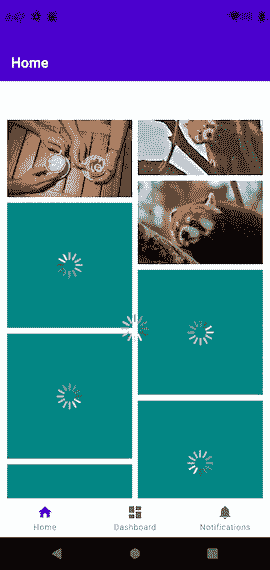

现在，我们已经完成了从网络获取数据，将照片保存在数据库中，并以单源真实方式在 RecyclerView 中显示这些照片的部分。

但你可能会注意到，当应用程序启动时，我们只获取了 20 张照片的数据一次，所以它不会获取更多照片。我们还会注意到，`Pexels` API 实际上支持带有查询参数`page`的分页，所以在下一章，我们将为我们的应用程序添加分页。

# 添加分页

我们计划做的是，当用户滚动到列表底部时，获取下一页的照片。

让我们打开`PexelsPhotoRespository.kt`并添加属性`data`的 backfield，因为我们需要保存 http 响应中的`nextPage` url，但我们不想保存在数据库中。因此，修改属性`data`如下:

```
**val _data = MutableLiveData<Data>()** val data: LiveData<Data>
    get() {
        val photos = database.pexelsPhotoDao.getPhotos()
        return Transformations.map(photos) **{** Data(
 **page = _data.*value*?.page ?: 0,
                perPage = _data.*value*?.perPage ?: 0,**                photos = **it**.*asDomainModel*(),
                totalResults = **it**.size,
 **nextPage = _data.*value*?.nextPage ?: ""**            )
        **}** }
```

我们还需要修改方法`refreshPexelsPhoto`,如下所示:

```
suspend fun refreshPexelsPhoto(keyword: String, pageIndex: Int) {
    lateinit var data: Data
    withContext(Dispatchers.IO) **{** data = PexelApi.retrofitService.getDataCoroutine(keyword, pageIndex = pageIndex)
        database.pexelsPhotoDao.insertAll(data.photos.*asDatabaseModel*())
    **}** _data.*value* = data
}
```

我们做了两个改变，一个是添加了一个新的参数，`pageIndex`用于让`PexelApi`知道获取哪个页面，另一个是保存响应`data`。

然后我们需要更新`HomeViewModel`类，如下所示

首先，我们需要将方法`refreshRepository`改为 public，这样就可以从片段中调用它。我们还需要如下更新此方法:

```
**fun refreshRepository() {
**    val keyword = "panda"
 **val nextPageUri = data.*value*?.nextPage?.*toUri*()
    val pageIndex = nextPageUri?.getQueryParameter("page")?.*toInt*() ?: 0**    _status.*value* = PexelsApiStatus.*LOADING
    viewModelScope*.*launch* **{** try {
 **pexelsPhotoRepository.refreshPexelsPhoto(keyword, pageIndex = pageIndex)** ......
    **}** }
```

其次，让我们更新`PhotoGridAdapter`类，当用户滚动到列表底部时做一些事情。

我们需要给`PhotoGridAdapter`的签名添加一个新参数`onScrollToBottom`，它是一个传入的函数，如下所示:

```
class PhotoGridAdapter**(private val onScrollToBottom: () -> Unit)**: ListAdapter<Data.Photo, PhotoGridAdapter.PhotoGridViewHolder>(DiffCallback)
```

并调用此函数`onScrollToBottom`，当滚动到列表底部时用`onBindViewHolder`方法如下:

```
override fun onBindViewHolder(holder: PhotoGridViewHolder, position: Int) {
    val photo = getItem(position)
 **if (position == *itemCount* - 1) {
        onScrollToBottom()
    }**    holder.bind(photo)
}
```

最后，让我们将函数`homeViewModel.getDataFromRepository()`传递给在`HomeFragment`类中实例化的`PhotoGridAdapter`对象，如下所示:

```
override fun onCreateView(
        inflater: LayoutInflater,
        container: ViewGroup?,
        savedInstanceState: Bundle?
): View? {
    val binding = FragmentHomeBinding.inflate(inflater)

    *// Allows Data Binding to Observe LiveData with the lifecycle of this Fragment* binding.*lifecycleOwner* = this

    *// Giving the binding access to the OverviewViewModel* binding.*viewModel* = homeViewModel

 **binding.photosGrid.*adapter* = PhotoGridAdapter() {homeViewModel.refreshRepository()}** return binding.*root* }
```

让我们运行应用程序，向下滚动到列表的底部。我们会看到下一页的照片将被加载。如果你继续滚动，将会加载越来越多的照片。

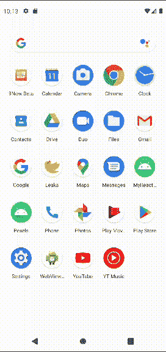

现在我们已经完成了分页。当滚动到当前列表的底部时，它将获取下一页数据。还因为所有提取的照片将被添加到数据库中，所以重复的照片将被替换。

到目前为止一切顺利。但是，您可能会注意到所有照片都是熊猫，因为查询关键字被硬编码为熊猫。所以在下一章，我们将添加一个搜索视图让用户输入关键字。

# 添加搜索视图

首先，我们需要向`PexelsPhotoDao`接口添加一个新的 API，`clearAll`，它用于在关键字发生变化时清理数据库表。让我们打开`Room.kt`，将下面的方法添加到`PexelsPhotoDao`界面。

```
@Query("delete from databasepexelsphoto")
fun clearAll()
```

我们还需要添加一个新方法`clearDatabase`，作为`PexelsPhotoRepository`类的后续方法。

```
suspend fun clearDatabase() {
    withContext(Dispatchers.IO) **{** database.pexelsPhotoDao.clearAll()
    **}** }
```

它是一个在 IO 线程上运行的挂起函数，因为数据库操作也是一个长时间运行的任务。

然后我们需要更新`HomeViewModel`。让我们打开`HomeViewModel.kt`，在`refreshRepository`方法中添加一个新参数`keyword`，如下所示，并相应地修改实现:

```
fun refreshRepository(**keyword: String = ""**) {
 **if (keyword.*isEmpty*()) {
        _status.*value* = PexelsApiStatus.*DONE* } else {**        val nextPageUri = data.*value*?.nextPage?.*toUri*()
        .....
        pexelsPhotoRepository.refreshPexelsPhoto(keyword, pageIndex = pageIndex)
        ......
       _status.*value* = PexelsApiStatus.*ERROR* }
**}**
```

这一变化表明，如果关键字为空，我们除了将`status`设置为`DONE`之外什么也不做，否则，我们将在调用`pexelsPhotoRepository.refreshPexelsPhoto`方法时使用该关键字获取数据。

您可能想要修改方法`getDataFromNetworkCoroutine`和`getDataFromNetwork`，尽管它们已经不再使用。

然后我们需要在`HomeViewModel`类中添加另一个私有方法`clearDataFromDatabase`

```
private fun clearDataFromDatabase() {
    *viewModelScope*.*launch* **{** try {
            pexelsPhotoRepository.clearDatabase()
        } catch (e: Exception) {
            _response.*value* = "Failure: ${e.message}"
            _status.*value* = PexelsApiStatus.*DONE* }
    **}** }
```

这个方法会调用`pexelsPhotoRepository.clearDatabase()`来清理数据库中的数据。

然后，我们需要添加一个新的方法`updateKeyword`，如下所示，当关键字发生变化时，将从`HomeFragment`调用该方法。

```
fun updateKeyword( keyword: String) {
    clearDataFromDatabase()
    refreshRepository(keyword)
}
```

这种方法非常简单，只需清理数据库，并用 new 关键字获取新数据。

现在我们已经更新了`PexelsPhotoDao`、`PexelsPhotoRepository`、`HomeViewModel`，是时候更新视图了、`HomeFragment`。

我们需要做的第一件事是添加一个`SearchView`和相应的监听器到`HomeFragment`类，允许用户输入关键字。

让我们在`./res/menu`文件夹中创建一个新的 xml 文件`home.xml`，并在其中添加一项，如下所示:

```
*<?*xml version="1.0" encoding="utf-8"*?>* <menu xmlns:android="http://schemas.android.com/apk/res/android"
    **xmlns:app="http://schemas.android.com/apk/res-auto"**>
 **<item android:id="@+id/action_search"
        android:title=""
        android:icon="@android:drawable/ic_menu_search"
        app:actionViewClass="androidx.appcompat.widget.SearchView"
        app:showAsAction="always"/>** </menu>
```

然后我们需要打开`HomeFragment.kt`，给`HomeFragment`类添加一个新的接口`androidx.appcompat.widget.SearchView.OnQueryTextListener`，如下所示:

```
class HomeFragment : Fragment()**, androidx.appcompat.widget.SearchView.OnQueryTextListener**
```

并添加一个私有属性`keyword`来保存用户输入的关键字，如下所示。

```
private var keyword = ""
```

实例化`SearchView`并在`onCreateView`方法下实现监听器，如下所示:

```
private var searchView: androidx.appcompat.widget.SearchView? = null
override fun onCreateOptionsMenu(menu: Menu, inflater: MenuInflater) {
    inflater.inflate(R.menu.*home*, menu)
    searchView = menu.findItem(R.id.*action_search*)?.*let* **{
        it**.*actionView* as? androidx.appcompat.widget.SearchView
    **}**?.*apply* **{** (*activity*?.getSystemService(Context.*SEARCH_SERVICE*) as? SearchManager)?.*also* **{** setSearchableInfo(**it**.getSearchableInfo(*activity*?.*componentName*))
        **}** *maxWidth* = Int.MAX_VALUE

        setIconifiedByDefault(false)
        *isIconified* = false
        *isSubmitButtonEnabled* = false
        setOnQueryTextListener(this@HomeFragment)
        requestFocus()
        *layoutParams* = ActionBar.LayoutParams(
            ActionBar.LayoutParams.*MATCH_PARENT*,
            ActionBar.LayoutParams.*MATCH_PARENT*)
    **}** }

override fun onQueryTextSubmit(query: String?): Boolean {
    return query?.*let* **{** if (**it**.length < 2) { return@let false }
        keyword = **it** homeViewModel.updateKeyword(keyword)
        searchView?.clearFocus()
        true
    **}** ?: false
}

override fun onQueryTextChange(newText: String?): Boolean {
    return true
}
```

在这段代码中，我们将初始化一个`SearchView`并将它绑定到`home`菜单中的`action_search`，它实现了搜索行为。我们还实现了监听器`onQueryTextSubmit`，当用户点击键盘上的`search`图标时会被调用，并触发`homeViewModel.updateKeyword()`方法，以及`onQueryTextChange`指示输入文本被更改。

我们还需要在 onCreateView 方法的开头添加如下菜单:

```
override fun onCreateView(
        inflater: LayoutInflater,
        container: ViewGroup?,
        savedInstanceState: Bundle?
): View? {
 **setHasOptionsMenu(true)**    val binding = FragmentHomeBinding.inflate(inflater)
    ...... binding.photosGrid.*adapter* = PhotoGridAdapter( PhotoGridAdapter.OnClickListener **{** homeViewModel.displayPhotoDetails(it)
    **}**) **{**homeViewModel.refreshRepository(**keyword**)**}** ......
}
```

小心，我们在调用`homeViewModel.refreshRepository`的时候也加了一个参数`keyword`，否则什么都取不到。

现在让我们运行应用程序，你会在`Home`页面的`ActionBar`处发现一个新的`SearchView`，如下图所示。然后你可以在`SearchView`中输入关键字，如`gorilla`，点击键盘上的`search`图标。

它会获取带有新关键字 gorilla 的照片，并更新数据库，然后像这样刷新列表:


到目前为止，这款应用相当不错，功能齐全。你还需要什么增强功能？也许另一个页面可以显示单张照片的详细信息。当你点击列表中的一张照片时，它会导航到新的`Detail`页面。让我们在下一章实现它。

# 添加详细信息页面

我们将使用 [Android 导航组件](https://developer.android.com/guide/navigation)实现从`Home`页面到`Detail`页面的导航，因此我们需要在`build.gradle(Module:Pexls.app)`的`dependencies`部分添加以下依赖项

```
*// Navigation* implementation 'androidx.navigation:navigation-fragment-ktx:2.3.4'
implementation 'androidx.navigation:navigation-ui-ktx:2.3.4'
```

我们将使用一个新的功能，`navigation-safe-args`，所以我们需要添加更多的插件和依赖

让我们打开`build.gradle(Project:Pexels)`，在`dependencies`块中添加如下几行:

```
dependencies **{** classpath "com.android.tools.build:gradle:4.1.1"
        classpath "org.jetbrains.kotlin:kotlin-gradle-plugin:$kotlin_version"
        **classpath "androidx.navigation:navigation-safe-args-gradle-plugin:2.3.4"**

        *// NOTE: Do not place your application dependencies here; they belong
        // in the individual module build.gradle files* **}
}**
```

再次打开 build.gradle(Module:Pexels.app)将另一个插件添加到 plugins 部分，如下所示:

```
plugins **{** id 'com.android.application'
    id 'kotlin-android'
    id 'kotlin-android-extensions'
    id 'kotlin-kapt'
    **id 'androidx.navigation.safeargs.kotlin'**
**}**
```

立即同步

我们将在下一步为`Detail`页面添加`ViewModel`。

为了项目的干净，我们先在`ui`包中创建新包`detail`。

我们需要在这个包中创建一个新类`DetailViewModel`，并更新代码如下:

```
class DetailViewModel(photo: Data.Photo, app: Application): AndroidViewModel(app) {
    private val _photo = MutableLiveData<Data.Photo>()
    val photo: LiveData<Data.Photo>
        get() = _photo

    init {
        _photo.*value* = photo
    }
}
```

它非常类似于`HomeViewModel`类，因为我们刚刚在其中创建了一个 LiveData 属性`photo`，来表示要显示的照片。

我们还需要添加一个`ViewModelProvider.Factory`的子类，用于检查创建的视图模型的类型是否正确，因为我们需要向它传递一些参数。在`init`块下添加以下代码。

```
class Factory( private val photo: Data.Photo,
               private val app: Application): ViewModelProvider.Factory {
    @Suppress("UNCHECKED_CAST")
    override fun <T : ViewModel?> create(modelClass: Class<T>): T {
        if (modelClass.isAssignableFrom(DetailViewModel::class.*java*)) {
            return DetailViewModel( photo, app) as T
        }
        throw IllegalArgumentException("Unknown View class")
    }

}
```

现在，我们已经完成了`Detail`页面的`ViewModel`。是时候实现`View`部分了。

让我们用`BlankFragment`模板创建一个新的片段`DetailFragment`。你会注意到会创建两个新文件，`DetailFragment.kt`和`fragment_detail.xml`。

先更新一下`fragment_detail.xml`吧。

为了使用`DataBinding`，我们需要移除整个`FrameLayout`部分，并添加如下的`layout`部分。

```
<layout xmlns:android="http://schemas.android.com/apk/res/android"
    xmlns:app="http://schemas.android.com/apk/res-auto"
    xmlns:tools="http://schemas.android.com/tools">
</layout>
```

我们需要在`layout`块中添加一个带有`variable`块的`data`块，用于声明变量的名称和类型，如下所示:

```
<data>
    <variable
        name="viewModel"
        type="com.ovlesser.pexels.ui.detail.DetailViewModel" />
</data>
```

我们还需要在`data`部分添加一些组件，如下:`image`、`id`、`size`(宽*高)、`url`和`photographer`

```
<ScrollView
    <androidx.constraintlayout.widget.ConstraintLayout
        android:layout_width="match_parent"
        android:layout_height="wrap_content"
        android:padding="16dp">

        <ImageView
            android:id="@+id/detail_photo"
            android:layout_width="0dp"
            android:layout_height="226dp"
            app:layout_constraintEnd_toEndOf="parent"
            app:layout_constraintStart_toStartOf="parent"
            app:layout_constraintTop_toTopOf="parent"
            app:imageUrl="@{viewModel.photo.src.medium}"
            tools:src="@tools:sample/backgrounds/scenic" />

        <TextView
            android:id="@+id/detail_id"
            android:layout_width="wrap_content"
            android:layout_height="wrap_content"
            android:layout_marginTop="16dp"
            android:textColor="#de000000"
            android:text="@{String.valueOf(viewModel.photo.id)}"
            app:layout_constraintStart_toStartOf="parent"
            app:layout_constraintTop_toBottomOf="@+id/detail_photo" />

        <TextView
            android:id="@+id/detail_size"
            android:layout_width="wrap_content"
            android:layout_height="wrap_content"
            android:layout_marginTop="16dp"
            android:textColor="#de000000"
            android:text="@{viewModel.size}"
            app:layout_constraintStart_toStartOf="parent"
            app:layout_constraintTop_toBottomOf="@+id/detail_id" />

        <TextView
            android:id="@+id/detail_url"
            android:layout_width="wrap_content"
            android:layout_height="wrap_content"
            android:layout_marginTop="16dp"
            android:textColor="#de000000"
            android:text="@{viewModel.photo.url}"
            app:layout_constraintStart_toStartOf="parent"
            app:layout_constraintTop_toBottomOf="@+id/detail_size" />

        <TextView
            android:id="@+id/detail_photographer"
            android:layout_width="wrap_content"
            android:layout_height="wrap_content"
            android:layout_marginTop="16dp"
            android:textColor="#de000000"
            android:text="@{viewModel.photo.photographer}"
            app:layout_constraintStart_toStartOf="parent"
            app:layout_constraintTop_toBottomOf="@+id/detail_url" />

    </androidx.constraintlayout.widget.ConstraintLayout>
</ScrollView>
```

我们将显示照片图像的`ImageView`和显示其他信息的其他`TextView`放在`ScrollView`中，以使整个布局可滚动，以防图像过大。

我们还设置了`app:imageUrl="@{viewModel.photo.src.medium}"`来设置`ImageView`的源

您可能会注意到在`android:text=”@{viewModel.size}”`处突出显示了一个错误，这是因为在`DetailViewModel`类中没有名为`size`的属性或方法。要解决这个问题，我们需要将属性`size`添加到`DetailViewModel`中，如下所示:

```
val size = Transformations.map(this.photo) **{** "${**it**.width} * ${**it**.height}"
**}**
```

然后我们会找到属性`DetailViewModel.size`

下一步我们要做的是更新数据模型，因为我们需要将参数传递到`Detail`页面，以指示从`Home`页面的列表中选择了哪个项目。而且这个参数必须是可序列化或可打包的，所以我们需要更新`Data`、`Data.Photo`和`Data.Photo.Src`，如下所示:

```
**@Parcelize**
data class Data(
    val page: Int = 0,
    @Json(name = "per_page") val perPage: Int = 0,
    val photos: List<Photo>,
    @Json(name = "total_results") val totalResults: Int = 0,
    @Json(name = "next_page") val nextPage: String = ""
)**: Parcelable** {
    **@Parcelize**
    data class Photo(
        val id: Int,
        val width: Int = 0,
        val height: Int = 0,
        val url: String = "",
        val photographer: String = "",
        @Json(name = "photographer_url") val photographerUrl: String = "",
        @Json(name = "photographer_id") val photographerId: Int = 0,
        @Json(name = "avg_color") val avgColor: String = "",
        val src: Src? = null,
        val liked: Boolean = false,
    )**: Parcelable** {
        **@Parcelize**
        data class Src(
            val original: String = "",
            val large2x: String = "",
            val large: String = "",
            val medium: String = "",
            val small: String = "",
            val portrait: String = "",
            val landscape: String = "",
            val tiny: String = ""
        )**: Parcelable**
    }
}
```

我们还将默认值添加到一些属性中，以简化后面的`Data`对象的实例化。

有趣的是，我们将使用导航图来实现导航。

让我们打开`./res/layout/navigation/mobile-navagation.xml`文件，添加一个新的片段段，如下所示:

```
<navigation xmlns:android="http://schemas.android.com/apk/res/android"
    ......
    app:startDestination="@+id/navigation_home">

    <fragment
       ......
       tools:layout="@layout/fragment_notifications" />

 **<fragment
        android:id="@+id/navigation_detail"
        android:name="com.ovlesser.pexels.ui.detail.DetailFragment"
        android:label="@string/title_detail"
        tools:layout="@layout/fragment_detail" />** </navigation>
```

作为新的导航目的地。我们还将字符串文字`title_detail`添加到`./res/values/string.xml`中，如下所示:

```
<string name="title_detail">Detail</string>
```

然后，让我们将动作添加到`Home`片段中，如下所示，使我们从`Home`片段到`Detail`片段

```
<fragment
    android:id="@+id/navigation_home"
    android:name="com.ovlesser.pexels.ui.home.HomeFragment"
    android:label="@string/title_home"
    tools:layout="@layout/fragment_home"**>
    <action
        android:id="@+id/action_showDetail"
        app:destination="@id/navigation_detail" />
</fragment>**
```

我们还需要将`argument`块添加到`Detail`片段中，如下所示，以定义将从`Home`片段传递到`Detail`片段的参数类型。

```
<fragment
    android:id="@+id/navigation_detail"
    android:name="com.ovlesser.pexels.ui.detail.DetailFragment"
    android:label="@string/title_detail"
    tools:layout="@layout/fragment_detail"**>
    <argument
        android:name="photo"
        app:argType="com.ovlesser.pexels.data.Data$Photo" />
</fragment>**
```

小心`Data`和`Photo`之间的`$`，因为`Photo`是`Data`的内部类，它实际上在这里使用了反射。

在这一步之后，您可能需要关闭项目/清理项目以确保类`DetailFragmentArgs`被生成(如果它不是自动生成的)。

现在，我们需要更新`DetailFragment`类。让我们打开`DetailFragment.kt`并删除所有模板代码，用下面的代码替换 onCreateView 方法

```
override fun onCreateView(
    inflater: LayoutInflater, container: ViewGroup?,
    savedInstanceState: Bundle?
): View? {
    val application = *requireNotNull*(*activity*).*application* val binding = FragmentDetailBinding.inflate(inflater)
    binding.*lifecycleOwner* = this

    val photo = DetailFragmentArgs.fromBundle(requireArguments()).photo
    val viewModelFactory = DetailViewModel.Factory( photo, application)
    binding.*viewModel* = ViewModelProvider(
        this, viewModelFactory).get(DetailViewModel::class.*java*)
    return binding.*root* }
```

当`DetailFragment`被初始化时，我们将从`requireArguments()`获得一个`Photo`对象。

然后我们需要更新`PhotoGridAdapter`类，使其响应列表项上的`click`事件。

让我们打开`PhotoGridAdapter.kt`并将一个新属性`onClickListener`添加到`PhotoGridAdapter`类，如下所示:

```
class PhotoGridAdapter(**private val onClickListener: OnClickListener,**
                       private val onScrollToBottom: () -> Unit): ListAdapter<Data.Photo, PhotoGridAdapter.PhotoGridViewHolder>(DiffCallback)
```

我们还需要实现一个内部类`OnClickListener`，如下所示:

```
class OnClickListener(val clickListener: (photo: Data.Photo) -> Unit) {
    fun onClick( photo: Data.Photo) = clickListener( photo)
}
```

并将`click`事件的响应添加到`onBindViewHolder`方法中，如下所示:

```
override fun onBindViewHolder(holder: PhotoGridViewHolder, position: Int) {
    val photo = getItem(position)
    if (position == *itemCount* - 1) {
        onScrollToBottom()
    }
 **holder.itemView.setOnClickListener {
        onClickListener.onClick(photo)
    }** holder.bind(photo)
}
```

现在，当一个列表项被点击时，它会调用回调函数`onClickListener.onClick(photo)`。当`PhotoGridAdapter`对象被实例化时，这个回调函数从`HomeFragment`传递过来。

下一步是更新`HomeViewModel`类，因为我们需要保存哪个列表项被点击。

让我们打开`HomeViewModel.kt`文件，添加另一个属性`selectedPhoto`及其 backfield `_selectedPhoto`，如下图所示:

```
private val _status = MutableLiveData<PexelsApiStatus>()
**private val _selectedPhoto = MutableLiveData<Data.Photo?>()** ......
val status: LiveData<PexelsApiStatus>
    get() = _status

**val selectedPhoto: LiveData<Data.Photo?>
    get() = _selectedPhoto**
```

我们还需要添加两个方法`displayPhotoDetails(photo: Data.Photo)`和`displayPhotoDetailComplete()`，如下所示，其中属性`selectedPhoto`将被更新。

```
fun displayPhotoDetails( photo: Data.Photo) {
    _selectedPhoto.*value* = photo
}

fun displayPhotoDetailComplete() {
    _selectedPhoto.*value* = null
}
```

现在，让我们更新`HomeFragment`类，将所有的更改绑定在一起。

让我们打开`HomeFragment.kt`并更新`viewModelAdapter`的实例化，如下所示:

```
binding.photosGrid.*adapter* = PhotoGridAdapter( **PhotoGridAdapter.OnClickListener {
    homeViewModel.displayPhotoDetails(it)
}**) **{**homeViewModel.refreshRepository()**}**
```

通过这一更改，我们将把一个 lambda 函数`PhotoGridAdapter.OnClickListener {
homeViewModel.displayPhotoDetails(it)
}`传递给 photoGridAdapter 对象。onClick()将被设置为`homeViewModel.displayPhotoDetails(it)`。这意味着当用户点击列表项时会调用`homeViewModel.displayPhotoDetails(it)`。该参数将是所选列表项的照片对象。

我们还需要添加一个观察者来观察 LiveData 属性`selectedPhoto`并导航到目的片段`DetailFragment`，如果`selectedPhoto`发生了变化。

```
homeViewModel.selectedPhoto.observe(*viewLifecycleOwner*, *Observer* **{** if (**it** != null) {
        this.*findNavController*().navigate(
            HomeFragmentDirections.actionShowDetail(it))
        homeViewModel.displayPhotoDetailComplete()
    }
**}**)
```

如果您发现找不到`findNavController`，您可能需要重启`Android Studio`。

我们差不多完成了。让我们运行应用程序，从`Home`页面上的列表中单击一张照片，它将导航到`Detail`页面，显示这张照片和一些信息。这正是我们所期望的。但是您可能会注意到一个小问题，即您无法通过点击`Detail`页面上的`Back`按钮返回到`Home`页面。让我们修理它。

我们需要打开`MainActivity.kt`并添加以下覆盖方法来启用后退按钮。

```
override fun onOptionsItemSelected(item: MenuItem): Boolean {
    when (item.*itemId*) {
        android.R.id.*home* -> {
            onBackPressed()
            return true
        }
    }
    return super.onOptionsItemSelected(item)
}
```

那我们再运行一下 app 吧。它将显示`Home`页面。点击单张照片后会导航到`Detail`页面，点击`Detail`页面的`Back`按钮会返回到`Home`页面，如下图:


然后，一旦用户在`ActionBar`点击`Back`按钮，应用程序将能够像按下`Back`按钮一样返回上一页。这不会影响在`home`、`dashboard`和`notification`页面之间的导航，因为这些页面已经在`onCreate`方法中用下面的模板代码设置为顶层页面。

```
val appBarConfiguration = *AppBarConfiguration*(*setOf*(
        R.id.*navigation_home*, R.id.*navigation_dashboard*, R.id.*navigation_notifications*))
*setupActionBarWithNavController*(navController, appBarConfiguration)
```

我们已经完成了这个照片应用程序的所有功能。在未来的教程中，我们可能会添加更多的功能来填充其他页面。

感谢浏览我的教程，欢迎任何反馈。

如果你对如何编写 android 项目的单元测试感兴趣，可以在[https://kxie 0124 . medium . com/how-to-write-unit-test-of-app-based-on-Android-architecture-components-and-coroutine-8e 5473 f 6674 c](https://kxie0124.medium.com/how-to-write-unit-test-of-app-based-on-android-architecture-components-and-coroutine-8e5473f6674c)中找到该项目的单元测试。