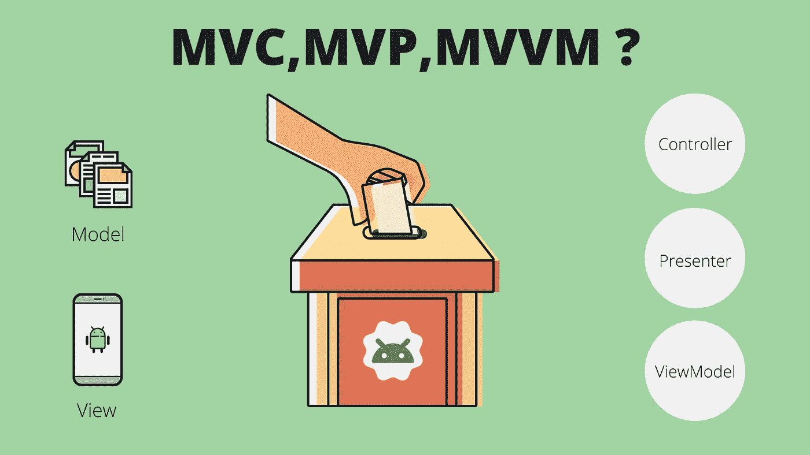
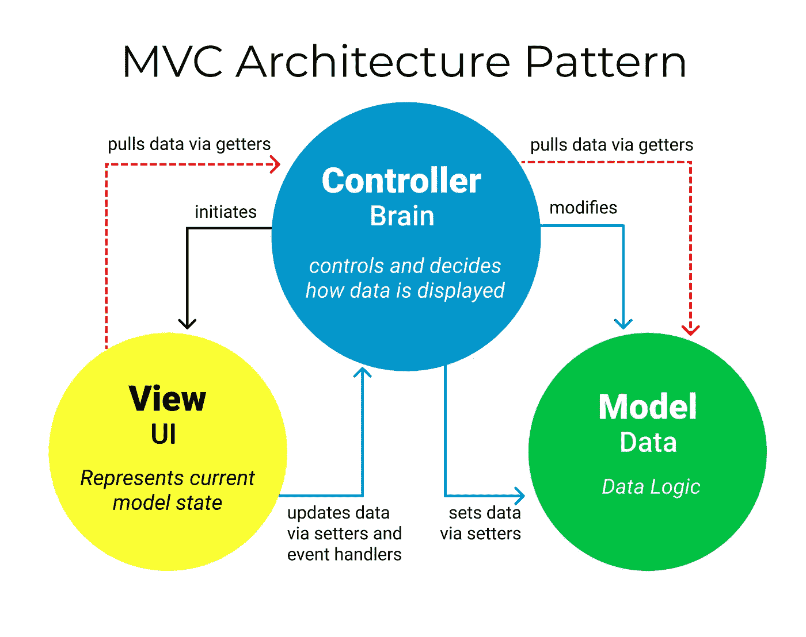
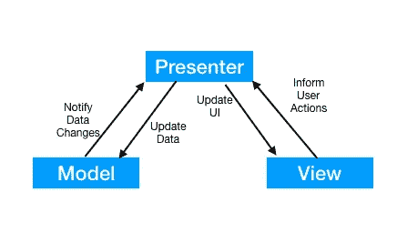
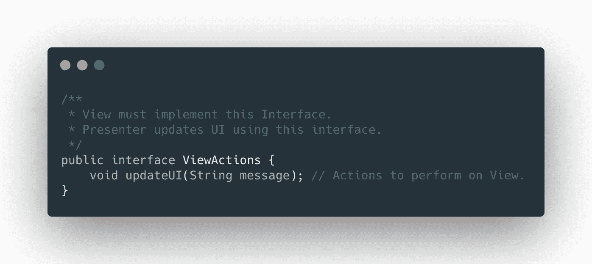
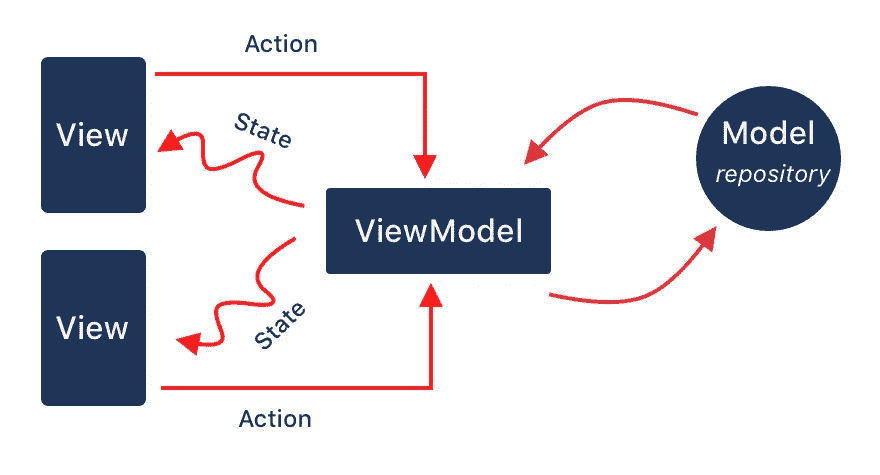
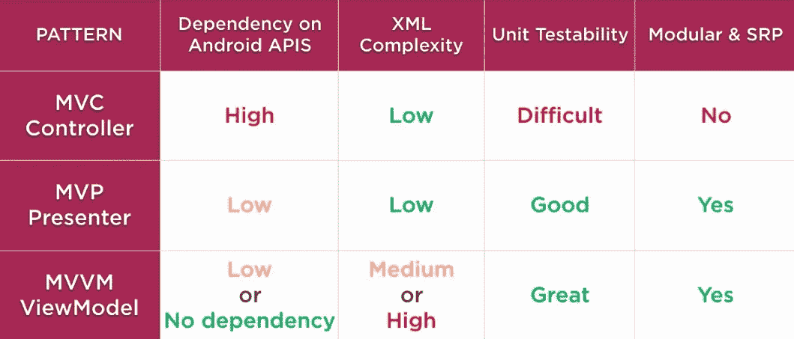

# Android 架构:MVVM，MVP，MVC 和你为什么应该关心

> 原文：<https://medium.com/nerd-for-tech/android-architecture-mvvm-mvp-mvc-and-why-you-should-care-65aae61fc11c?source=collection_archive---------1----------------------->

是选举:)

每一个认真的移动开发者都应该专注于构建一个高质量、可维护、高性能的移动应用。遵循可识别且易于遵循的设计模式是实现这一目标的好方法。

当我们谈论原生 android 开发时，我们有三种主要的候选架构，****【MVP】******MVVM***。为您的项目和团队选择最佳架构是一件棘手的事情，因此本文将讨论以下几点，以帮助您了解 android 开发世界中的架构，以及如何选择最适合您的架构。*

> *[为什么您应该关注架构](#d303)*
> 
> *[Android 系统和 MVC](#c4b5)*
> 
> *[Android 架构:MVC](#8092)*
> 
> *[安卓架构:MVP](#14fe)*
> 
> *Android 架构:MVVM*
> 
> *[架构对比](#36a5)*
> 
> *为什么是 MVVM？*
> 
> *[结论](#621a)*

# *为什么您应该关注架构*

*可能会问的一个问题是，为什么选择正确的应用程序架构很重要？这可以从两个角度来回答；工程师的责任和客户的责任。我先从工程师的角度来回答。*

*大多数工程师都熟悉常见的架构模式。这意味着，当一名新工程师加入一个项目或一个工程师团队接手一个现有项目时，他们可以更好地浏览项目结构，更快地开始工作，并且更有信心可以毫无问题地添加新功能。此外，随着新特性的增加，架构的哪一部分需要修改是显而易见的，团队可以在架构的不同层上一起工作。所有这些导致了更稳定的应用程序，具有更少的错误和更好的性能。*

*从客户的角度来看，选择正确的应用程序架构很重要，原因有很多。客户需要确保他们选择构建应用程序的工程团队在质量和效率方面都考虑到了他们的最大利益。软件架构模式允许在保持效率的同时达到更高的质量水平。也没有适用于所有项目的通用架构。例如，一个高度复杂的企业级应用程序需要一个比简单的概念证明或最小可行产品应用程序更复杂的架构模式。此外，当一个项目被发布，然后需要额外的功能时，客户可以确信这个过程会尽可能的简单。*

# *Android 系统和 MVC*

*Android 本身被写成 MVC，其中活动负责或多或少的一切。MVC 对于简单的应用程序来说是好的，但是随着复杂性的增加，问题的数量和级别也会增加。这导致了其他架构的引入，如 MVVM 和 MVP，但即使是这两个也有其缺点。*

# *Android 架构:MVC*

*MVC 代表模型视图控制器，其中:*

1.  ***模型**:模型表示数据模型(数据实体)并管理它们的状态，它还包含应用程序的业务逻辑。*
2.  ***视图**:视图是我们表示数据的方式。对于安卓来说，就是布局。*
3.  ***控制器**:控制器通过模型和视图之间的通信通道处理所有用户与应用程序的交互。*

**

*MVC 架构:[源码 FreeCodeCamp](https://www.freecodecamp.org/news/the-model-view-controller-pattern-mvc-architecture-and-frameworks-explained/)*

*用户与 UI 交互，控制器通过视图得到通知。基于用户交互，控制器修改某些模型。模型执行一些业务逻辑，并将更新后的模型数据状态返回给控制器。控制器然后可以根据从模型接收的新数据状态更新 UI。*

# *Android 架构:MVP*

*MVP 代表模型视图演示者，其中:*

1.  ***模型:**与 MVC 相同。*
2.  ***视图:**Android 中的布局以及活动/片段。它应该为演示者的动作实现一个接口*
3.  ***presenter** :视图调用 Presenter 的动作，并通过 Presenter 接口中定义的动作更新自己的状态。*

**

*MVP : [来源 JouranlDev](https://www.journaldev.com/14886/android-mvp)*

*虽然流程图看起来和 MVC 一样，但是不同之处在于视图和演示者/控制器之间的交互方式。*

*在 MVP 中，视图和演示者通过一个接口进行交互(不像 MVC)。演示者在界面上执行一些操作，这些操作在视图中实现，因此视图得到更新。*

*它比 MVC 好得多，因为这里的演示者没有 android API(或者只有很少的 ANDROID API ),并且很容易测试。
可以使用 espresso 等测试视图，查看视图是否更新。*

*因此，这些观点相当愚蠢。它们从演示者那里获取数据，并相应地更新 UI 组件。*

*这张图片将有助于理解演示者的行为*

**

*MVP:演示者的界面操作*

*视图将实现这个接口来定义当一个定义的动作发生时，它将如何被更新。*

# *安卓架构:MVVM*

*MVVM 代表模型视图 ViewModel，模型和视图与 MVC 和 MVP 相同，另一方面，ViewModel 使用实时数据来观察模型值并相应地更新 UI*

## *什么是实时数据？*

> *[LiveData 是**一个可观察的数据持有者类**。与常规的可观察对象不同，LiveData 具有生命周期意识，这意味着它尊重其他应用程序组件的生命周期，如活动、片段或服务。这种意识确保 LiveData 仅更新处于活动生命周期状态的应用程序组件观察者。](https://developer.android.com/topic/libraries/architecture/livedata)*

*这张图片展示了 android 中的 MVVM 流程*

**

*MVVM: [来源艾兰比亚](https://jayrambhia.com/blog/android-mvvm-intro)*

*因此视图接收用户交互并通知视图模型。
现在，ViewModel 将更新模型和可观察对象(这将调用值更改)。接下来，ViewModel 接口将更新 UI。*

# *MVC/MVP/MVVM 的比较*

**

*比较*

*正如你所看到的，MVVM 更适应 android，因为它允许视图模型独立于 android API，这增加了可维护性。MVVM 还允许很好的模块化，因此应用了 SRP 原则(单一责任原则)，这意味着你可以测试类，因为业务逻辑与视图是分离的。所有这些使得项目非常具有可测试性，这有助于 ***减少并找到 bug***。*

*MVVM 的唯一缺点是它增加了 XML 的复杂性，因为它经常与视图绑定一起使用。*

# *为什么是 MVVM？*

*比较表明，MVVM 和 MVP 对 Android 都有好处，无数关于架构模式的演讲和文章，我们可以同意上面讨论的最流行和最广泛采用的是 MVP。*

*然而，谷歌推出了包括 ViewModel 而不是 Presenter 的 android 架构组件，这意味着谷歌支持 MVVM，这不可能只是随机的，MVP 肯定有问题(对 Android 来说是错误的)。*

*错误的是 MVP 要求每个视图都有一个展示者，这意味着每个活动/片段都有自己的展示者。这是一种硬约束关系，它会影响演示者的简单性，因为随着视图复杂性的增加，演示者的复杂性也会增加，这使得维护和测试变得困难。*

*另一方面，MVVM 不需要这种硬性关系，这使得 ***更适合 android 开发。****

# *结论*

*在这一点上，很明显 MVC 已经过时了，作为开发人员或项目负责人，你需要根据你的需求在 MVVM 和 MVP 之间做出选择，但请记住，MVVM、MVP 都在不断发展，MVVM 有潜力成为强大而完美的 Android 开发工具，有用且实现起来令人惊叹。MVP 已经发展到了一定的水平，但没有什么是完美的。*

*最后，我想提一下，这是我的个人意见，你可以选择任何其他的建筑模式，它们都证明了它们在一定程度上是好的。*