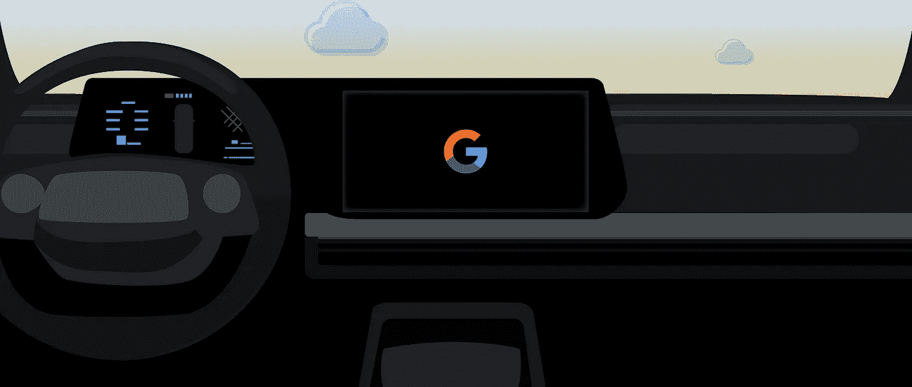
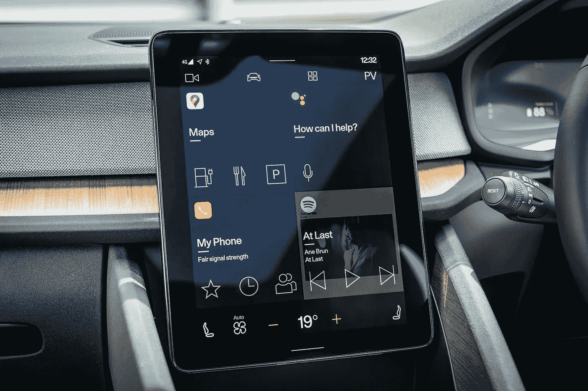

# 安卓汽车操作系统。？—汽车用安卓系统

> 原文：<https://medium.com/nerd-for-tech/android-automotive-operating-system-android-for-cars-cd7489b54b8f?source=collection_archive---------2----------------------->

> “我们想让科幻小说的承诺走进生活”——桂·卡瓦尔康蒂

车载安卓系统— [谷歌](https://developers.google.com/cars/images/androidforcars-hero_1920.png)

我们需要谈论充满技术的汽车。每当革命发生时，时间就会说话。在这篇文章中，我不会深入研究汽车的历史和它们所面临的斗争。在我童年的 21 世纪初，拥有一辆汽车是一件大事，对我这一代人来说，这仍然是一个梦想。然而，汽车生态系统经历着有规律的变化。现在电动汽车的趋势已经开始，这对人类是有益的。希望我们的下一代能呼吸到新鲜空气。

本文的目的是强调谷歌专门为汽车开发的一个操作系统。它被称为 Android 汽车操作系统[AAOS]。与 Android auto 不同[Android auto 是谷歌开发的一款应用，可以在驾驶时反映你的手机功能，让你依赖你的手机]。AAOS 是一个特别设计的操作系统，专为汽车打造，提供了复杂的用户体验和有用的功能。

AAOS 界面— [汽车杂志](https://car-images.bauersecure.com/pagefiles/98057/googleos_04.jpg)

AAOS 消除了使用电话进行连接和镜像的需要，因为汽车本身的屏幕就像一个独立的屏幕。要将连接的设备同步到 Google 帐户，您只需要一个无线连接和一个 Google 帐户。AOOS 启动图像和标志可以由制造商定制，但设置过程将保持不变。在这种情况下，放置在汽车中的屏幕/显示器不会模仿 tab UI，它会创建一个具有大图标、按钮和布局的新界面，以便在我们驾驶时轻松操作。用户可以直接从 Play Store 下载媒体应用。一般来说，开发者为 Android 移动设备和平板电脑开发应用，但现在他们将为汽车开发应用，就像我们在智能电视上看到的那样。

另一个重要的特点是，汽车的转向可以用来直接控制屏幕。方向盘可以被认为是汽车屏幕的附加遥控器。尽管你可以通过触摸来控制显示屏，但拥有方向盘控制选项可以让你专注于控制。鉴于 AAOS 的出现，android 的一些核心功能，如谷歌地图、谷歌语音助手、谷歌主页等。，会受到用户的欢迎。除了谷歌地图，语音辅助在导航和寻找地点时也是一个很有价值的功能。

AAOS 导航— [Tunigblog](https://www.google.com/url?sa=i&url=https%3A%2F%2Fwww.tuningblog.eu%2Fen%2Fcategories%2Ftipps_tuev-dekra-u-co%2Fandroid-automotive-265785%2F&psig=AOvVaw3uKykMP7K8g6fE1X6eirQ_&ust=1630152467451000&source=images&cd=vfe&ved=0CAoQjRxqFwoTCNi1t6-V0fICFQAAAAAdAAAAABAP)

在讨论了谷歌助手与汽车的集成之后，我们想指出一些有吸引力的功能。使用您的声音，您可以像在汽车中一样轻松地接听或拨打电话、发送或阅读信息。同样，你也可以只用你的声音控制汽车的空调温度，同时调节音频也是无缝的。将你的谷歌账户连接到你的家庭设备和汽车上，你甚至可以在汽车上打开/关闭你家的灯。

在 GPS 导航屏幕上，可以根据交通状况改变路线，如果需要，可以停止燃料/充电站以及剩余的电池和充电电源。停车时，显示屏还会自动显示汽车的 360 度视图，这样司机就不会被汽车周围的物体分散注意力。由于它仅限于少数高端车型，我们必须等到所有的汽车都可用。会有那么一段时间，有人问你:“你打算买哪款安卓设备？”你可以说“**我正在买车，一辆安卓车。**

> 感谢我所有亲爱的读者，请随时留下反馈或建议&虚拟鼓掌不会让你筋疲力尽😇— [纳伦德拉·贾纳帕提](https://linkedin.com/in/narendraj3)