# 带有 GitLab 的 Android CI/CD——可以动态构建 apk 的 Slack bot。

> 原文：<https://medium.com/nerd-for-tech/android-ci-cd-with-gitlab-slack-bot-that-can-build-apks-on-the-fly-a877e26307db?source=collection_archive---------5----------------------->

我最近意识到，我们工作场所的大多数工程师都陷入了构建 apk 并将其交给 Slack 上的 QA 团队的循环中。我们每次所做的就是，从我们正在工作的特性分支手动构建 Apk，并将其上传到 Slack 供 QA 团队测试。如果在此期间或之后出现任何变化，循环将再次继续。你说对了！所以，当你能让它自动化的时候，为什么要手动去做呢？🤷‍♂️

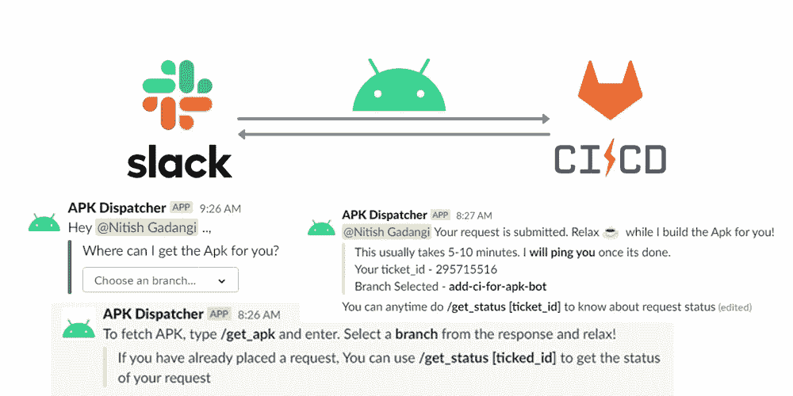

因此，让我们使用 GitLab CI 的强大功能，并将其与 Slack API 结合起来，构建一个 bot，它将为您提供我们的回购上所有可用分支的列表，在 select 上，将构建相应的回购，并将 Apk 上传到 Slack。

# 目标

1.  交互式 Slack-bot 显示回购上所有可用的分支。(我们将使用 Slack API 中的[消息菜单](https://api.slack.com/legacy/message-menus)
2.  设置一个 GitLab 配置项，该配置项具有一个仅在我们的 Slack-bot 触发[时运行的作业。](https://docs.gitlab.com/ee/ci/triggers/)
3.  为 slack 上的所选 repo 在 CI 上自动构建应用程序变体，并将其上传回 slack。
4.  此外，让我们再添加一些功能，如检查 CI 作业状态的选项。提供如何使用 bot 的说明的 Help 命令。(我们将使用 Slack API 中的[斜线命令](https://api.slack.com/interactivity/slash-commands))。
5.  最后，让我们确保当 Apk 构建成功完成时，会 pinged 请求 Apk 的特定用户。

# TL；速度三角形定位法(dead reckoning)

如果你对深入研究代码感兴趣。下面是剧透。你也可以直接到底部去检查最终的功能。

 [## NitishGadangi/apk-调度员-松弛-机器人

### 🤖Slack Bot 使用 GitlabCI 的能力来构建并从 Gitlab 为您指定的分支提供 APKs

github.com](https://github.com/NitishGadangi/apk-dispatcher-slack-bot) 

# 所需成分

1.  为此，我们需要一个 CI/CD 实例。幸运的是，GitLab 有一个简单且免费的 CI/CD 系统，可以在私有存储库中找到。
2.  您必须拥有创建新 Slack 应用程序并在您的工作区中启动它的权限。
3.  因为我们将对 Slack-bot 使用 Slash 命令，所以我们需要一个 HTTP 实例来响应来自 Slack 的调用。(我们将使用一个部署在 Heroku 上的简单 Node.js 应用程序)
4.  显然，我对 CI/CD 的工作原理有一些基本的了解，对 Node 也有一些了解。

# 让我们开始做饭吧…

实施流程

## GitLab 设置

您需要将 CI/CD 配置文件添加到 GitLab repo 中。这可以通过将`**.gitlab-ci.yml**` 文件添加到 Android 项目根目录来完成。如需更详细的演练，您可以在这里浏览文档。

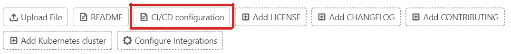

CI 配置 yml 文件基本包含运行 CI 管道所需的所有指令。对于环境设置，我们可以运行标准的 Android SDK 实例。但是，我们可以使用为 Android 预配置的 [Jangrewe](https://github.com/jangrewe/gitlab-ci-android) 的 [Docker 图像](https://docs.docker.com/get-started/part2)。稍后我们需要添加剩余的指令来帮助构建 Apk 并上传到 slack。这是它最终的样子。

CI 配置 YML 文件

在继续之前，让我们看看上面的配置文件，了解关键字及其用法:

1.  `**image:**` 该标签用于指定一个用于执行的 Docker 图像。Gitlab 运行程序将使用这个 Docker 映像来运行管道。
2.  `**cache:**` 在生成多个构建时，缓存 gradle 文件夹可以显著减少构建时间。缓存将在开始时下载和提取，并在每个作业结束时上传。`${CI_PROJECT_ID}`是 Gitlab 中唯一的项目 ID。

现在，我们定义一个**作业**来构建一个调试 APK，其内容解释如下。

1.  `**stages:**` 这表示工作属于哪个阶段。
2.  `**before_script:**` 这用于在实际工作开始前设置材料。在我们的例子中，我们设置`GRADLE_USER_HOME`来避免使用 gradle 的完整路径，并使 gradlew 可执行。
3.  `**rules:**` 在这里，我们可以定义各种条件，使得作业仅在基于这些指定的[规则](https://docs.gitlab.com/ee/ci/yaml/#rules)时运行。由于我们需要我们的作业仅在手动触发时运行，我们添加了一个 if 条件，指定`$CI_PIPELINE_SOURCE`必须是一个[触发器](https://docs.gitlab.com/ee/ci/triggers/)。
4.  `**script:**` git lab 运行程序执行的 shell 脚本。这是作业运行的唯一强制关键字。

*   首先，我们运行命令来组装调试版本
*   在构建生成之后，我们使用 **curl，**一个命令行工具来传输数据。
*   此外，`${SLACK_CHANNEL_ID}`和`${SLACK_REFERRER_ID}`用于表示用户触发管道的通道和相应的用户 id，用于表示用户发出通知。这两个变量将由我们的 Node.js 应用程序发送，而 node . js 应用程序又由 Slack-bot 触发。
*   类似地，我们也使用了`${CI_COMMIT_REF_NAME}`和`${CI_PIPELINE_ID}`以及 Apk 向消息中添加更多信息。
*   最后对于文件上传，Slack 定义了一个非常易用的 API。放置生成的 APK 的文件名(例如 *app-debug.apk* )。如果您的 gradle 根据构建版本/类型生成不同的构建名称，那么使用 find 命令和文件的初始字符，如上所示。

**Node.js App 设置**

由于我们将为 slack bot 使用[斜杠命令](https://api.slack.com/interactivity/slash-commands)，我们需要一个服务器应用程序来响应来自 slack-api 的请求。我想让事情尽可能简短。开始了。

1.  克隆这个回购协议([apk-dispatcher-slack-bot](https://github.com/NitishGadangi/apk-dispatcher-slack-bot)
2.  在这里，我们可以看到我们将拥有基本路由`/android`，在此基础上还有 4 个 post 路由器可用。

*   `/android/actions`用作 slack 中交互操作的请求 URL。任何交互交互组件(如按钮、选择菜单和日期选择器)都将被发送到这个端点。
*   `/android/get_apk`、`/android/help`、`/android/get_status`由 slash 命令触发，每个命令都会做相应的动作，并将响应回传给 slack-api。

我们还需要通过将环境变量放入。env 文件或放置在配置变量中(如果您使用 heroku)。我们稍后将回到这一部分，因为现在您可以直接部署项目。

也就是说，您可以随时查看完整的代码库，以更清楚地了解后面实际发生了什么。不管怎样，让我们继续前进。

**松弛应用设置**

最后，我们需要为我们的工作空间创建自己的 slack 应用程序，并将其链接到 node.js 应用程序。

1.  登录您的空闲工作区，或者在[空闲工作区](https://slack.com/create#email)创建一个。
2.  转到[应用程序](https://api.slack.com/apps)部分，创建一个新的应用程序。您只需要输入应用程序名称，并从下拉列表中选择工作区。在应用程序设置的第一页，在显示信息部分添加应用程序的基本信息。
3.  在 Features 下转至 **OAuth & Permissions，**首先将应用程序安装到您的工作空间，并复制和保护 **Scopes** 部分下的`Bot User OAuth Token.`及以下内容，添加以下 **OAuth Scopes、** [命令](https://api.slack.com/scopes/commands)和[文件:write](https://api.slack.com/scopes/files:write) 。

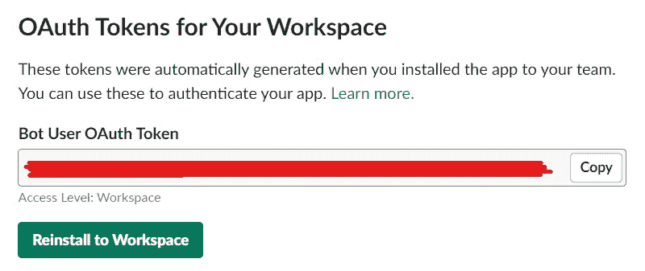

4.接下来转到**功能**下的**交互性&快捷方式**部分。打开**交互**并在部署后粘贴 Node.js 应用的`/actions`端点。

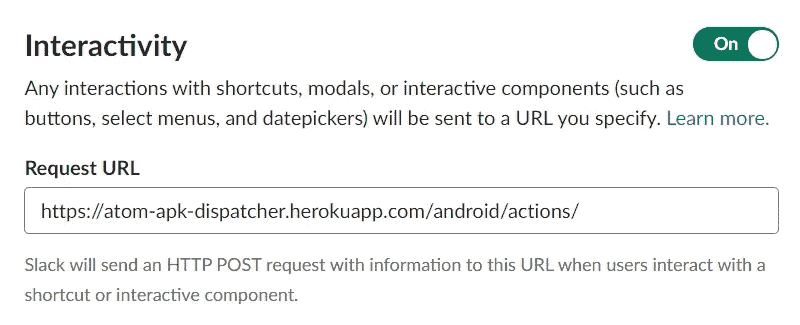

5.最后，转到特性下的**斜线命令**部分和**创建新命令。这里我们计划有 3 个斜杠命令，因此我们在后端有 3 个相应的端点。根据需要添加斜杠命令、其请求 URL 和描述。**

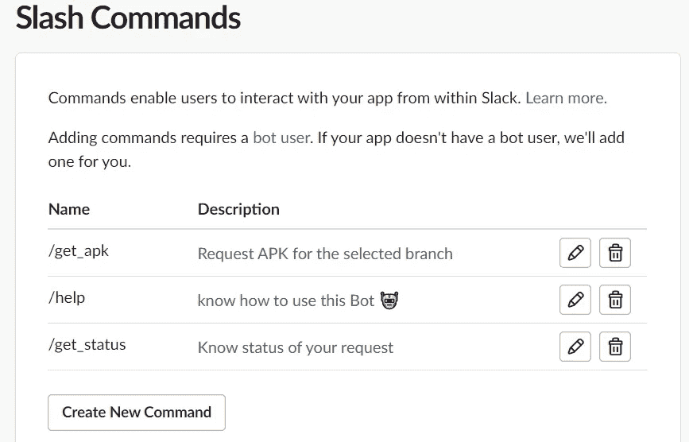

Slack 应用程序已经准备好了，我们可以开始了。然而，我们必须将所有的部分结合在一起，以便使它们一起工作。

**让我们把他们都绑起来……**

正如我们之前所讨论的，我们需要在节点应用程序中指定环境变量，以使其正常工作。让我们看看如何获取这些环境变量，稍后我们可以将它们放入 Heroku 设置中的[配置变量](https://devcenter.heroku.com/articles/config-vars)。

`**SLACK_CHANNEL_ACCESS_TOKEN:**`这可以从你的 Slack 应用设置的 **OAuth & Permissions** 部分获取。这已经在 Slack 应用设置的步骤 3 中讨论过了。

`**AUTH_TOKEN:**` 这基本上就是你的 GitLab 个人访问令牌。您可以从您的 [GitLab 配置文件首选项→访问令牌](https://gitlab.com/-/profile/personal_access_tokens)中获取它并为您创建一个。(范围`read_repository`对于我们的用例来说足够了)。

`**TRIGGER_TOKEN:**` 进入你的 GitLab repo 设置→ CI/CD，在**管道触发器**下，添加触发器。复制代币，那就是你的`TRIGGER_TOKEN`。你可以从[这里](https://docs.gitlab.com/ee/ci/triggers/)阅读更多关于触发器的内容。

`**PROJECT_ID:**` 下同一个**管道触发器**从收拢段复制项目 id。你可以参考下图。

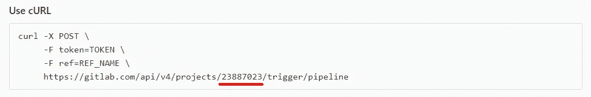

带下划线的数字是项目标识

现在我们得到了所有需要的变量，让我们把它放在 Heroku 的 [Config Vars](https://devcenter.heroku.com/articles/config-vars) 部分，最终的状态看起来像这样。

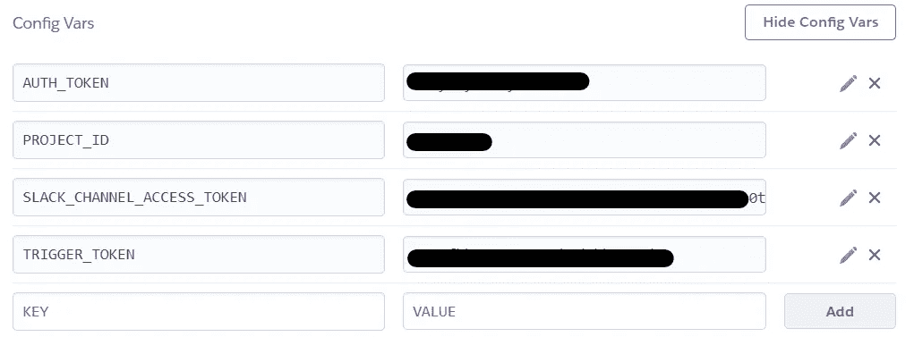

**最后，让我们测试功能……**

跳到你的 slack workspace 上，邀请我们所有的新 Slack bot 到任何你想使用它的频道。通过键入`**/**` 后跟命令，开始键入任何松弛命令。Slack 将自动开始建议所有可用的斜杠命令。

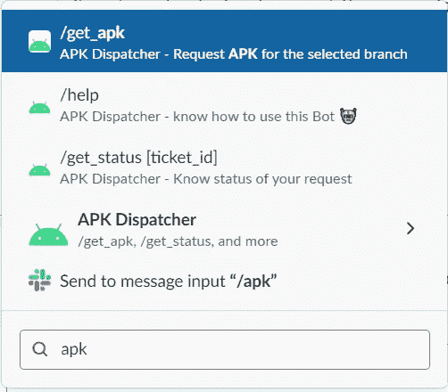

我们之前添加的所有三个斜杠命令都已列出。

这里我们有 3 个斜杠命令，让我们测试它们。

做`**/help**`将会给我们以下关于如何使用机器人的指导。

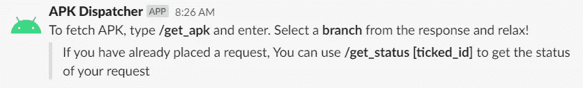

/帮助

执行 `**/get_apk**` 将会用一个下拉菜单提示您，要求您选择一个您想要构建并获取 apk 的分支。

一旦你选择了任何一个分支，它会给你所选择的分支的详细信息和预计的构建时间。此外，还提供了 ticked_id，如果需要，以后可以使用它来了解管道的状态。

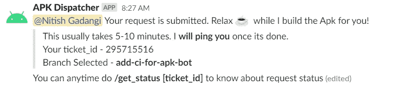

在选择分支时

给定的 ticked_id 可以与`**/get_status**` 结合使用，以了解构建过程的状态。

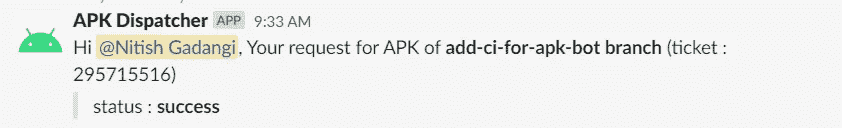

/get_status [ticket_id]

最后，一旦构建完成，机器人会用最终的 Apk ping 你。

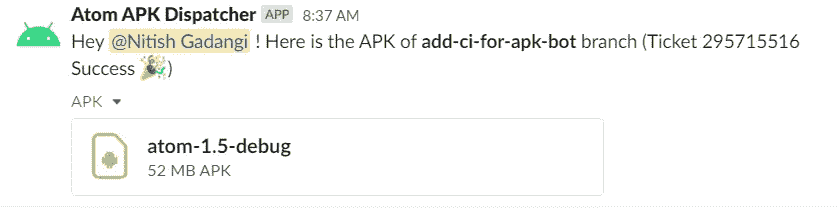

耶！这就是我们构建的整个应用程序。您总是可以通过添加更多斜杠命令或向 CI 配置添加更多指令来进一步扩展它。无论如何，我想说这已经足够了。

也就是说，我希望你已经理解了整个构建，并希望你喜欢这个实现。如有任何疑问，请在下面评论。

最后，我想附上另外两篇在整个过程中对我有很大帮助的媒体文章。也要归功于他们。🎉

 [## 为 Android 设置 Gitlab CI/CD 的快速指南

### 频繁构建 apk 并上传到 Slack 进行测试？遵循这个简短的指南来节省您的大量时间！

proandroiddev.com](https://proandroiddev.com/a-quick-guide-to-setup-gitlab-ci-cd-for-android-6bb5faec1491)  [## Slack App : Bot 用户、交互组件、Slash 命令等等

### Slack(“所有对话和知识的可搜索日志”)是团队协作最常用的工具之一，它…

medium.com](/@pallavtrivedi03/slack-app-bot-users-interactive-components-slash-commands-and-more-6b34d58c4d11)