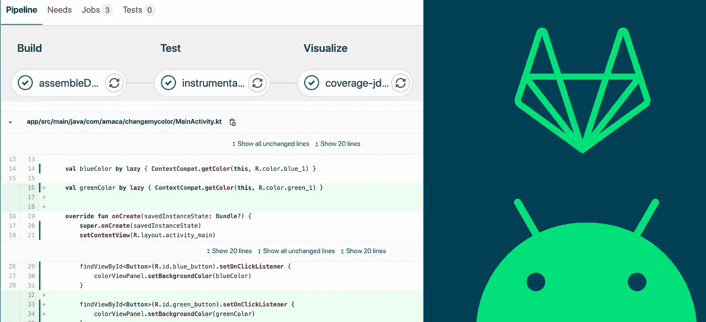
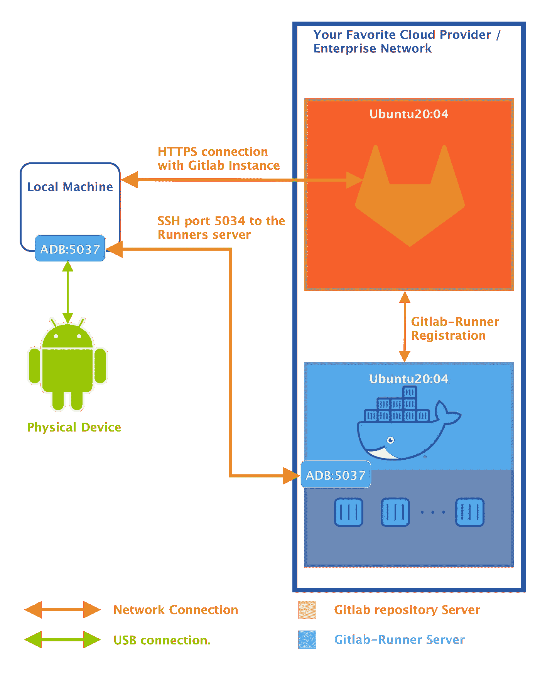
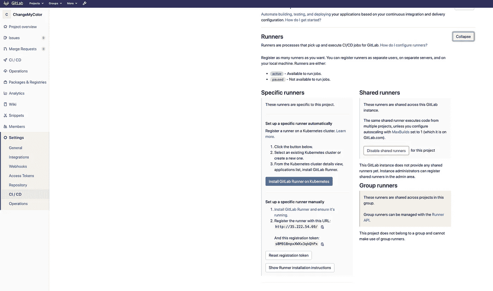
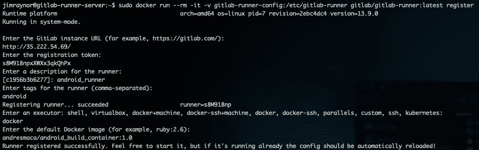
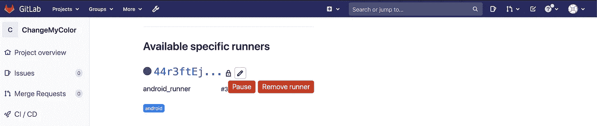
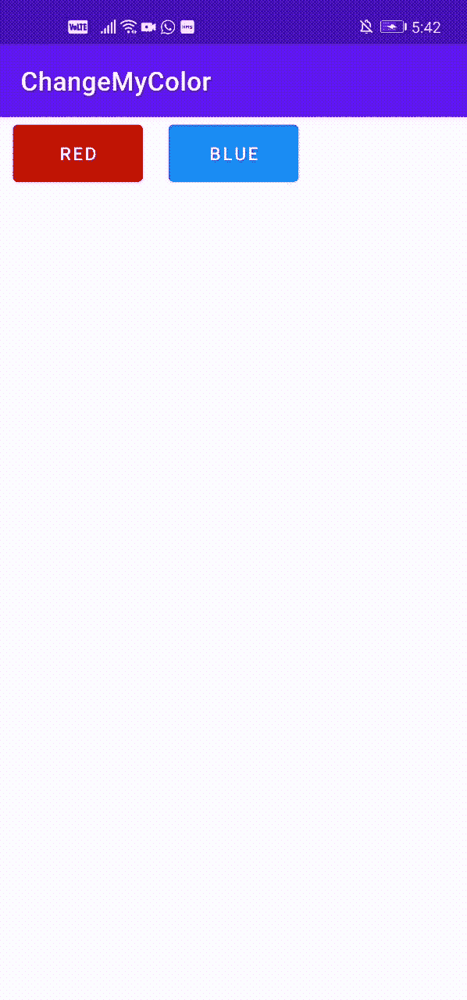
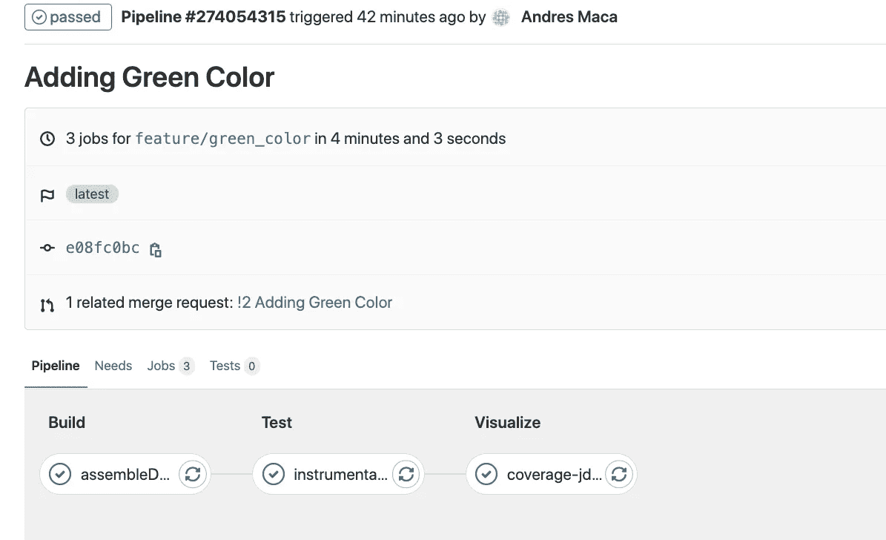
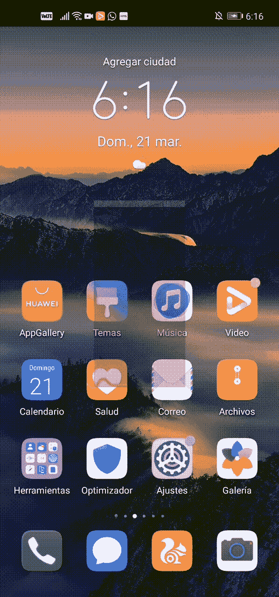
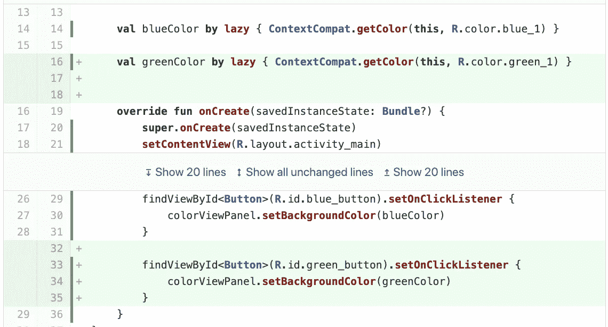
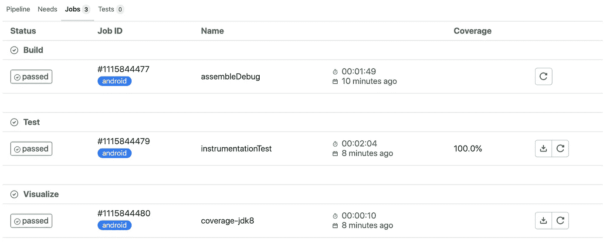

# Gitlab 上的 Android 持续集成和覆盖可视化。

> 原文：<https://medium.com/nerd-for-tech/android-continuous-integration-and-coverage-visualization-on-gitlab-4a15d58f624c?source=collection_archive---------5----------------------->



# **引言。**

你的新代码打破了以前的代码？您的热修复程序引入了新的错误？放心吧！你并不孤单，老实说，DevOps 不能 100%保证这种问题不会再次发生，但你可以肯定，有了良好的质量测试和 CI/CD，这种情况会在较小的程度上发生。

我们不会谈论所有的 DevOps 过程或者如何编写高质量的仪器测试。我们将关注一个 Android 应用程序中的 CI(代表持续集成)和覆盖率(测试覆盖了你的代码库的多少%),以及你的团队如何使用 Gitlab 在合并请求上可视化这个覆盖率(不要担心这个过程，Github 几乎是一样的)！

所以我在寻找一个教程，让我们的团队实现代码覆盖可视化，并在“本地”物理设备上运行插装测试，我已经尝试在一个 docker 上用 Android 映像运行插装测试，但至少在我们的情况下是真的，不是所有的测试都通过了，Docker 映像错误。

此外，我们通常会尝试在具有高度个性化 UI 层的设备上进行测试，因为这种智能手机的错误率最高，而不是那些具有更干净的 Android UI 的设备。这个想法是便宜地失败并且尽可能快地抓住错误。

我们的目标是让你的团队在那套设备上运行 CI-Pipelines 测试，你不能用 docker 上运行的 Android 映像轻松做到这一点，至少据我所知是这样。因此，我们要将设备连接到远程 Gitlab Runner 服务器。

传统上，对于合并请求，您必须下载覆盖报告，并手动检查新代码是否被覆盖，如果您是进行代码审查的人，这是一个令人疲惫的过程。我们将自动执行，并在 Gitlab 上的合并请求上直接显示代码行是否被覆盖。

我们开始吧！

# **概念。**

根据 Android， [**插装测试**](https://developer.android.com/training/testing/fundamentals) 是在物理设备和仿真器上运行的测试，它们可以利用 Android 框架 API 和支持 API，如 AndroidX 测试。例如，如果您需要应用程序上下文，您应该编写一个工具测试。

Gitlab 介绍了 CI: [***持续集成***](https://docs.gitlab.com/13.8/ee/ci/README.html) *的工作原理是将小代码块推送到 Git 存储库中托管的应用程序的代码库，并在将它们合并到主分支之前，运行脚本管道来构建、测试和验证代码更改。*举例来说，你正在工作，一个全新的功能。使用 CI +高质量的仪器测试，您的团队可以在管道运行的早期阶段发现新的错误/不当行为，而不是在您的 QA 团队或客户使用您的应用程序时。

[***Docker***](https://docs.docker.com/get-started/overview/)*提供了在松散隔离的环境(称为容器)中打包和运行应用程序的能力。隔离和安全性允许您在给定的主机上同时运行许多容器。容器是轻量级的，包含运行应用程序所需的一切，因此您不需要依赖主机上当前安装的内容。您可以在工作时轻松共享容器，并确保与您共享的每个人都获得以相同方式工作的相同容器。*

# **建筑。**

默认情况下，您在 Gitlab 服务器上推送的每个提交都会触发一个 [*管道*](http://A quick guide to GitLab CI/CD pipelines | GitLababout.gitlab.com › blog › 2019/07/12 › guide-to-ci-cd-pi...) ，这是一系列阶段，告诉 Gitlab 要检查什么，即 CI:

*   建设
*   试验
*   显示覆盖范围

如果一个阶段失败了，您可以检查发生了什么并修复它。 *GitLab Runner 是一个与 GitLab CI/CD 协同工作的应用程序，用于在管道中运行作业*。每个步骤可以有不同的容器。

如果你的跑步者在你的本地机器上，跳过这一章。

这是 Android 管道的常见架构，Gitlab 存储库服务器与 Gitlab-Runner 服务器在不同的机器上，当管道运行时，在测试阶段，Gitlab-Runer 必须部署在 docker 容器上运行的 Android 操作系统映像，以便可以运行插装测试。


标准架构

优点是可扩展性。这个有什么问题？有些映像需要对 gradle 进行大量额外的依赖，另一个需要修改大量的测试代码才能运行，并且您没有在物理设备上运行测试的高保真度。

下面是 ***提出的架构。我们试图给我们的 Gitlab-Runner 一个尽可能接近我们作为开发者所拥有的环境。***



提议的架构

当你把你的 android 设备连接到你的笔记本电脑上时，你可以通过 ADB(Android 设备桥)调试/安装/摆弄它。我尽量保持简短，ADB 与一个监听本地端口 5037 的守护程序一起工作。这个想法是将该端口上的通信发送到 Gitlab-Runner 服务器，这很有用，因为这就像您将您的设备连接到您的服务器。缺点是什么？您的手机必须始终连接到 Gitlab-Runner-Server，或者至少在管道运行时。

引用《硅谷- HBO》系列中的 Gilfoyle 的话，免责声明:通知你公司的安全团队你将要做这个端口的事情，一个关键组件的错误配置会导致安全问题。 ]

我们不需要修改任何测试代码或者你的 gradle，因为你的仪器测试将会在你的本地设备上运行。

# **实施——基础设施。**

如果你的公司把 gitlab.com 作为一个存储库而不是一个自我管理的实例，并且 Runners 运行在每个开发者的本地机器上，你可以跳过下一段。

首先，如果可能的话，我们需要两台运行 Linux 的服务器，我们不关心这些服务器在哪里，您可以使用您的笔记本电脑在 virtual box 上运行两台虚拟机，事情是这些服务器中的一台(gitlab-runner-server)必须有 Docker，您可以从您的笔记本电脑访问端口 5037(ADB 守护程序正在运行),另一台必须有 gitlab 存储库(gitlab-repository-server，您可以在 gitlab-repository 的同一台机器上部署 Docker ),并且您可以访问 Gitlab 这里是[在谷歌云基础设施上实现这一目标的分步指南](/@andresmaca/deploying-a-gitlab-repository-and-runner-server-on-google-cloud-57b9d490c975)。在本教程中，我们将使用 Ubuntu 20.04 作为服务器的操作系统。

我们必须在 Gitlab 资源库上注册我们的跑步者，在 Gitlab 上打开您的 Repo，然后进入设置> CI/CD >跑步者:扩展。复制 URL 和注册令牌。



Gitlab CI/CD 设置

现在通过 SSH 与您的 *gitlab-runner-instance* 连接，启动一个 docker 卷并将其安装到 gitlab-runner:

```
sudo docker volume create gitlab-runner-configsudo docker run -d --name gitlab-runner --restart always     -v /var/run/docker.sock:/var/run/docker.sock     -v gitlab-runner-config:/etc/gitlab-runner     gitlab/gitlab-runner:latestsudo docker run --rm -it -v gitlab-runner-config:/etc/gitlab-runner gitlab/gitlab-runner:latest register
```

它会要求您提供一些数据，您已经有了注册令牌和 url:



注册跑步者

接下来，我们必须在 *gitlab-runner-server:* 上添加一个有效的网络模式

```
sudo su
cd /var/lib/docker/volumes/gitlab-runner-config/_data
vim config.toml
```

添加 network_mode = "host "


跑步者网络模式

```
docker restart gitlab-runner
```

您可以在注册令牌和 url 的同一站点上查看状态或删除已注册的跑步者:



可用跑步者

现在，在本地机器上打开一个终端，键入:

```
adb devicesssh -XC -v -R 5037:localhost:5037 username_on_gitlab_runner_server@ip_address_gitlab_runner_server
```

最小化终端。在这一点上，您能够从您的 CI/CD 中运行插装测试，让合并请求上的覆盖可视化一起移动。

# 实现—代码覆盖可视化。

我们有一个[非常简单的应用](https://gitlab.com/ciandroidinstrumentationtest/ChangeMyColor)你可以点击一个按钮在面板上显示想要的颜色。作为开发人员，我们应该确保每个按钮都显示 seek 颜色。我们公司和客户不希望当你点击蓝色按钮时看到红色面板。



ChangeMyColor 演示

我们的客户需要添加[绿色，](https://gitlab.com/ciandroidinstrumentationtest/ChangeMyColor/-/tree/feature/green_color)我们应该确保当绿色按钮被按下时，绿色面板显示。在我们编写了所需的测试之后，我们将代码推送到 Gitlab，然后[流水线应该开始](https://gitlab.com/ciandroidinstrumentationtest/ChangeMyColor/-/pipelines/274054315)。



App 的渠道

当 [*instrumentationTest* 作业](https://gitlab.com/ciandroidinstrumentationtest/ChangeMyColor/-/jobs/1115844479)正在进行时，我们可以看到 Espresso 正在我们的本地设备上执行测试:



从 Gitlab Runner 运行仪器测试

打开合并请求后，代码审查者可以[在 Gitlab](https://gitlab.com/ciandroidinstrumentationtest/ChangeMyColor/-/merge_requests/2/diffs) 平台上检查绿色按钮特性的新代码是否被覆盖(代码左侧的绿色线条)并按预期工作，而无需下载任何内容。



覆盖可视化

要做到以上，你要有一个**。**[**git lab-ci . yml**文件](https://gitlab.com/ciandroidinstrumentationtest/ChangeMyColor/-/blob/master/.gitlab-ci.yml)，你可以在这里找到我正在使用的[(Android _ build _ container)](https://gitlab.com/ciandroidinstrumentationtest/android_build_container)和[(jacoco 2 cobertura)](https://gitlab.com/ciandroidinstrumentationtest/jacoco2cobertura)Docker 容器的源代码。



管道作业

流水线很简单，执行 3 个任务:

*   构建:[用 gradle assembleDebug 构建项目](https://gitlab.com/ciandroidinstrumentationtest/android_build_container)。我们确保我们的代码至少可以编译。
*   测试:在本地设备上运行工具测试，并将 jacoco 报告作为工件上传。不要忘记在您的本地机器和 gitlab-runner-server 之间创建 ssh 连接，否则这项工作将会失败。
*   可视化:解析从 Jacoco 到 Cobertura 的[输出，并将 cobertura.xml 作为报告上传。](https://gitlab.com/ciandroidinstrumentationtest/jacoco2cobertura)

您可以添加一些额外的规则，例如:如果覆盖率低于限制，则使管道失败[。或者仅当是标记或特定分支或操作时才运行管道。](https://www.raywenderlich.com/10562143-continuous-integration-for-android#toc-anchor-014)

这就是全部！

如果你对你的开源/ONG 项目有任何疑问或需要帮助，请随时在 [linkedIn](https://www.linkedin.com/in/andresmaca) 上点击我的 DM。

感谢 Gitlab 的 James Heimbuck 先生帮助设置覆盖可视化特性。

如果有用的话，别忘了按拍手按钮！