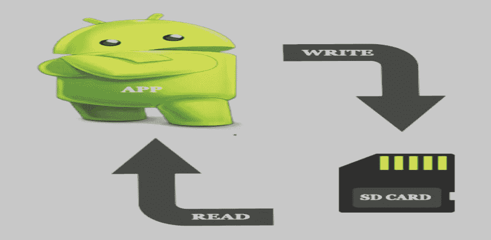

# Android 导出和导入数据

> 原文：<https://medium.com/nerd-for-tech/android-export-and-import-data-9223c6bce8da?source=collection_archive---------0----------------------->



以 JSON 格式导出/导入数据

关于数据，占据我们头脑的一件非常重要的事情就是不要丢失它。我们必须备份数据，以便在需要时进行恢复。因此，我们需要知道如何将数据推送到设备的 SD 内存中。在本文中，我们将了解如何在 JSON 文件中导入和导出数据。

# 我们开始吧

为了导出和导入数据，我们将使用 [**Gson**](https://github.com/google/gson) 库。它是一个 Java 库，将 Java 对象转换成它们的 JSON 表示。此外，它将 JSON 字符串转换为等效的 Java 对象。

要设置它:

```
implementation 'com.google.code.gson:gson:2.8.9'
```

# 首先，以学习为目的，创建一个简单的 UI。

```
*<?***xml version="1.0" encoding="utf-8"***?>* <**RelativeLayout xmlns:android="http://schemas.android.com/apk/res/android"
    xmlns:tools="http://schemas.android.com/tools"
    android:layout_width="match_parent"
    android:layout_height="match_parent"
    tools:context=".MainActivity"**>

    <**Button
        android:id="@+id/btnExport"
        android:layout_width="wrap_content"
        android:layout_height="wrap_content"
        android:layout_centerInParent="true"
        android:layout_marginStart="-6dp"
        android:layout_marginTop="65dp"
        android:layout_marginBottom="20dp"
        android:text="Export"
        android:textSize="20sp"** />

    <**Button
        android:id="@+id/btnImport"
        android:layout_width="wrap_content"
        android:layout_height="wrap_content"
        android:layout_below="@id/btnExport"
        android:layout_centerInParent="true"
        android:text="Import"
        android:textSize="20sp"** />
</**RelativeLayout**>
```

# 然后，让我们回到代码。

## **1。将数据导出到** JSON **文件**

通常，我们从某个数据源获取数据，如房间、领域、火焰基地或任何其他数据源。

在我们的例子中，我们将创建假数据。这将是客户和员工的两个列表。

*   创建客户类别

```
**class** Customer(**var name**: String, **var job**: String, **var overDue**: Float)
```

*   创建员工类别

```
**class** Employee(**var nameEmployee**: String, **var jobEmployee**: String)
```

*   创建用于存储这两个列表的数据类

```
**class** Data(**val customers**: List<Customer>, **val employees**: List<Employee>)
```

*   用虚拟数据创建两个列表

```
**val** customers = ArrayList<Customer>()
customers.add(Customer(**"Hala"**, **"developer"**, 34.5f))
customers.add(Customer(**"Nora"**, **"teacher"**, 43.5f))
customers.add(Customer(**"Rana"**, **"doctor"**, 56.5f))

**val** employees = ArrayList<Employee>()
employees.add(Employee(**"ALi"**, **"carpenter"**))
employees.add(Employee(**"Yaser"**, **"mechanic"**))
```

*   初始化 Gson 对象，并使其全局化，以便能够访问它

```
**private var gson**: Gson? = **null****gson** = GsonBuilder().serializeNulls().setPrettyPrinting().create()
```

*   将类转换为 JSON 格式

```
**private fun** convertClassToJson(customers: List<Customer>, employees: List<Employee>): String? {
    **val** allData = Data(customers, employees)
    **return gson**?.toJson(allData)
}
```

*   添加写入和读取数据的权限

```
<**uses-permission android:name="android.permission.WRITE_EXTERNAL_STORAGE"** />
<**uses-permission android:name="android.permission.READ_EXTERNAL_STORAGE"** />
```

*   检查是否授予了存储权限。

```
**private fun** isStoragePermissionGranted(): Boolean {
    **return if** (Build.VERSION.*SDK_INT* >= Build.VERSION_CODES.*M*) {
        **if** (checkSelfPermission(Manifest.permission.*WRITE_EXTERNAL_STORAGE*) == PackageManager.*PERMISSION_GRANTED*) {
            *//Permission is granted* **true** } **else** {
            *//Permission is revoked* ActivityCompat.requestPermissions(**this**, *arrayOf*(Manifest.permission.*WRITE_EXTERNAL_STORAGE*), 1)
            **false** }
    } **else** {
        *// Permission is automatically granted on sdk<23 upon installation* **true** }
}
```

*   获取一个随机的文件名，而不是覆盖同一个文件名

```
**private fun** getRandomFileName(): String {
    **return** Calendar.getInstance().*timeInMillis*.toString() + **".json"** }
```

*   将数据写入 JSON 文件

```
**private fun** writeTextToFile(jsonResponse: String?) {
    **if** (jsonResponse != **""**) {
        *// Create a File object like this.* **val** dir = File(**"//sdcard//Download//"**)
        **val** myExternalFile = File(dir, getRandomFileName())
        *// Create an object of FileOutputStream for writing data to myFile.txt* **var** fos: FileOutputStream? = **null
        try** {
            *// Instantiate the FileOutputStream object and pass myExternalFile in constructor* fos = FileOutputStream(myExternalFile)
            *// Write to the file* fos.write(jsonResponse?.*toByteArray*())
            *// Close the stream* fos.close()
        } **catch** (e: IOException) {
            e.printStackTrace()
        }
        Toast.makeText(**this**@MainActivity, **"Information saved to SD card. $**myExternalFile**"**, Toast.*LENGTH_SHORT*).show()
    }
}
```

*   使用导出按钮备份您的数据

```
**binding**.**btnExport**.setOnClickListener **{****if** (isStoragePermissionGranted()) {
        writeTextToFile(**allJsonResponse**)
    }
**}**
```

现在，您的数据被导出到手机下载文件夹中的 JSON 文件中。

## 2.从 JSON 文件导入数据

*   打开文件管理器，选择要导入的 JSON 文件

```
**private fun** openFileManager() {
    **val** intent = Intent(Intent.*ACTION_OPEN_DOCUMENT*)
    intent.addCategory(Intent.*CATEGORY_OPENABLE*)
    intent.*type* = **"*/*"
    getDataFromFile**.launch(intent)}
```

*   从 JSON 文件中读取数据

```
**private fun** readTextFromUri(uri: Uri): String {
    **var** inputStream: InputStream? = **null
    val** stringBuilder = StringBuilder()
    **try** {
        inputStream = *contentResolver*.openInputStream(uri)
        **val** reader = BufferedReader(InputStreamReader(inputStream))

        *// Read a line of text.* **var** line = reader.readLine()
        *// Read the entire file* **while** (line != **null**) {
            *// Append the line read to StringBuilder object. Also, append a new-line* stringBuilder.append(line).append(**'**\n**'**)
            *// Again read the next line and store in variable line* line = reader.readLine()
        }
    } **catch** (e: IOException) {
        e.printStackTrace()
    }
    **return** stringBuilder.toString()
}
```

*   在活动中获取 JSON 数据

```
**private var getDataFromFile** =
registerForActivityResult(ActivityResultContracts.StartActivityForResult()) **{** result: ActivityResult **->
        if** (result.*resultCode* == *RESULT_OK*) {
            **val** uri = result.*data*?.*data* **val** fileContents = readTextFromUri(uri!!)
            Toast.makeText(**this**@MainActivity, fileContents, Toast.*LENGTH_SHORT*).show()
        }
    **}**
```

*   使用导入按钮恢复您的数据

```
**binding**.**btnImport**.setOnClickListener **{** openFileManager()
**}**
```

恭喜，您的数据是从一个 JSON 文件导入的，现在您可以将它插入到您的数据库中，或者以任何适合您的应用程序的方式使用它。

对于 GitHub 上的样例 App，点击[**backup data**](https://github.com/Marwa-Eltayeb/Android-Features/tree/master/BackupData)**。**还有，这个功能在我的 app **Wordi 里实现了。**获取*它*通过 [**Google Play**](https://play.google.com/store/apps/details?id=com.marwaeltayeb.wordi)

更多文章:点击 [**此处**](https://marwa-eltayeb.medium.com/)

**找到我这里:**[GitHub](https://github.com/Marwa-Eltayeb)|[LinkedIn](https://www.linkedin.com/in/marwa-eltayeb/)|[Twitter](https://twitter.com/Marwa_Eltayeb1)