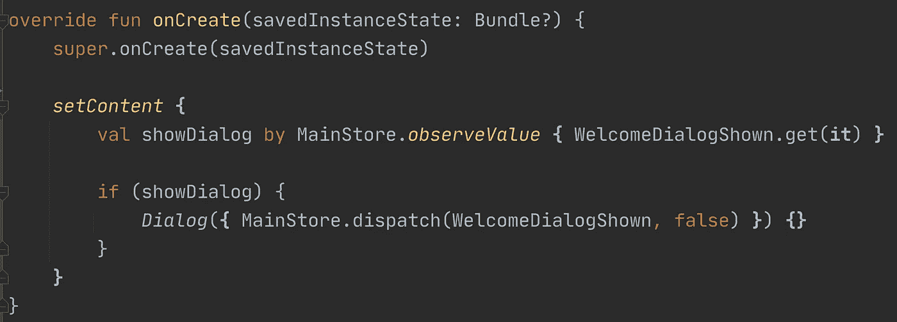

# Android JetpackCompose —具有全局状态

> 原文：<https://medium.com/nerd-for-tech/android-jetpackcompose-with-global-state-3a0b3c0f0b30?source=collection_archive---------6----------------------->

## 移动应用中的反应式编程——一次旅行

## Android 的 JetpackCompose(或 iOS 的 SwiftUI)是一种很棒的功能性、声明性、基于组件的 UI 开发技术。让我们用全局状态管理使它变得更好

我们都很熟悉 [*React.js*](https://reactjs.org/) 和它伟大的 [*JSX* 扩展](https://reactjs.org/docs/introducing-jsx.html)用于轻松构建 UI 组件。它让开发人员直接从一些*数据*或*状态*中编写动态 UI，而不是将静态 UI 代码(例如 *xml* 或 *html* )和动态状态绑定代码(例如[*view binding*](https://developer.android.com/topic/libraries/view-binding)*或 [*JQuery*](https://jquery.com/) )分开。*

**Android* 和 *iOS* 团队紧随其后，开发了他们的原生等价物*React+JSX*——[——*JetpackCompose*](https://developer.android.com/jetpack/compose)和 [*SwiftUI*](https://developer.apple.com/xcode/swiftui/) 。
像 *React* 一样，它们提供内部状态管理，也就是说，每个‘组件’要么可以控制自己的状态，要么被自己的‘父组件’控制，父组件处理自己的状态……
像 *React* 一样，它们缺少 [**全局**状态管理](https://spin.atomicobject.com/2017/06/07/react-state-vs-redux-state/) — [*Redux*](https://redux.js.org/) ，例如。这正是我们来这里的目的。*

**

*一个简单的带有对话框的 JetpackCompose 屏幕——使用 Reactdroid 的存储作为状态*

## *JetpackCompose 长什么样*

*这是 *JetpackCompose* 中一个简单屏幕的样子:*

*JetpackCompose 中带有标题的简单屏幕*

*这是一个类似的例子，但是用*动态*状态*来控制标题，使用一个*按钮*:**

*JetpackCompose 中带有动态标题的简单屏幕*

*如果你在这里，你可能已经明白——一旦这个组件树在中型应用程序中变得越来越深，管理所有这些内部的*状态*就变得越来越困难。此外，你必须通过层次树深处的许多*状态*，例如，仅仅为了控制一个*文本*，或者*按钮*。
更重要的是——如果你有多个具有相似 UI 的屏幕，或者只有一个与相似的*状态*相关，你必须再次编写和管理它，并以某种方式在这些*状态*之间进行连接(例如 *SharedPrefs* 、 *DB* 或 *Intents* )。嗯，至少我们已经让`[rememberSaveable](https://stackoverflow.com/questions/66424642/android-jetpack-compose-by-remembersaveable-state-does-not-survive-back-button)`在屏幕旋转期间保持那些*状态*😅。*

## *拥有全局状态管理看起来像什么*

*无论如何，我在这里不是要说服你为什么**全局**状态很棒，我在这里是要向你展示如何在 *JetpackCompose* :)
跟随[我的系列](/nerd-for-tech/reactdroid-reactive-mvi-architecture-for-android-with-a-pure-kotlin-core-multiplatform-587726a5045f)上的 [*Reactdroid*](https://github.com/GuyMichael/Reactdroid) 库，这里是你如何可以*连接*你的 *JetpackCompose* 代码到*存储库**

**JetpackCompose 中带有全局状态标题的简单屏幕，使用 Reactdroid 的存储**

**就是这样！现在*标题*在全局范围内，可以被你整个应用程序中的许多组件跨页面使用(例如*活动*)。
此外，您可以在应用程序的任何地方从**更改*标题*(使用*分派*)，而不管使用它的组件在哪里。****

**当然，作为 [*Reactdroid*](https://github.com/GuyMichael/Reactdroid) 库的一部分，您可以将 *props* 模型用于复杂状态，而不是单个值。这次我们将导出一个*连接的“*主屏幕”，而不是让它“知道”它的*状态*是如何被控制的。*jetpackcomposite*团队称之为 [*吊装*](https://developer.android.com/codelabs/jetpack-compose-state#5) :**

**JetpackCompose 中的连接屏幕，使用 Reactdroid 的存储和提升**

**简而言之，*连接*方法*将通常接收一些*属性*的*组件(*组件*)连接到*存储*(全局状态)，并帮助您将 UI 代码与状态管理代码分离——与前面示例中的`observeAsValue`(以及类似方法)和`mutableStateOf`相反。就像 *Redux* …**

> *依我拙见，这应该是唯一的方法/风格。
> 现在关注点的分离被最大化了——你甚至可以让不同的开发人员在每个部分工作:
> 纯 UI 代码在*主屏幕*中，连接到数据/状态代码在*connectedmainseen*中，而 *MainActivity* 就像它应该的那样——完全不知道 UI 代码。*

# *摘要*

*这是一个快速的概述，展示了如何将全局状态和 *JetpackCompose* 一起使用。它让我们在前往 [*科特林多平台*](https://kotlinlang.org/docs/multiplatform.html) 的旅程中又前进了一步。我希望你喜欢它，如果你想了解它是如何工作的，请继续关注。*

> *如果你很难理解这些例子，你可能会错过*上的[我的系列](/nerd-for-tech/reactdroid-reactive-mvi-architecture-for-android-with-a-pure-kotlin-core-multiplatform-587726a5045f)React*+*Redux*中的 *Kotlin* 但它基本上只是 [*Redux*](https://redux.js.org/) 样式，并绑定到 JetpackCompose。这里的要点是——使用 *JetpackCompose* 和 *SwiftUI* *:)* ，我们离全面的 [*Kotlin 多平台*](https://kotlinlang.org/docs/multiplatform.html) 库又近了一步*