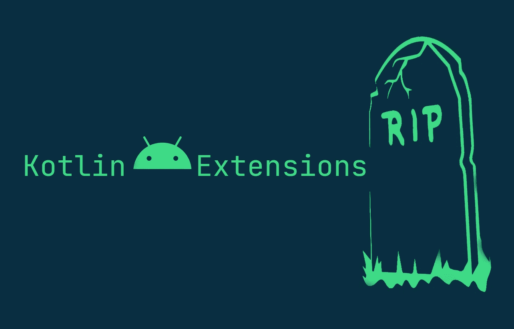
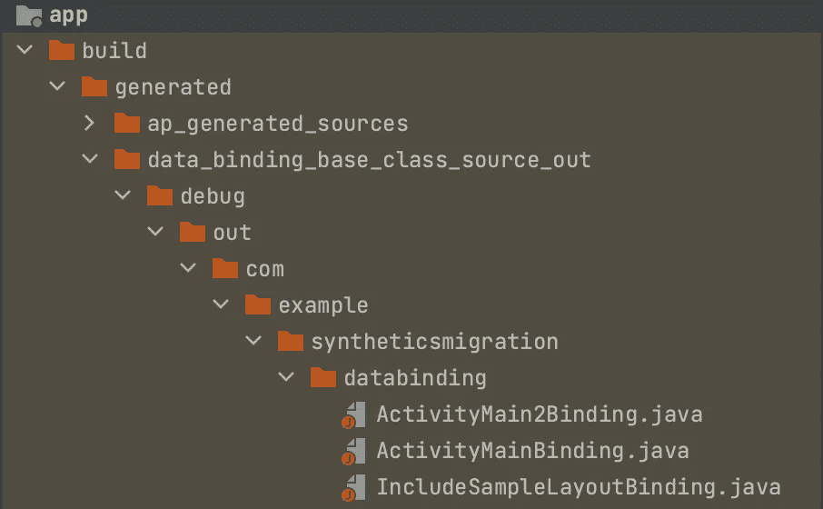

# Android Kotlin 扩展 RIP

> 原文：<https://medium.com/nerd-for-tech/android-kotlin-extensions-rip-fcdc530119b8?source=collection_archive---------1----------------------->



大约 3 年前的 Android Kotlin 扩展 Gradle 插件为 **Android 开发**在 **Kotlin** 带来了两个新的便利:

> 这里我们不是在讨论 **KTX** ，而是关于**Android kot Lin Extensions Gradle plugin**

**Synthetics** 可让您更换来电

```
**findViewById** with **kotlinx.android.synthetic bindings**.
```

*   **Parcelize** 允许您移除样板文件，并通过 [@Parcelize](https://developer.android.com/kotlin/parcelize) 注释轻松创建 **Parcelables** 。

# 科特林合成纤维的主要缺点

*   它们污染了全局名称空间
*   它们不公开可空性信息
*   他们只在科特林代码中工作

# **科特林合成材料的替代品**

> *建议您应该遵循的方法是****view binding***

# 让我们一步一步地看看如何迁移到 viewBinding

```
**// 1\. step enable viewBinding** buildFeatures {
 **viewBinding true** }
```

现在，重新构建您的项目，您可以开始了:💃

*   现在，对于项目中的所有布局，相关的**数据绑定类**将会生成，您可以在下面的**路径**中找到:



数据绑定生成的类文件夹路径

*   现在我们可以在我们尊敬的**活动和片段**中使用**视图绑定**:

```
class MainActivity : AppCompatActivity() {
 **private lateinit var binding: ActivityMainBinding** override fun onCreate(savedInstanceState: Bundle?) {
        super.onCreate(savedInstanceState) // old way to set the content
        // setContentView(R.layout.activity_main) **binding = ActivityMainBinding.inflate(layoutInflater)**

        **binding.tv.**setOnClickListener **{
           // perform your action onClick**
        **}** // get the **root view** from **binding** and **set it to as ContentView.** 
        setContentView(**binding.root**) 
    }
}
```

*   **binding.root :** 引用**布局**的 **parentView**

在出现**碎片**的情况下，我们需要**更加小心地管理绑定**，否则**可能会导致意外的内存泄漏**

*   让我们看看在**片段**的情况下我们如何使用 viewBindng:

```
class SampleFragment : Fragment() {

 **private var binding: FragmentSampleBinding? = null** 
    override fun onCreateView(
        inflater: LayoutInflater, container: ViewGroup?,
        savedInstanceState: Bundle?
    ): View {
        // Inflate the layout for this fragment
        **binding = FragmentSampleBinding.inflate(inflater, container, false)**
        return binding?.*root*!!
    }

   override fun onDestroyView() { **// we need to reset the binding to null once fragment's view   get's destroyed which helps to avoid memory leaks

    binding = null** super.onDestroyView()
   }
}
```

# 访问包含的布局:

*   让我们看看如何访问包含的布局的**视图:**

```
<?xml version="1.0" encoding="utf-8"?>
<androidx.constraintlayout.widget.ConstraintLayout xmlns:android="http://schemas.android.com/apk/res/android"
    xmlns:app="http://schemas.android.com/apk/res-auto"
    xmlns:tools="http://schemas.android.com/tools"
    android:layout_width="match_parent"
    android:layout_height="match_parent"
    tools:context=".MainActivity">

    <TextView
        android:id="@+id/tv"
        android:layout_width="wrap_content"
        android:layout_height="wrap_content"
        android:layout_margin="64dp"
        android:clickable="true"
        android:focusable="true"
        android:text="Hello World!"
        app:layout_constraintLeft_toLeftOf="parent"
        app:layout_constraintRight_toRightOf="parent"
        app:layout_constraintTop_toBottomOf="@id/logo" /> <!-- in case of **include**, we **must have to provide id tag** to **generate proper viewBinding** **variable** which helps to access the views from included layout-->
    <**include**
 **android:id="@+id/included"**        layout="@layout/include_sample_layout"
        android:layout_width="match_parent"
        android:layout_height="wrap_content"
        app:layout_constraintBottom_toBottomOf="parent"
        app:layout_constraintEnd_toEndOf="parent"
        app:layout_constraintStart_toStartOf="parent"
        app:layout_constraintTop_toBottomOf="@id/tv" />

</androidx.constraintlayout.widget.ConstraintLayout>
```

*   **的内容包括 _ 样本 _ 布局:**

```
<?xml version="1.0" encoding="utf-8"?>
<androidx.constraintlayout.widget.ConstraintLayout xmlns:android="http://schemas.android.com/apk/res/android"
    xmlns:app="http://schemas.android.com/apk/res-auto"
    android:layout_width="match_parent"
    android:layout_height="match_parent">

    <TextView
        android:id="@+id/tv2"
        android:layout_width="match_parent"
        android:layout_height="wrap_content"
        android:layout_margin="64dp"
        app:layout_constraintBottom_toBottomOf="parent"
        app:layout_constraintEnd_toEndOf="parent"
        app:layout_constraintStart_toStartOf="parent"
        app:layout_constraintTop_toTopOf="parent" />

</androidx.constraintlayout.widget.ConstraintLayout>
```

*   下面是从包含的布局访问 tv2 的**示例:**

```
class MainActivity : AppCompatActivity() {
 **private lateinit var binding: ActivityMainBinding**    override fun onCreate(savedInstanceState: Bundle?) {
        super.onCreate(savedInstanceState)
        binding = ActivityMainBinding.inflate(*layoutInflater*) **binding.included.tv2.*text* = "Included textview"**        setContentView(binding.*root)*
    }
}
```

如果您想**忽略视图绑定或布局文件**中的任何**视图，您可以在布局文件的适当级别添加以下属性:**

*   **生成 viewBinding 时忽略视图:** **不为**视图**提供 id 属性**。ViewBinding 将简单地忽略该视图。

```
<!-- the following view will be ignored by ViewBinding -->
<ImageView
    android:layout_width="match_parent"
    android:layout_height="200dp"
    android:layout_margin="32dp"
    android:importantForAccessibility="no"
    android:src="@drawable/ic_launcher_background"
    app:layout_constraintStart_toStartOf="parent"
    app:layout_constraintTop_toTopOf="parent" />
```

*   **忽略整个布局文件:**添加**工具:viewBindingIgnore="true"** 标签到你想要**忽略**的布局文件的父视图由**视图绑定生成**

```
<androidx.constraintlayout.widget.ConstraintLayout xmlns:android="http://schemas.android.com/apk/res/android"
    xmlns:app="http://schemas.android.com/apk/res-auto"
    xmlns:tools="http://schemas.android.com/tools"
    android:layout_width="match_parent"
    android:layout_height="match_parent"
    **tools:viewBindingIgnore="true"**
    tools:context=".MainActivity">
```

# 替换**包装**

*   在你的尊重模块**中，用新的特定于 Parceable 的插件替换旧的 android-kotlin-extensions 插件**

```
plugins **{**
  **  id 'kotlin-parcelize'**
**}**
```

> `kotlin-parcelize`插件提供了一个`[Parcelable](https://developer.android.com/reference/android/os/Parcelable)`实现生成器。

您需要使用以下软件包进行打包👇

```
// update all the **imports from new package** and you are good to go 💃
**import kotlinx.parcelize**
```

> 你应该开始使用独立的 **kotlin-parcelize** 插件，而不是**Android-kot Lin-extensions**。

*   这里是我们在本文中讨论过的所有代码示例的示例代码**:**

[](https://github.com/navczydev/SyntheticsMigration) [## navczydev/synthetics 迁移

### GitHub 是超过 5000 万开发人员的家园，他们一起工作来托管和审查代码、管理项目和构建…

github.com](https://github.com/navczydev/SyntheticsMigration) 

# 参考

[](https://developer.android.com/topic/libraries/view-binding/migration) [## 从 Kotlin 合成材料迁移到 Jetpack 视图绑定

### Kotlin Android Extensions 已被弃用，这意味着使用 Kotlin synthetics 进行视图绑定不再…

developer.android.com](https://developer.android.com/topic/libraries/view-binding/migration) [](https://developer.android.com/kotlin/parcelize) [## Parcelable 实现生成器| Android 开发人员

### kotlin-parcelize 插件提供了一个可扩展的实现生成器。当你用@Parcelize 注释一个类时，一个…

developer.android.com](https://developer.android.com/kotlin/parcelize) [](https://blog.jetbrains.com/kotlin/2020/11/kotlin-1-4-20-released/) [## Kotlin 1.4.20 发布- Kotlin 博客| JetBrains

### Kotlin 1.4.20 带来了新的实验特性供您尝试。对社区反馈持开放态度是…

blog.jetbrains.com](https://blog.jetbrains.com/kotlin/2020/11/kotlin-1-4-20-released/) [](https://developer.android.com/topic/libraries/view-binding) [## 查看绑定| Android 开发者

### 视图绑定是一个允许您更容易地编写与视图交互的代码的特性。一旦视图绑定被…

developer.android.com](https://developer.android.com/topic/libraries/view-binding) 

# **😊😊**👏👏👏👏**快乐编码**👏👏👏👏**😊😊**

# 保持联系

[推特](https://twitter.com/navczydev)

[](https://github.com/navczydev) [## navczydev -概述

### 软件 _Android 开发者解散在 GitHub 上注册你自己的个人资料，这是托管代码、管理…

github.com](https://github.com/navczydev)  [## Nav Singh -中级移动软件工程师-宏利| LinkedIn

### 在世界上最大的职业社区 LinkedIn 上查看 Nav Singh 的个人资料。Nav 列出了 6 个职位…

www.linkedin.com](https://www.linkedin.com/in/navczydev/)