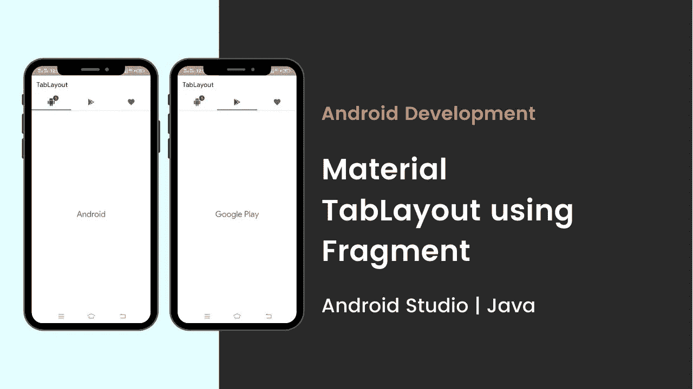
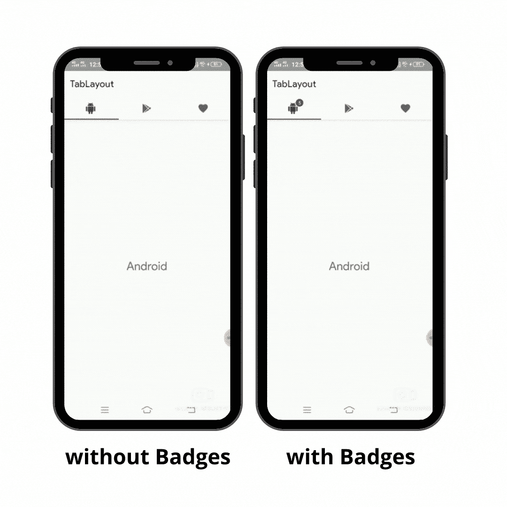

# 使用片段的 Android 材料 tablayut | tablayut 中的徽章| Android Studio | Java

> 原文：<https://medium.com/nerd-for-tech/android-material-tablayout-using-fragments-badges-in-tablayout-android-studio-java-c98cccc4f19a?source=collection_archive---------1----------------------->



**Android Material tablayut 使用片段| tablayut 中的徽章| Android Studio | Java**

在本教程中，我们将使用片段创建一个材质选项卡布局。在这里，我们将看到如何将**徽章**添加到选项卡布局中。

你也可以访问之前的教程，学习如何在 android 中创建简单的标签页布局。 [**点击这里**](https://www.gbandroidblogs.com/2021/03/how-to-create-tab-layout-using-fragments-in-android.html) 。

# 现在，让我们看看您将在本教程中看到的内容:

# 让我们创造它

# 步骤 1:添加依赖项

在 **build.gradle** app 文件中添加 google material 依赖项。

```
implementation 'com.google.android.material:material:1.3.0'
```

# 步骤 2:设计主布局

```
<?xml version="1.0" encoding="utf-8"?>
<androidx.coordinatorlayout.widget.CoordinatorLayout xmlns:android="http://schemas.android.com/apk/res/android"
    xmlns:app="http://schemas.android.com/apk/res-auto"
    xmlns:tools="http://schemas.android.com/tools"
    android:layout_width="match_parent"
    android:layout_height="match_parent"
    tools:context=".RippleTabLayout">
 <com.google.android.material.appbar.AppBarLayout
        android:layout_width="match_parent"
        android:layout_height="wrap_content"
        android:layout_marginTop="28dp"> <androidx.appcompat.widget.Toolbar
            android:id="@+id/toolbar"
            android:layout_width="match_parent"
            android:layout_height="wrap_content"
            android:background="@color/white"
            android:minHeight="?attr/actionBarSize"/> <com.google.android.material.tabs.TabLayout
            android:id="@+id/tab_layout"
            android:layout_width="match_parent"
            android:layout_height="wrap_content"/>
    </com.google.android.material.appbar.AppBarLayout> <androidx.viewpager.widget.ViewPager
        android:id="@+id/view_pager"
        android:layout_width="match_parent"
        android:layout_height="wrap_content"
        app:layout_behavior="com.google.android.material.appbar.AppBarLayout$ScrollingViewBehavior" />
</androidx.coordinatorlayout.widget.CoordinatorLayout>
```

# 步骤 3:添加片段

这里我用了三个片段，正如你在上面的视频中看到的。因此，转到包并创建三个空白片段。(包/新/空白片段)。

**第一个片段:**安卓

**第二个片段:** Google Play

**第三个片段:**最爱

# 步骤 4:添加功能

```
package com.codewithgolap.tablayout;import androidx.annotation.NonNull;
import androidx.annotation.Nullable;
import androidx.appcompat.app.AppCompatActivity;
import androidx.appcompat.widget.Toolbar;
import androidx.fragment.app.Fragment;
import androidx.fragment.app.FragmentManager;
import androidx.fragment.app.FragmentPagerAdapter;
import androidx.viewpager.widget.ViewPager;import android.os.Bundle;import com.codewithgolap.tablayout.Fragments.ChatsFragment;
import com.codewithgolap.tablayout.Fragments.HomeFragment;
import com.codewithgolap.tablayout.Fragments.SettingsFragment;
import com.google.android.material.badge.BadgeDrawable;
import com.google.android.material.tabs.TabLayout;import java.util.ArrayList;
import java.util.List;public class RippleTabLayout extends AppCompatActivity { private Toolbar toolbar;
    private ViewPager viewPager;
    private TabLayout tabLayout; private HomeFragment homeFragment;
    private SettingsFragment settingsFragment;
    private ChatsFragment chatsFragment; @Override
    protected void onCreate(Bundle savedInstanceState) {
        super.onCreate(savedInstanceState);
        setContentView(R.layout.*activity_ripple_tab_layout*); toolbar = findViewById(R.id.*toolbar*);
        setSupportActionBar(toolbar); viewPager = findViewById(R.id.*view_pager*);
        tabLayout = findViewById(R.id.*tab_layout*); homeFragment = new HomeFragment();
        settingsFragment = new SettingsFragment();
        chatsFragment = new ChatsFragment(); tabLayout.setupWithViewPager(viewPager); //create viewpager adapter
        //here we will create inner class for adapter
        ViewPagerAdapter viewPagerAdapter = new ViewPagerAdapter(getSupportFragmentManager(), 0); //add fragments and set the adapter
        viewPagerAdapter.addFragment(homeFragment,"");
        viewPagerAdapter.addFragment(settingsFragment,"");
        viewPagerAdapter.addFragment(chatsFragment,"");
        viewPager.setAdapter(viewPagerAdapter); //set the icons
        tabLayout.getTabAt(0).setIcon(R.drawable.*android*);
        tabLayout.getTabAt(1).setIcon(R.drawable.*google_play*);
        tabLayout.getTabAt(2).setIcon(R.drawable.*heart*); //set the badge
        BadgeDrawable badgeDrawable = tabLayout.getTabAt(0).getOrCreateBadge();
        badgeDrawable.setVisible(true);
        badgeDrawable.setNumber(5);
    } private class ViewPagerAdapter extends FragmentPagerAdapter { private List<Fragment> fragments = new ArrayList<>();
        private List<String> fragmentTitles = new ArrayList<>(); public ViewPagerAdapter(@NonNull FragmentManager fm, int behavior) {
            super(fm, behavior);
        } //add fragment to the viewpager
        public void addFragment(Fragment fragment, String title){
            fragments.add(fragment);
            fragmentTitles.add(title);
        } @NonNull
        @Override
        public Fragment getItem(int position) {
            return fragments.get(position);
        } @Override
        public int getCount() {
            return fragments.size();
        } //to setup title of the tab layout
        @Nullable
        @Override
        public CharSequence getPageTitle(int position) {
            return fragmentTitles.get(position);
        }
    }
}
```

这里，我们不是创建一个额外的适配器 java 类，而是为适配器创建一个内部类。

# 输出:



# 你可以在 YouTube 上关注我:

[Golap 酒保](https://www.youtube.com/channel/UCqHYLy2nzO0pONL5BueoT6Q)

# 另外，请访问我的网站/博客:

[www.gbandroidblogs.com](https://www.gbandroidblogs.com/)

# 在 Instagram 上关注我

安卓应用开发者

# 跟着我去脸书

GBAndroidBlogs