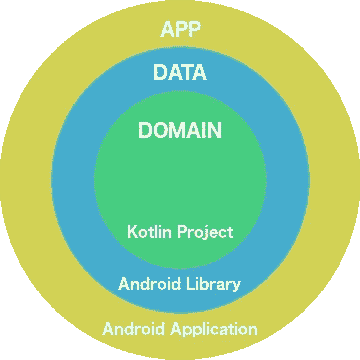
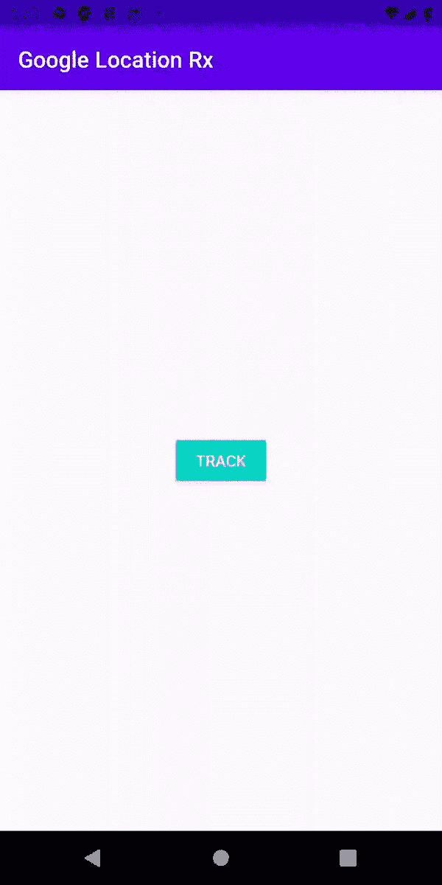

# Android——使用 RxJava 和 Clean 架构检索谷歌位置

> 原文：<https://medium.com/nerd-for-tech/android-retrieving-google-location-using-rxjava-and-clean-architecture-36c1017c6529?source=collection_archive---------0----------------------->

[安德鲁·尼尔](https://unsplash.com/@andrewtneel?utm_source=medium&utm_medium=referral)在 [Unsplash](https://unsplash.com?utm_source=medium&utm_medium=referral) 上拍照

使用谷歌定位并不是一项简单的任务，但是 [FusedLocationProvider API](https://developers.google.com/location-context/fused-location-provider) 帮助并简化了我们的工作。
在这篇文章中，我将介绍我实现的一种方法，通过一个干净的架构项目从 Google 定位服务中检索数据并展示给用户。

既然我们遵循干净的架构，让我们从我们的架构开始，并解释它将如何工作。

架构/依赖性

与其在这里花时间解释干净架构的概念，我将假设您已经熟悉它，并解释它在我们的场景中是如何工作的。
如果你不知道 clean architecture 是如何工作的，你可以看看这个关于它的好帖子:
[https://www . raywenderlich . com/3595916-clean-architecture-tutorial-for-Android-getting-started](https://www.raywenderlich.com/3595916-clean-architecture-tutorial-for-android-getting-started)

**领域层:**领域层将负责使用 LocationRepository 数据的用例(GetLocationUseCase)。
该层仅由其他层实现。

**数据层:**该层将负责通过使用融合位置提供者 API([https://developers . Google . com/Location-context/Fused-Location-Provider](https://developers.google.com/location-context/fused-location-provider))来请求 Google 位置数据本身，它将被封装在 GoogleLocationDataSource 类中。
这一层将实现域层。

**应用程序层:**此外，我们将需要定义从业务逻辑(域)到 UI(应用程序)的桥梁，这将由注入到我们的 TrackerViewModel 中的用例来处理。
这一层将实现两层(数据和领域)，以提供我们需要的依赖注入。

模块之间的关系

事不宜迟，让我们从代码方面检查一下，从 GoogleLocationDataSource 类开始

# 数据源

数据源类

首先，我们通过定义 FusedLocationProviderClient、LocationRequest 和 LocationCallback 来设置 Google Location API。

**FusedLocationProviderClient:**将负责通过监听器使用 *requestLocationUpdates* 函数和 *lastLocation* 请求位置更新。
PS1:它将允许我们删除位置更新回调函数。
[https://developer . Android . com/training/location/request-updates](https://developer.android.com/training/location/request-updates)

**LocationRequest:** 定义我们的位置提供商客户端将使用的必要服务质量参数，如间隔和优先级，您可以在此处找到更多信息:[https://developers . Google . com/Android/reference/com/Google/Android/GMS/location/location request . html](https://developers.google.com/android/reference/com/google/android/gms/location/LocationRequest.html)

**LocationCallback:** 非常简单，回调函数将接收 Google Location 提供的位置数据。
[https://developers . Google . com/Android/reference/com/Google/Android/GMS/location/location callback . html](https://developers.google.com/android/reference/com/google/android/gms/location/LocationCallback.html)

**LocationSubject:** 这个变量将负责发布我们在 **LocationCallback** 上收到的结果，并将作为一个可流动的对象暴露给存储库。

**LocationObservable:** 这是我们将在数据源和存储库之间定义的桥梁。请注意，我们使用**取消订阅**来开始请求位置更新，使用**取消取消**来停止请求位置更新，从而将位置请求功能与 flowable 相关联。

**LocationEntity:** 是包装位置经纬度的对象，应该只能从数据层访问。

# 贮藏室ˌ仓库

存储库接口

位置存储库接口将在域层上定义，作为用例的协议。

知识库实现类

存储库实现将是在数据层定义的存储库的实际实现，并且将使用已经定义的 GoogleLocationDataSource 的注入实例来创建。它必须映射到一个域层对象( **LocationDomainModel** )，因为域层不知道数据层，也不能访问 **LocationEntity。**

# 用例

用例类

用例将注入我们定义的供视图模型使用的存储库接口。

# 视图模型

查看模型类

在我们的视图模型中，每当我们授予位置权限时，我们使用注入的用例来观察位置数据，我们必须将结果映射到我们的 UI 模型，并使用 **_locationModel** livedata 来发布值。
**PS:**base subscribe 是在我的 BaseViewModel 上定义的功能，它将在我的 [Github repo](https://github.com/PedroOkawa/google-location-rx) 上可用。

# 碎片

片段类

最后，我们的片段将处理 Google Maps 接口和位置许可。要接收位置数据，我们唯一需要做的事情就是观察**位置模型**可观测性。

# 结果

申请结果

**PS:** 使用模拟器定位功能更改了位置。

# 结论

融合的位置 API 非常简单明了，但是我们必须定义一种适当的方式来请求这些数据，使用一种干净的架构方法可以帮助我们完成这项任务，使它更加健壮和有组织。

要了解更多细节，请查看我的 Github 项目的实现:

 [## 佩德鲁卡瓦/谷歌-位置-接收

### 在 GitHub 上创建一个帐户，为 PedroOkawa/google-location-rx 的开发做出贡献。

github.com](https://github.com/PedroOkawa/google-location-rx)