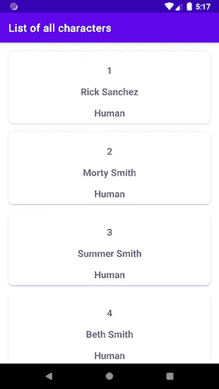
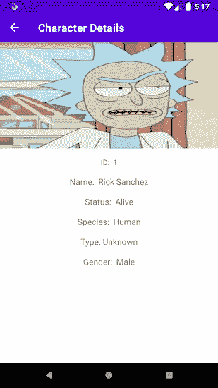
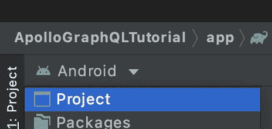
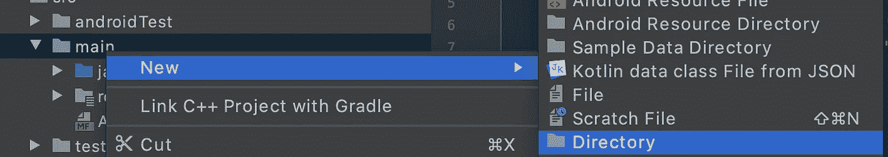
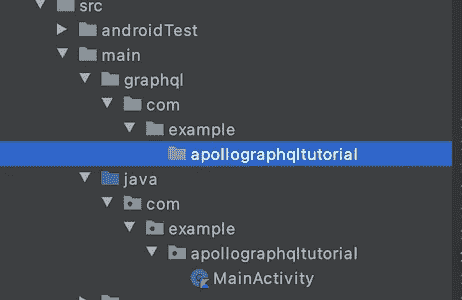
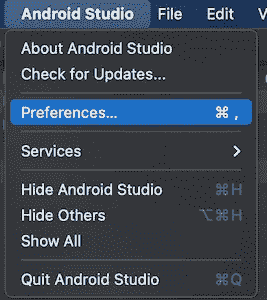
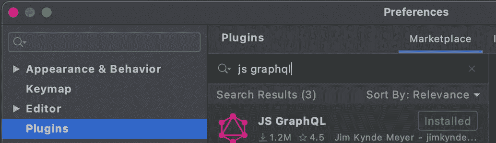
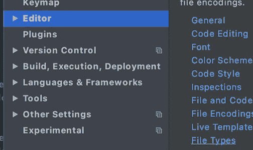
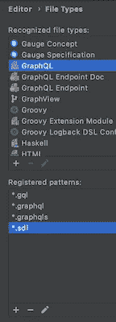
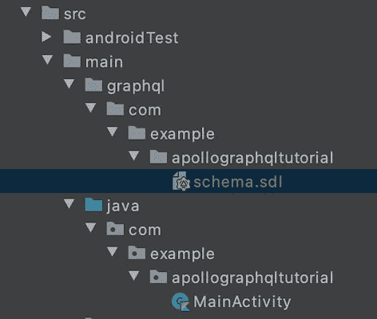

# Android 教程第 1 部分:使用 Apollo 库从 GraphQL 端点获取数据

> 原文：<https://medium.com/nerd-for-tech/android-tutorial-part-1-using-apollo-library-to-fetch-data-from-a-graphql-endpoint-61e8c58158de?source=collection_archive---------0----------------------->


美国宇航局在 [Unsplash](/s/photos/astronaut?utm_source=unsplash&utm_medium=referral&utm_content=creditCopyText) 拍摄的照片

在本教程中，我将展示如何使用 [Apollo](https://www.apollographql.com/docs/android/essentials/get-started-kotlin/) 库从 [Rick 和 Morty GraphQL 端点](https://rickandmortyapi.com/documentation/#graphql)获取数据。我将展示如何使用 [Kotlin](https://kotlinlang.org/docs/reference/) 、[数据绑定](https://developer.android.com/topic/libraries/data-binding)、[视图绑定](https://developer.android.com/topic/libraries/view-binding)、 [ViewModel](https://developer.android.com/topic/libraries/architecture/viewmodel) 、 [LiveData](https://developer.android.com/topic/libraries/architecture/livedata) 、[Kotlin Coroutines](https://developer.android.com/kotlin/coroutines)、[导航组件](https://developer.android.com/guide/navigation/navigation-getting-started)、 [Apollo](https://www.apollographql.com/docs/android/essentials/get-started-kotlin/) 、[线圈](https://coil-kt.github.io/coil/getting_started/)、[手柄](https://developer.android.com/training/dependency-injection/hilt-android)以及 MVVM 架构模式从 Rick 获取数据这将是一个简单的应用程序，它获取一个角色列表，并通过点击特定的卡片，一个新的屏幕显示角色的详细信息。这是一个循序渐进的教程。

# 先决条件

你应该已经熟悉[科特林](https://kotlinlang.org/)、[数据绑定](https://developer.android.com/topic/libraries/data-binding)、[视图绑定](https://developer.android.com/topic/libraries/view-binding)、 [ViewModel](https://developer.android.com/topic/libraries/architecture/viewmodel) 、 [LiveData](https://developer.android.com/topic/libraries/architecture/livedata) 、[科特林协同程序](https://developer.android.com/kotlin/coroutines)和 MVVM。

我用的是 Android Studio 4 . 1 . 2
Build # AI-201 . 8743 . 12 . 41 . 7042882，2020 年 12 月 20 日构建。

# 为什么是这篇文章？

我目前工作的公司已经从 REST API 转换到 GraphQL API。其中一个主要好处是，客户端能够准确地指定他们需要从服务器获得什么，并以可预测的方式接收数据。使用 GraphQL，您只能得到您需要的东西。与 REST API 响应相比，REST API 响应通常包含很多大多数时候不需要的数据。在那里你必须筛选出真正感兴趣的数据。这使得 GraphQL 更加高效。如需简短介绍，请查看 YouTube 上来自 [Fireship](https://www.youtube.com/watch?v=eIQh02xuVw4) 的视频。

# 应用程序将会是什么样子

该应用程序将包含一个卡片列表。每张人物卡显示一个 id，名字和物种。角色细节显示了角色的 id、名字、状态、种类、类型、性别和形象。



字符列表



角色详细信息

# 开始新项目

去 Android Studio 新建一个 ***空项目*** (语言科特林，API 23)。或者到分行查看我的 GitHub 回购: [initial_project](https://github.com/fahrican/ApolloGraphQlTutorial/tree/initial_project)

# 梯度依赖性

转到您的**项目 build.gradle** 文件。首先，为我们将使用的依赖项创建变量。

```
ext **{** kotlin_version = "1.4.31"
    apollo_version = "2.5.4"
    hilt_version = "2.31.2-alpha"
    hilt_compiler_version = '1.0.0-alpha03'
    legacy_support_v4_version = '1.0.0'
    fragment_component_version = "2.3.3"
**}**
```

然后添加句柄和导航安全参数的类路径。

```
dependencies **{** classpath "com.android.tools.build:gradle:4.1.2"
    classpath "org.jetbrains.kotlin:kotlin-gradle-plugin:$kotlin_version"
    classpath "androidx.navigation:navigation-safe-args-gradle-plugin:$fragment_component_version"
    classpath "com.google.dagger:hilt-android-gradle-plugin:$hilt_version"
**}**
```

下面是**项目 build.gradle** 现在应该是什么样子的要点:

现在转到 **app build.gradle** ，添加第一行所需依赖的插件:

```
plugins **{** id 'com.android.application'
    id 'kotlin-android'
    id 'kotlin-kapt'
    id 'dagger.hilt.android.plugin'
    id 'androidx.navigation.safeargs.kotlin'
    id("com.apollographql.apollo").version("2.5.4")
**}**
```

然后在 **kotlinOptions** 下面添加以下内容:

```
buildFeatures **{** viewBinding = true
    dataBinding = true
**}**
```

现在出现了一个非常非常重要的依赖。下面的依赖项是从 [Apollo 库](https://www.apollographql.com/docs/android/)转换而来的*。graphql 文件转换成*。kt 文件。应该和*安卓{}* 在一个层次。

```
apollo **{** // instruct the compiler to generate Kotlin models
    generateKotlinModels.set(true)
**}**
```

这里汇总了 **app build.gradle**

# GraphQL 模式

这部分是整个教程中最重要的部分。在这里我将解释 Apollo 和 GraphQL 是如何为 Android 工作的。

将您的项目视图从“Android”更改为“project”。



现在从**app**->**src**->**main**导航。右键点击**主**->-**新建**->-**目录**



创建一个新目录，并将其命名为 **graphql** 。创建与 java 文件夹相同的子目录。



这很重要，因为现在我们将保存 **schema.sdl** 文件并添加 ***。graphql** 文件在那里。相同的包结构很重要，因为我们将能够在 java 包中使用生成的 Kotlin 类。

## JS GraphQL Android Studio 插件

在我们添加***schema . SDL****文件之前，我们想要添加一个特殊的插件来使我们的 GraphQL 语法更加简单。打开您的 Android Studio 偏好设置。*

**

*我用的是 MacBook，所以如果你用的是 Windows 或 Linux，偏好可能会在别的地方。*

*然后进入**插件**点击 **Marketplace** 搜索“js graphql”并安装 Jim Kynde Meyer 的第一个条目。安装后，您可能需要重新启动 Android Studio。*

**

*重启安装插件 **JS GraphQL** 并重启 IDE 后，再次打开首选项。这次导航到**编辑器**->-**文件类型***

**

*现在寻找 GraphQL 并点击它。下面的“注册模式:”是添加文件类型的加号。添加一个又一个文件类型，比如:*

**

*   **.gql*
*   **.graphql*
*   **.图表 qls*
*   **.sdl*

*添加完这些文件类型后，我们最终可以添加 **schema.sdl** 文件。头回到你的包结构:**graph QL**->**com**->**example**->**apollographql tutorial**->**右键** - > **新建**->**File**->**schema . SDL***

**

*好了，第一部分到此为止。如果你喜欢这篇文章**，请鼓掌**。这里是[第二部](https://fahri-c93.medium.com/android-tutorial-part-2-using-apollo-library-to-fetch-data-from-a-graphql-endpoint-96dad8a58639)。*

*这里是已完成的项目，退房分支 **part_one***

*[](https://github.com/fahrican/ApolloGraphQlTutorial/tree/part_one) [## fahrican/apollographql 教程

### 在 GitHub 上创建一个帐户，为 fahrican/apollographqlturtutorial 开发做贡献。

github.com](https://github.com/fahrican/ApolloGraphQlTutorial/tree/part_one)*