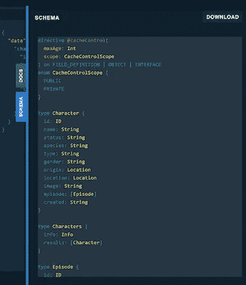
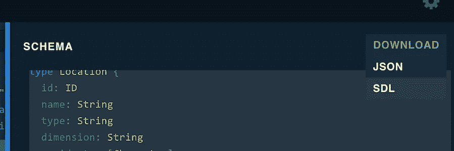
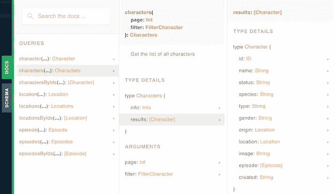
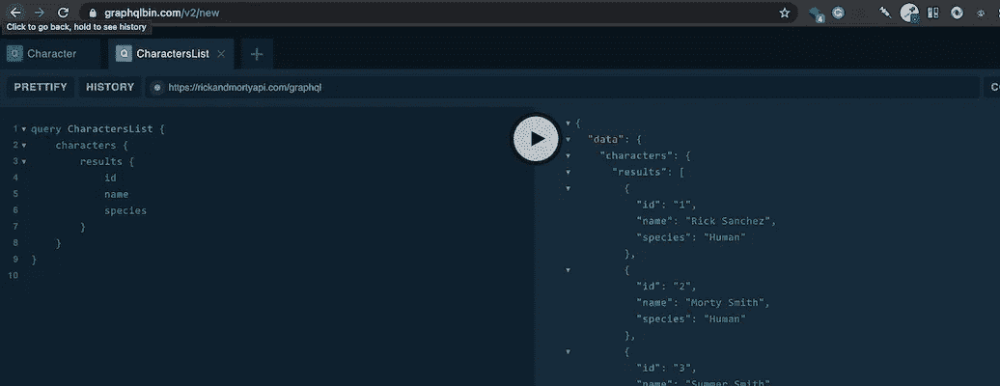
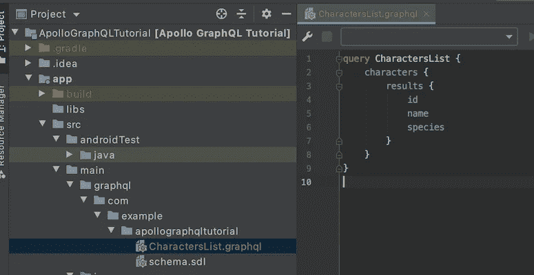
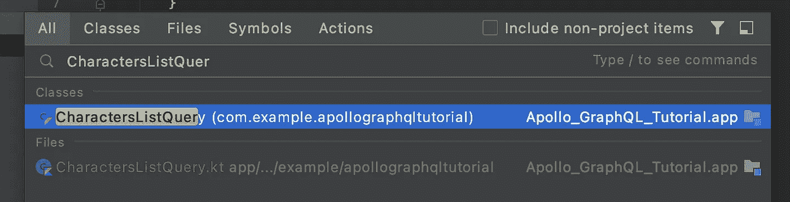
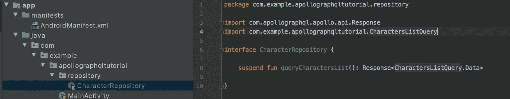

# Android 教程第 2 部分:使用 Apollo 库从 GraphQL 端点获取数据

> 原文：<https://medium.com/nerd-for-tech/android-tutorial-part-2-using-apollo-library-to-fetch-data-from-a-graphql-endpoint-96dad8a58639?source=collection_archive---------1----------------------->


美国宇航局在 [Unsplash](/s/photos/astronaut?utm_source=unsplash&utm_medium=referral&utm_content=creditCopyText) 拍摄的照片

# 图表信息

在[第 1 部分](/nerd-for-tech/android-tutorial-part-1-using-apollo-library-to-fetch-data-from-a-graphql-endpoint-61e8c58158de)中，我们配置了项目结构并添加了一个空的 **schema.sdl** 文件。

好吧，我想是时候解释一些事情了。当您使用 GraphQL 时，CRUD 操作只有一个端点。因此，我们必须为所有操作在本地保存一个模式文件。获取数据需要一个 ***查询{},*** 创建/更新数据需要一个 ***突变{}*** 获取特定数据变更的更新需要 ***订阅{}*** 。对于本教程，我们将只使用***{查询}*** 。

## 获取模式

记住我们的 **schema.sdl** 当前是空的，现在让我们获取模式。首先，打开 GraphQL 游乐场下面是链接:[https://www.graphqlbin.com/v2/new](https://www.graphqlbin.com/v2/new)

在 GraphQL 操场上粘贴里克和莫蒂的 API 链接:[https://rickandmortyapi.com/graphql](https://rickandmortyapi.com/graphql)

当游乐场打开时，您将在右侧看到两个选项卡:**文档**和**模式**。点击**模式**



在 Android Studio 的 **schema.sdl** 文件中标记、复制并粘贴所有内容。您的 **schema.sdl** 应该是这样的:

## 仅供参考:)

您也可以下载模式文件。**模式**标签的右侧有一个下载按钮，您可以在这里决定是使用 JSON 还是 SDL。



有时下载的文件有一些问题，这就是为什么我更喜欢复制/粘贴的方法。如果你应该使用比 2.5.4 更老的 Apollo 版本，比如 2.2.0，那么你不能使用 SDL，因为生成器不能识别文件类型。

## 编写您的第一个查询

是时候看看要查询什么了。点击**选项卡中的**单据。现在，您应该会看到所有的查询选项。您可以单击每个条目来查看您可以查询的内容。看看“字符”并点击可能的查询选项。



这里我们看到 ***人物*** 导致 ***结果*** 并且这导致**人物**细节。所以这意味着查询具有层次结构，首先是*字符{ T11 }这导致*字符{结果} }* 这最终导致字符{ T14 }结果{ id 名称物种} }*

现在跳到左侧面板，编写以下查询:

```
query CharactersList {
    characters {
        results {
            id
            name
            species
        }
    }
}
```

Apollo 生成 Kotlin 文件的查询名称是“CharactersList”。我们必须给查询一个名称。接下来的几行描述了我们想要查询的内容。这就产生了一个包含 id、姓名和物种的字符列表。显然，我可以获取比 id、名称和物种更多或更少的信息。但是我们将在接下来的步骤中获取更多。现在按播放按钮，看看你的查询是否正确。



当您看到数据输出时，您知道您的查询是正确的。现在跳回到 Android Studio。在与您的 **schema.sdl** 相同的包中创建一个新文件。该文件具有您的查询的名称，因此创建 **CharactersList.graphql**

从游戏场的左侧面板复制您的查询，并将其粘贴到您的 **CharactersList.graphql** 文件中。



现在点击**构建** - > **清理项目**然后点击**构建** - > **重建项目**。

是时候看看 Apollo 能否创建一个包含 **CharactersList.graphql** 文件的 Kotlin 文件了。如果您使用的是 MacOS，则双击 shift 并搜索“ ***字符列表查询*** ”。



打开文件***characters list query***。在那里，您将找到一个结果数据类，其中包含列表查询所需的字段。

```
public data class Result(
  public val __typename: String = "Character",
  public val id: String?,
  public val name: String?,
  public val species: String?
)
```

这意味着我们可以开始开发应用程序，您可以再次关闭生成的文件***characters list query***。

# **开始开发应用**

在存放 ***MainActivity*** 的同一个包中，新建一个文件:***RickAndMortyApp***。从***Application()***继承，并用 **HiltAndroidApp** 注释该类，这样 Hilt 就可以从那里为你的应用创建依赖树。

```
@HiltAndroidApp
class RickAndMortyApp : Application()
```

移动到 **AndroidManifest.xml** 首先添加互联网权限。之后给你的应用命名***RickAndMortyApp***。

```
<uses-permission android:name="android.permission.INTERNET" />

<application
    android:name=".RickAndMortyApp"
    android:allowBackup="true"
...
```

# **用于获取数据的存储库**

是时候创建一个 repo 来获取数据了。创建一个新包，并将其命名为 **repository** 。创建接口***character repository***并创建一个挂起函数，其返回类型为:Response<characters list query。数据>



将光标放在 ***字符库*** 内，按 *ALT + Enter* 移动到“执行界面”。那么你应该有一个类***CharacterRepositoryImpl***。

# ***graph QL 客户端***

我们需要的下一个类是 ApolloClient 的实例。在实现***CharacterRepositoryImpl***之前，让我们为 ApolloClient 实现这个类。创建一个新的包，命名为**网络**。在那里创建一个类***RickAndMortyApi***。

```
class RickAndMortyApi {

    fun getApolloClient(): ApolloClient {
        *check*(Looper.myLooper() == Looper.getMainLooper()) **{** "Only the main thread can get the apolloClient instance"
        **}** val okHttpClient = OkHttpClient.Builder().build()
        return ApolloClient.builder()
            .serverUrl("https://rickandmortyapi.com/graphql")
            .okHttpClient(okHttpClient)
            .build()
    }

}
```

正如您所看到的，这个类创建了一个 ApolloClient，并对 Rick 和 Morty API 端点进行网络调用。

好了，第二部分到此为止。如果你喜欢这篇文章**，请鼓掌**。这里是[第三部](https://fahri-c93.medium.com/android-tutorial-part-3-using-apollo-library-to-fetch-data-from-a-graphql-endpoint-616fda869560)。

这里是已完成的项目，检查分支 **part_two**

[](https://github.com/fahrican/ApolloGraphQlTutorial/tree/part_two) [## fahrican/apollographql 教程

### 在 GitHub 上创建一个帐户，为 fahrican/apollographqlturtutorial 开发做贡献。

github.com](https://github.com/fahrican/ApolloGraphQlTutorial/tree/part_two)