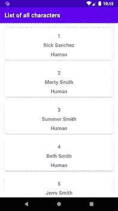

# Android 教程第 3 部分:使用 Apollo 库从 GraphQL 端点获取数据

> 原文：<https://medium.com/nerd-for-tech/android-tutorial-part-3-using-apollo-library-to-fetch-data-from-a-graphql-endpoint-616fda869560?source=collection_archive---------3----------------------->


美国宇航局在 [Unsplash](/s/photos/astronaut?utm_source=unsplash&utm_medium=referral&utm_content=creditCopyText) 拍摄的照片

在[第 2 部分](/nerd-for-tech/android-tutorial-part-2-using-apollo-library-to-fetch-data-from-a-graphql-endpoint-96dad8a58639)中，我们将 **schema.sdl** 添加到项目中，并开始开发应用程序。我们完成了创建***RickAndMortyApi***类。

# 依赖注入的句柄模块

由于我们现在已经在我们的***RickAndMortyApi***中有了 Apollo 客户端实例，我们现在可以使用 Hilt 将它注入到***character repositoryimpl***中。创建一个新的包，命名为 **di** 。在包 **di** 中创建对象 ***RepoModule*** 。用*模块*对其进行注释，用 *InstallIn* 对其进行注释，并将其传递给 *SingletonComponent* 类。从 Dagger 2 你可能知道*模块*被传入*组件*。与此相反，你将*组件*传递到*模块*。*需要 SingletonComponent* ，因为它需要比 Activity 和 ViewModel 更长寿。有关组件的更多信息，请点击[此处](https://dagger.dev/hilt/components)。然后用 *Singleton* & *标注的 create 方法提供*并返回一个 ***RickAndMortyApi 的实例。***

```
@Module
@InstallIn(SingletonComponent::class)
object RepoModule {

    @Singleton
    @Provides
    fun provideWebService() = RickAndMortyApi()

}
```

# 存储库模式

还记得我们在上一部分创建的类***CharacterRepositoryImpl***吗？现在去打开它。At 用***RickAndMortyApi***的实例注入构造函数。然后使用方法 *queryCharactersList( )* 内的属性查询***characters list query***。

# **ViewModel 的另一个模块**

在 **di** 里面新建一个文件，命名为 ***ViewModelModule*** 。用安装在中的*模块*和*对其进行注释，并向其传递*视图模型组件*类。因为它需要比活动更长久。创建一个方法，用*绑定*和 *ViewModelScoped* ，传递一个参数***CharacterRepositoryImpl***，给它一个返回类型***character repository***。*

# 处理视图状态

创建新的包**视图**。在**视图**中创建另一个包，并将其命名为**状态**。在**状态下**包创建**文件*视图状态*文件**。这个类将处理加载、显示数据或错误消息的视图。

# 为 MVVM 创建的最后一个类

创建一个新的包**视图模型**。在 **viewmodel** 内部创建类**角色*viewmodel*角色**。用*experimental routinesapi*和 *HiltViewModel* 对其进行注释。添加注入构造函数给构造函数传递一个***character repository***的实例。最后一步，别忘了从 *ViewModel 继承。*

```
@ExperimentalCoroutinesApi
@HiltViewModel
class CharacterViewModel @Inject constructor(
    private val repository: CharacterRepository,
) : ViewModel() {
}
```

接下来，为*视图模型*创建私有字段*可变数据*，并在*视图模型*之外创建公共*活动数据*属性。

```
private val _charactersList by *lazy* **{** MutableLiveData<ViewState<Response<CharactersListQuery.Data>>>() **}**val charactersList: LiveData<ViewState<Response<CharactersListQuery.Data>>>
    get() = _charactersList
```

之后，我们需要一个方法，在调用时首先设置视图状态加载，然后设置 **_charactersList** 的数据，或者设置一个视图状态错误情况，如果发生异常。

# 移动到适配器上

在**视图**包内创建包**适配器**。然后创建文件***character adapter***。首先，我们需要一个 *DiffUtil* 类，稍后用于 *ListAdapter* 。 *DiffUtil* 和 *ListAdapter* 将提升 *RecyclerView* 的性能。

```
class CharacterDiffUtil : DiffUtil.ItemCallback<CharactersListQuery.Result>() {

    override fun areItemsTheSame(
        oldItem: CharactersListQuery.Result,
        newItem: CharactersListQuery.Result
    ): Boolean {
        return oldItem.id == newItem.id
    }

    override fun areContentsTheSame(
        oldItem: CharactersListQuery.Result,
        newItem: CharactersListQuery.Result
    ): Boolean {
        return oldItem == newItem
    }

}
```

现在跳转到**RES**->-**layout**，创建资源文件: **item_character.xml** 。这个布局将保存一个字符，该字符被提取。

# 用于存储和缓存数据的视图保持器

时间跳转回文件*。创建一个新的 ViewHolder 类，其参数为***item character binding***，并从 ***RecyclerView 继承。*取景框**。*

```
*class CharacterViewHolder(val binding: ItemCharacterBinding) : RecyclerView.ViewHolder(binding.*root*)*
```

# *用于显示数据的适配器*

*我建议在上面的***character viewcholder***中创建类***character adapter***。***character adapter***继承自:*

```
*ListAdapter<
CharactersListQuery.Result, 
CharacterViewHolder
>(CharacterDiffUtil())*
```

*现在，我们必须重写 onCreateViewHolder()和 onBindViewHolder()方法。*

*onCreateViewHolder()只创建***character view holder***并返回。*

```
*override fun onCreateViewHolder(parent: ViewGroup, viewType: Int): CharacterViewHolder {
    val binding: ItemCharacterBinding = DataBindingUtil.inflate(
        LayoutInflater.from(parent.*context*),
        R.layout.*item_character*,
        parent,
        false
    )
    return CharacterViewHolder(binding)
}*
```

*onBindViewHolder()传递一个 ***CharactersListQuery 的 an 对象。结果*到数据绑定布局**。*

```
*override fun onBindViewHolder(holder: CharacterViewHolder, position: Int) {
    holder.binding.*character* = getItem(position)
}*
```

*这里总结一下**文件 *CharacterAdapter。****

*应用程序导航的片段组件*

*打开 **activity_main.xml** ，用***FragmentContainerView***替换默认的 *TextView* ，这样每个片段都会被加载到那里。*

```
*<androidx.fragment.app.FragmentContainerView
    android:id="@+id/nav_host_fragment"
    android:name="androidx.navigation.fragment.NavHostFragment"
    android:layout_width="0dp"
    android:layout_height="0dp"
    app:defaultNavHost="true"
    app:layout_constraintBottom_toBottomOf="parent"
    app:layout_constraintEnd_toEndOf="parent"
    app:layout_constraintStart_toStartOf="parent"
    app:layout_constraintTop_toTopOf="parent"
    app:navGraph="@navigation/nav_main" />*
```

*你会注意到最后一行:*app:nav graph = " @ navigation/nav _ main "*会是红色的。将光标放在这一行，按下 **ALT + Enter** (MacOS)，然后**创建导航资源文件‘nav _ main . XML’**。*

*打开 ***MainActivity*** 用**andr identity point**对其进行注释，并创建***activity main binding***的一个属性和***nav controller***的一个属性。然后在 *onCreate()* 的主体中实例化这两个属性。在**视图**中创建包 **ui。**然后将 ***主活动*** 移动到**视图**->-**ui**包中*

*第 18 行的方法*setupActionBarWithNavController(nav controller)*和方法 *onSupportNavigateUp()* 在我们在下一部分添加另一个*片段*作为子片段时，将需要用于后退导航。动作栏中的后退箭头需要这两种方法。*

# *用于显示字符列表的片段*

*转到**RES**->**layout**，创建一个名为**fragment _ characters _ list . XML**的新布局文件。该布局将显示字符列表。*

*跳转到套餐**查看**->-**ui**。创建文件***characters list Fragment***并用*experimental routinesapi*和*andr identify point*对其进行注释，然后从 *Fragment* 中继承。*

```
*@ExperimentalCoroutinesApi
@AndroidEntryPoint
class CharactersListFragment : Fragment()*
```

*我们需要三个属性:一个是***fragmentcharactersistbinding***，一个是***character adapter***，一个是***character viewmodel***。*

```
*private lateinit var binding: FragmentCharactersListBinding
private val characterAdapter by *lazy* **{** CharacterAdapter() **}** private val viewModel by *viewModels*<CharacterViewModel>()*
```

*覆盖方法 *onCreateView()* ，在那里实例化 ***绑定*** 字段，返回 ***绑定*** 的*根*字段。*

```
*override fun onCreateView(
    inflater: LayoutInflater, container: ViewGroup?,
    savedInstanceState: Bundle?
): View {
    binding = FragmentCharactersListBinding.inflate(inflater)
    return binding.*root* }*
```

*在主体中覆盖方法 *onViewCreated()* 将***character Adapter***分配给 RecyclverView 适配器。之后，从您的 ***视图模型中调用 *queryCharactersList()* 方法。*** 断行，写*observe livedata()。**

```
**override fun onViewCreated(view: View, savedInstanceState: Bundle?) {
    super.onViewCreated(view, savedInstanceState)

    binding.charactersRv.*adapter* = characterAdapter
    viewModel.queryCharactersList()
    observeLiveData()
}**
```

**方法 *observeLiveData()* 将处理何时显示加载进度条、何时显示将列表分配给 RecyclerView 以及何时在显示屏上显示错误文本的逻辑。**

# **不要忘记在 main_nav.xml 中添加片段**

**在 **nav_main.xml** 中添加***characters list 分段*** 并设置为 *startDestination* 。**

**最后，运行应用程序，看看你的结果**

****

**好了，第三部分到此为止。如果你喜欢这篇文章，请鼓掌。下面是[第四部分](https://fahri-c93.medium.com/android-tutorial-part-4-using-apollo-library-to-fetch-data-from-a-graphql-endpoint-a621dfd98564)。**

**这里是已完成的项目，检查分支 **part_three****

**[https://github . com/fah Rican/apollographql tutorial/tree/part _ three](https://github.com/fahrican/ApolloGraphQlTutorial/tree/part_three)**