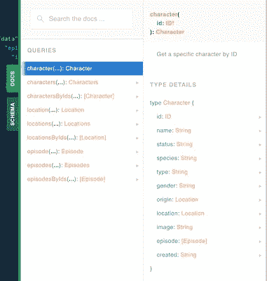
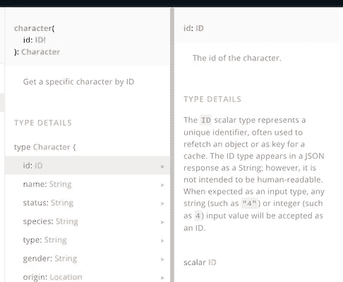
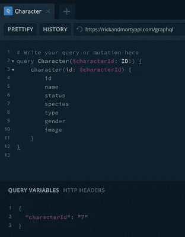
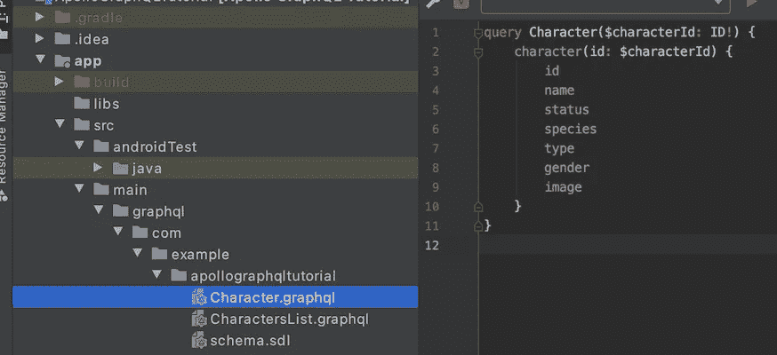
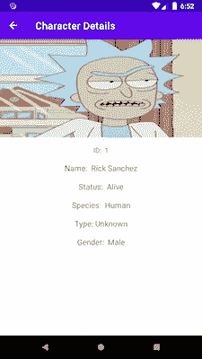

# Android 教程第 4 部分:使用 Apollo 库从 GraphQL 端点获取数据

> 原文：<https://medium.com/nerd-for-tech/android-tutorial-part-4-using-apollo-library-to-fetch-data-from-a-graphql-endpoint-a621dfd98564?source=collection_archive---------3----------------------->


美国宇航局在 [Unsplash](/s/photos/astronaut?utm_source=unsplash&utm_medium=referral&utm_content=creditCopyText) 拍摄的照片

在[第三部](/nerd-for-tech/android-tutorial-part-3-using-apollo-library-to-fetch-data-from-a-graphql-endpoint-616fda869560)中，我们完全实现了获取角色列表的屏幕。在这一部分，我们将为列表中的每个角色创建详细信息屏幕。

# 回到 GraphQL 游乐场

首先，显然对于字符细节屏幕，需要一个新的 GraphQL 查询。再次打开[https://www.graphqlbin.com/v2/new](https://www.graphqlbin.com/v2/new)然后再把瑞克&莫蒂·格拉 QL 端点[https://rickandmortyapi.com/graphql](https://rickandmortyapi.com/graphql)放在那里。

再次查看文档选项卡。在那里您将找到对**字符(…):字符**的查询



您会看到一个字符查询需要一个类型为 **ID 为**的参数。您是否注意到在类型 **ID** 后面有一个感叹号。这意味着参数不是可选的，默认情况下 GraphQL 中的每个参数都是可选的。当有感叹号时，它不是可选的。如果你现在问自己，这个 **ID** 类型长什么样。然后点击 id 字段下方的**类型详细信息**。



在那里你可以得到更多的信息。ID 类型可以是字符串或整数。你可以决定通过什么。如果你问自己 **ID** 的范围是多少。然后运行应用程序，看看字符列表，你会看到我们有一个从 1 到 20 的范围。当你再次查看**类型的详细信息**时，你会看到我们可以查询*名称*、*状态*、*物种*等等。

# 编写第二个 GraphQL 查询

是时候编写下一个 GraphQL 查询了。再次跳到左边的面板上。在左下方，您将看到另一个面板，其中有两个选项卡。打开**选项卡查询变量**。将有为字符查询保存的 **ID** 参数。以一个大括号开始，然后用 ***【字符化】:" 7"*** 表示将在查询中使用的变量名。数字 7 是角色的 id。如前所述，您可以编写 1 到 20 之间的任何整数(或字符串形式的数字)。然后用右花括号将它括起来。

```
{
 "characterId": "7"
}
```

之后，再次单击上面的面板以编写角色详细信息查询。

```
query Character($characterId: ID!) {
    character(id: $characterId) {
        id
        name
        status
        species
        type
        gender
        image
    }
}
```

当你点击播放按钮，你应该会看到关于“阿布拉多夫林肯勒”的信息。请注意，我们在字符查询中访问带有 **$** 的查询变量**，并且不要忘记在类型 **ID** 后写一个感叹号。因为 ID**不能是可选的，所以我们必须提供一个值。****



现在，我们知道查询工作正常，没有错误。复制*查询字符*，再次打开 Android Studio。确保您再次选择了**项目**视图。再次导航到**graph QL**->**com**->**example**->**apollographql tutorial**，在那里创建一个新的 **Character.graphql** 文件。在该文件中粘贴查询字符。



再次点击**构建**->-**清理项目**，然后点击**构建**->-**重建项目**。之后，搜索生成的类 ***字符查询*** 。在这个类中，您可以看到为查询生成的代码。

# 使用 ***字符查询 MVVM 建筑***

现在将生成的类***character query***添加到 MVVM 架构中的每一层。从界面 ***字符库*** 开始。添加一个通过字符串类型的 id 获取字符的方法。

```
suspend fun queryCharacter(id: String): Response<CharacterQuery.Data>
```

现在***CharacterRepositoryImpl***类会显示一个错误。因为我们必须实现这个方法。该方法的实现看起来很像 *queryCharactersList()* 。唯一的区别是在 *query()* 传递***character query(id)***

下一站是***character viewmodel*T3。在 ***中添加 character viewmodel*****LiveData**进行 ***字符查询。数据*** 。**

```
private val _character by *lazy* **{** MutableLiveData<ViewState<Response<CharacterQuery.Data>>>() **}** val character: LiveData<ViewState<Response<CharacterQuery.Data>>>
    get() = _character
```

在 *queryCharactersList()* 下面添加另一个方法，将结果传递给属性 *_character* 。

## 差不多完成了，只差设置视图了

再次打开 CharacterAdapter，这里我们需要一个回调属性来知道打开哪个角色细节。

```
var onItemClicked: ((CharactersListQuery.Result) -> Unit)? = null
```

不要忘记在 RecyclerView 中为每张卡添加一个点击监听器。这个点击监听器将使用回调 **onItemClicked** 来打开角色细节屏幕。

```
override fun onBindViewHolder(holder: CharacterViewHolder, position: Int) {
    holder.binding.*character* = getItem(position)

    val character = getItem(position)
    holder.binding.*root*.setOnClickListener **{** onItemClicked?.invoke(character)
    **}** }
```

## 创建 CharacterDetailsFragment 片段

进入**包查看**->-ui。然后点击**新建**->-**kot Lin 文件/类**并创建***character details fragment***。

```
@ExperimentalCoroutinesApi
@AndroidEntryPoint
class CharacterDetailsFragment: Fragment() {

}
```

我们稍后将实现片段，现在让我们创建布局。进入**RES**布局。创建**fragment _ character _ details . XML**。

如果你在 ImageView 上查看第 18 行，在 23 **app 上有这一行:imageUrl = " @ { query . character . image } "**属性 *imageUrl* 是自定义的。我们将在接下来的步骤中定义它。

再次打开***character adapter***，在文件底部添加使用[线圈库](https://github.com/coil-kt/coil) **在 **ImageView** 上设置图像 URL 的方法。**

```
@BindingAdapter("imageUrl")
fun setImageUrl(imageView: ImageView, url: String?) {
    imageView.*load*(url) **{** crossfade(true) **}** }
```

## 启用从字符列表重定向以打开特定字符

为了打开一个特定的字符，我们必须在 ***nav_main.xml*** 中声明它。这里我们将向***character details fragment***声明一个动作。在带有**characters _ list _ fragment**的片段标签中，将定义重定向的动作。

id**character _ details _ fragment**将会是红色的，因为当前没有具有该 id 的片段标签。

在标签**characters _ list _ fragment**下面，创建 id 为**character _ details _ fragment**的片段标签，并带有一个字符串类型和名称 id 的参数。

下面是 ***nav_main.xml*** 的总结

## 实现 character details fragment***的时间。***

再次打开***character details fragment***，添加三个属性。一个 ***类型的 FragmentCharacterDetailsBinding***，一个 ***类型的 CharacterDetailsFragmentArgs***和一个 ***类型的 CharacterViewModel*** 。

```
private lateinit var binding: FragmentCharacterDetailsBinding
private val args: CharacterDetailsFragmentArgs by *navArgs*()
private val viewModel by *viewModels*<CharacterViewModel>()
```

实现 *onCreateView()* 并在那里使用视图绑定。

```
override fun onCreateView(
    inflater: LayoutInflater, container: ViewGroup?,
    savedInstanceState: Bundle?
): View {
    binding = FragmentCharacterDetailsBinding.inflate(inflater)
    return binding.*root* }
```

然后覆盖 *onViewCreated()* 首先从 ViewModel 调用 *queryCharacter()* 方法。 *queryCharacter()* 的参数是 **args** 属性的 **id** 属性。最后但同样重要的是，再次创建一个 *observeLiveData()* 方法。

```
override fun onViewCreated(view: View, savedInstanceState: Bundle?) {
    super.onViewCreated(view, savedInstanceState)

    viewModel.queryCharacter(args.id)
    observeLiveData()
}
```

*observeLiveData()* 方法包含与***characters list fragment***类几乎相同的逻辑。加载数据时首先显示进度条，然后显示数据或显示错误文本。

# 最后要实现的东西

只差一个实现了。打开最后一次 CharactersListFragment，转到 *observeLiveData()* 下面的方法 onViewCreated()调用 **characterAdapter** 的回调属性 **onItemClicked** 。在那里，您必须管理到 CharacterDetailsFragment 的导航。

当您现在运行应用程序并点击其中一个卡片项目时。



当点击列表中的第一张卡片时，您应该会看到这样的结果。

就是这样！祝贺迄今为止的成绩！我希望这篇教程对你有用。如果你喜欢，别忘了给我鼓掌。这里是已完成的项目，你可以结帐分公司 **part_four** :

[](https://github.com/fahrican/ApolloGraphQlTutorial/tree/part_four) [## fahrican/apollographql 教程

### 在 GitHub 上创建一个帐户，为 fahrican/apollographqlturtutorial 开发做贡献。

github.com](https://github.com/fahrican/ApolloGraphQlTutorial/tree/part_four) 

# 感谢

特别感谢[Rick 和 Morty API](https://rickandmortyapi.com/) 为他们的 [GraphQL API](https://rickandmortyapi.com/documentation/#graphql) 和 [GraphQL Playground](https://rickandmortyapi.com/graphql) 提供文档。