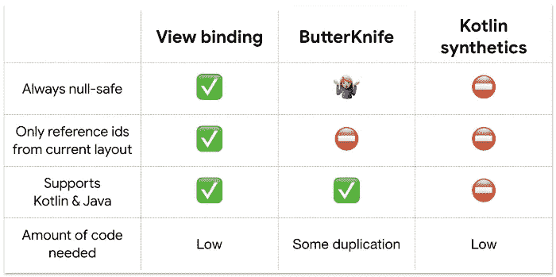

# Android 视图绑定—告别 findViewById()

> 原文：<https://medium.com/nerd-for-tech/android-view-binding-b9c49a3be2c4?source=collection_archive---------18----------------------->

Android 视图绑定使得编写与布局交互的代码变得很容易，也就是说，你可以很容易地从 java 文件中访问 XML 格式的布局，而不需要使用 findViewById()

视图绑定是在一个模块接一个模块的基础上启用的，在大多数情况下，它取代了编写 findViewById()的需要。我不确定任何人，但我总是发现为每个视图编写 findViewById()很乏味

# Android 视图绑定的优势

*   **更少的样板代码** 不需要重复编写 findViewById()，因此代码行更少。
*   **空安全** 在 findViewById()中提到错误的视图 id 并得到空指针异常是一个常见的错误。但是由于我们不再需要编写 findViewById()，这种错误已经成为过去。
*   **类型安全** 因为不需要 findViewById()并且绑定对象包含了所有具有正确类型的视图，所以不存在类型不匹配的情况。

***要启用此功能，请在应用程序级别梯度中进行以下更改-***

如果您想忽略一个布局文件，并且不想对该布局使用视图绑定，将`tools:viewBindingIgnore="true"`属性添加到该布局文件的根视图:

# 用法:让我们看看它的作用！！

绑定类的名称是通过将 XML 文件的名称转换为 camel 大小写并在末尾添加单词“binding”来生成的。
例如
如果布局的名称是 activity_main.xml，那么生成的绑定类名将是“ActivityMainBinding”

要设置绑定类的实例，需要对应用程序的活动进行以下更改

您可以通过以下方式使用 binding 类来引用任何视图

我应该将现有代码迁移到视图绑定吗？

这是你的个人选择，如果你对此感到满意，那么你可以继续重构你当前的代码，但是在我看来，根据视图绑定来转换你已经测试过的代码并没有太大的好处。

> 在新的班级中实施它将会有很大的好处，因为它将会对你的日常工作产生巨大的影响，你应该被鼓励去尝试它。

*暂时就这样吧！！
感谢阅读，别忘了分享给你的开发伙伴:)
这篇文章最初发布在 CodeTheraphy.com***。**

**更多文章关注我上* [*中*](/@nandishswarup) *和*[*CodeTheraphy.com*](https://www.codetheraphy.com/)*。
也可以在*[*LinkedIn*](http://www.linkedin.com/in/nandish-swarup)*上联系我。！！**