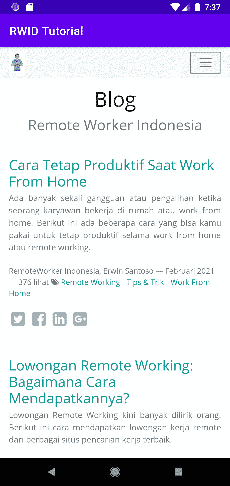
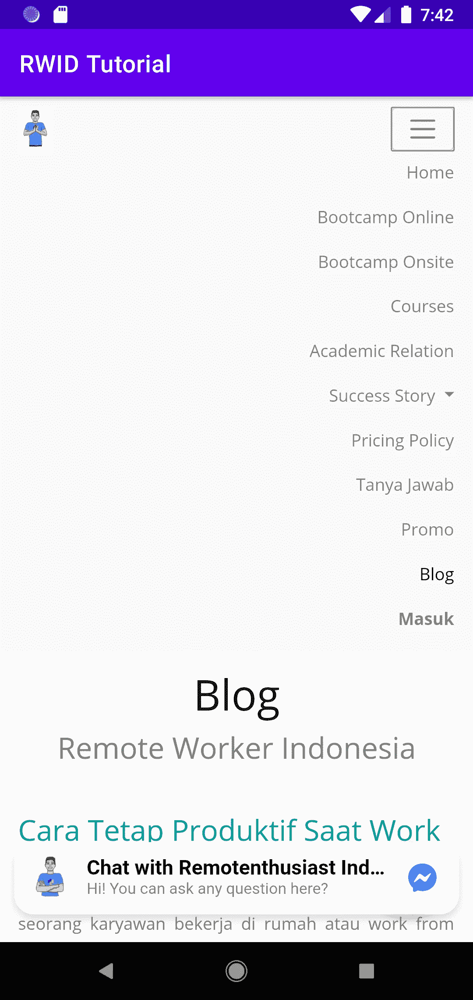
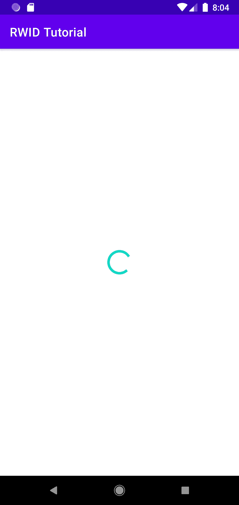
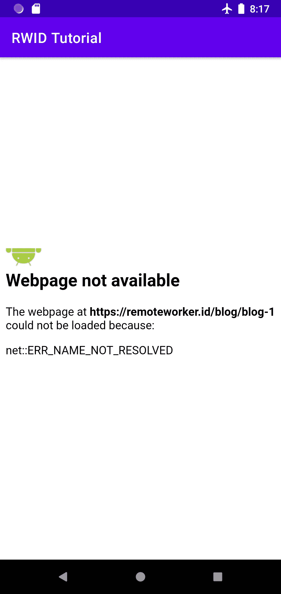
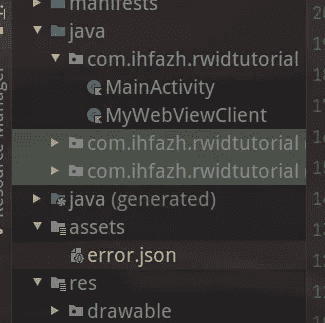
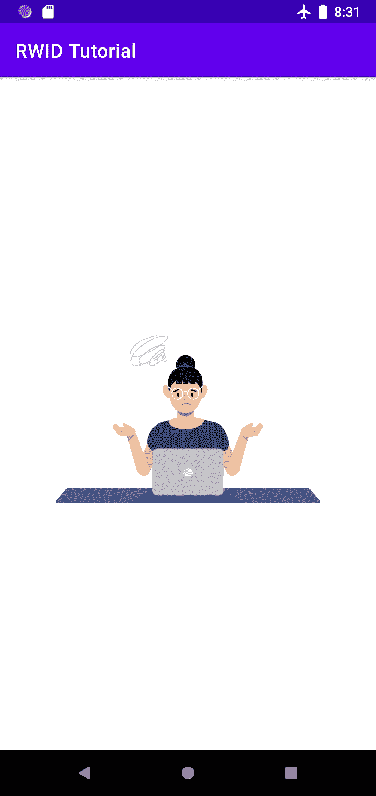

# Android WebView，使用 remoteworker.id 的研究案例|第 1 部分

> 原文：<https://medium.com/nerd-for-tech/android-webview-a-study-case-using-remoteworker-id-part-1-7cd1efe678cb?source=collection_archive---------4----------------------->

想象一下，你有一个网站，需要创建一个 android 应用程序，而你不需要花费额外的时间或金钱来构建它。你可以用 WebView 来处理。

WebView 的主要用途是显示网站。这里的 web 术语并不是唯一已经部署在互联网上的远程网站。还包括您在本地拥有的自定义 HTML/CSS/javascript。

在本教程中，我将教你如何使用 Kotlin 语言在 Android Studio 上使用 WebView 功能，并在其上添加一些提示和技巧。最终的应用程序将如下所示:

# 创建一个简单的 WebView

首先，您需要用一个新的空活动创建一个新项目。然后在“activity_main.xml”中定义“WebView ”,不要忘记为它添加一个 id。

然后，在 Kotlin 文件上，“MainActivity.kt”获取 WebView 并加载您的第一个网站。

接下来，在清单文件上添加 Internet 权限。

运行您的应用程序和 viola。您的第一个 WebView 已加载。恭喜你！

# 提示:使用 viewBinding

在编写视图代码时，您将会弄乱“findViewById”函数。使用 viewBinding 特性可以消除这种情况。要启用该功能，请打开模块的“build.gradle”文件。并将此添加到“android”块中:

不要忘记同步你的 Gradle 文件并使用 Ctrl+F9 构建你的应用程序。

接下来，在“MainActivity.kt”上，您可以将代码更改为:

构建您的应用程序并运行。没有变化，但它比多次调用' findViewById '更简洁。

# 激活 Javascript

现在，当你点击页面顶部的汉堡包按钮时，菜单并没有展开。这是因为如果启用了 javascript，菜单将会展开。

打开主活动文件，并添加

binding . webview . settings . JavaScript enabled = true

下面的“loadUrl”调用。

所以，主要的活动是这样的

太好了！您的页面现在是交互式的，您可以展开菜单，一个浮动按钮将会出现。

# 添加进度条

现在，当页面第一次加载时，您将看到一个白色页面。我知道这不是你和你的委托人需要的。你想通知用户，页面仍在加载。

是的，是时候给你的应用程序添加一个进度条了。

打开“activity_main.xml ”,并添加 ProgressBar。

创建一个名为“MyWebViewClient”的文件。扩展“WebViewClient”并重写某些方法。添加 progressBar 作为构造函数参数。

当页面已经显示时，将调用“onPageFinished”。所以，这是隐藏进度条的地方。

接下来，在 MainActivity 文件中添加

# 一些重构

您可以看到带有“binding.webview.xxx”的三行代码，我们可以使用 kotlin 的“with”子句重构它。

# 修复错误方案错误

让我们深潜。尝试单击浮动操作按钮。你看到了什么？完全没有动作。

您可以看到运行控制台，您会看到这样的错误

**chromium: [INFO:CONSOLE(0)]"混合内容:**页面

您可以通过添加来修复它

**settings . mixedcontentmode = web settings。混合内容兼容模式**

运行应用程序。啊，你仍然得到一个错误。网页不可用。 **net::ERR_UNKNOWN_URL_SCHEME。**

若要修复该错误，您应该重写 shouldOverrideUrlLoading 方法。检查 URL 是否匹配，您应该覆盖它，覆盖它，并返回 true。

这意味着 webview 不会处理它。

对于我们的问题，URL 方案是从` intent://`开始的

让我们处理它。

最终的 MyWebViewClient 是这样的

不要忘记修改 MyWebViewClient 初始化。

# 覆盖 onReceivedError

现在，试着关闭你的网络连接。然后，打开您的应用程序。

好吧，这不是你想要的，对吗？你需要向你的用户展示更多信息。

这里的要点是从“WebViewClient”中覆盖“onReceivedError”方法。然后，显示错误信息或动画，你决定。并显示另一页，以便不显示默认错误页。

# 安装洛蒂

将洛蒂添加到您的依赖项中

**实现' com . Airbnb . Android:Lottie:3 . 7 . 0 '**

还有，同步。

现在，是时候添加一些布局代码了。打开您的“activity_main.xml”。添加以下内容:

我们让 Lottie 自动播放，永远在线循环，并将文件名定义为 error.json。

error.json 在哪里？你可以在这里下载[https://lottiefiles.com/38463-error](https://lottiefiles.com/38463-error)。下载洛蒂 JSON。并将其放置在“资产”文件夹中。重命名为“error.json”。

error.json 位置

接下来，向 MyWebViewClient 添加一个名为 errorAnim 的新参数。当您收到错误主机查找时显示它。

不要忘记修改 MyWebViewClient 初始化。运行它。

# 处理历史记录

让我们试试后退按钮。点击链接。然后点击后退按钮。遗憾的是，当你需要返回文章列表时，应用程序关闭了。我们如何解决这个问题？？

打开 MainActivity 文件，覆盖 onBackPressed 方法。检查 webview 是否可以返回，然后返回。否则，打电话给超级。

# 摘要

恭喜你！您可以创建一个 webview 应用程序，并在 webview 上做一些小把戏。以下是你目前为止学到的东西:

*   创建简单的 webview
*   在 webview 中启用 javascript
*   处理混合内容
*   当用户点击浮动按钮时，通过重写 shouldOverrideUrlLoad 来处理打开的 fb-messenger
*   处理简单的 webview 错误
*   用户按 back 时的句柄。
*   并将洛蒂动画添加到您的应用程序中

下一部分再见。您将在片段的顶部学习 webview，并处理它的背面压力。

你可以在这里看到完整的代码

 [## ihfazhillah/rwid-教程-网络视图

### 此时您不能执行该操作。您已使用另一个标签页或窗口登录。您已在另一个选项卡中注销，或者…

github.com](https://github.com/ihfazhillah/rwid-tutorial-webview)