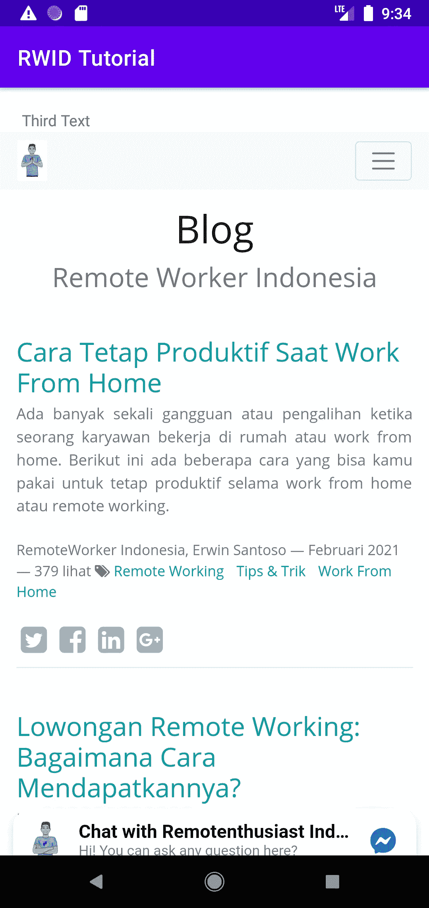
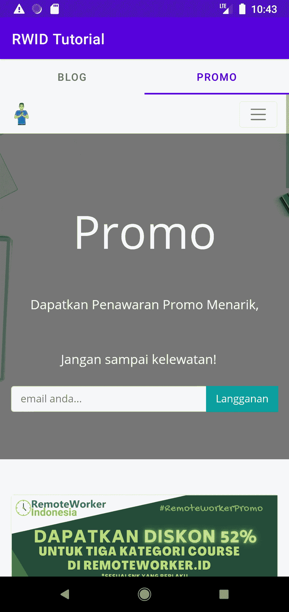

# Android WebView |第 2 部分:顶视图上的 WebView 第 2 页

> 原文：<https://medium.com/nerd-for-tech/android-webview-part-2-webview-on-top-viewpager2-639181e6d6f5?source=collection_archive---------1----------------------->

你之前的 webview 应用已经很棒了。但是，有时你需要使用另一种方法来处理。

例如，如果你想在片段内部使用 webview，而不是直接在 activity 上。

在这最后一部分，您将实现两个 webview，每个将打开不同的页面。你可以在它们之间左右滑动。您将利用 view page 2 和 TabLayout，修复使用 view page 2 时的垂直滚动问题，以及背部按压问题。

# ViewPager2，这是什么

当您需要在视图或片段之间进行幻灯片演示时，您可以使用 ViewPager2。ViewPager2 是 ViewPager 的后续版本，它有几个优点，您可以在文档中看到。是的，你可以得到它的更新。

# 实现简单视图页面 2

对于介绍，我们将在这里使用一个带有 ViewPager2 的简单视图。目标是使用 ViewPager2 显示几个文本，您可以滑动它们。

首先，右键单击 RES > Layout > new > Layout Resource File。将其命名为 simple_view.xml

接下来，修改“activity_main.xml”以匹配

若要使用 View 处理 ViewPager2，应使用扩展 RecyclerView.Adapter 的适配器。

创建一个 kotlin 文件，将其命名为 MyViewPagerAdapter，如下所示

打开 MainActivity.kt，并向 viewPager 添加一个适配器

运行它，祝贺你。您的简单 ViewPager2 已经完成。可以左右滑动。

看上面的文字。你可以向右滑动。

# 将 WebView 提取到片段中，并将其添加到 ViewPager2 中

这是令人兴奋的部分。我们需要创建两个网络视图，并确保我们可以左右滑动这两个。

第一步是创建一个片段，提取 webview，进度条，错误动画到里面。

创建名为“fragment_webview.xml”布局文件，将这三个文件移入其中。

创建 WebViewFragment.kt 文件，并将其填充如下

将 webview 初始化移到那里。因此，WebViewFragment 将如下所示:

现在，禁用 MainActivity 上的 onBackPressed 函数。

创建一个适配器来连接片段和 ViewPager。我们将扩展 FragmentStateAdapter。

打开 MyViewPagerAdapter，将其修改为 extends FragmentStateAdapter。

它说:建立 2 个页面，每个页面将显示 WebViewFragment。我们稍后会对其进行修改。

然后，修改 viewpager 的适配器

修改片段创建，并确保我们可以在每个 viewpager 上打开不同的页面。首先是博客，其次是推广。

在 createFragment 方法上修改 viewpager 的适配器

太好了！

# 修复滚动问题

不幸的是，当你试图向下滚动你的页面时，会有延迟。有时候，你会被扔到第二页或者第一页。是的，这是 ViewPager2 目前已知的问题。

要解决这个问题，您应该像这样扩展 ViewPager2:

并调用 reduceDragSensitivity。因此，viewpager2 将如下所示:

如需进一步解释，可阅读本页[https://gist . github . com/AlShevelev/ea 43096 e 8 f 66 b 0 EC 45 a 0 EC 0 D1 e 8 cacc](https://gist.github.com/AlShevelev/ea43096e8f66b0ec45a0ec0dd1e8cacc)

# 添加一个标签来通知用户他在哪里

目前，你的用户不知道他在哪里，也不知道这个页面是多个还是只有一个。

为了更好的体验，你应该通知用户他在哪里。一种选择是使用选项卡布局。

在 ViewPager2 上方的 activity_main.xml 中，添加以下代码

并将 view_pager 的顶部约束更改为底部选项卡布局

最后，使用 TabLayoutMediator 在选项卡布局和视图页导航之间进行连接。

# 将 WebView 处理回片段内部

差不多完成了，恭喜！

但是，当你打开博客部分，点击一个链接，然后按下返回按钮，应用程序关闭。您不能使用以前的解决方案，因为 webview 不直接在 MainActivity 上。现在在我的 MyViewPagerAdapter 上。

您将使用另一种解决方案！

*   从片段中公开 canGoBack 方法和 GoBack
*   从活动中调用这些方法。

打开 WebViewFragment，向其中添加 canGoBack 和 GoBack 方法，如下所示

打开 MainActivity 并修改 onBackPressed，如下所示

# 结论

恭喜你，你的长途旅行结束了。您已经创建了一个 webview 应用程序，在片段的顶部处理 back press。您还将学习如何在左右两个片段之间滑动，用一个标签连接它以获得更好的用户体验。

和往常一样，你可以在这里打开最终代码

 [## ihfazhillah/rwid-教程-网络视图

### 在 GitHub 上创建一个帐户，为 ihfazhillah/rwid-tutorial-webview 开发做贡献。

github.com](https://github.com/ihfazhillah/rwid-tutorial-webview)