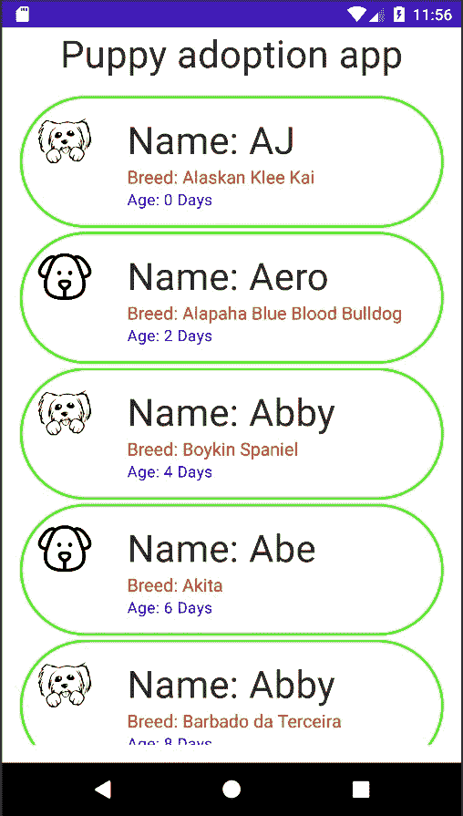
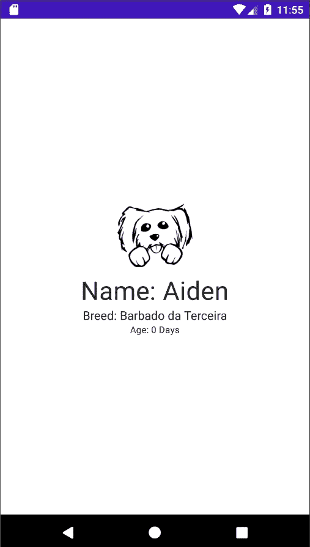
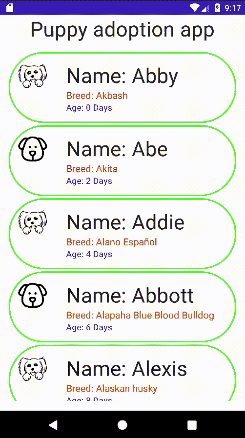
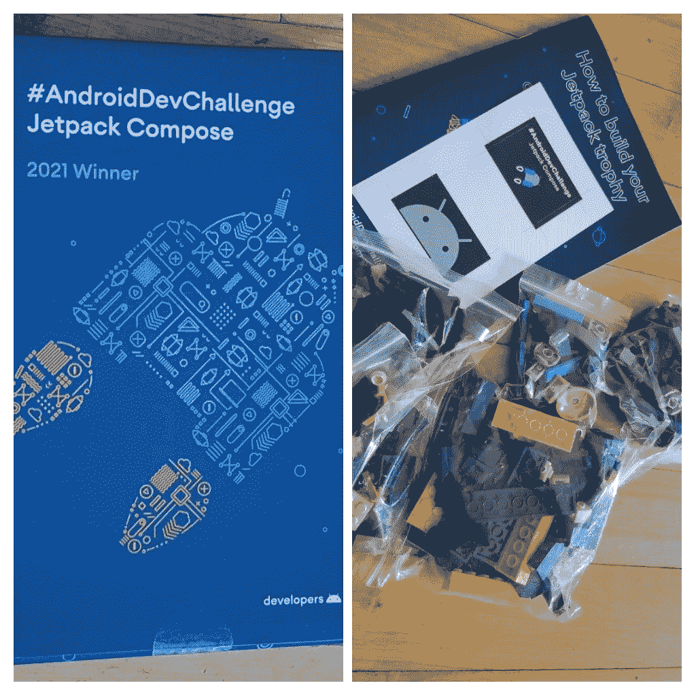

# AndroidDevChallenge 第 1 周-JetpackCompose

> 原文：<https://medium.com/nerd-for-tech/androiddevchallenge-week1-jetpackcompose-48971dee8bad?source=collection_archive---------22----------------------->


图像标题

今天和大家分享一下我打造**小狗的经历🐶领养 app****AndroidDevChallenge week 1。**

# 挑战的要求

> 应用程序的所有 UI 必须使用 Jetpack compose 编写。

## 我用来构建 UI 的主要组件如下

```
*NavHost, composable, Column, Image, Text, LazyColumn, Row, and Spacer*
```

**我创建了** `**data class called Pet**` **其中包含了** `**data**` **为每个** `**puppy item**`

*   他们没有与互联网的互动，所以我已经添加了模拟数据，为我们的应用程序创建静态宠物列表

```
data class Pet(
    val id: Int = 0,
    val name: String,
    val breed: String,
    val age: String
) {
    companion object {
        fun listOfPets(): List<Pet> {
            val list = *mutableListOf*<Pet>()
            *repeat*(21) **{** list.add(
                    Pet(
                        **it**,
                        name = listOfPetNames[**it**],
                        breed = listOfBreeds[**it**],
                        age = "${**it** * 2} Days"
                    )
                )
            **}** return list
        }

        private val **listOfPetNames** = *listOf*(
            "Abby", "Abe", "Addie", "Abbott", "Alexis", "Ace", "Alice",
            "Aero", "Allie", "Aiden", "Alyssa", "AJ", "Amber", "Albert",
            "Angel", "Aspen", "Andy", "Athena", "Angus", "Autumn", "Apollo",
        )
        private val **listOfBreeds** = *listOf*(
            "Akbash", "Akita", "Alano Español", "Alapaha Blue Blood Bulldog",
            "Alaskan husky", "Alaskan Klee Kai", " Alaskan Malamute",
            "Alopekis", "Austrian Black and Tan Hound", "Austrian Pinscher",
            "Azawakh", "Bakharwal dog", "Banjara Hound", "Barbado da Terceira",
            "Bosnian Coarse-haired Hound", "Boston Terrier", "Bouvier des Ardennes", "Boxer",
            "Boykin Spaniel", "Bracco Italiano", "Braque d'Auvergne",
        )
    }
}
```

**所有的 UI 都把**包装成`**Column**` 其中有 **2 个子**

```
*Column*(horizontalAlignment = Alignment.CenterHorizontally) **{
    // UI components goes here 
}**
```

# 应用程序标题组件

```
*Text*(
    text = "Puppy adoption app", 
    style = *typography*.h4, **// material design text style Headline4**
    textAlign = TextAlign.*Center*,
)
```

`**Composable**` 函数调用`**PuppyItem**`被定义为处理 **UI** 中用于**的每一个小狗项目。**

它需要两个参数`NavController`和`Pet`

```
@Composable
fun PuppyItem(pet: Pet, navController: NavController) {
}
```

*   **导航控制器**用于当用户点击列表中的任何小狗项目时导航到详细信息屏幕
*   `**Pet**`用于为 UI 组件的每一项提供数据

**这里的**是 `**PuppyItem function**`的 `**full code**`

```
@Composable
fun PuppyItem(pet: Pet, navController: NavController) {
    *Row*(
        Modifier
            .*clickable*(
                enabled = true,
                onClick = **{** navController.*navigate*("PuppyDetails/${pet.id}") **{
                    }** Log.d("TAG", "Puppy: ${pet.age}")
                **}** )
            .*border*(2.*dp*, color = Color.Green, shape = *CircleShape*)
            .*fillMaxWidth*()
            .*padding*(16.*dp*)
    ) **{** *Image*(
            painter = *painterResource*(
                when (pet.id % 2 == 0) {
                    true -> R.drawable.*dog2* else -> R.drawable.*dog_clip* }
            ),
            contentDescription = null,
            modifier = Modifier
                .*width*(48.*dp*)
                .*height*(48.*dp*),
            contentScale = ContentScale.Fit
        )
        *Spacer*(
            modifier = Modifier
                .*height*(48.*dp*)
                .*width*(32.*dp*)
        )
        *Column* **{** *Text*(
                text = "Name: ${pet.name}",
                style = *typography*.h4
            )
            *Text*(
                text = "Breed: ${pet.breed}",
                style = *typography*.body1.copy(color = Color.Red)
            )
            *Text*(
                text = "Age: ${pet.age}",
                style = *typography*.body2.copy(color = Color.Blue)
            )
        **}
    }** *Spacer*(
        modifier = Modifier
            .*height*(4.*dp*)
            .*fillMaxWidth*()
    )
}
```



小狗项目页面

**在** `**Row’s click**` 上，用户**导航**至**详细屏幕**

```
onClick = **{
    We have defined the NavHost which has 2 composable with route name defined** navController.*navigate*("PuppyDetails/${pet.id}") **// pet' id passed as argument to PuppyDetails page.
}**
```

`**NavHost**` 是我们 App 的**主要组件，帮助连接`**2 pages**`**

```
// Start building your app here!
@Composable
fun MyApp() {
    val navController = ***rememberNavController*()**
    ***NavHost***(navController, **startDestination = "PuppyList"**) **{
        *composable*(route = "PuppyList")** **{** *PuppiesListPage*(navController) **}
    }**
}
```

*   **startDestination** 它定义了应用的第一个屏幕。

`**Composable**` **用来定义** `**routes**`

```
*composable*(
    "PuppyDetails/{dogId}",
    arguments = *listOf*(navArgument("dogId") **{** type = NavType.*IntType* **}**)
) **{** backStackEntry **->** *PuppyDetailsPage*(backStackEntry.*arguments*?.getInt("dogId") ?: 0)
**}**
```

*   当用户点击宠物物品时，我们将点击的宠物物品的 **id 作为 `*argument of type int*` *传递给`*PuppyDetailsPage*` *，这有助于显示所选物品的详细信息。****

`**Composable**` **函数名为** `**PuppyDetailsPage**` **用来渲染为** `**details page**` **的 UI。**

```
@Composable
fun PuppyDetailsPage(dogId: Int) {
    *Column*(
        modifier = Modifier
            .*fillMaxWidth*()
            .*fillMaxHeight*(),
        verticalArrangement = Arrangement.Center,
        horizontalAlignment = Alignment.CenterHorizontally
    ) **{** *Image*(
            painter = *painterResource*(
                when (dogId % 2 == 0) {
                    true -> R.drawable.*dog2* else -> R.drawable.*dog_clip* }
            ),
            contentDescription = null,
            modifier = Modifier
                .*width*(100.*dp*)
                .*height*(100.*dp*),
            contentScale = ContentScale.Fit
        )

        *with*(Pet.listOfPets()[dogId]) **{** *Text*(text = "Name: $name", style = *typography*.h4)
            *Text*(text = "Breed: $breed", style = *typography*.body1)
            *Text*(text = "Age: $age", style = *typography*.caption)
        **}
    }** }
```



小狗详细信息页面

*   这就是使用 Jetpack compose 创建列表**所需的全部代码。**
*   如果你熟悉**recycle view，**你会惊讶地发现使用 Jetpack compose 创建列表非常容易，而且代码非常少。



应用程序输出

# 👨‍💻👏👏我希望你在这篇文章中了解到一点 Android 的新 UI 框架👏👏👨‍💻

# **在这次挑战中，我获得了喷气背包奖杯🏆 🎁**



礼物盒🎁

# 保持联系

[](https://github.com/navczydev) [## navczydev -概述

### GDG-蒙特娄 Android 开发者组织者。navczydev 有 83 个存储库可用。在 GitHub 上关注他们的代码。

github.com](https://github.com/navczydev)  [## 纳夫·辛格-作家-媒体| LinkedIn

### 在世界上最大的职业社区 LinkedIn 上查看 Nav Singh 的个人资料。Nav 列出了 7 个职位…

www.linkedin.com](https://www.linkedin.com/in/navczydev/) [](https://twitter.com/navczydev) [## JavaScript 不可用。

### 编辑描述

twitter.com](https://twitter.com/navczydev) 

# Github 回购

 [## navczydev/PuppyAdoptionApp

### Android dec 挑战赛第一周。在 GitHub 上创建一个帐户，为 navczydev/PuppyAdoptionApp 的开发做出贡献。

github.com](https://github.com/navczydev/PuppyAdoptionApp) 

# 参考

*   [**Android dev challenge**](https://developer.android.com/dev-challenge)
*   [**Jetpack 官方文档**](https://developer.android.com/jetpack)
*   [**Jetpack 作曲导航**](https://developer.android.com/jetpack/compose/navigation)