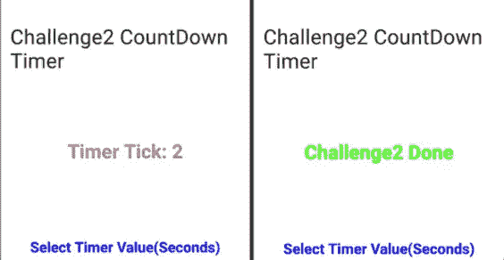
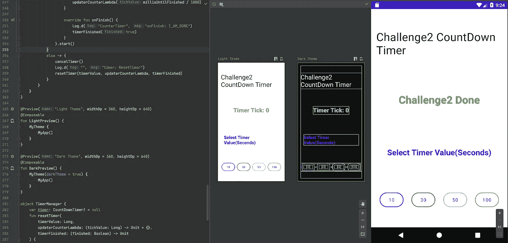
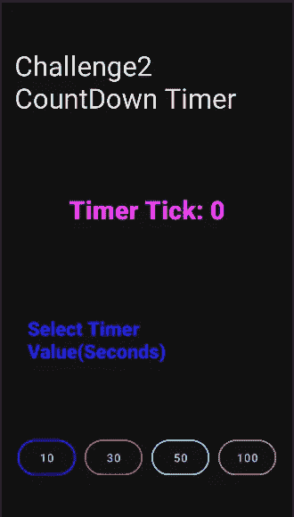
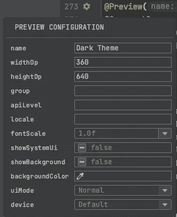
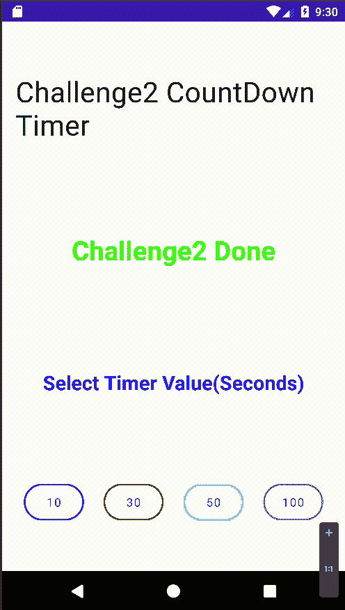

# Android dev 挑战赛第 2 周-在✈️航空公司创作

> 原文：<https://medium.com/nerd-for-tech/androiddevchallenge-week2-compose-on-air-%EF%B8%8F-d5dd75265b68?source=collection_archive---------16----------------------->


图像标题

今天和大家分享一下我的**建筑倒计时的经历⏰定时器第二周 JetpackCompose 的挑战。**

感谢 [**卡塔尔航空**](https://www.qatarairways.com/en-us/homepage.html) **🛩** 在我从蒙特利尔飞往多哈的航班上提供**超级 Wifi，🙌这有助于我按时完成这项挑战。**



应用程序的用户界面

# 挑战的要求

> 应用程序的所有 UI 必须使用 Jetpack compose 编写。

*   关于 **Jetpack compose** 的伟大之处在于，你可以**在 android studio 中预览 UI，而无需将你的应用部署到仿真器或设备上**。



Android studio 预览版中的 Jetpack 合成

## 我用来构建 UI 的主要组件如下

```
*Column,*Text, *Row, Spacer, TextButton, animateColorAsState, remember, mutableStateOf*
```

*   **所有的 UI 组件都包裹在**中`**Column**`

*   **App 标题组件**


标题截图

*   显示定时器值更新的标签使用`timerFinished`标志和保存状态的`counterValue`来相应地更新 UI 标签。

*   **这里是** `**timerFinished**` **旗和** `**counterValue**`的代码

当我们使用**创建属性/变量时，compose observe 那些属性，只重组依赖的 UI 组件。**

*   ***最后一个组件是** `**Row**` **用来装** `**4 TextButtons**`*

**

*按钮截图*

*   ***这里是**的代码`**Button**`*

*   *借助几乎所有组件都具有的`modifier`属性，您可以对组件应用样式。*

*   ***处理应用程序状态的逻辑***

*每个按钮`onClick`的 **timer()** 函数被调用*

*例如，当用户**点击文本为 10** 的按钮时，使用以下参数调用`timer()`函数:*

*   *`**timer()**` **方法***

*   *在`@Preview annotation`的帮助下，你可以通过提供不同的配置为你的用户界面创建多个预览*

**

*深色主题预览*

*   *点击显示在`@Preview annotation`前面的⚙图标，通过**打开**预览配置对话框**，可以提供**配置给预览*****

**

*预览配置对话框*

# *演示:*

**

*演示 gif*

# *👨‍💻👏👏我希望你在这篇文章中了解到一点 Android 的新 UI 框架👏👏👨‍💻*

# *为了这次挑战，我收到了喷气背包抽奖箱🎁*

**

*礼物盒🎁*

# *Github 回购*

 *[## navczydev/JetpackCountdownTimer

### 安卓喷气背包挑战周 2。通过在…上创建帐户，为 navczydev/JetpackCountdownTimer 的开发做出贡献

github.com](https://github.com/navczydev/JetpackCountdownTimer)* 

# *保持联系*

 *[## 纳夫·辛格-作家-媒体| LinkedIn

### 在世界上最大的职业社区 LinkedIn 上查看 Nav Singh 的个人资料。Nav 列出了 7 个职位…

www.linkedin.com](https://www.linkedin.com/in/navczydev/)* *[](https://github.com/navczydev) [## navczydev -概述

### GDG-蒙特娄 Android 开发者组织者。navczydev 有 83 个存储库可用。在 GitHub 上关注他们的代码。

github.com](https://github.com/navczydev) [](https://twitter.com/navczydev) [## JavaScript 不可用。

### 编辑描述

twitter.com](https://twitter.com/navczydev) 

# **参考文献**

[](https://developer.android.com/dev-challenge) [## 开发挑战| Android 开发人员

### 在接下来的四周里，#AndroidDevChallenge 将帮助你了解 Jetpack Compose，Android 的现代工具包…

developer.android.com](https://developer.android.com/dev-challenge) [](https://developer.android.com/jetpack/compose?gclid=Cj0KCQjw1PSDBhDbARIsAPeTqrdlZQ6baifCYtcuqOhELG-Pbqn2Rr8dcTq4GY4IOCWzds7tL96pkeYaAurNEALw_wcB&gclsrc=aw.ds) [## Jetpack Compose | Android 开发者

### Jetpack Compose 是 Android 用于构建原生 UI 的现代工具包。它简化并加速了在…上的 UI 开发

developer.android.com](https://developer.android.com/jetpack/compose?gclid=Cj0KCQjw1PSDBhDbARIsAPeTqrdlZQ6baifCYtcuqOhELG-Pbqn2Rr8dcTq4GY4IOCWzds7tL96pkeYaAurNEALw_wcB&gclsrc=aw.ds)*