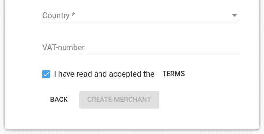
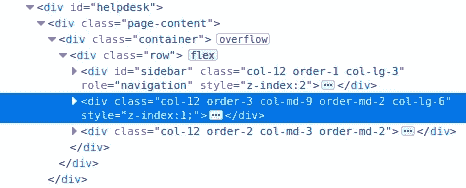
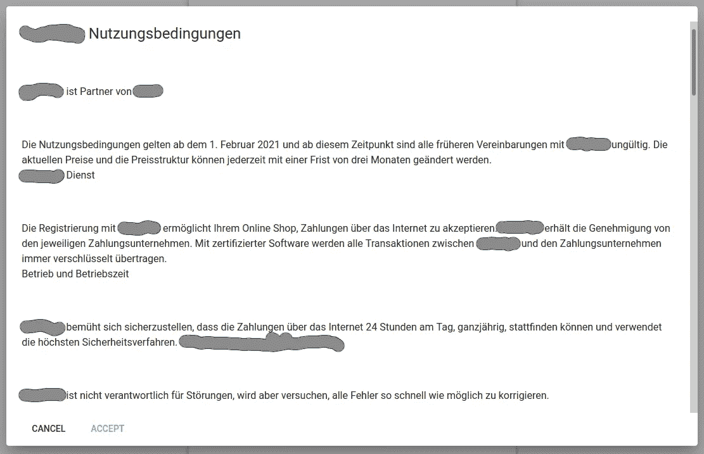

# Angular 11:在自己的网站中插入外部 HTML 网络抓取

> 原文：<https://medium.com/nerd-for-tech/angular-11-insert-external-html-in-your-own-website-web-scraping-ff78f2540c4b?source=collection_archive---------2----------------------->

我想我会试着与你分享一个有趣问题的小解决方案(注意我是如何与“你”分享的——如果你在这里，我欢迎你并很高兴能够帮助你——如果你不在这里，没有人会注意到我使用了“你”这个词)。聪明呵；)

前几天，我们不得不在入职表格中加入新的条款。问题是，这些条款是在一个外部网站上托管的。我们的网站是在 Angular 11 中建立的，这似乎是一个可以在几秒钟内完成的小问题。如果你忽略了 UX 的部分。



第一个建议仅仅是一个指向 URL 的 a 元素，其中包含:

```
<mat-checkbox [checked]=”accept” (change)=”accept = !accept”>
  {{ ‘I have read and accepted’ | translate }}
</mat-checkbox>
<a href=”https://your/external/terms/” target=”_blank”>
  {{ ‘terms’ | translate }}
</a>
```

这样做的主要问题是，您的用户现在在入职过程中被抛到外部网站。此外，没有简单的方法回来；您不能在外部页面上选择“接受”,您必须再次手动关闭页面并返回表单，等等。只是不是好 UX。

**解决方案—网页抓取**

为什么不从外部网站抓取条款文本，并将其插入到一个模态中？就这么办吧。

首先，我们需要知道我们要去哪里，要得到什么。“在哪里”只是网站的网址。

我们将使用 async/await(我相信是 ES7)并首先获取整个网页 HTML:

```
(async () => {
  const response = await fetch('https://your/external/terms/');
  const text = await response.text();
  console.log(text);
})();
```

然后控制台将打印出所有的 HTML——但是有一个条件:这是一个字符串！
提示:您可以直接在浏览器中完成此操作，方法是转到外部 URL，在开发人员工具中打开控制台，粘贴上述代码，然后点击“Enter”:

对于“什么”,请访问该网站，右键单击文本并选择“检查元素”。这就是我的情况:



蓝色标记的 DIV 是我需要的。我能直接处理的最接近的东西是带有 ID="sidebar "的兄弟 DIV，所以让我们试试。

我们在这里面临的挑战是，我们不能在字符串格式的 HTML 中导航——我们需要一个 DOM，所以让我们将字符串“还原”成 HTML。

我选择了一个使用和维护良好的 npm 包`node-html-parser`，并将`import { parse } from ‘node-html-parser';`添加到我的组件中。所以让我们把它付诸实践。

```
(async () => {
  const response = await fetch('https://your/external/terms/');
  const text = await response.text();
  const terms = parse(text);
})();
```

`terms`现在是转换成 HTML 的字符串，我们现在可以遍历它，所以我们将取出 DIV `#sidebar`，转到下一个兄弟节点并获取内部 HTML。

```
htmlTerms: string;(async () => {
  const response = await fetch('https://your/external/terms/');
  const text = await response.text();
  const terms = parse(text);
  this.htmlTerms = terms.querySelector('#sidebar').nextElementSibling.innerHTML;
})();
```

首先，我们用 response.text()将所有的 HTML 作为一个字符串取出，但是为了得到有趣的部分，我们用 parse(text)将它解析回 HTML，并用`terms.querySelector('#sidebar').nextElementSibling.innerHTML;`遍历这个新创建的 DOM。
现在您又有了一个包含您需要的确切内容的字符串，并且可以使用属性`htmlTerms`将它直接放在您自己的组件视图中。

请注意，Angular 内置于 XSS，你可能需要更多的操纵比上面显示的。此外，如果外部网页与您的抓取代码相关的更改，您将失去 HTML。因此，为了以防万一，你可能需要一些错误处理；)

我为术语选择了一个交互模式(德语；)但是你想怎么实现就怎么实现。



你当然可以操纵代码或添加你自己的风格(或他们的风格)，但你操纵得越多，如果原来的网站被改变，就越容易崩溃，所以我更喜欢 KISS。

玩得开心。