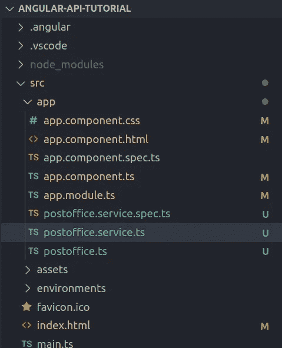
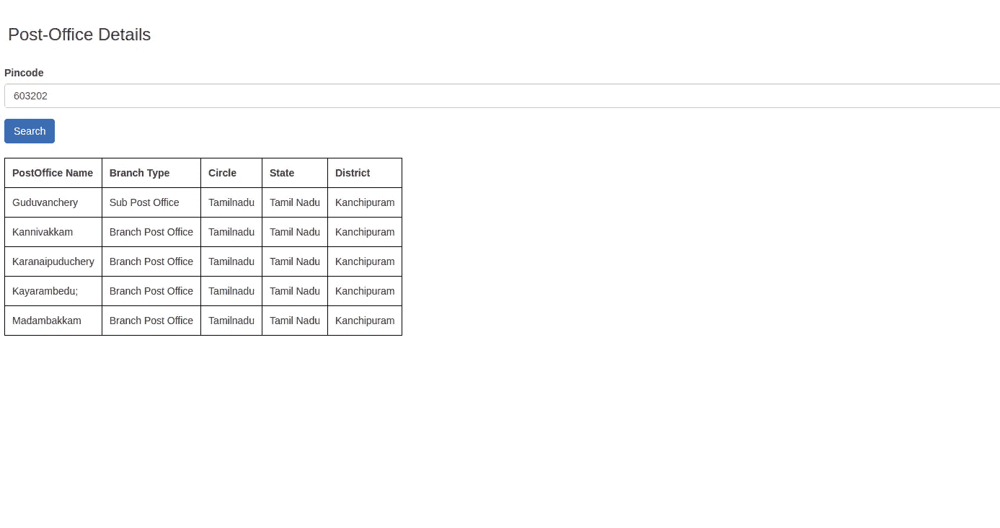
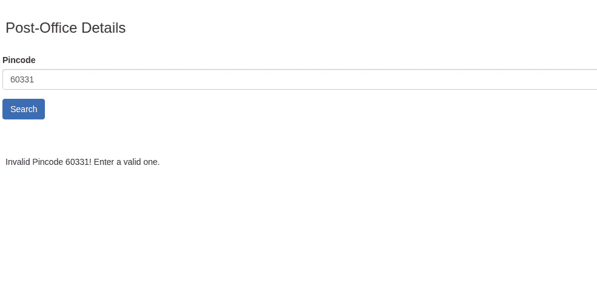

# Angular API 教程

> 原文：<https://medium.com/nerd-for-tech/angular-api-tutorial-d87f538ac33c?source=collection_archive---------0----------------------->

Angular 是基于 TypeScript 的开源 web 应用程序框架，用于构建移动和桌面 web 应用程序。在本教程中，我们将构建一个简单的 angular 应用程序，它将获取并显示一个地区中特定邮局的详细信息。

## 项目设置

首先，让我们使用以下命令创建一个新的角度应用程序:

> ng 新角度-API-教程

在您最喜欢的文本编辑器中打开项目。

现在，让我们创建一个模型来支持邮局详细信息的检索。

接下来，让我们创建一个名为 **'postoffice.service.ts'** 的服务，编写一个名为' getPostOfficeDetails()'的方法并执行一个 HTTP GET 请求。

> 香港邮政总局

接下来，前往 app.component.html 的**，创建一个基本表单，如下所示:**

从上面的代码可以明显看出，当用户单击“Search”按钮时，onSearch()方法被调用。现在，让我们在 **app.component.ts** 文件中定义这个方法。此外，我们需要将我们创建的服务(postoffice.service.ts)注入到这个组件中。

现在，要构建应用程序(在开发模式下)并在活动服务器中打开它，请执行以下命令:

> 发球——开放式

申请成功完成🥳.不同场景的截图如下所示。

有效密码

无效的密码

本教程到此结束。代码可在 [GitHub](https://github.com/smv1999/angular-api-tutorial) 上获得。感谢阅读！编码快乐！

如果您有任何疑问，请在下面的**评论**部分发帖。在 [LinkedIn](https://www.linkedin.com/in/vaidhyanathansm/) 上与我联系。此外，如果你想看看我开发的惊人的应用程序集，别忘了查看谷歌 Play 商店。

了解我更多[在这里](http://vaidhyanathansm.netlify.app/)。