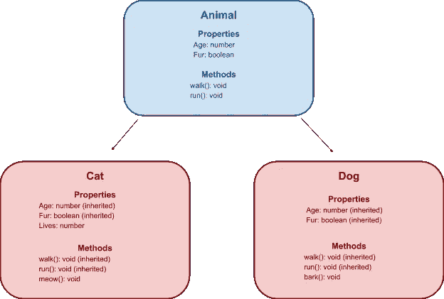

# 角容器和继承

> 原文：<https://medium.com/nerd-for-tech/angular-containers-and-inheritance-ac0f9a903a6d?source=collection_archive---------1----------------------->

## 增强你的棱角结构


Joshua Fuller 在 [Unsplash](https://unsplash.com?utm_source=medium&utm_medium=referral) 上拍摄的照片

我曾经以如下方式将服务传递给组件的构造函数:

```
import {MyServiceA} from './myServiceA';
import {MyServiceB} from './myServiceB';
import {MyServiceC} from './myServiceC';

export class MyComponent {
  constructor(
    **private myServiceA:MyServiceA, 
    private myServiceB:MyServiceB, 
    private myServiceC:MyServiceC**) {}
}
```

这很好，但当你的应用程序增长时，你可能会考虑一种不同的方法，使你的架构更具可扩展性。让我们创建一个基础组件，或者所谓的容器，它将包含全局注入器。这个文件可以命名为`featureA.base.container.ts`

顾名思义，这个组件将作为其他组件的基础。在 OOP(面向对象编程)中，我们可以有一个动物类，它有年龄和皮毛等属性，其他类(狗、猫)可以继承这些属性。



来源:[爱上角分量遗传的 4 个理由](https://www.bitovi.com/blog/4-reasons-to-fall-in-love-with-angular-component-inheritance)

与我们将服务作为参数传递给构造函数的第一个代码片段不同，我们可以从 Angular core 导入`Injector`并传递它。然后使用`get`方法我们可以检索其他服务的实例。下面是它的样子(调整后的片段来自:[继承和依赖注入](https://stackoverflow.com/questions/39038791/inheritance-and-dependency-injection)

```
// featureA.base.container.ts**import {Injector} from '@angular/core';**
import {MyServiceA} from './myServiceA';
import {MyServiceB} from './myServiceB';
import {MyServiceC} from './myServiceC';

export class BaseComponent {
  protected myServiceA:MyServiceA;
  protected myServiceB:MyServiceB;
  protected myServiceC:MyServiceC; sharedProperty: boolean;constructor(**injector: Injector**) {
    this.myServiceA = **injector.get(MyServiceA)**;
    this.myServiceB = **injector.get(MyServiceB)**;
    this.myServiceC = **injector.get(MyServiceC)**;
  }
}
```

下面是如何在子组件中使用它。我们必须`extend`使用这些服务的组件。记住，如上图所示，这也是关于共享属性和方法的。

```
export MyComponent **extends BaseComponent** {
  constructor(**injector: Injector**) {
    **super(injector);**

    this.myServiceA.JustCallSomeMethod();
    this.myServiceB.JustCallAnotherMethod();
    this.myServiceC.JustOneMoreMethod(); this.sharedProperty = true;
  }
}
```

我们再次使用注入器和调用父构造函数的`super(injector)`关键字。

> [super](https://developer.mozilla.org/en-US/docs/Web/JavaScript/Reference/Operators/super) 关键字用于访问对象文字或类的[[Prototype]]的属性，或者调用超类的构造函数。

最初看起来似乎有更多的东西需要定义，但是如果你有许多服务和一些属性想要在组件之间共享，你可以简单地继承它们，我认为这仍然是非常清晰和通用的解决方案。当然，您可以更深入地创建几个抽象层。我们创建的基本容器可能是`extend`，例如 CommonComponent 等。

在[Designing Angular architecture 中描述了一个类似的模式——容器表示模式](https://indepth.dev/posts/1478/designing-angular-architecture-container-presentation-pattern)，其中输入和输出装饰器用于在组件之间传递数据。不管您选择什么样的模式，我希望这篇文章对您有用。