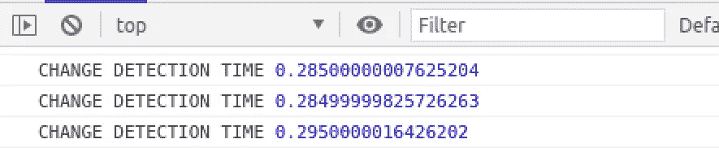

# 棱角分明:不要赤手空拳去战斗

> 原文：<https://medium.com/nerd-for-tech/angular-dont-go-to-battle-unarmed-813ab0d3cb4f?source=collection_archive---------8----------------------->

## 将改进任何角度项目的工具集合

一个好的士兵总是在去战斗之前确保他有合适的武器，同样的道理也适用于一个开发人员，他在开始一项新任务之前需要合适的工具。


在这篇文章中，我将与你分享一些工具，它们将使你的编码更高效、更负责、更清晰。

# 1.性能:“记忆”和变更检测日志

## Lodash 装饰公司“memoize”

正如你所知道的，当你在你的模板中调用一个函数时，它会在每次变化检测时被触发。如果函数运行一些“繁重”逻辑，可能会导致性能问题。

有几种解决方案可以避免这种情况:

1.将该功能转移到一个纯管道中——但是为每个用例编写一个新管道可能会很烦人。

2.将函数编写为内联代码，类似于:

```
[class.some-class]="firstVar === 'good' && (secondVar ==='1' | thirdVar === '2')"
```

这很好，但它使模板代码非常难看，我更喜欢我的所有逻辑都放在' component.ts '文件中。

我建议您使用另一种解决方案，即在模板中使用常规函数，但使用 memoize decorator。

Memoize 的工作原理类似于管道。它所做的是为函数接受的每个输入创建一个哈希键并缓存结果，如果该键重复，它将恢复缓存结果。

```
install:
npm i lodash-decorators --save
```

对于只有 1-0 个参数的函数，您可以使用:

对于采用多个参数函数，请使用:

*注意事项*:

1.  注意函数中的一些内部状态会导致不同的输出。
2.  尽量只使用基本类型，因为对象和数组是通过引用缓存的。
3.  你可以从这个库中使用其他有用的装饰器，比如:去抖，节流等等。

## 更改检测日志

我在开发时总是确保运行这个技巧，它让我意识到我的应用程序中的变更检测周期以及每个周期花费了多少时间。当您集成了一些第三方软件，并想看看它会引起什么样的变化检测时，这是特别有用的。

要实现这一点，请使用以下配置，确保这段代码只在 develop 中执行(我使用' isDevelopment '标志) :

然后，您将在控制台日志中看到以下内容:



# **2。单元测试:SpyHelper**

是一个助手类，它将使你的项目中的模拟服务变得轻而易举。

在项目中定义以下类:

对于基本用法，您只需要模拟类:

如果您确实需要模拟服务中的某些逻辑，您可以执行以下操作:

# 4.自定义验证类

将所有自定义验证放在一个类中，然后就可以像使用内置验证一样使用它。

这样做的另一个好处是，您可以共享逻辑 bettwen 验证功能。

# **4。通用安全管道**

当我需要向模板注入一些不安全的代码时，这是我经常使用的一个常用管道。

创建以下管道:

用法:

```
<div [innerHTML]="previewHtml | safe: 'html'"></div>
```

# 如果你错过了:

*   Angular 新项目配置:[https://tal-gershman . medium . com/angular-New-Project-boilerplate-workspace-unit-testing-pre-commits-hooks-custom-library-eslint-FCC 40873698 a](https://tal-gershman.medium.com/angular-new-project-boilerplate-workspace-unit-testing-pre-commits-hooks-custom-library-eslint-fcc40873698a)

**感谢阅读！如果你有任何问题，请在评论中告诉我。**