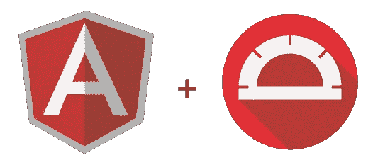
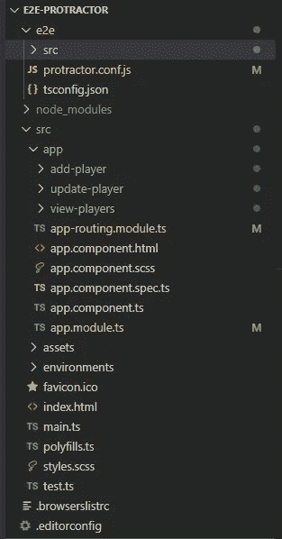
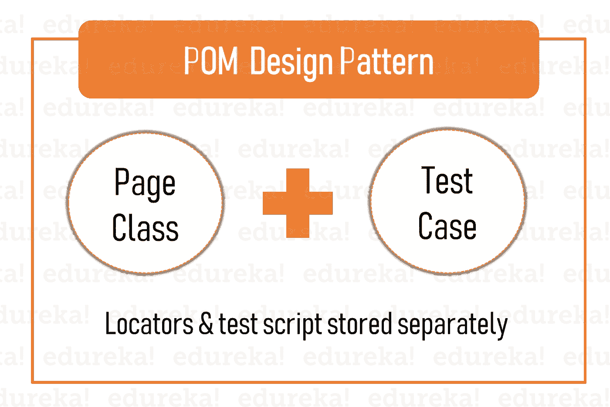
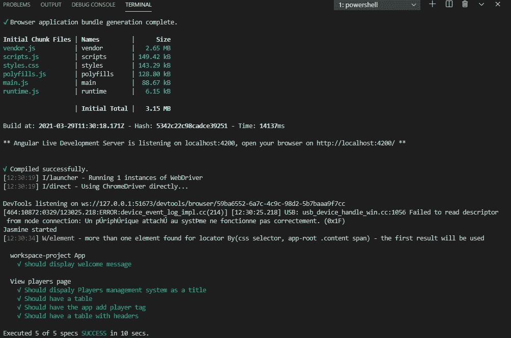
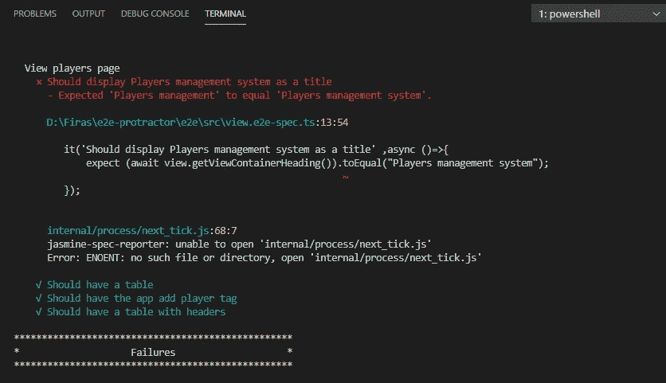

# 使用量角器和 Jasmine 进行角度端到端(E2E)测试

> 原文：<https://medium.com/nerd-for-tech/angular-end-to-end-e2e-testing-using-protractor-and-jasmine-dbedea91cbc?source=collection_archive---------1----------------------->

测试是软件开发生命周期中最重要的阶段之一，也是最容易被忽视的阶段。它有助于减少系统中出现缺陷的机会。

顾名思义，E2E(端到端)就是从头到尾测试应用程序。它将测试我们的应用程序的行为，用户界面以及他们对需求的尊重程度。



## E2E 测试和单元测试的区别

单元测试用于确保应用程序的服务和组件的行为符合预期(通常是服务和组件的逻辑)。而 e2e 确保应用程序的高级功能(例如 UI)如**预期的那样**工作。

## 量角器和茉莉

在本教程中，我们将使用量角器和茉莉作为我们的 e2e 测试工具。

**量角器**是一个端到端的测试框架，用于角度和角度应用。量角器对运行在真实浏览器中的应用程序进行测试，像用户一样与之交互。

量角器提供了一个非常大的 API，我们将使用它进行 e2e 测试，这些是主要的 API:

*   **browser()** :带来导航、调试等所有浏览器级别的操作。
*   **element():** 用于根据搜索条件或条件链在 DOM 中查找元素。它返回一个 ElementFinder 对象，您可以对它们执行诸如`getText()`或`click()`之类的操作。
*   **by.css()，by.name()，by.buttonText():** 基于 css 选择器、名称属性或按钮文本查找元素的定位符。

**Jasmine** 是一个行为驱动的开发框架，用于测试 JavaScript 代码。它不依赖于任何其他 JavaScript 框架。它不需要 DOM。它有一个清晰、明显的语法，所以你可以很容易地编写测试。

在本教程中，我们将更多地关注量角器，我们的 e2e 测试框架，但我们必须介绍一些 Jasmine 语法，因为量角器依赖它来运行测试。

Jasmine 有 3 个全局函数，我们将在整个教程中使用，下面的测试用例将帮助我们更好地理解这些函数:

```
describe("A suite is just a function", **function**() {
  **var** a;

  it("and so is a spec", **function**() {
    a **=** **true**;

    expect(a).toBe(**true**);
  });
});
```

*   **describe():** 是全局 jasmine 函数，有两个参数:一个字符串和一个函数。字符串是一个规范套件的名称或标题——通常是被测试的内容。该函数是实现套件的代码块。
*   it() : 它是定义规范的函数，就像`describe`接受一个字符串和一个函数。字符串是规范的标题，函数是规范或测试。
*   **expect():** 茉莉中的期待是一个或真或假的断言。一个包含所有真实期望的规范是一个合格的规范。一个有一个或多个错误期望的规范是一个失败的规范。
*   **beforeEach()** 和 **afterEach()** :顾名思义，`beforeEach`函数在被调用的`describe`中的每个规范之前被调用一次，`afterEach`函数在每个规范之后被调用一次。

这些是著名的 jasmine 函数，也是我们需要的函数。

为了更深入地了解茉莉，我建议跟随这个课程[https://jasmine.github.io/2.4/introduction.html](https://jasmine.github.io/2.4/introduction.html)。

## 配置量角器

假设现在我们已经熟悉了 jasmine 语法，我们将开始在一个真实的应用程序(球员管理系统的 CRUD 应用程序)中使用 protratcor。

我们将创建 3 个组件，稍后将进行测试:

*   查看玩家:显示所有玩家
*   AddPlayer:添加新玩家
*   更新播放器:更新现有的播放器。

要安装量角器，我们只需运行以下命令:

```
npm install protractor
```

这是我们项目的结构:



我们可以看到，当我们安装量角器时，我们有一个自动生成的 e2e 文件夹。

在这个文件夹中，我们将编写我们的 e2e 测试。

## **页面对象模型(POM)**

如果我们看一下 e2e 文件夹，我们会注意到除了量角器配置文件之外，我们还有两个附加文件:一个 app.e2e-spec.ts 文件(appComponent 的测试文件)和另一个 app.po.ts

那么后一个文件是什么呢？

这个文件是名为 PageObject 的类型脚本文件，这是一种在测试自动化中流行的设计模式，用于增强测试维护和减少代码重复。page 对象是一个面向对象的类，用作应用程序页面的接口。在这个页面对象中，我们将获取测试中使用的元素(表格、标题、按钮、输入等)，并在以后的规范文件中使用它们。



## 测试 viewPlayers 组件

在本教程中，我们将使用 viewPlayers 组件来运行我们的测试(您将在 git 存储库中找到与其他组件相关的其余测试)

为了更好地组织我们的测试架构，让我们创建一个 page-object 文件夹，并创建一个文件 **main.po.ts** ，该文件将具有其他 page-objects 类和 **view.po.ts** 之间的共享方法，并从其中扩展并获取 viewPlayers 的元素

**主要订单**

```
import { browser, by, element, promise, ElementFinder } from 'protractor';export class Main{navigateToHome():promise.Promise<any> {return browser.get('/');}/* Mock data for creating a new Player and editing existing Player */getMockPlayer(): any {let player: any = { name: "SALAH",age: "28",club: "LIVERPOOL",country:'EGYPT'}return player;}getEditedMockPlayer(): any {let player: any = {"name":'RONALDO','age':'36','club':'JUVENTUS','country':'PORTUGAL'}return player;}/* Methods shared by addPlayer and updatePlayer */getInputName():ElementFinder {return element(by.name("name"));}getInputAge(): ElementFinder {return element(by.name("age"));}getInputClub(): ElementFinder {return element(by.name("club"));}getInputCountry(): ElementFinder{return element(by.name("country"));}}
```

**查看订单**

```
import { promise, by, ElementFinder, ElementArrayFinder, element } from "protractor";import { Main } from "./main.po";export class View extends Main {getViewContainer():ElementFinder {return element(by.css('.container'));}getViewContainerHeading(): promise.Promise<string> {return this.getViewContainer().element(by.css("h2")).getText();}/*Table Data */getTable():ElementFinder {return element(by.css('table'));}getTableHeader(): promise.Promise<string> {return this.getViewContainer().all(by.tagName('tr')).get(0).getText();}getTableRow(): ElementArrayFinder {return this.getViewContainer().all(by.tagName('tr'));}getFirstRowData(): promise.Promise<string> {return this.getTableRow().get(1).getText();}getLastRowData(): promise.Promise<string> {return this.getTableRow().last().getText();}getAddPlayerTag(): ElementFinder {return this.getViewContainer().element(by.tagName('app-add-player'));}isAddPlayerTagPresent(): promise.Promise<boolean> {return this.getAddPlayerTag().isPresent();}}
```

现在我们已经准备好了页面对象的代码，让我们将它导入到我们的规范中。以下是我们的 viewPlayers 测试代码:

```
import { browser, protractor } from 'protractor';import { View } from './page-objects/view.po';describe ('View players page', ()=>{const view: View = new View;// executed before each specbeforeEach( async ()=>{await view.navigateToHome();});it('Should display Players management system as a title' ,async ()=>{expect (await view.getViewContainerHeading()).toEqual("Players management system");});it ('Should have a table ', async () => {expect(await view.getTable()).toBeTruthy();});it('Should have the app add player tag', async () => {expect(await view.getAddPlayerTag()).toBeTruthy();})it('Should have a table with headers ', async () => {expect (await view.getTableHeader()).toContain('NAME AGE CLUB COUNTRY');})})
```

上面测试的场景是:

*   玩家应该显示玩家管理系统作为标题
*   应该存在一个表
*   app-add-player 选择器应该存在
*   表格应该有标题(姓名、年龄、俱乐部、国家)

现在一切都设置好了，让我们通过运行以下命令来尝试一下:

```
ng e2e
```

我们可以在后面看到，我们所有如此巨大的测试都成功地通过了:



现在，让我们回到我们的 viewPlayers 组件，将标题更改为与测试中不同的名称，并再次运行命令:

我们可以看到标题标题的测试失败了。



这就是 E2E 测试的重要性所在，这是我们可以确保我们的前端(UI)与需求相匹配的地方。

最后，让我们总结一下到目前为止我们所做的工作:

*   我们已经看到了 E2E 测试的重要性以及单元测试之间的区别。
*   量角器 API 和 jasmine 语法
*   页面对象模型
*   使用量角器测试播放器组件。

我希望所有的事情都足够清楚，并且在阅读完这篇文章之后，你们都可以开始为你们的应用程序编写测试，因为正如我们在开始时所说的，测试是软件开发生命周期的一个主要步骤。

你可以在 git 责任区找到其余的测试。

[](https://github.com/FirasMessaoudi/angular-e2e-testing) [## FirasMessaoudi/角度 e2e 测试

### 此项目是使用 Angular CLI 版本 11.2.1 生成的。为开发服务器运行 ng serve。导航到…

github.com](https://github.com/FirasMessaoudi/angular-e2e-testing) 

别忘了鼓掌并在评论区留下你的反馈。