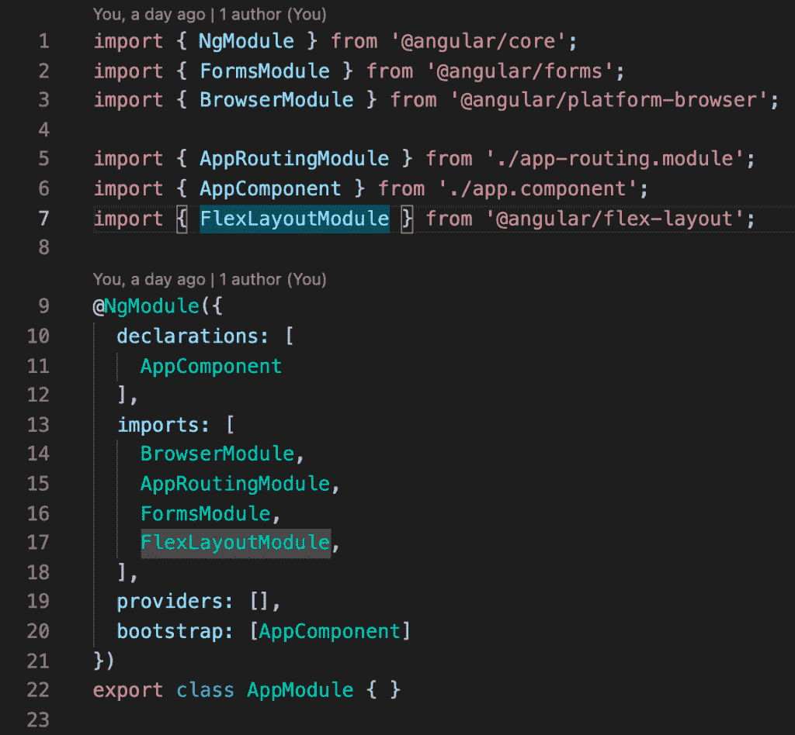
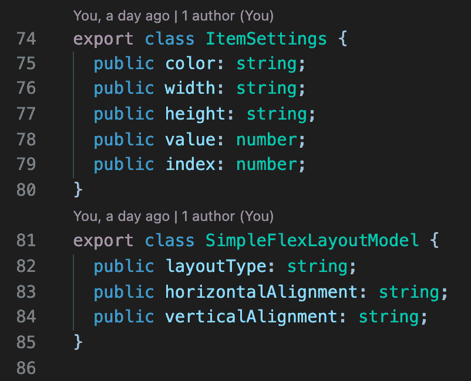
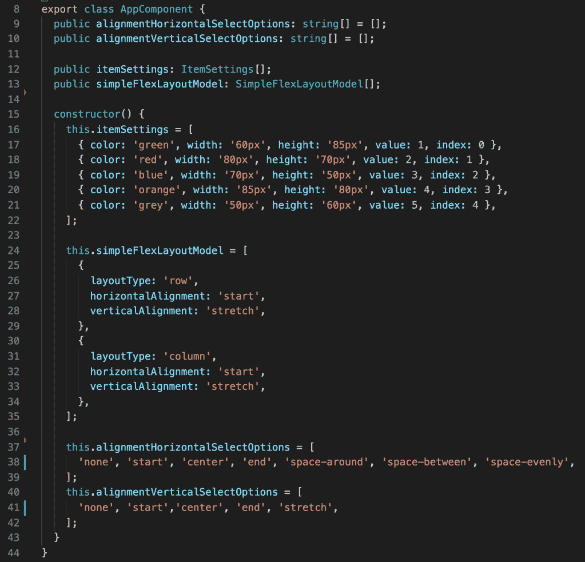
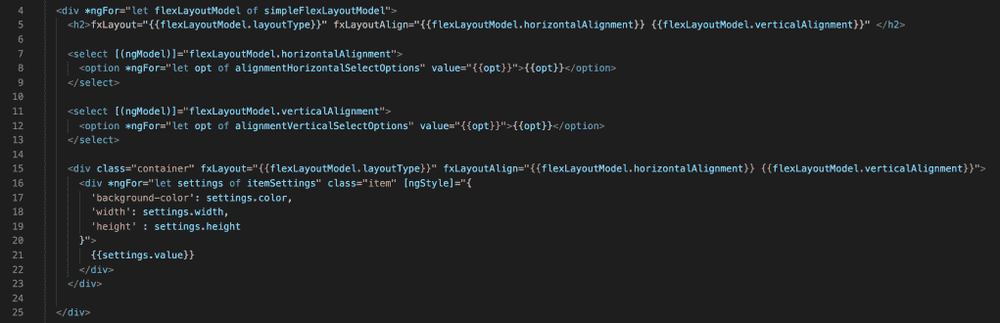
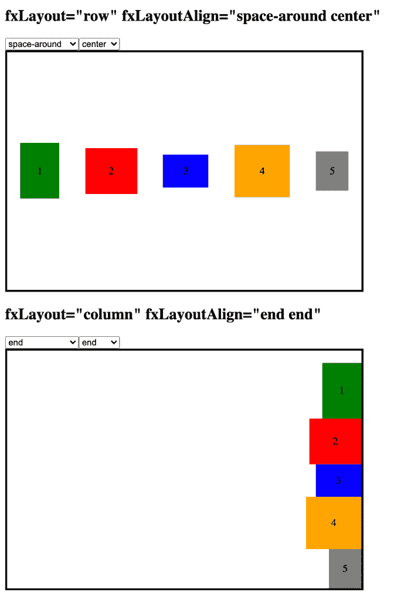

# 角度灵活布局第一眼

> 原文：<https://medium.com/nerd-for-tech/angular-flex-layout-first-look-6cbd8fc46405?source=collection_archive---------0----------------------->

CSS Flexbox

创建前端的现代 CSS 技术是 CSS grid 和 flexbox。这些技术使得前端开发更加容易。我们可以在 Angular 项目中使用这些技术。但是现在我们可以安装 [@angular/flex-layout](https://github.com/angular/flex-layout) 并且不用写 CSS 代码就能使用这些技术。在 [@angular/flex-layout](https://github.com/angular/flex-layout) 里面，我们可以找到 flexbox，CSS grid，media query。请记住，有些功能仍处于测试阶段。

为了使用 [@angular/flex-layout](https://github.com/angular/flex-layout) ，我们需要在我们的项目中安装它。

NPM I-s @ angular/flex-layout @ angular/CDK

之后，我们需要在我们的主模块中导入 FlexLayoutModule。

在本文中，我们将只关注 flexbox。如果我们想使用 flexbox，我们需要在 CSS 文件中编写 display: flex 和 flex-direction: row。Angular flex 布局库为我们做了这一切。我们需要使用属性指令，而不是编写 CSS 代码。

如你所见，angular/flex-layout 在幕后做了大量工作。我们只需要知道如何使用 API。我们还可以将一个值绑定到某个属性上，并对其进行更改。Angular 将动态地对 HTML 和 CSS 代码进行新的修改。

举个例子吧。我们将制作两种类型的布局(行和列),并将动态改变对齐方式。布局内的项目会有所不同。为此，我们需要创建两个模型。一个模型用于主布局，另一个用于内部项目。

在构造函数中，我们初始化它们。

一切都准备好了，是时候在 HTML 中使用那些模型了。我们需要进行两次选择，并使用几个 NGF 进行循环。

就是这样。轻松右转。我们根本没有编写 CSS 代码。现在我们有了一个小小的 flexbox 例子，可以进行对齐。

在 [@angular/flex-layout](https://github.com/angular/flex-layout) 中的一切都很灵敏。如果您需要对不同的设备进行更改，您可以使用 fxLayout.lt-sm 等属性来手动设置。

如果你需要仔细看看这个项目[，这里有链接](https://github.com/8Tesla8/Angular-Flex-Layout)。

*原载于 2021 年 10 月 23 日 http://tomorrowmeannever.wordpress.com***。**