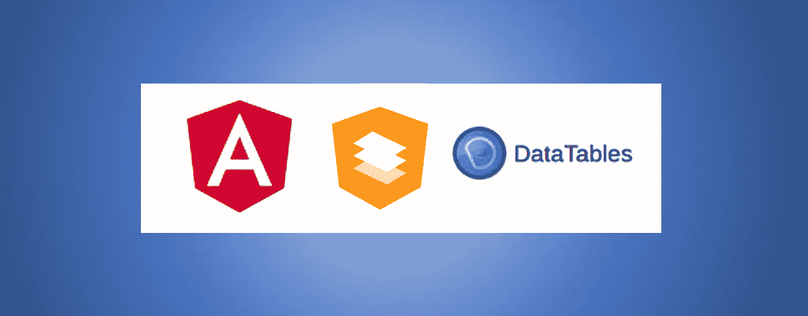
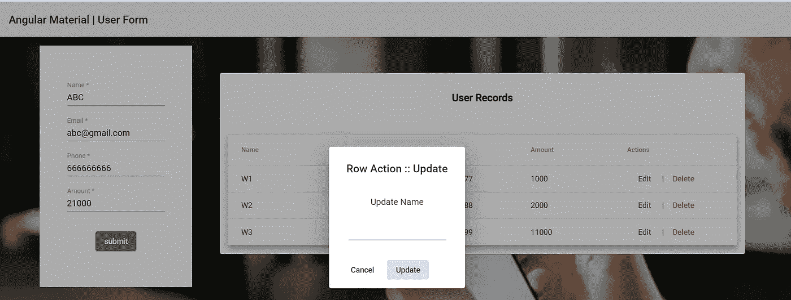

# 具有表格数据的角度材料数据表

> 原文：<https://medium.com/nerd-for-tech/angular-material-data-table-with-form-data-47f6490603da?source=collection_archive---------0----------------------->



角度+材料成分+表格+数据表

Angular Material 是一个 angular.js UI 框架，有完整的材质设计支持。材料组件为功能性网页和 web 应用程序提供了一致性和吸引力。Angular material table 组件以每种优化的方式创建数据丰富的网格，因为它具有完整的特性和各种功能，如排序、分页、展开-折叠、自定义模板。

在本文中，我们将通过一个示例工作来了解如何用表单数据加载角度材料数据表。对于更多，我们将添加一些基本的操作，如添加，编辑，删除行使用对话框组件的角度材料。对话框弹出布局在屏幕的所有内容之上显示给用户。

首先，在安装 angular CLI 之后，应该创建一个新的 angular 项目。

```
# Install Angular CLI
$ npm install -g @angular/cli# Create new project
$ ng new project_name# Enter project
$ cd project_name# run the application
$ ng serve --open
```

然后安装材料包。

```
ng add @angular/material
```

# 材料数据表

使用 **mat-table** 指令添加 **<表>** 创建物料数据表。**【数据源】**属性将一组数据传递给数据表。 **ng-container** 元素用 **matColumnDef** 创建了列。这里 **matColumnDef** 在 JSON 数据对象中被赋予相同的键。 ***matHeaderRowDef** 获取我们想要在表格中显示的列的数组。列标题包含在 ***matHeaderCellDef** 中。

材料数据表包含三列，即姓名、电子邮件，它们由用户通过材料表单输入来加载，稍后我们将添加一列作为操作来执行基本操作编辑和删除表行。

用户属性在名为 **user** 的接口中定义。

**columnsToDisplay** 字符串数组用于定义数据表的列。数据对象被放入名为 **USER_DATA** 的数组中。newUser 是一个新用户对象的示例。

# 材料表单字段

**mat-form-field** 用于创建获取用户输入的表单。 **[(ngModel)]** 双向绑定，用于将事件从视图发送到组件。在使用**模式**和**必需**关键字创建表单字段时，我使用了角度材料强制字段。这里的模式包括一个正则表达式，用于 **mat-form-field** 电子邮件验证。 **mat-raised-button** 作为提交按钮，具有 **addUser()** Onclick 功能。

当新行到达时，角度材料表不会更新。因此，在添加新的数据行后，material 表通过更新 dataSource 来刷新，而不使用它的实例，如下面的代码行所示。

```
this.myDataArray = […newUsersArray];
```

在最新版本的 **Angular Material 11 | 10 中，**我们可以在更新一行数据后调用 **renderRows()** 方法，如果我们直接使用数组作为源，如下面的代码所示，其中**表**是 **mat-table** 的 ViewChild。因此我们可以看到模板变量 **#table** 已经在创建材料表的 HTML 模板中定义，我们可以在这里调用 renderRows()时使用它。方法。

```
call table.renderRows()
```

# 材料数据表-动作列

“操作”列包含每行的操作按钮，用于删除和编辑特定的行元素。编辑按钮用 **openDialog()** click 方法传递行对象(this.user)和 **delete()** 按钮用 delete click 方法传递行对象(this.user)。

delete 函数通过其参数获取特定行的详细信息。然后通过检查电子邮件删除该行。通过安装 sweetalert2，用于显示成功警报的角度定制警报。

**openDialog()** 方法正在获取 **row_obj** 作为要传入 **open()** 方法的行对象。使用 **afterClosed()** 方法订阅对话框关闭事件。从 DialogBoxComponent **发回后关闭()**方法。行对象的用户名由输入到对话框中的名称替换，以便更新。(row_obj.userName=this.name)

# 创建对话框组件

正如上面在编辑行对象和更新用户名中提到的，我使用了材质对话框来接受用户输入。对话框还包含更新和取消按钮。为此，需要一个新的组件。这里我用下面的命令创建了一个新组件 DialogBoxComponent。

```
ng generate component dialog-box
```

HTML:

组件. ts:

MAT_DIALOG_DATA 从 App 组件获取 openDialog()方法的 DATA 参数中传递的数据。MatDialogRef 对打开的对话框模式执行操作，并用于关闭对话框。

我改进了表单、编辑和删除按钮操作，这些操作可以处理更多的字段和验证。我的例子工作的代码可以访问[这里](https://github.com/Isurie/Angular-material-Data-table-with-form-data.git)。



带有数据表的角材用户表单模板，显示用于更新的对话框。