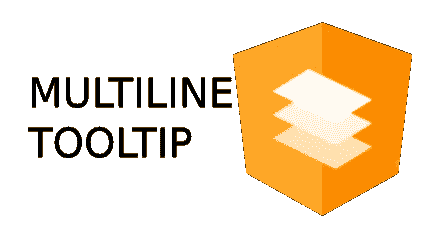

# 带多行文字的角度材质工具提示

> 原文：<https://medium.com/nerd-for-tech/angular-material-tooltip-with-multiline-text-80e8ca2c1d8f?source=collection_archive---------2----------------------->

## 如何在 matTooltip 中换行

来自 https://angular.io/presskit[的官方棱角材质 Logo】](https://angular.io/presskit)

> 角度材料的 API 参考`[tooltip](https://material.angular.io/components/tooltip/api)`:

`import {MatTooltipModule} from ‘@angular/material/tooltip’;`

我们需要在主 angular 模块中导入该指令的引用。

在元素内部实现多行文本的主要思想是在组件内部编写一个函数，该函数返回我们想要换行的静态或动态文本。

首先，我们需要将 matTooltip 指令添加到 HTML 视图中，该指令带有返回文本的函数的名称，这些文本将显示在工具提示中。

在组件文件中，我们需要一个以字符串形式返回所需工具提示文本的函数。

在我们的例子中，假设我们必须在工具提示中显示关于两个事件的信息。显示的文本应该在两个事件信息之间有一个换行符。我们将显示名称以及给定事件的开始和结束日期。

有一个 return 语句，如上所示，将考虑到我们的空白，在我们的例子中是换行符。

结果可能类似

> `toLocalString`方法返回一个字符串，该字符串具有该日期的语言敏感表示。

有关更多信息，请考虑阅读:[https://developer . Mozilla . org/en-US/docs/Web/JavaScript/Reference/Global _ Objects/Date/toLocaleString](https://developer.mozilla.org/en-US/docs/Web/JavaScript/Reference/Global_Objects/Date/toLocaleString)

> `matTooltipPosition`允许用户定义工具提示相对于父元素的位置

更多信息请阅读:[https://material.angular.io/components/tooltip/api](https://material.angular.io/components/tooltip/api)

感谢您的时间，并继续编码。