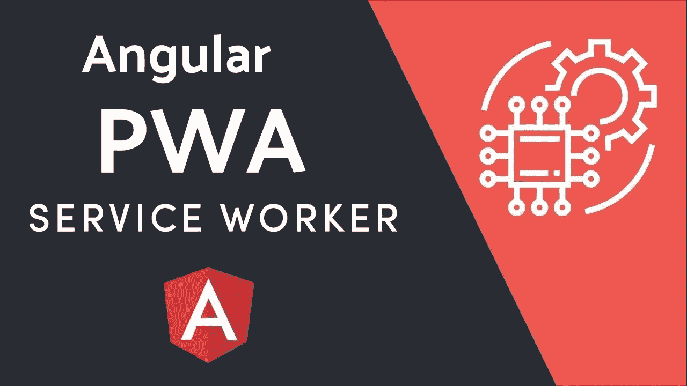
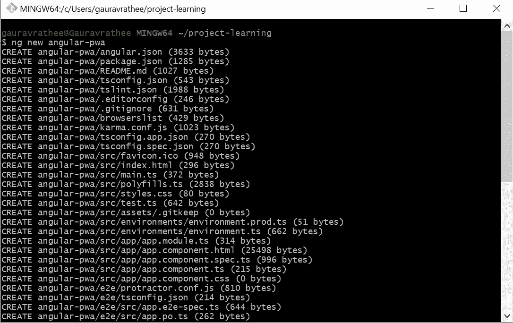
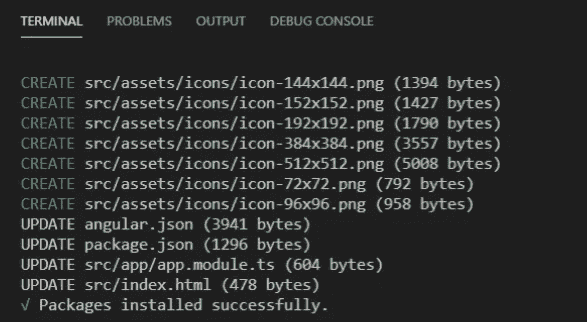
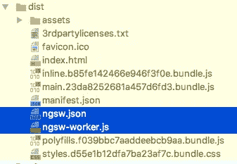
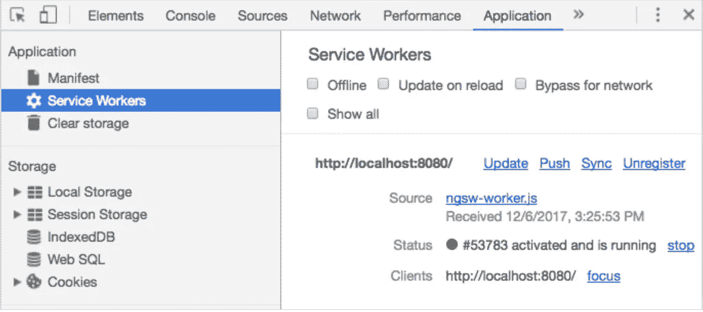
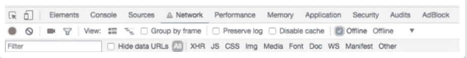
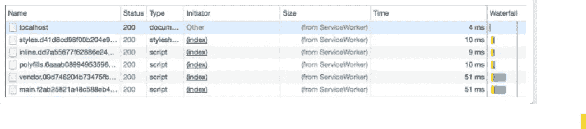

# 角度离线能力:服务人员和 PWA

> 原文：<https://medium.com/nerd-for-tech/angular-offline-capability-service-worker-and-pwa-12b94ebbb141?source=collection_archive---------0----------------------->

如今，离线能力是市场上的一个新的大事件。越来越多的开发者致力于为用户提供离线功能的应用。有了 Angular Service Worker 和 Angular CLI 内置的 PWA 支持，现在让我们的 web 应用程序可以下载和安装比以往任何时候都简单，就像一个本地移动应用程序一样



# **什么是 PWA**

渐进式 web 应用程序(PWA)是一种通过 Web 交付的应用软件，使用 HTML、CSS 和 JavaScript 构建。它适用于任何使用符合标准的浏览器的平台。

在内部，PWA 使用服务工作者浏览器 API 来提供对一些本机功能的访问。此外，它给你一个类似应用程序的感觉。缓存存储是一个非常棒的特性，可以帮助大幅缩短页面加载时间

# 什么是服务人员

服务人员是您的浏览器在后台运行的脚本，独立于网页，为不需要网页或用户交互的功能打开了大门。如今，它们已经包括了像[推送通知](https://developers.google.com/web/updates/2015/03/push-notifications-on-the-open-web)和[后台同步](https://developers.google.com/web/updates/2015/12/background-sync)这样的功能。核心特性是拦截和处理网络请求的能力，包括以编程方式管理响应缓存。

# 先决条件

要使用 Angular service worker 的所有功能，请使用 Angular 和 Angular CLI 的最新版本。

为了注册服务人员，应用程序必须通过 HTTPS 访问，而不是 HTTP。浏览器会忽略通过不安全连接提供服务的页面上的服务人员。原因是服务工作者非常强大，所以需要格外小心以确保服务工作者脚本没有被篡改。

这个规则有一个例外:为了使本地开发更容易，浏览器在访问`localhost`上的应用程序时*不*要求安全连接。

让我们开始在我们的 angular 应用程序中实现 Service worker 和 PWA。

> **步骤 1:创建角度应用**

如果在现有的角度应用程序上实现，可以跳过此步骤。我们将使用角度 CLI。

```
ng new angular-pwa
```

上述命令将在`angular-pwa`文件夹中创建一个脚手架角度应用程序。让我们导航到`angular-pwa`文件夹



> **第二步:添加 PWA 包**

该命令会触发添加和修改多个文件的原理图。它负责通过添加`service-worker`包以及设置必要的支持文件来配置您的应用程序以使用服务工作者

```
ng add @angular/pwa
```

上述命令完成以下操作:

1.  将`@angular/service-worker`包添加到项目中。
2.  支持服务人员在 CLI 中构建支持。
3.  在应用程序模块中导入并注册服务工作者。
4.  安装图标文件以支持已安装的渐进式 Web 应用程序(PWA)。
5.  创建名为`[ngsw-config.json](https://angular.io/guide/service-worker-config)`的服务工作器配置文件，该文件指定缓存行为和其他设置。
6.  更新`index.html`文件:

*   包括添加`manifest.webmanifest`文件的链接。
*   为`theme-color`添加 meta 标签。



> **步骤 3:创建构建**

这需要一点时间，但是过一会儿，我们将在`dist`文件夹中提供我们的应用程序构建。

```
ng build --prod
```

让我们看看在我们的构建文件夹中有什么，这里是生成的大多数文件:



> **步骤 4:运行角度 PWA 应用**

因为`ng serve`不与服务工作者一起工作，所以您必须使用一个单独的 HTTP 服务器来本地运行您的项目的 PWA 功能。您可以使用任何 HTTP 服务器。下面的例子使用了来自 npm 的 [http-server](https://www.npmjs.com/package/http-server) 包。

全局安装 http-server([链接](https://www.npmjs.com/package/http-server))

```
npm install -g http-server
```

要使用`http-server`提供包含 web 文件的目录，请运行以下命令:

```
http-server -p 8080 -c-1 dist/angular-pwa
```

`-c-1`选项将禁用服务器缓存，一个服务器将在端口`8080`上运行，为应用程序的生产版本提供服务。如果端口`8080`繁忙，那么您可以更改为任何端口号。

> **步骤 5:测试角度 PWA 应用**

在服务器运行的情况下，可以将浏览器指向 [http://localhost:8080/。您的应用程序应该可以正常加载。](http://localhost:8080/.)

提示:在测试 Angular 服务人员时，在浏览器中使用匿名或私人窗口是一个好主意，以确保服务人员不会从以前的剩余状态读取数据，这可能会导致意外行为。

现在，您的浏览器开发工具应该已经安装了服务人员



将网络设置更改为脱机



现在刷新应用程序，应用程序将在没有网络连接的情况下再次加载



离线模式下的网络日志

> **结论**

现在，我们已经学会了在任何角度应用程序上构建离线功能和 PWA 功能。感谢阅读:)

如果你喜欢这篇文章，请按👏鼓掌按钮 1000 次或你想要多少次。如果你有任何问题，请随意提问。非常感谢你的阅读！

# 在你走之前

***感谢*** *的阅读！如果你想与我取得联系，请随时联系我在 gauravrathee0@gmail.com 或我的* [***LinkedIn 简介***](https://www.linkedin.com/in/gaurav-rathee-5b4253b7/) *。还有，随意探索* ***我的简介*** *阅读不同的文章。*