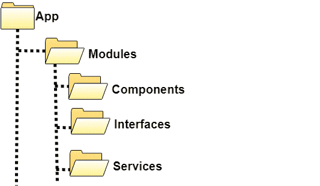

# 角度建议和良好实践

> 原文：<https://medium.com/nerd-for-tech/angular-recommendations-and-good-practices-d4b732965cad?source=collection_archive---------0----------------------->


# 配置文件:

# tsconfig.json

## 路径别名:

它们是我们文件的快捷方式，有了它们，我们可以用一种更舒适、更快捷的方式实现导入。

```
"paths":{  
   "@src/*":[  
      "src/*"
   ],
   "@assets/*":[  
      "src/assets/*"
   ],
   "@shared/*":[  
      "src/app/shared/*"
   ]
}
```

# angular.json

## stylePreprocessorOptions 选项:

它需要一个具有以下属性的 JSON“include paths ”,该属性在同一个路径别名中声明我们的样式文件的快捷方式，唯一的区别是它不需要“@”来在 scss 文件中使用它。

```
"stylePreprocessorOptions": {
   "includePaths": ["src/app/shared/styles"]
 },
```

## 配置:

我们的项目可以在编译中使用的每一种配置。

我为开发和生产推荐以下内容:

```
"configurations": {
            "local": {
              "fileReplacements": [
                {
                  "replace": "src/environments/environment.ts",
                  "with": "src/environments/environment.local.ts"
                }
              ],
              "optimization": false,
              "outputHashing": "all",
              "sourceMap": true,
              "extractCss": true,
              "namedChunks": false,
              "aot": true,
              "extractLicenses": true,
              "vendorChunk": false,
              "buildOptimizer": false,
              "budgets": [
                {
                  "type": "initial",
                  "maximumWarning": "2mb",
                  "maximumError": "5mb"
                }
              ]
            },
            "production": {
              "fileReplacements": [
                {
                  "replace": "src/environments/environment.ts",
                  "with": "src/environments/environment.prod.ts"
                }
              ],
              "optimization": true,
              "outputHashing": "all",
              "sourceMap": false,
              "extractCss": true,
              "namedChunks": false,
              "aot": true,
              "extractLicenses": true,
              "vendorChunk": false,
              "buildOptimizer": true,
              "budgets": [
                {
                  "type": "initial",
                  "maximumWarning": "2mb",
                  "maximumError": "5mb"
                }
              ]
            }
}
```

# 结构:

## 桶:

为了组织我们的项目导入，我们将使用“桶”的概念，主要思想是将名为“index.ts”的文件添加到包含。ts 文件。在它的内部，我们将把每个可导出变量导出到所有。ts 文件以这种方式创建了一个隐藏的层次结构，这将有助于我们在导入时隐藏长而深的路径。

示例:

“组件”文件夹中的 Index.ts

```
export * from './component-folder-1';
export * from './component-folder-2';
```

在模块中导入

```
import { 
   Component1, 
   Component2, 
   Component3, 
   Component4 
} from './component-folder';
```

请检查 index.ts 文件中的组件数量是否多于导出的数量，发生这种情况是因为在我们导出的每个路径中，有更多的 index.ts 文件同时导出更多的路径。

正如您所看到的，这更清晰，同时也更容易实现，我们减少了导入文件所需的行数，并且缩短了路径。

## 主要结构:

除了 app.module、app.component 等。我们将为每个模块创建一个文件夹，在其中我们会发现以下结构:



主要思想是将逻辑按类别分开，每个模块包含它自己的，以加强模块的惰性加载的概念，其中每个模块将在需要时被加载，并且必须彼此独立。

对于那些组件、服务等。我们需要一个以上的模块(例如:角材料模块)，我们将创建一个“共享模块”来导入和导出他们的应用程序。

对于共享服务，我建议直接在 app.module 中实现它们，如果我们在共享模块中实现它们，我们将为它们中的每一个创建一个不同的服务实例，这样就不可能在整个应用程序中使用该服务进行通信。

## 核心服务:

核心或实用程序服务文件是在 app.module 中实现的共享服务，包含可在整个应用程序中重用的所有方法。请记住，每个函数都必须是声明性的，没有副作用，并且必须随结果返回值，如果您需要修改参数，请使用它的值创建一个变量。

## 微调器实现:

我推荐使用 observable 来实现 spinner，它可以接收一个布尔值来显示或隐藏它。

core.service.ts

```
import { Injectable } from '@angular/core';
import { AbstractControl } from '@angular/forms';
import { MatAutocomplete, MatAutocompleteSelectedEvent, MatChipInputEvent } from '@angular/material';
import { Subject } from 'rxjs';
export interface LoaderState {
  show: boolean;
}@Injectable({
  providedIn: 'root'
})
export class CoreService {
  spinnerStatusState = new Subject<any>();
 constructor() {} displaySpinner(value: boolean) {
    this.spinnerStatusState.next(<LoaderState>{ show: value });
  }
}
  }
```

应用程序组件

```
import { Component, ChangeDetectionStrategy, OnInit } from '@angular/core';
import { CoreService } from './shared/services/core.service'; @Component({
  selector: 'app-root',
  templateUrl: './app.component.html',
  styleUrls: ['./app.component.scss']
})
export class AppComponent implements OnInit {
  show = false;
 constructor(private coreService: CoreService) {} ngOnInit() {
    this.coreService.spinnerStatusState.subscribe(state => {
      setTimeout(() => {
        this.show = state.show;
      }, 0);
    });
  }
}
```

app.component.html

```
<ng-container><span *ngIf="show"><app-spinner></app-spinner></span>
    <app-navbar> <router-outlet></router-outlet> </app-navbar>
</ng-container>
```

spinner.component.ts

```
import { Component, OnInit } from '@angular/core'; @Component({
  selector: 'app-spinner',
  template: `
    <div class="loading"></div>
  `,
  styleUrls: ['./spinner.component.scss']
})
export class SpinnerComponent implements OnInit {
  constructor() {}
 ngOnInit() {}
}
```

实现你的 spinner scss 来设计你自己的风格，或者用 gif 或其他文件替换模板。

如何使用它:

在组件的构造函数中注入核心服务，在调用端点之前:

this . coreservice . display spinner(true)；

得到结果后，即使成功与否:

```
this.yourService.getInformation().subscribe(
  response => {
   ...
   this.coreService.displaySpinner(false);
  },
  error => {
   ...
   this.coreService.displaySpinner(false);
  }
);
```

# 可观察到的:

结合可观测的！！在你的组件中，有时你会同时调用多个端点…与其订阅它们中的每一个，为什么不合并它们呢？。

我建议使用来自 rxjs 的 combineLatest 来做这件事，这样即使一些值没有出现，我们仍然要输入 subscribe 的结果或错误，当缺少的值出现时，我们将保留最后一个值。

```
import { combineLatest } from 'rxjs';...ngOnInit() {
  combineLatest(
    this.yourService.getObservable1(),
    this.yourService.getObservable2()
  ).subscribe(
    ([result1, result2]) = {
      ...
    }
  ) 
}
```

这样我们可以更容易地在 ngOnDestroy 取消订阅:)

呼叫端点推荐！！！！(在端点给出结果后，角度自动退订，但我认为这是一个很好的做法，仍然使用它来获得头脑中的良好做法)，如果您知道您的可观察对象将只从后面获得一次信息，请使用。pipe(first())在您订阅之前，这样它将获得信息并自动取消订阅。

```
import { first } from 'rxjs/operators';...this.yourService.getObservable().pipe(first()).subscribe(...);
```

# 应用程序状态的自定义管理:

我们建议使用工厂模式在旅途中创建、管理和销毁可观察对象！

为此，我创建了这个非常酷的共享服务，并与你分享:)

observable.service.ts

```
import { BehaviorSubject } from 'rxjs';
import { Injectable } from '@angular/core'; export interface ObserverArrayItem {
  key: string;
  observable: BehaviorSubject<any>;
} @Injectable({
  providedIn: 'root'
})
export class ObservableService {
  private observerArray: ObserverArrayItem[] = [];
 createObservable(key: string) {
    const observable = new BehaviorSubject(null);
    this.observerArray.push({ key, observable });
  } getObservable(key: string) {
    const observableArrayItem = this.observerArray.find(obs => obs.key === key);
    return observableArrayItem.observable;
  } emitValue(key: string, data: any) {
    const observableArrayItem = this.observerArray.find(obs => obs.key === key);
    observableArrayItem.observable.next(data);
  } destroyObservable(key: string) {
    const selectedObservable = this.observerArray.find(obs => obs.key === key);
    selectedObservable.observable.unsubscribe();
    this.observerArray = this.observerArray.filter(obs => obs.key !== key);
  }
}
```

如何使用:

将通过可观察对象发送数据的组件将负责创建和销毁数据:

在您的组件上

```
export const NameOfYourObservable = 'observable1';
...
ngOnInit() {
  this.observableService.createObservable(NameOfYourObservable);
}...// after getting the informationthis.observableService.emitValue(NameOfYourObservable, 'Hi! im the information !!'); // when we destroy our component
ngOnDestroy() {
  this.observableService.destroyObservable(NameOfYourObservable);
}
```

为什么要在发出数据的组件上管理可观察的生命周期？？

因为如果发出数据的组件不在了…为什么要继续拥有一个不再有任何作用的可观察对象呢？:)

使用它的另一种方式是让组件的父组件创建和销毁可观察对象，这样我们可以放心，可观察对象将为其子组件做好准备，当父组件不在时，可观察对象也将准备好。

在您的订阅组件上

```
import { NameOfYourObservable } from './component-emitter-forlder';...ngOnInit() {
  this.observableService(NameOfYourObservable).subscribe(...)
}
```

> 就是这样！这些是我能给你的一些建议！！如果你喜欢它，请分享，我愿意回答问题。
> 
> *我还想邀请你来我的前端社区过* [*不和*](https://discord.gg/KEavKkDc5Y) *！我通过我的*[*YouTube*](https://www.youtube.com/watch?v=2jfIfeY4lrQ&t=1006s&ab_channel=GentlemanProgramming)*频道进行指导和授课。*
> 
> *大家编码快乐！！*