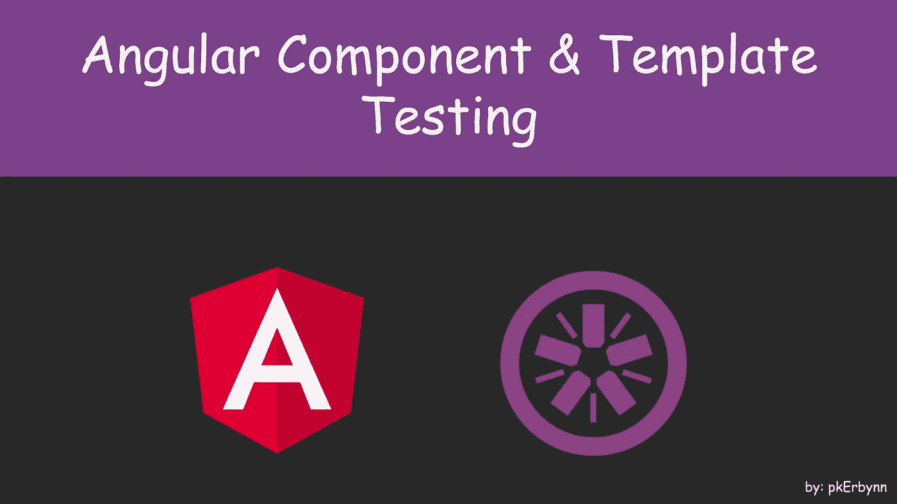
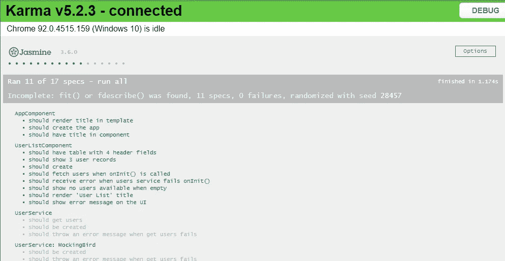
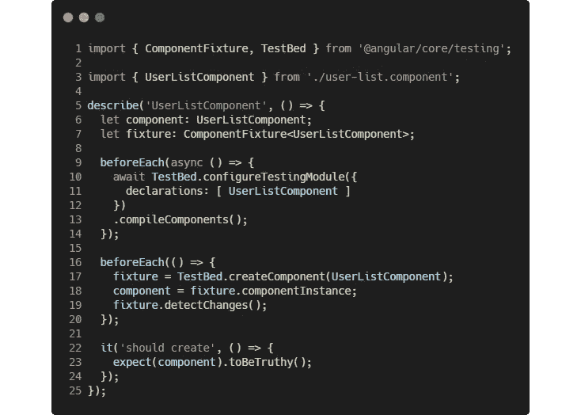
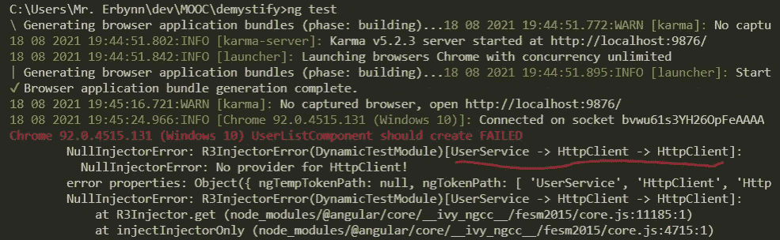
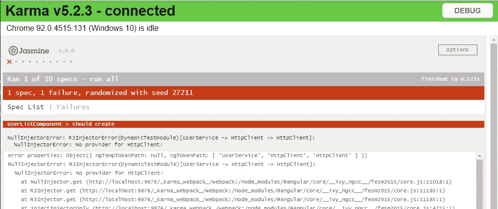
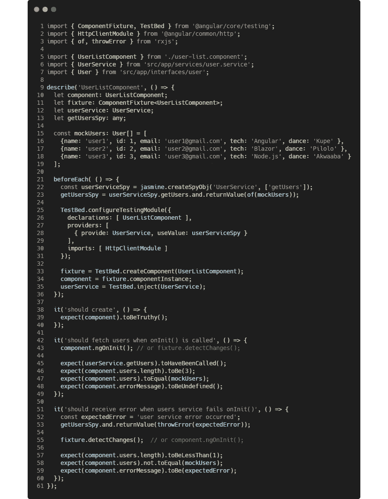
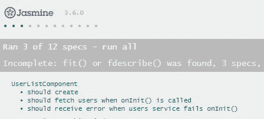
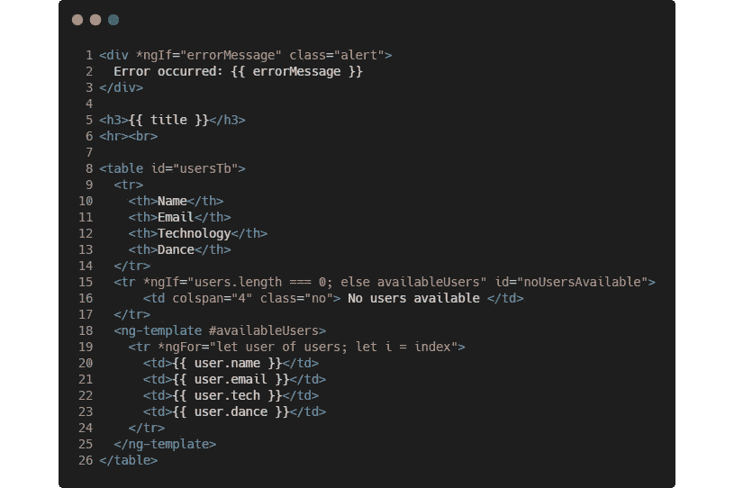
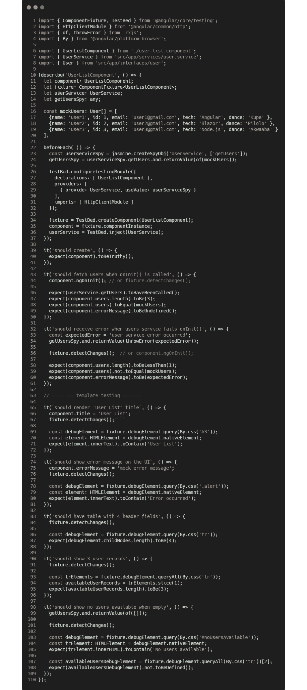
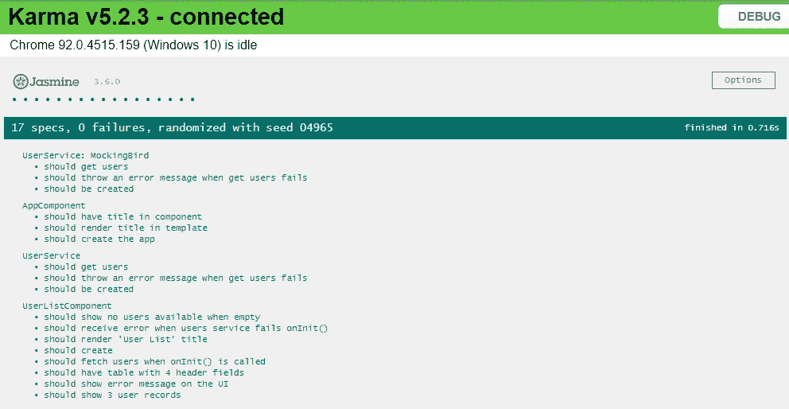

# 角度单元测试系列——第 3 集:Jasmine 组件测试

> 原文：<https://medium.com/nerd-for-tech/angular-unit-testing-series-episode-3-component-testing-w-jasmine-2ed25082558f?source=collection_archive---------0----------------------->

## 测试组件及其 HTML 模板



在本系列的前一集中，我们使用 Jasmine 和 ts-mocking-bird 测试了我们应用程序的服务。本集是角度单位测试系列的第三集，也是最后一集。

在本文中，我们将学习测试我们的 [*组件和模板的基本原理，揭开*](https://github.com/pkErbynn/demystify/tree/9368cc50d5d0acb5389b2f862726b7ccf1c78d91) *一个* ngular 应用程序的神秘面纱。我们将利用 Jasmine 测试框架，因为 ts-mocking-bird 不支持模板测试。

***我们所期待的:***

*覆盖主应用组件和用户列表组件及其模板的测试通过结果，在浏览器中报告。*

*项目代码库状态:* [*GitHub 链接*](https://github.com/pkErbynn/demystify/tree/64a4acec0fb1f72b8a4938e36346e2b112bfaf23)



在本文结束时，您应该能够；

*   编写角度分量的测试
*   为 Angular HTML 模板编写一个测试

让我们开始吧！…

# 用户列表组件

按照我们的软件架构，用户列表组件位于用户服务之上，并将用户从服务中提取到用户数组中。它还监听可能发生的任何错误，并通过显示友好的错误消息来处理它。

`user-list.component.ts`文件包含以下代码结构:


用户列表.组件. ts

我们的目标是测试组件，考虑其核心可能的行为，包括何时成功获取用户以及何时请求失败。

# 用户列表组件规范文件

在`user-list/`文件夹中是`user-list.component.spec.ts`文件，它包含主`user-list.component.ts`实现文件的默认测试套件。



用户列表.组件.规格

现在，让我们在不重构任何东西的情况下运行默认测试。

## 运行我们的用户列表组件测试

在项目目录的根目录下，运行下面的命令。

```
$ ng test
```

> 让我们只运行 userListComponent 测试套件，通过像这样的“f”*`***f****describe(‘UserListComponent’...*`*

*您将从控制台终端收到一个失败的测试结果，如下所示:*

**

*命令行测试失败*

*…此外，Karma 的浏览器显示了一个失败的结果*

**

*浏览器测试失败报告*

*失败是由于没有为用户列表组件成功运行提供或解析依赖关系。*

# *修复用户列表组件测试*

*让我们使用 Jasmine 测试框架来修复失败的用户列表测试。我们将处理三个测试用例场景:*

1.  *测试用户列表组件是否已创建*
2.  *测试初始化用户组件时是否成功检索到用户数据*
3.  *测试检索用户时是否出现错误*

*将`user-list.component.spec.ts`的代码更新如下:*

**

*用户列表.组件.规格*

*让我们明白这是怎么回事…*

*   ***行#10 - #13** `let component...`:组件、夹具、用户服务、getUsersSpy 的声明。fixture 是围绕 UserListComponent 的包装器，帮助获取组件的实例，通过本地或调试元素访问其模板/DOM 元素。*
*   ***行#25 - #31** `beforeEach(()=>...`:配置 userListComponent 及其所需的依赖项。我们在**声明**块(#26)中指定要测试的组件的名称。为了解决用户服务依赖性，我们用一个名为`userServiceSpy`的假用户服务替换了原来的用户服务**提供者**，而不是用第 22 行和第 23 行中的伪数据来模仿。同样，当用户服务进行 HTTP 调用时，`HttpClientModule`被**导入**。*
*   ***line #33 - #35** `fixture = TestBed.create...`:为用户列表组件创建一个 fixture。这个 fixture 包装器使得组件的实例(#34)及其注入的服务依赖项(#35)被初始化成为可能。*
*   ***第 39 行** `expect(...`:断言用户列表组件为真。*
*   ***line #43** `component.ngOnInit...`:调用组件上的`ngOnInit()`方法，从而触发假用户服务。这也可以使用`fixture.detectChanges()`来更新 DOM。*
*   ***行#45 - #48** `expect(userService...`:验证用户服务的`getUsers()`方法是否已被调用，预期用户数，以及深层对象相等性检查。此外，在成功调用的过程中不会出现错误消息。*
*   ***行#52 - #53** `const expectedError...`:重新模拟 getUsersSpy 抛出错误。`getUsersSpy`正从第 23 行被访问，并被重新模拟以适应错误情况。*
*   ***行# 57-# 59**`expect(...`:确认没有预期的用户，同时也收到一条错误消息。*

> ***注意:** `toEqual()` *匹配器* *用于*图元*，而* `*toBe()*` *用于*对象*和*图元*

***用户列表组件测试结果:***

**

*用户列表组件测试报告*

# *用户列表 HTML 模板测试*

*Angular 应用程序组件定义了一个包含应用程序数据和逻辑的类，并与一个定义要显示的视图的 HTML *模板*相关联。用于**模板**的语言是 HTML，带有**角度**标记，将视图层**分开。***

*有时 HTML 元素呈现的结构或动态数据可能与需要显示的不同，因此我们必须测试模板视图页面。*

*`user-list.component.html`文件有以下将被测试的更新。*

**

*在这里，如果出现错误，我们会显示一个错误消息警告。此外，当没有数据时，我们显示“没有可用的用户”，否则数据将在 UI 上填充。*

*模板有 5 个测试用例场景。即用户列表页面:*

1.  *应该呈现正确的页面标题*
2.  *发生错误时应显示错误警告*
3.  *应该有一个 4 头字段的表格*
4.  *当找到数据时，应该填充许多匹配的记录*
5.  *应该显示空数据不可用的消息*

*现在，让我们用模板测试更新`user-list.component.spec.ts`:*

**

*从第 63 行开始，让我们了解模板测试发生了什么…*

*   ***第 65 - #71 行:**用标题更新 DOM，然后定位第一个`<h3>`元素并断言页面包含“用户列表”标题。*
*   ***第#75 - #80** 行:用错误消息更新 DOM，使用包装`nativeElement`的`debugElement`通过 CSS 类定位警告消息元素。最后，它验证 html 元素是否包含错误消息。*
*   ***行#83 — #87:** 验证模板初始化时，当模拟用户数据可用时，表行应填充 4 条记录(包括字段名称)。*
*   ***第 90 - #96 行:**类似地，验证在 ngOnInit()上，应该会有三个伪造的用户记录。`slice(1)` (#94)不包括表格字段名称。*
*   ***行# 98-# 108:**`getUserSpy()`重新分配空用户(#99)，并与模板(#101)同步。这满足了具有`*ngIf="users.length === 0`逻辑的`<tr>`元素。然后显示“没有用户可用”消息(#105)。类似地，验证`*ngFor` `<tr>`元素未被填充和未定义(#108)。*

> *在运行完所有的组件测试套件后，您会发现主`*app-component.spec.ts*`文件的测试失败了。为了修复它们，我已经更新了`[*app-component.spec.ts*](https://github.com/pkErbynn/demystify/blob/64a4acec0fb1f72b8a4938e36346e2b112bfaf23/src/app/app.component.spec.ts)`*文件的测试套件。**

*如果应用程序和用户列表组件测试进展顺利，您将收到如下成功的测试通过结果:*

**

# *所有测试报告…*

*组合所有测试(服务+组件+模板)并运行它们，您会看到如下成功结果:*

**

# *结论*

*这就把我们带到了以角度为单位的单元测试系列的结尾。在这一集里，我们讨论了组件和模板测试。之前，我们还介绍了如何建立一个 Angular 项目并测试它的服务。我真的很喜欢写这些重要的概念。*

*我希望这篇文章和其余的文章对您有用。如果您有任何疑问，请随时提出评论、反馈和问题；).*

*此外，您可以在 [LinkedIn](https://www.linkedin.com/in/pkerbynn/) 上找到并联系我。*

*项目代码库: [GitHub 链接](https://github.com/pkErbynn/demystify/tree/master)*

*一个大大的“ **T** 表示感谢！*

> *前一篇文章:*
> 
> *[**角度单元测试系列-第 2 集:带 Jasmine 的角度单元测试介绍& ts-mocking-bird**](https://javascript.plainenglish.io/introduction-to-angular-unit-testing-w-jasmine-ts-mocking-bird-3475a1d906e7)*