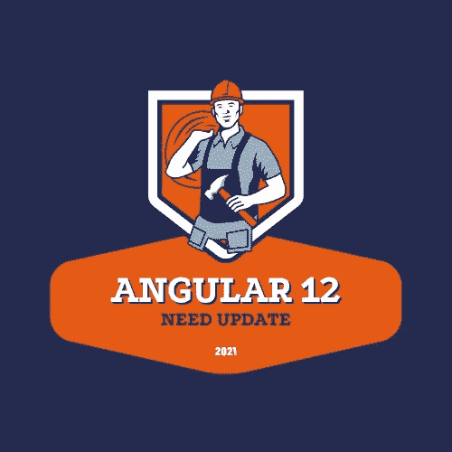
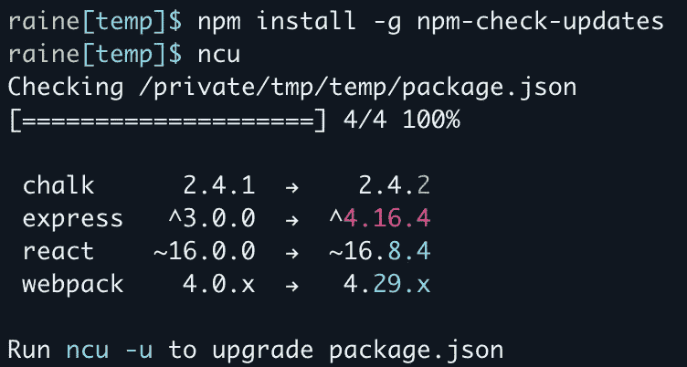

# 角度更新指南

> 原文：<https://medium.com/nerd-for-tech/angular-update-guide-565a8de661e3?source=collection_archive---------5----------------------->

## 角度 12

开发者总是谷歌的东西来寻找指南。如果你输入 update angular，你可能会找到这个网站。根据该网站，我们需要运行命令:

ng 更新@ angular/core @ 12 @ angular/CLI @ 12

如果我们使用有角的材料，我们需要运行:

ng 更新@角度/材料

并在必要时更新 typescript。

但是应用程序中的其他包呢？我们可能也需要更新它们。我们如何做到这一点？我们可以手动更新。如果我们只有 5 包，这没什么大不了的。但是在实际项目中，我们有更多。

最好能找到一个能升级所有软件包的工具。它调用[NPM-检查-更新](https://www.npmjs.com/package/npm-check-updates)。

要安装此工具，只需运行以下命令:

npm 安装-g NPM-检查-更新

然后运行命令检查更新:

ncu -u

您可能会在控制台中看到类似这样的内容。

之后，我们的 package.json 有每个包的最新版本。我们需要做的就是安装最新版本。

npm 安装

最后一步是在生产模式下运行项目，可能会修复一些代码问题，因为在最新的更新中，他们改变了一些东西。如果您不知道如何修复某些问题，您可以将此软件包的版本更改为以前的版本。

现在我们的应用程序已经准备好了。

*原载于 2021 年 8 月 20 日 http://tomorrowmeannever.wordpress.com***。**