# Angular 组件、DOM 元素、组件的元素和指令的 ViewChild

> 原文：<https://medium.com/nerd-for-tech/angular-viewchild-for-component-dom-element-element-of-component-and-directive-c23328ee1525?source=collection_archive---------1----------------------->

我正在学习 Angular 并热爱它，但有些概念比其他概念更令人困惑。我为较难的人写文章(对我来说更难)，因为这有助于我理解。这是我对 ViewChild 的尝试。

我将在[https://stackblitz.com/](https://stackblitz.com/)上尝试这段代码，这样你也可以去那里做同样的事情，如果你选择 Angular 的话。

使用 ViewChild，我们可以通过获取对模板(html)元素的引用，将这些元素注入到组件(ts)中。我们可以得到参考资料

*   一个组件
*   DOM 元素
*   组件的元素
*   一个指令。

# 1-引用一个组件

当您选择 Angular 时，在 stackblitz 中创建的默认应用程序在 app.component.html 中具有此代码。

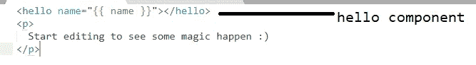

默认情况下，应用程序组件是:

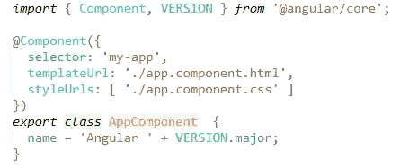

我们还得到了 hello 组件:

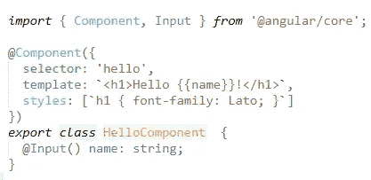

如果我们想访问 app ts 文件中的 hello 组件，我们可以这样做。

我们可以访问 ngOnInit 中的 myHelloComponent 变量，这是我们得到的结果:

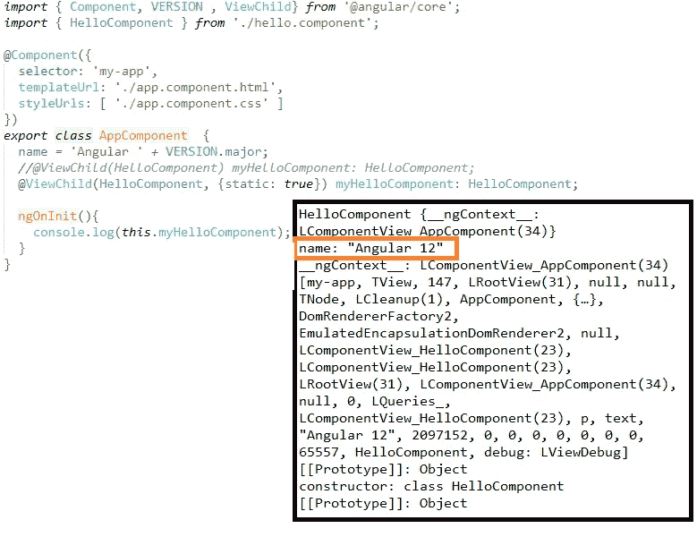

我想看看当我向应用程序的模板添加另一个 Hello 组件并运行相同的代码时会发生什么。其他一切还是老样子。代码运行并在控制台上显示信息。

但是，如果 hello 组件上的名称来自应用程序，而我给了不同的名称，该怎么办呢？在应用程序模板中:

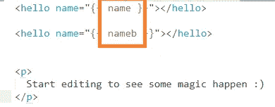

在应用程序 ts 文件中:

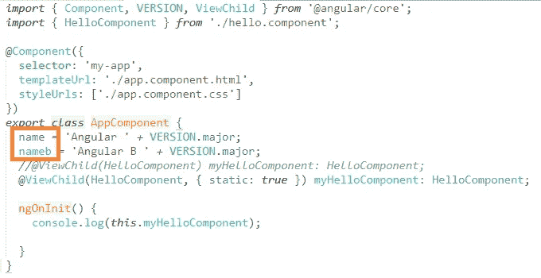

在浏览器中，我们会看到:

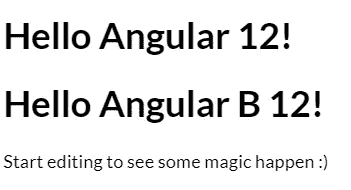

在控制台上，我们得到第一个 hello 组件:

**hello component**{ _ _ ng context _ _:LComponentView _ app component(46)}
名称:" **Angular 12"**
…

# 2-引用特定的 DOM 元素。

我现在将应用程序模板更改为:

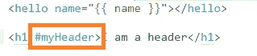

现在，我们可以将特定的元素注入到组件中，而不是组件。在应用程序组件中:

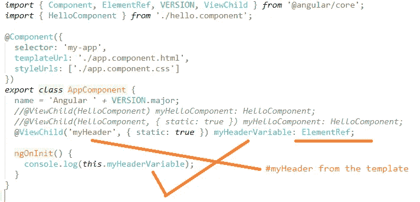

在控制台上，我们将看到:

nativeElement: h1

…

innerHTML:“我是标题”

innerText:“我是一个标题”

如果我们尝试对 hello 组件元素使用上述方法，会发生什么情况？

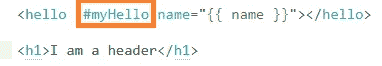

在控制台中，我们仍将获得组件。

如果我们这样做，我们仍然会得到组件:

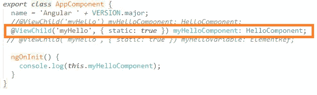

那么，我们如何更深入地了解组件呢？

# 3 —深入了解组件

将上面的 ViewChild 更改为如下所示:

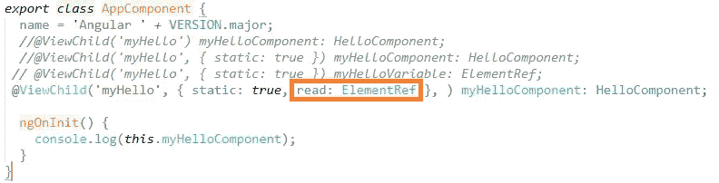

现在，在控制台上，我们将看到这个而不是组件:

***element ref { native element:hello }***

nativeElement:你好

…

内文:“你好 Angular 12！”

…

# 4-引用指令

我现在将模板更改为:

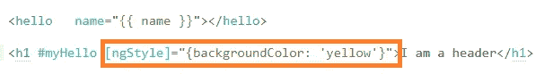

在组件中:

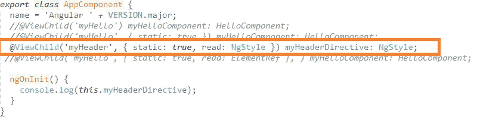

在控制台上:

1.  *NgStyle …*

…ng style:{ background color:" yellow " }

这是我对 ViewChild 的总结，接下来我要对 ngContent 和 contentChild 做一个总结。

如果有什么不清楚的地方或者我搞砸了，请告诉我:-)