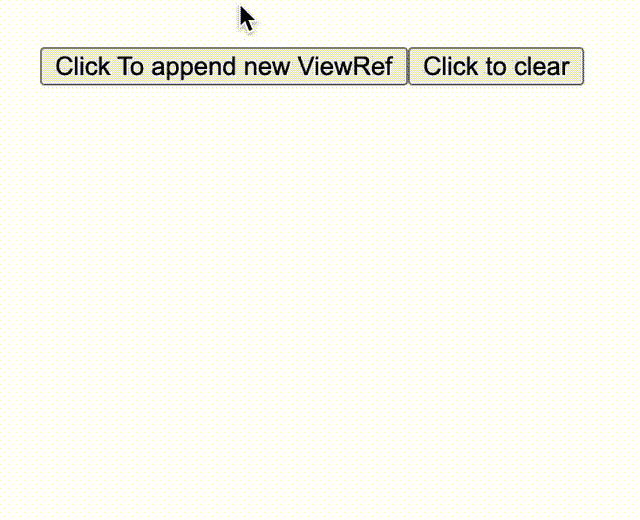
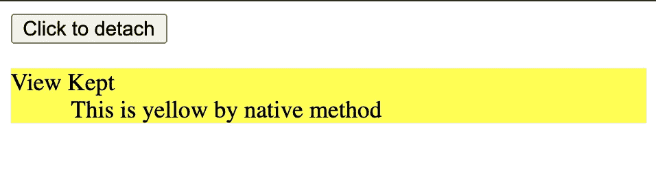
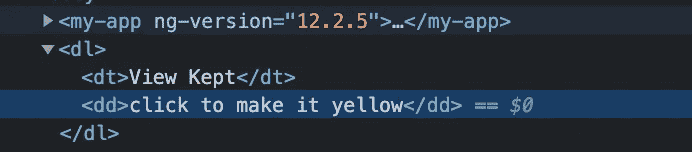
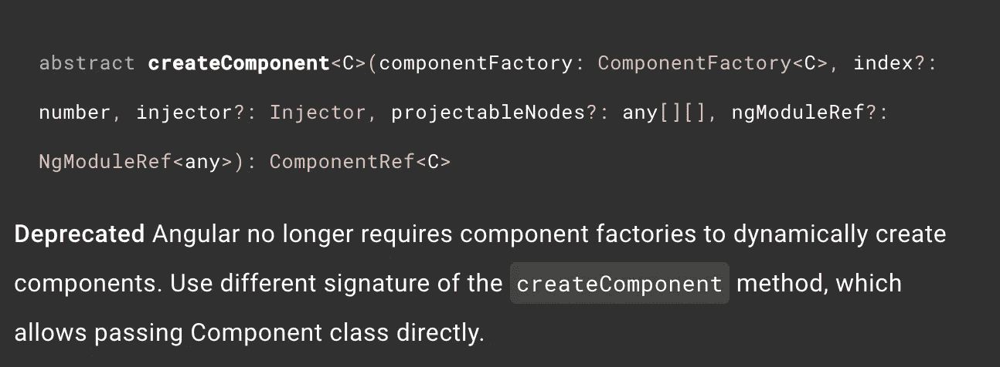

# [angular]关于 ViewContainerRef 的所有内容

> 原文：<https://medium.com/nerd-for-tech/angular-viewcontainerref-a1e8d08eabc2?source=collection_archive---------0----------------------->


[Erda Estremera](https://unsplash.com/@erdaest?utm_source=medium&utm_medium=referral) 在 [Unsplash](https://unsplash.com?utm_source=medium&utm_medium=referral) 上拍摄的照片

**ViewContainerRef(VCR)** 表示一个容器，可以在其中附加一个或多个视图。
它基本上是所有模板语法施展魔法的地方。

大多数时候，我们用标记编写模板来创建一个新视图，我们也可以用这个 **VCR 按需创建视图**。

## **|如何访问 ViewContainerRef。**

ViewChild 可以通过添加令牌选项**{ read:ViewContainerRef }**访问模板上 ***元素*** 的 **VCR** 或者访问 ***组件宿主*** ，注入对实例化的依赖。

**注意**，ng-template 也可以提供 viewContainerRef，这就是我们如何创建结构化指令。

```
@Component({
  selector: 'my-app',
  template: `
    <h1>See console to See viewContainer</h1>
    <ul>
      <li><span #span>this is html element</span></li>
      <li><custom-comp #custom></custom-comp></li>
      <li><ng-template #template [ngIf]="true">this is template</ng-template></li>
   </ul>`,})
export class AppComponent implements AfterViewInit {
  @ViewChild('span', { read: ViewContainerRef }) span;
  @ViewChild('custom', { read: ViewContainerRef }) custom;
  @ViewChild('template', { read: ViewContainerRef }) template; constructor(private viewContainerRef: ViewContainerRef) {} ngAfterViewInit() {
    console.log('>>>hostElement', this.viewContainerRef);
    console.log('>>>htmlElement', this.span);
    console.log('>>>customElement', this.custom);
    console.log('>>>ngTemplate', this.template);
  }}
```

[](https://stackblitz.com/edit/angular-ivy-5rrwvf?file=src/app/app.component.ts) [## viewContainerRef - StackBlitz

### 编辑描述

stackblitz.com](https://stackblitz.com/edit/angular-ivy-5rrwvf?file=src/app/app.component.ts) 

## |通过 ***ngIf** 创建视图的示例

我们知道 ngIf 是结构指令。去掉糖衣部分，都是一样的。

```
<div *ngIf="true">hey, show me!!!</div>// is same as the later.<ng-template [ngIf]="true"><div>hey, show me!!!</div></ng-template>
```

ngIf 如何按需改变模板？

```
private **_updateView**() {  

  **if** (**this._context.$implicit**) { 
    *// if ngIf is true* if (!this._thenViewRef) { // if no thenView created..       
      **this._viewContainer.clear();**
      this._elseViewRef = null;
      if (this._thenTemplateRef) {          
        this._thenViewRef =            
       this.**_viewContainer.createEmbeddedView**(this._thenTemplateRef, this._context);        
      }      
    }

  } **else** {  
     *// if ngIf is false*

    if (!this._elseViewRef) { // if no elseView created..
      **this._viewContainer.clear(); **       
      this._thenViewRef = null;        
      if (this._elseTemplateRef) {          
        this._elseViewRef =              this.**_viewContainer.createEmbeddedView**(this._elseTemplateRef, this._context);        
      }      
    }

  } }
```

[](https://github.com/angular/angular/blob/master/packages/common/src/directives/ng_if.ts) [## 角度/ng_if.ts 在主角度/角度

### 此文件包含双向 Unicode 文本，其解释或编译可能与下面显示的不同…

github.com](https://github.com/angular/angular/blob/master/packages/common/src/directives/ng_if.ts) 

这里有两种主要的方法，我们将更深入地研究它们。

*   **_viewContainer(录像机)。createEmbeddedView(…)**
*   **_ 查看容器(VCR)。clear()**

## | vcr . createembedded view & vcr . clear

**createEmbeddedView** 从 **TemplateRef 创建 **ViewRef 的类型(** EmbeddedViewRef 扩展 ViewRef **)** 。**

**ViewRef** 负责渲染视图，它扩展了**changededetorref**。
**VCR** **容纳 1 个以上的 ViewRef** ，调用 **createEmbeddedView** 会导致向容器追加新视图而不是替换。

要移除所有嵌入的视图，调用 **VCR.clear()，**现有视图将被分离并销毁。

[](https://stackblitz.com/edit/angular-ivy-b25uva?file=src/app/app.component.ts) [## viewcontainerref . createembeddedview-stack blitz

### 编辑描述

stackblitz.com](https://stackblitz.com/edit/angular-ivy-b25uva?file=src/app/app.component.ts) 

如果你不想破坏视图，只是从容器中取出， **VCR.detach** 就是你要找的。

## | VCR.detach() & VRC.insert()

[](https://stackblitz.com/edit/angular-ivy-k7zuph?file=src/app/app.component.ts) [## viewcontainerref . detach-stack blitz

### 编辑描述

stackblitz.com](https://stackblitz.com/edit/angular-ivy-k7zuph?file=src/app/app.component.ts) 

**分离**不会破坏视图，并保持它的元素原样，当您**将**插回时，任何与角度无关的状态都可以保留。



这就是为什么，举例来说，黄色背景色仍然保留后，重新连接。

## | ViewContainerRef 的其他方法

根据 viewContainer 的名称，您可能认为 viewRefs 位于 VCR.element 内部，但它们实际上是作为兄弟元素出现的。



ViewContainerRef.element 引用视图的 **ElementRef** 。
可以是自定义元素，元素节点，甚至是注释节点。这就是为什么所有视图都位于 VCR.element.nativeElement 旁边。

现在我们知道了如何创建模板视图，我们还能创建组件吗？

是的，VCR 也提供了**创建组件**的方法

以前它需要 componentFactory，但现在它已被弃用，您可以传递组件本身。

```
abstract **createComponent**<C>(componentType: [Type](https://angular.io/api/core/Type)<C>, options?: { index?: number; injector?: [Injector](https://angular.io/api/core/Injector); ngModuleRef?: [NgModuleRef](https://angular.io/api/core/NgModuleRef)<unknown>; projectableNodes?: Node[][]; }): [ComponentRef](https://angular.io/api/core/ComponentRef)<C>
```

 [## 有角的

### Angular 是一个构建移动和桌面 web 应用程序的平台。加入数百万开发者的社区…

angular.io](https://angular.io/api/core/ViewContainerRef#createcomponent) 

已弃用…

现在组件也可以像模板一样**保存**。

```
// componentRef is returned by createComponent method.this.componentRef = this.viewContainerRef.createComponent(...);// you can detach without destroying
this.viewContainerRef.detach(0);// also reattach it with preserved elements.
this.viewContainerRef.insert(this.componentRef.hostView, 0);
```

:)