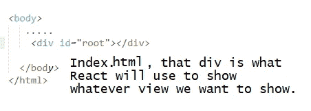
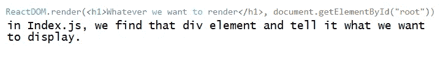
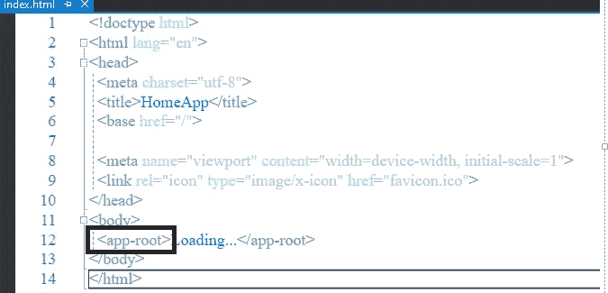
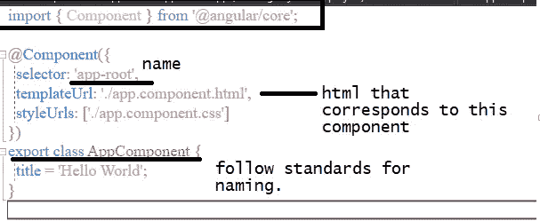
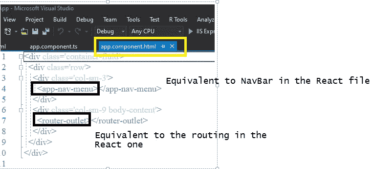
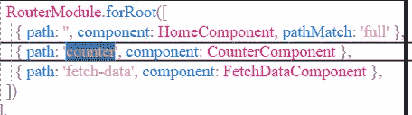
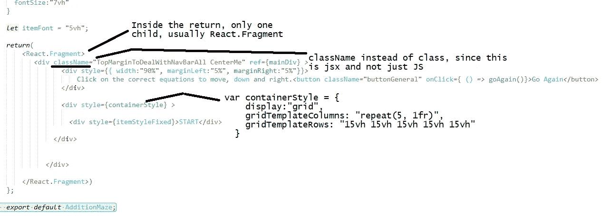
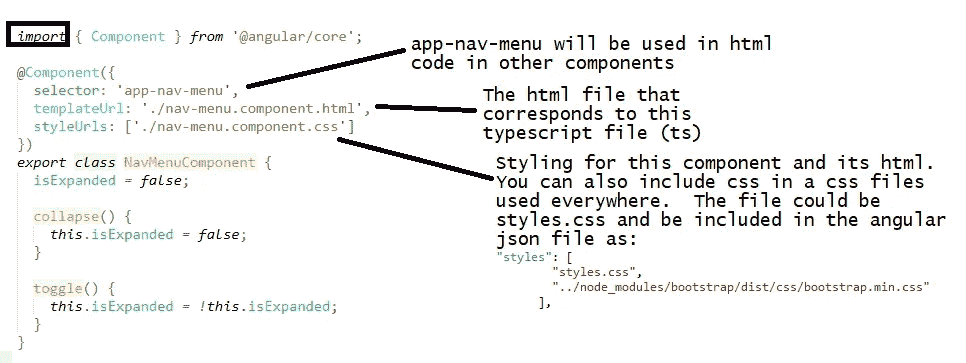
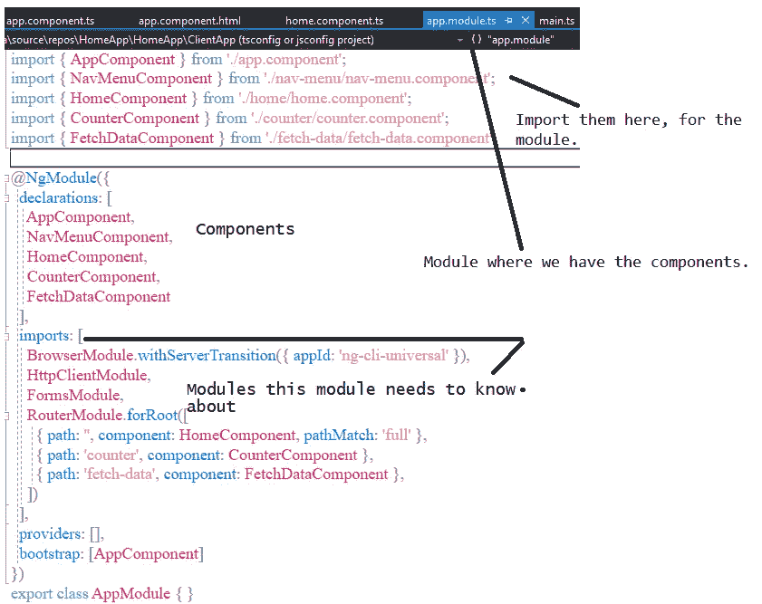

# 角度与反应:比较最基本的

> 原文：<https://medium.com/nerd-for-tech/angular-vs-react-compare-the-very-basics-776fd96fec23?source=collection_archive---------11----------------------->

我对反应和角度都不熟悉(对角度较新)，我想比较两者(一次一点)。我会随时更新，但这是我的开始。这假设已经为反应和角度创建了应用程序。

# 1-开始使用 React 运行应用程序

Index.html 是第一个出现的文件。它有一个 div，用于放置我们需要显示的任何内容。



带有路由的应用程序看起来会像这样(如果你想了解更多关于路由的信息，请参阅路由一文):

```
const **routing** = (
    <React.Fragment>   
        <div className="fragmentContainer"> 

         <**Router** baseline="/">
            <div>
                <**NavBar**/> 
                <**Switch**>
                    <**Route** exact path = "/"} **component**=  {LandingPage}/>                  
                    <**Route** exact path = **component**={bdpq}/>

                </**Switch**>                      
            </div>
        </**Router**> 

        </div>   
    </React.Fragment>

)ReactDOM.render(           
        **routing** ,      
    **document.getElementById('root'))**;
```

在 index.js 文件中，我们导入将要使用的组件，并根据路径决定在路由变量中要有什么组件，这将显示在根元素的呈现中。

# 2-开始使用 Angular 运行应用程序

我们也有 index.html 的档案，看起来像这样。注意,<app-root>组件将等同于 React 中的根元素。</app-root>



这是<app-root>来自的组件。请注意，我们在 html 代码中使用的名称是我们为组件中的选择器提供的字符串。</app-root>



但是将要显示的 html 代码在哪里呢？它就是上面在 templateUrl 下给出的那个。检查一下，我们发现:



对于 Angular，布线在 app.module.ts 中完成:



# 3-带 React 的基本组件

使用 React，您可以将组件创建为一个类或一个函数。接下来，首选的方法是使用函数，这就是我在这里要讲的。

在组件文件中，导入您需要使用的内容(在顶部):

```
**import** React, {useState, useEffect} from "react";
import MathOperationComponent from '../../Components/MathOperationComponent';
import { disableBodyScroll, clearAllBodyScrollLocks } from 'body-scroll-lock';
...
```

使用函数表单创建组件:

```
//with props as the argument if needed
**function** AdditionMaze (**props**) {
   window.scroll(0,0); //scroll to the top    
   let mainDiv = React.createRef();//if we need to access an element ...
    //whatever other functions you need to use.
   ...//using the below to avoid the window scroll when on an element
    useEffect( () => {
      disableBodyScroll(mainDiv.current);
      //for cleanup (will unmount)
      return function cleanup () {
         clearAllBodyScrollLocks();
      }
})...
//at the end of the file:
**export default** AdditionMaze;
```

有了组件所需的 JavaScript 代码，我们就有了 jsx 代码,“html like”代码使用了 JavaScript 代码的一部分。



因此，有了 React 组件、样式、html 和代码，我们可以将所有东西放在同一个文件中，并导入我们需要使用的东西(其他组件、React 的特性等)。

# 4-带角度的基本组件

有棱角的东西更有组织性(在我看来)，但我发现动画工作比反应有点奇怪。总之，一个基本的角分量大概是这样的:



有了 angular，我们就不必导入我们必须使用的所有其他组件。我们可以将组件添加到它们的模块中，并且我们可以从同一个模块中的其他组件访问它们。



在包含组件的 ts 文件中，我们还需要在组件中使用任何 JavaScript(在本例中为 typescript)函数、属性等。然后我们可以在 html 文件中访问它。

html 代码的一个例子可能是这样的，使用{{}}允许它访问 ts 文件中的属性(或方法):

```
<tbody>
   <tr *ngFor="let forecast of forecasts">
      <td>**{{ forecast.dateFormatted }}**</td>
      <td>{{ forecast.temperatureC }}</td>
      <td>{{ forecast.temperatureF }}</td>
      <td>{{ forecast.summary }}</td>
   </tr>
</tbody>
```

如果我们直接访问一个方法(函数),我们将使用带有函数名的()。

我们不仅可以显示 ts 代码中的内容。我们还可以使用 ts 文件中的变量来设置一个属性，如下所示:

```
<button **[disabled]** = **"itIsDisabled"** ...
```

上面，`disabled`与[]，i `tIsDisabled` 是 ts 文件中的属性名。要直接使用硬编码值，请不要包含引号。

如果绑定事件而不是属性，请执行以下操作(包括事件名称的():

```
..... **(click) = "onCreateValue()"** ...
```

这就是现在，但期待了解更多关于这一点。我不确定我最喜欢哪一个。我认为 Angular 似乎更有条理，但也许对于小组件来说 React 更快。我们走着瞧。我想学到足够的东西，看看我最喜欢哪一个，然后去争取:-)

如果你有偏好，我很想听听。