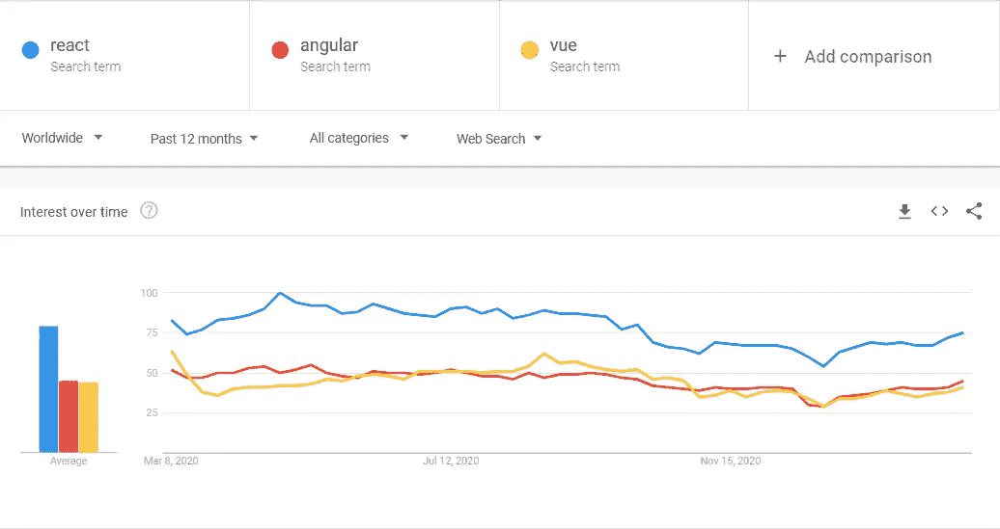
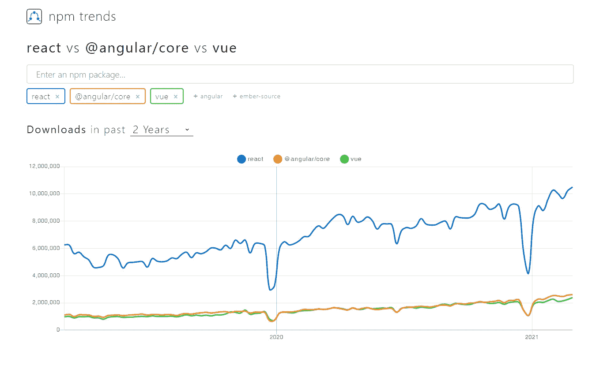
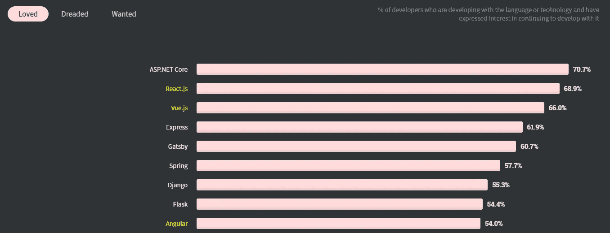
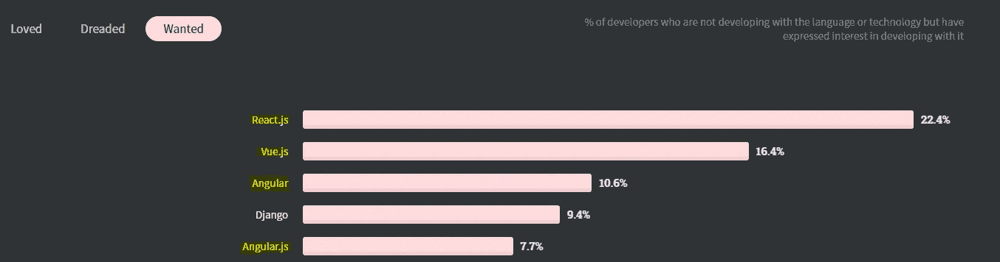
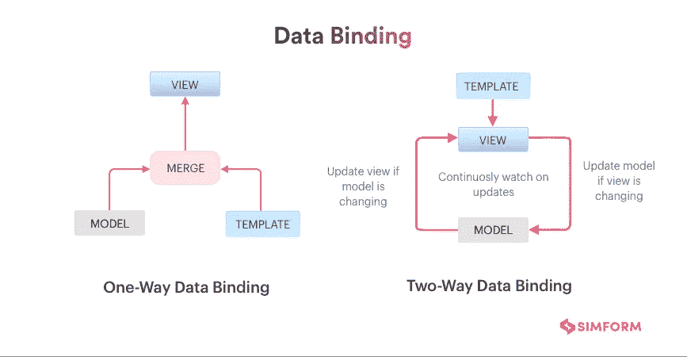
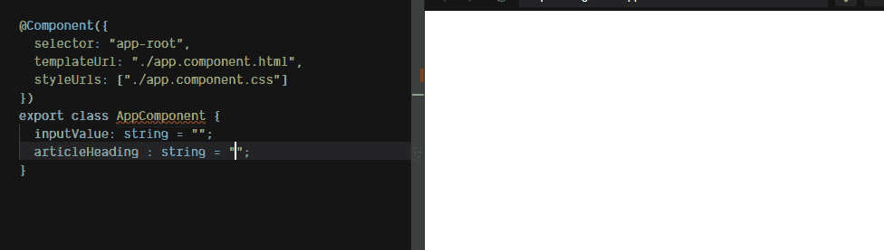
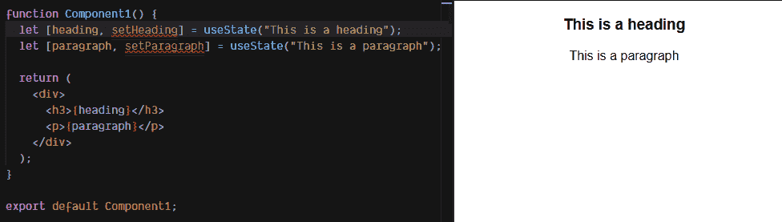
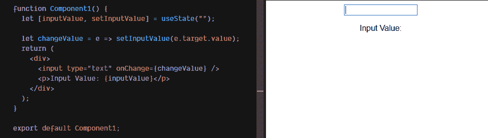
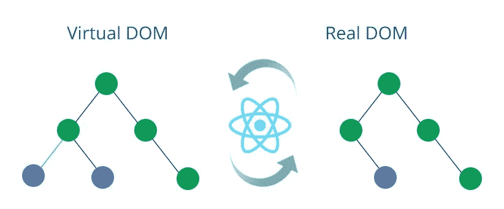

# Angular vs. React vs. Vue:哪个框架更好？

> 原文：<https://medium.com/nerd-for-tech/angular-vs-react-vs-vue-which-framework-is-better-6721d6f7b865?source=collection_archive---------21----------------------->


如果你是一个项目的开发人员，或者你想学习前端开发框架，你可能会遇到这三个 Javascript 框架:Angular，React，Vue。尽管这些框架已经存在了一段时间，但受欢迎程度从未下降。但真正的问题是*“哪个最好？”*，🤔

让我们来了解一下！🧐

# #背景🕵️‍♂️

在此之前，我们先做一些背景调查。

## **棱角分明**


*   **Angular** 是谷歌在 2010 年开发的。
*   基于类型脚本的 Javascript 框架。
*   最初是“AngularJS”，他们在 2016 年放弃并发布了“Angular 2”。
*   最新版本是 Angular 11，2020 年 11 月发布。
*   使用过:谷歌，微软，UPS，自由职业者，Xbox，Udacity，Udemy，iStock，耐克，福布斯，索尼等。

## 反应


*   **React** 由脸书于 2013 年研发。
*   它被认为是一个前端库(UI 库)而不是一个框架。
*   由于它不像 Angular 那样是一个完整的框架，所以高级功能需要第三方库。
*   最新版本是 17.0，2020 年 10 月发布。
*   使用过:脸书，Instagram，Whatsapp，优步，雅虎，Airbnb，Dropbox，可汗学院，Slack，微软，耐克，欧特克，Adobe，Udemy，Paypal 等。

## 某视频剪辑软件


*   Vue 是尤雨溪(前谷歌员工)在 2014 年开发的。
*   Vue 由开源社区驱动。
*   最新版本是 3.0，2020 年 9 月发布。
*   使用过:阿里巴巴，Grammarly，Adobe，小米，GitLab 和 Laracasts，Upwork，Behance，Livestorm 等。

# #受欢迎程度和社区支持🌐

## 为什么受欢迎很重要？

流行的框架总是会得到各自公司和社区的支持。所以它们不太可能在一夜之间消失。作为初学者，你可以接触到许多教程、文档、项目/资源库等。此外，就业市场也往往随着最常用的技术而变化。



根据 google trends，过去 12 个月的全球框架流行度



过去 2 年的 npm 包下载

在过去的几年里，React 一直在顶级货架上，而 Angular 和 Vue 正在争夺第二名。我在研究中注意到的是，以前使用 Angular 的大多数网站已经被转移到 React 或 Vue。这也意味着有了 React 你会有更多的工作机会。

但是社区 vice，你可能会发现 Angular 和 React 比 Vue 有更大的社区。



最受欢迎的 Web 框架—stack overflow 2020 年开发者调查

根据 2020 年 StackOverflow 开发者调查[，React.js 和 Vue.js 位列最受欢迎的 web 框架前三名，而 Angular 和 Angular.js 仍然排名较低。而 Angular.js 也被认为是最可怕的。](https://insights.stackoverflow.com/survey/2020#technology-most-loved-dreaded-and-wanted-web-frameworks)

然而，这三个框架仍然是开发人员最想要的 web 框架的前三名😃。



最受欢迎的 Web 框架—stack overflow 2020 年开发者调查

# #主要特性和概念💡

让我们来谈谈这些框架中的一些概念。

## 语言

**Angular** :使用 JavaScript 的一个超集，称为“TypeScript”。它意味着对来自面向对象编程背景的开发人员更友好。

**React:** 将 UI 模板和 JavaScript 逻辑结合起来，这就是所谓的**“JSX”。** React 只需要 Javascript 知识。

**Vue:** 分别使用 HTML，JavaScript，CSS。

## 成分

组件用于创建 UI 小部件。简单地说，组件接收输入并返回 UI 模板。这使得代码可重用。这三个框架都使用了这个概念。

在**中，角度**组件是指令的子集。指令将行为附加到 DOM 元素上。组件是一种特殊类型的带有视图或模板的指令。所以这些指令使得组件可以重用。

但是在**反应过来**这就不一样了。React 结合了组件的 UI 和行为。您可以使用函数和类(ES6)来定义组件。

另一方面，Vue 允许定制，你可以将 UI 和行为组合到一个组件中。

## 单向与双向数据绑定

数据绑定意味着业务逻辑和视图之间的数据同步。如果模型中的数据得到更新，视图应该呈现这种变化。



单向与双向数据绑定

在 **Angular** 中，你有**双向数据绑定**，如果你改变一个 UI 元素，相应的模型状态也应该改变。如果您更改了模型状态，那么 UI 元素也应该相应地更改。这是一个双向的过程。



角度视图绑定(字符串插值)的组件示例[(参考)](https://soshace.com/understanding-data-binding-in-react-and-angular/)

然而， **React** 只支持**单向数据绑定**。如果模型状态改变，相应的 UI 元素也会改变。但是如果你改变了一个不改变模型状态的 UI 元素。



在 React [(参考)](https://soshace.com/understanding-data-binding-in-react-and-angular/)中查看绑定的组件示例

默认情况下，视图无法更改模型状态。但是，仍然有一些方法可以在 React 中实现双向数据绑定。



React [(参考)](https://soshace.com/understanding-data-binding-in-react-and-angular/)中组件绑定的视图示例

这两个概念各有利弊，双向绑定更有效，但单向绑定更容易调试。

**Vue** 支持这两个概念，我们称之为反应式双向数据绑定。它会自动选择正确的方式来更新元素。Vue 使得使用 v-model 指令进行双向绑定变得很容易。让我们来看一个简单的例子([阅读更多](https://www.digitalocean.com/community/tutorials/vuejs-v-model-two-way-binding))。

这是组件数据方法:

```
data() {
  return {
    existentialQuestion: 'Am I truly an alligator?'
  };
}
```

和模板:

```
<h2>My deepest, darkest question: {{existentialQuestion}}</h2>
<input v-model="existentialQuestion"/>
```

[现场演示](https://www.digitalocean.com/community/tutorials/vuejs-v-model-two-way-binding)

# #性能📈

## 真实世界 vs 虚拟世界



虚拟 DOM 和真实 DOM

## 什么是 DOM？

> W3C 文档对象模型(DOM)是一个平台和语言中立的接口，它允许程序和脚本动态地访问和更新文档的内容、结构和样式——w3schools.com

DOM 就像一个界面，告诉你浏览器如何看到和读取你的 HTML 文档。我们称 HTML 的元素为“节点”。可以使用 Javascript 操纵这些节点。

## 什么是虚拟 DOM？

> 虚拟 DOM 是 DOM 的轻量级版本。

简单地把它看作是实际 DOM 的副本，但是您可以在不影响实际 DOM 的情况下进行修改。

*   **Angular** 使用真实 DOM，这意味着每次对象改变时真实 DOM 都会更新。
*   **React** 使用虚拟 DOM，其中 React 识别虚拟 DOM 中被改变的对象，并更新真实 DOM 中必要的部分。
*   Vue 也使用虚拟 DOM 作为 React 采用的概念。
*   这将极大地影响 web 应用程序的性能，React 和 Vue 的渲染速度会比 Angular 快。

**那么这有什么关系呢？**🤔嗯，操纵虚拟 DOM 比操纵真实 DOM 要快得多。因为真正的 DOM 必须到达每个节点并更新，这需要时间。但是虚拟 DOM 可以更新得很快，你只需要更新真实 DOM 中需要的部分，这样会更有效。而且虚拟 DOM 缺乏直接改变屏幕内容的真正能力。凡事都有利弊。🤷

## 启动性能

*   这意味着 web 应用程序加载和交互的速度有多快。
*   这包括**自己的代码+框架代码**。

Angular 倾向于拥有比 React 或 Vue 更大的包，我们可以假设 Angular 可能比其他两个框架花费更多的时间来加载。

## 运行时性能

*   这意味着网络对用户输入的反应有多快。
*   这包括**框架的内部结构+它如何处理 DOM 操作**。

在我看来，React 是这里的赢家，但它可能会在未来发生变化。😉

# #学习曲线📖

## 有角的

*   有着陡峭的学习曲线。
*   你可能需要学习像 MVC 架构、TypeScript 这样的概念来掌握 Angular。

## 反应

*   学习曲线不那么陡峭。
*   有指导性文档和教程。
*   常见问题的解决方案已经在 StackOverflow 中。

## 某视频剪辑软件

*   比有角的或有反应的容易学。
*   提供更高的可定制性。
*   更容易从反应/角度转换到 Vue。
*   简单灵活。

# #何时选择？🙄

## 有角的

*   对于非常大和复杂的项目。
*   具有动态内容的应用 *—高效的数据绑定*

## 反应

*   要求速度和多功能性的应用。
*   当你的前端不太复杂的时候。
*   一般网站，需要良好的搜索引擎优化。
*   当你的截止日期很紧的时候。

## 某视频剪辑软件

*   要求高性能的应用。
*   当项目范围较小时。
*   当应用程序需要轻量级时。
*   当你想将一个框架集成到一个现有的应用程序中时。

# #结论


**那么谁是 wins❓** 🙄

完全没有答案。他们都不是赢家。

等等！😳所以都不好？

不，我不是这个意思。所有这三种框架都有各自的优点和缺点。选择最佳选项完全取决于您的项目和您的个人要求。

这些并不是你唯一的选择。市场上有很多其他 JavaScript 框架可能是更好的选择。

最后，你不必一直坚持一个框架。你能学到的不止一个！😄

所以继续探索吧！！！🤓💪