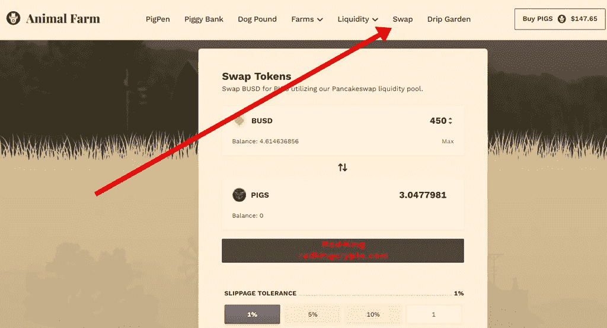
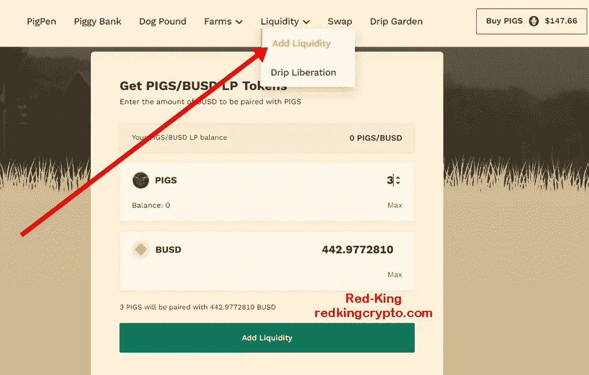
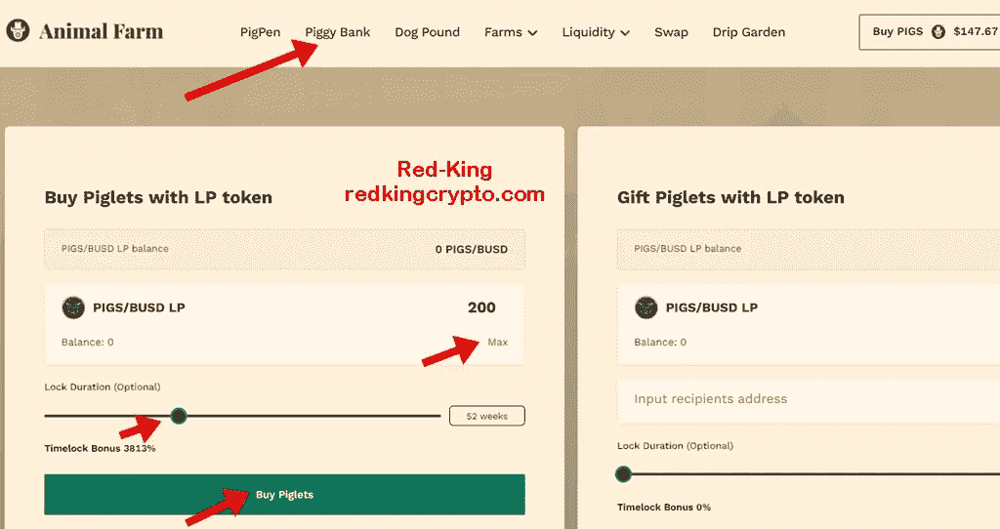
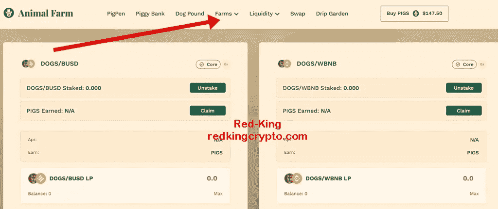
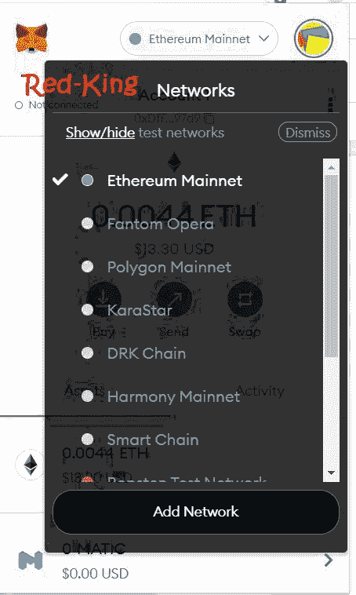

# 动物农场重新开放。存钱罐对我来说是一个很大的收入来源

> 原文：<https://medium.com/nerd-for-tech/animal-farm-re-opens-piggy-bank-has-been-a-great-earner-for-me-f8665c3096ee?source=collection_archive---------1----------------------->

## 所有的游泳池和农场终于又开放了。

今天的一些大新闻，很多人都在期待，是动物农场游泳池和农场的全面重新开放。

虽然我在很早的时候投资了[滴滴](http://drip.community/faucet?buddy=0xcF900B03d697149fEAa0D02Ee5e49cdD5643574f)，但在《动物庄园》刚推出时我并没有进入，实际上我只是在大约四个月前的重新推出时(取消暂停后)才决定投资。我对这个决定很满意， [**存钱罐**](https://redkingcrypto.com/animalfarm) 在这段时间里为我带来了一些丰厚的回报。

动物农场目前使用猪令牌(技术上它被称为 AFP，代表动物农场猪)，你现在可以在 [**动物农场**](https://redkingcrypto.com/animalfarm) **网站**上购买 AFP，然后将它们存入猪圈或存钱罐。储蓄罐是有史以来第一个非通货膨胀的可变时间赌注年金。

到目前为止，对我来说最有效的方法是购买猪，然后将它们与 BUSD 配对，然后将它们存入 [**存钱罐**](https://redkingcrypto.com/animalfarm) 。当你下注猪/BUSD LP 代币来赚取高达 3%的日投资回报率时，这对我来说是相当一致的。**我目前在存钱罐中有 12 种不同的赌注，**我在不同的时间开始投资，它们都有不同的时间锁定期，每天都在打印出色的奖励。

*******************************************************************

*   你可以在这里 [**加入我的电报群**](https://t.me/redkingcrypto) **。**
*   你可以在这里看到我所有的文章。

******************************************************************

# **如何投资存钱罐**

1.  在币安智能链上将一些 **BUSD** 放入您的 MetaMask 钱包中。(如果您不确定如何滚动到文章底部)
2.  前往[动物庄园站点](https://redkingcrypto.com/animalfarm)点击**交换**将你的一半 BUSD 交换给 AFP(正确的 AFP 地址是**0x9a 3321 E1 a CD 3 b 9 F6 debee 5 e 042 DD 2411 a 1742002**)。)

3.然后点击“添加流动性”(位于流动性按钮下方)添加流动性并创建一个 **BUSD/AFP 对。**

4.现在去 [**储蓄所**](https://redkingcrypto.com/animalfarm) 存入 LP，选择你想锁定多久。

对于额外的奖金，您可以选择锁定投资的时间，以获得相应的回报。例如，您可以选择锁定您的存款 5 周，并获得 12%的投资回报，或者您可以将投资锁定 156 周，并获得 149299%的巨额 timelock 奖金。

你也可以选择 0 周，这样你的资金就可以随时提取，但这对我来说没有太大意义。在储蓄罐中，你需要每 24 小时计算一次你的奖励，否则你将错过当天的 timelock 奖金。

所以这是我一直使用的主要策略。现在所有的泳池和农场都开放了，有多种策略可供选择:

你可以创建并入股 [**滴滴/BUSD LP** 来赚猪](https://redkingcrypto.com/af-farms)。然后你可以把这些猪押在猪圈里来获得 BUSD 奖励。

或者你可以关注 DOGS。[你可以把 DOGS 押在自动复利狗镑](https://redkingcrypto.com/af-farms)上，被动地赚猪。

或者你可以[在手动复利狗镑](https://redkingcrypto.com/af-farms)里押 DOGS 被动赚 BNB，还有很多其他选择。

探索[农场和游泳池](https://redkingcrypto.com/af-farms)看看什么最适合你。

***记住只使用风险资本****——你能“承受”损失的钱。换句话说，如果项目失败，你失去了投资，可能会有点痛，但不会让你破产，也不会让你承受严重的财务压力。做你的研究，享受赚钱的乐趣。*

*   *我最近最好的三笔投资分别是*[***Furio***](https://redkingcrypto.com/furio)[***财富山***](https://redkingcrypto.com/wealthmtn) ***和动物庄园的存钱罐。***
*   您可以在这里**加入我的电报组，在这里 [**推特上**](https://twitter.com/RedKingDefi) 和在我全新的 [**YouTube 上**](https://www.youtube.com/channel/UCtJMEcrr-PKYy6h_LgxSAtg) 与我联系。**
*   **你可以在这里看到我所有的文章。**
*   **我不是财务顾问。这不是一个财务建议，无论你在我的文章中读到什么，都是出于教育目的。**
*   **这些 defi 项目都是高风险、高回报的，只使用风险资本，小心谨慎。**
*   **本文包含会员链接。**
*   **这些锁桩 dApps 大多采用锁桩，这意味着您无法收回原始投资。**

# **发现这有帮助吗？**

**我希望你觉得这篇文章内容丰富。如果你喜欢这个故事，请鼓掌(最多 50 次),并在下面留下评论！这真的会帮助我。**

****我的文章没有得到 Medium 的报酬。****

**[跟我来**中等**](/@Red-King) 如果你想更多地了解**密码货币、被动收入、玩游戏赚钱和高产农业。****

# **没有元面膜？以下是如何设置它**

**您想做的第一件事是设置一个元掩码钱包(如果您还没有这样做)。只需打开 Chrome 或 Brave 浏览器，进入 *metamask.io* 并点击*添加 Chrome 扩展*。**

**然后，您需要将币安智能链添加到元面膜钱包中。**

**点击钱包中的*以太网*，然后向下滚动至*添加网络*。**

****

**单击该按钮并添加以下详细信息:**

**网络名称:智能链**

**新 RPC URL:[https://bsc-dataseed.binance.org/](https://bsc-dataseed.binance.org/)**

**链号:56**

**符号:BNB**

**block Explorer URL:[https://bscscan.com](https://bscscan.com/)**

****免责声明:** *此非财务建议，本文信息仅供参考。永远不要投资你输不起的东西。对于任何根据我文章中讨论的信息、想法或策略行事的人，我不承担任何责任或损失。做你自己的研究。***