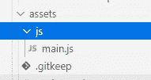

# 动画固定/粘性标题滚动角度

> 原文：<https://medium.com/nerd-for-tech/animate-fixed-sticky-header-on-scroll-in-angular-e2b68dc63791?source=collection_archive---------0----------------------->

> 这篇文章是关于粘性标题的，我们如何在我们的 angular 应用程序中快速的使用粘性标题，以及我们如何在 scroll 上使用这个例子。

粘性标题或固定标题是指即使我们向下滚动到页面，它们仍然粘在页面顶部。今天有许多网页设计师采用粘性标题作为一种方式来安排和构建一个网站，为用户提供更好的导航。粘性标题有助于在 web 应用程序和移动应用程序的多个页面之间快速导航。

如果我们用普通的 html CSS 建立一个网站，应用 JavaScript 很容易，但是在 angular 中，许多初学者面临着将 JavaScript 逻辑应用到我们的 html 元素的挑战。因此，在这篇文章中，你将得到一个合适的解决方案，从这个方案中你将能够在 angular 应用程序中添加 javascript。这篇文章将指导你如何设计粘性标题，以及如何在滚动条上应用不同的样式。

首先，我们将使固定标题，然后将应用样式来制作动画

让我们开始…

# 第一步:创建你自己风格的页眉

**app【app.component.html】>T22**

```
<div class="background">
    <div class="head">
        <h1 class="text">HEADER</h1>
    </div>
</div>
```

## 步骤 2:应用 CSS

**app>>app . component . CSS**

```
.background {
    height: 1500px;
    width: 100%;
}

.head {
    border-bottom: 3px solid #1f6a7d9c;
    padding: 15px;
    width: 100%;
    z-index: 99;
    background: white;
    position: -webkit-sticky;
    position: fixed;
    height: 120px;
    transition: 0.3s;
    box-shadow: 0 3px 3px 0 rgba(0, 0, 0, 0.14), 0 1px 7px 0 rgba(0, 0, 0, 0.12), 0 3px 1px -1px rgba(0, 0, 0, 0.2);
}

.text {
    text-align: center;
    font-size: 50px;
    color: black;
}
```

## 第三步:在 angular 应用中添加 JavaScript 文件。

要将 JavaScript 逻辑代码应用到 angular 中的 html 元素，我们需要在 asset 文件夹中添加 JavaScript 特定文件。任何外部文件，即你的 angular 项目中存在的 JS/CSS 都应该在 index.html 定义，否则该特定文件的逻辑将无法工作。

**首先在 assets 文件夹下创建一个 main.js 文件，如图**



在 index.html 文件中定义 main.js 文件标签在<app-root>标签后的标签中。</app-root>

**index.html**

```
<script src="assets/js/main.js"></script>
```

注意:在添加 main.js 文件之前添加 jQuery 库

**然后将下面的代码粘贴到 main.js 文件中**

**资产>>js>>main . js**

```
$(document).ready(function () {
    var header = $(".head");
    var text = $(".text")
    $(window).scroll(function () {
      var scroll = $(window).scrollTop();
      if (scroll >= 30) {
        header.addClass("scrolled");
        text.addClass("text_style");
      } else {
        header.removeClass("scrolled");
        text.removeClass("text_style");
      }
    });
  });
```

**在 css 文件中添加 scrolled 和 text_style 类属性为**

**app>>app . component . CSS**

```
.scrolled {
    transition: 0.3s;
    background: #84bcd8f8;
    height: 80px;
    border-bottom: 2px solid #1f6a7de1;
}.text_style {
    font-size: 30px;
    color: white;
}
```

## 你的 CSS 看起来会像

**app>>app . component . CSS**

```
.background {
    height: 1500px;
    width: 100%;
}.head {
    border-bottom: 3px solid #1f6a7d9c;
    padding: 15px;
    width: 100%;
    z-index: 99;
    background: white;
    position: -webkit-sticky;
    position: fixed;
    height: 120px;
    transition: 0.3s;
    box-shadow: 0 3px 3px 0 rgba(0, 0, 0, 0.14), 0 1px 7px 0 rgba(0, 0, 0, 0.12), 0 3px 1px -1px rgba(0, 0, 0, 0.2);
}.text {
    text-align: center;
    font-size: 50px;
    color: black;
}.scrolled {
    transition: 0.3s;
    background: #84bcd8f8;
    height: 80px;
    border-bottom: 2px solid #1f6a7de1;
}.text_style {
    font-size: 30px;
    color: white;
}
```

当我们向下滚动时，将应用 CSS 属性滚动类

完成的..！

如有任何疑问，请在下方评论。

快乐编码🙂