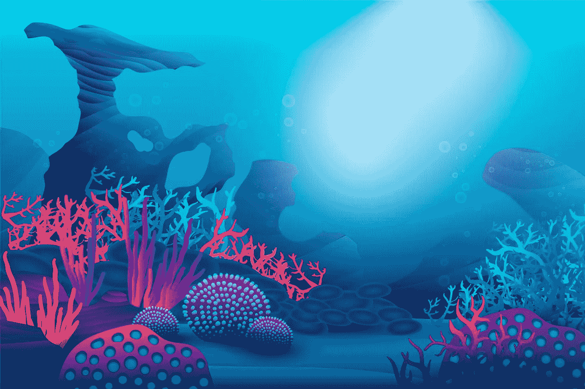

# 动画鱼运动

> 原文：<https://medium.com/nerd-for-tech/animated-fish-locomotion-c6ab5232c18f?source=collection_archive---------4----------------------->

仅 html 和 CSS

在这里，我将向你描述如何只用 html 和 CSS 创建动画鱼的移动。

## 步骤 01

创建一个包含以下代码的 html 文件。

pond.html

## 步骤 02

创建一个包含以下代码的 CSS 文件。

pond.css

## 步骤 03

请确保将 sea.jpg 图像也添加到代码中。

sea.jpg

让我们开始编码，享受一下乐趣。

如果你在创作这部动画时有任何疑问，请联系我。

祝你有愉快的一天…