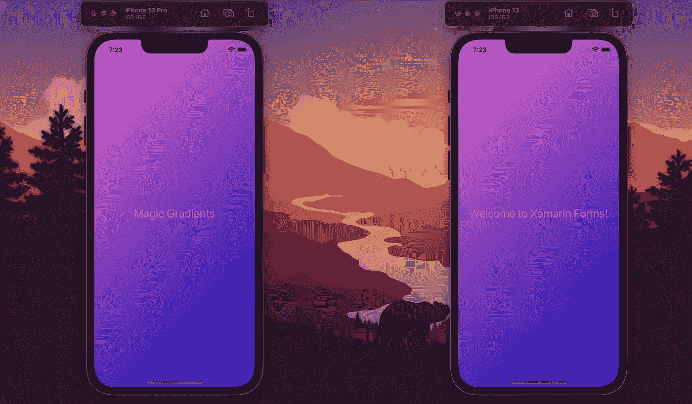
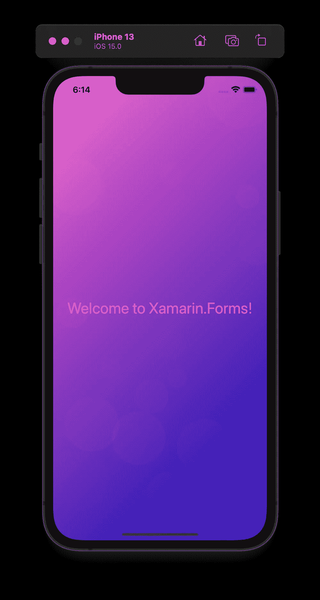
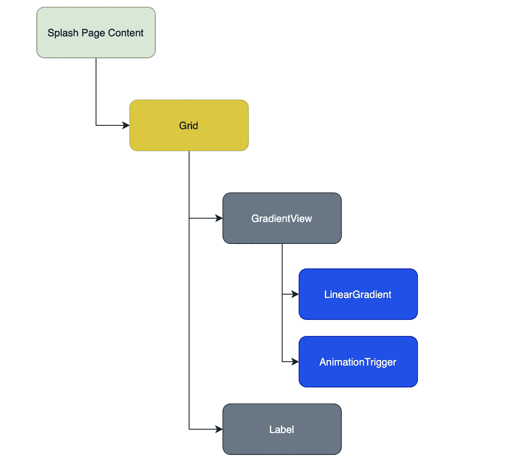
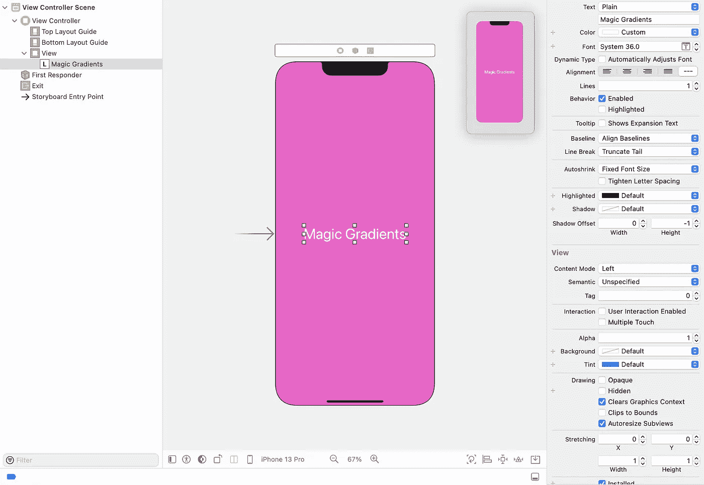

# 带有魔法渐变的动画启动画面

> 原文：<https://medium.com/nerd-for-tech/animated-splash-screen-with-magic-gradients-3f372af65c07?source=collection_archive---------0----------------------->

魔法渐变闪屏

## 如何制作带有动画魔术渐变的闪屏？这些闪屏的利与弊。这里会出什么问题呢？

嗨，伙计们，我们所知道的是我们可以使用图像作为启动画面。另外，你们中的一些人知道我们可能会用`LottieAnimationView`作为一个动画启动画面。类似地，这给了我一个想法，我们可以使用魔法渐变和动画来构建一个“自定义闪屏”和一些动画。

因此，我们将如何做:

*   移动所有初始化(仅保留 Xamarin。表单)从默认位置到特殊界面。
*   添加新的 Xamarin。表单页面——这将是我们新的闪屏。
*   当向用户显示动画时，在新页面初始化所有。

很简单——对吗？这样的话，我们来详细描述一下每一步。

 [## GitHub-bbenetskyy/magics plash Screen:带有魔法渐变的闪屏

### 带魔法渐变的闪屏。在…上创建帐户，为 bbenetskyy/MagicSplashScreen 开发做出贡献

github.com](https://github.com/bbenetskyy/MagicSplashScreen) 

# 初始解

我们有一个漂亮的主页，我们的可怕的应用程序。但是在每个🥺.平台上加载所有的 NuGet 包和初始化所有需要的组件需要 5 秒钟这是可悲的。但是！我们认为，如果展示一些流畅的动画，我们可以让等待时间不那么无聊。

在这种情况下，我们需要创建一个新的接口，将所有平台初始化从 Android 的`MainActivity`中的`OnCreate`方法和`AppDelegate`中的`FinishedLaunching`方法中转移出来。

让我们把它命名为`IPlatformInitializer`并放在我们的 Xamarin 中。表单项目:

> 备注:在内部，我将使用[简单的注入器](https://www.nuget.org/packages/SimpleInjector/) IoC 容器，但是所提出的解决方案适用于任何现代 IoC 提供者。

# Android 平台初始化器

让我们创建`AndroidPlatformInitializer`类并实现`IPlatformInitializer`。为此，我们需要在 Xamarin 之后移动所有可以初始化的东西。从`MainActivity`中的`OnCreate`方法开始，并将我们的实现注册到 IoC 中。

# iOS 平台初始化器

让我们创建`iOSPlatformInitializer`类并实现`IPlatformInitializer`。为此，我们需要在 Xamarin 之后移动所有可以初始化的东西。从`AppDelegate`中的`FinishedLaunching`方法开始，并将我们的实现注册到 IoC 中。

是的，我知道 1-1 就像我们已经为 Android 🥱做的那样，但是等等，接下来我们将创建动画魔法渐变背景。

# Xamarin。表单启动页面

现在让我们在 Xamarin 项目中创建`SplashPage`。我们可以在没有任何页面模型的情况下创建它，因为我们不打算制作一些复杂的逻辑。在构造函数内部的代码后面，我们需要将`BindingContext`设置为`true`，这是绑定`AnimationTrigger`的`IsRunning`所必需的，因为我们不能只在 XAML 内部设置`True`的值。如果我们使用标准 MVVM 体系结构，这不是问题，但是在我们不打算使用视图模型的情况下，我们需要使用卑鄙的手段🤪。

在`OnAppearing`方法中，我们需要设置所有的依赖项，然后在`Main Thread`上更改一个`MainPage`。

我不确定用两个词来解释元素应该如何放置在 XAML 内部是不是很容易。因此，我创建了一些图表，展示了元素在页面中的位置:

现在，我想我们可以解释如何制作带有渐变的动画。我们将创建`GradientView`来填充和扩展整个空间。这是我们的背景。它应该有两个相同的颜色梯度。其中一个应该是用`ColorAnimation — AnimationTrigger`换的。此外，我们需要设置动画`RepeatBehavior=”Forever” AutoReverse=”True”`和持续时间——不要太快也不要太慢——`Duration=”3000"`(3s)。在它的顶部，我们放置了一个白色标签，上面有文字“魔法渐变”。就这样，很简单，对吧？😱

现在来看看`App.xaml.cs` MainPage 到 SplashPage 的变化:

`MainPage = new SplashPage();`

现在，我们的应用程序从短白屏和我们美丽的动画渐变背景开始。这还不算太糟，我们甚至可以带着它离开。但是我们可以从渐变的初始颜色开始，让用户看不到平台页面的变化过程。

# Android 原生闪屏

有一千个例子可以说明如何做到这一点，但我会用另一种方法😅。我试着根据例子用`TextView`分开闪屏 XML 文件，但是它对我不起作用。我不认为用透明背景制作文本是一个好主意，所以我只改变了我们主要活动中的一种背景颜色，没有创建任何其他颜色。有益的是，由于在开始时只有一个活动而没有其他的 NuGet 初始化，它启动得相当快。

# iOS 原生闪屏

这里也是一样，只需放置一个 xCode 的截图，显示我只是改变了背景色，并添加了一个白色文本“Magic Gradients ”,字体大小和字体家族与 Xamarin Splash Page 相同。此外，不要忘记检查 info.plist 文件，并确保我们的启动屏幕.故事板链接到那里，这一点非常重要。

`<string>Launch Screen</string><key>CFBundleName</key>`

就这样，伙计们！请关注我的 Twitter 账户，获取关于我的博客帖子或演讲的所有更新🙃 😉。祝你的项目好运😋

[https://twitter.com/bbenetskyy](https://twitter.com/bbenetskyy)

[github.com/bbenetskyy](http://github.com/bbenetskyy)