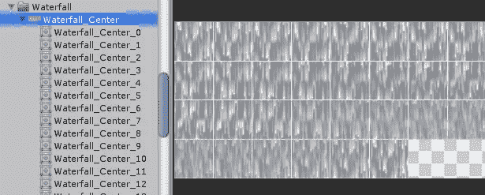
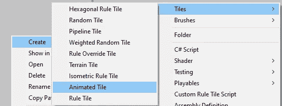
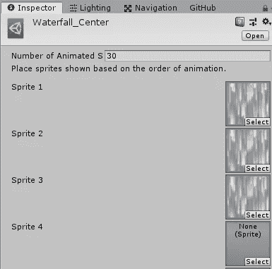
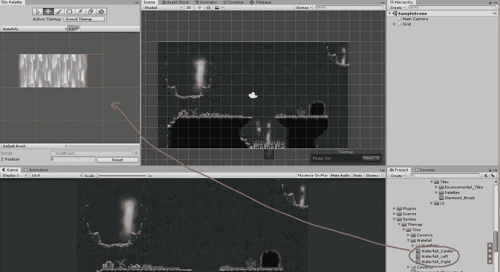
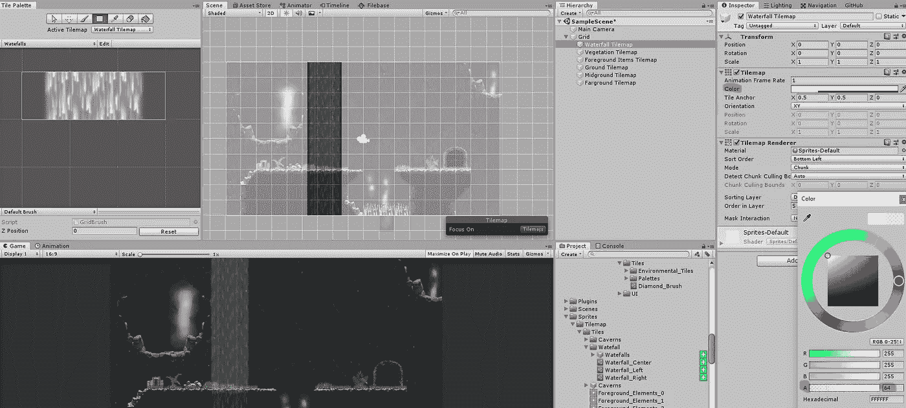
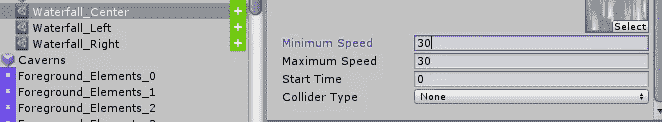

# 动画瓷砖精灵

> 原文：<https://medium.com/nerd-for-tech/animated-tile-sprites-de8b6b9e3287?source=collection_archive---------10----------------------->

目标:创建一个动画 tileset。

我们将创建一个由动画精灵组成的瀑布。我们开始像平常一样切割 sprite 工作表。

进入*创建→平铺→动画平铺*。

现在我们将设置动画精灵的*数量*来匹配我们的工作表中精灵的数量(在这个例子中，30 个)。不幸的是，我们必须单独设置每个 sprite 我们不能只拖动它们(至少从 Unity 2018.4 开始)。

我们将这样做三次:瀑布的左侧、中间和右侧各一次。

接下来，我们将创建一个新的*瓷砖面板*，将我们的三个动画瓷砖拖入其中，并进入*编辑*模式来重新定位它们。

现在，我们将创建一个新的 tilemap，并用瓷砖进行绘制。我们将设置这个贴图的*颜色 Alpha* 来给瀑布一些透明度。

最后，我们将三个动画块的动画速度调整为每秒 30 帧。

当我们玩我们的场景时，我们会看到动画瀑布！