# 动画瓷砖| Unity

> 原文：<https://medium.com/nerd-for-tech/animated-tiles-unity-a9fa47103296?source=collection_archive---------2----------------------->

## 统一指南

## 关于如何在 Unity 中引入动画效果的快速指南

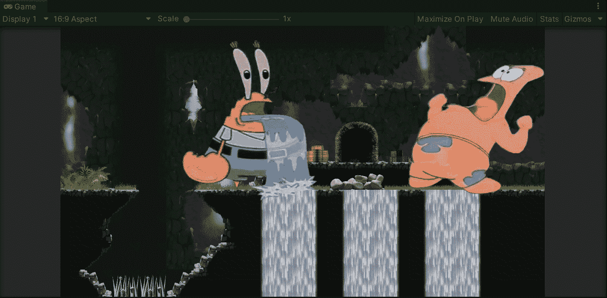

**目标**:在 Unity 开发的 2D 环境中引入动画效果。

在上一篇文章中，我介绍了在 Unity 中使用 tilemaps 的[。现在，是时候在 Unity 的新 2D 环境中引入动画效果了，让游戏看起来更漂亮。](/nerd-for-tech/introduction-to-tilemap-unity-394ec63f6e18)

如果你读了上一篇文章，你会记得我们使用 tilemaps(包含在 Unity 项目的 2D 模板中)来设计我们游戏的关卡:

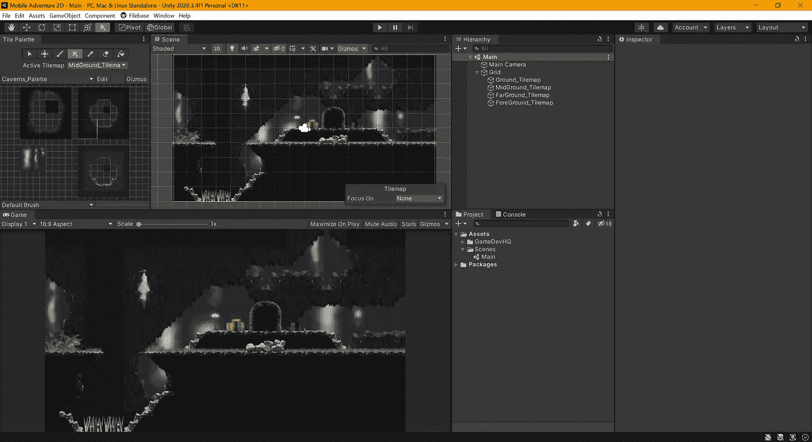

# 导入 2D tilemap extras

现在，为了在我们的环境中引入动画效果，让我们从 Unity 注册表中导入 2D tilemap extras 包。为此，让我们首先打开**项目设置**，并启用**包管理器**选项卡上的 ***启用预览包*** 选项:

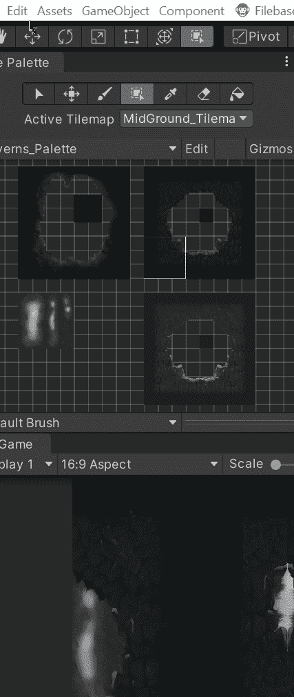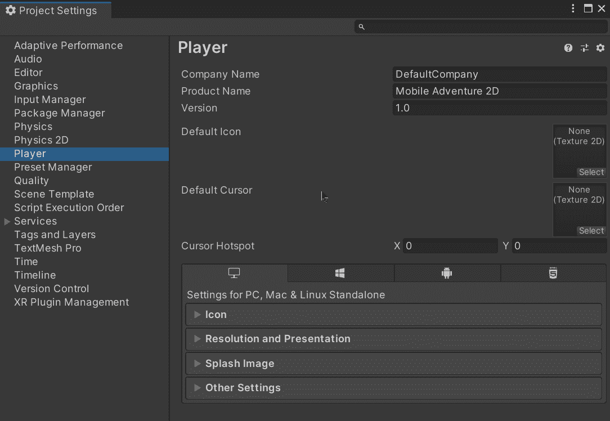

一旦启用，我们将能够在 Unity 注册表上预览 2D tilemap extras 包。要将包导入我们的项目，让我们打开**包管理器**窗口，然后点击右下角的*安装*按钮:

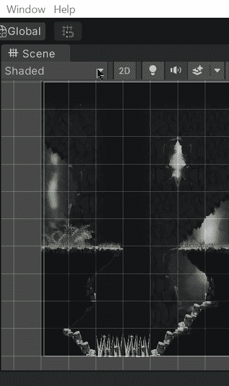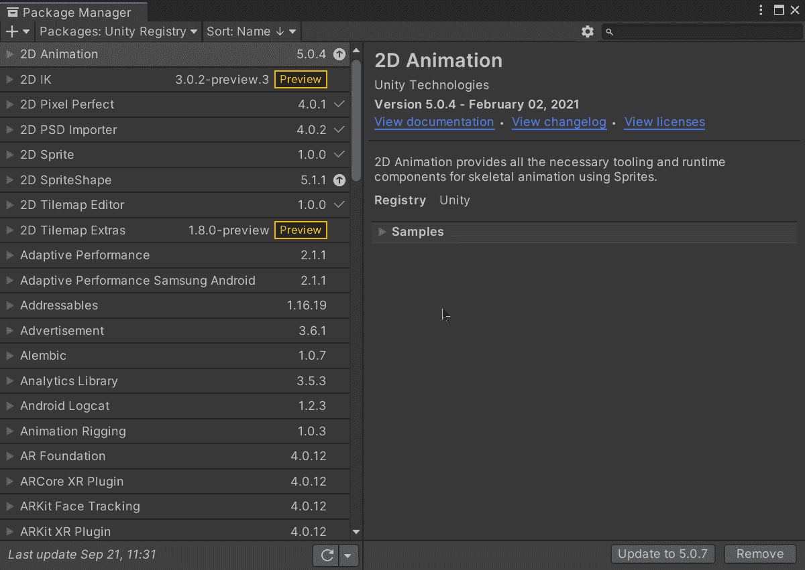

# 创建动画单幅图块

接下来，为了开始创建我们的第一个动画瓷砖，让我们编辑和切片各自的精灵表。在这种情况下，我将使用 3 个精灵表来创建动画瓷砖，当一起使用时形成瀑布:

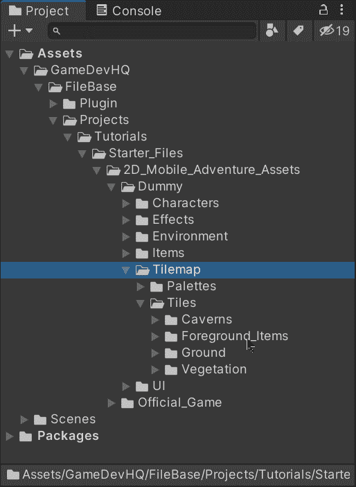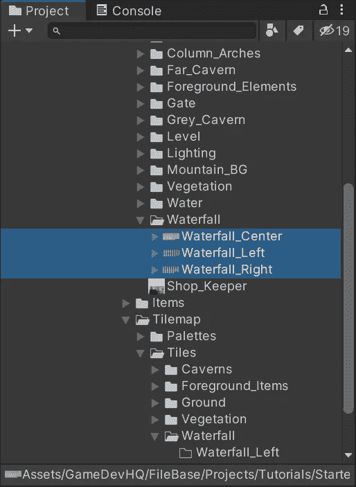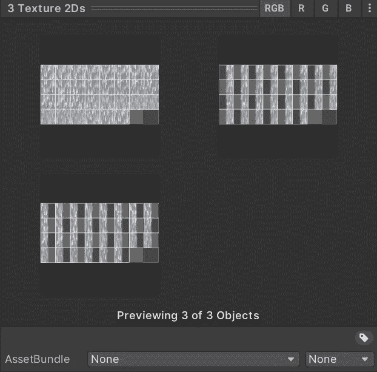

就像我们在[上一篇文章](/nerd-for-tech/introduction-to-tilemap-unity-394ec63f6e18)中所做的一样，让我们编辑 sprite sheet 属性，并根据其大小对图像进行切片:

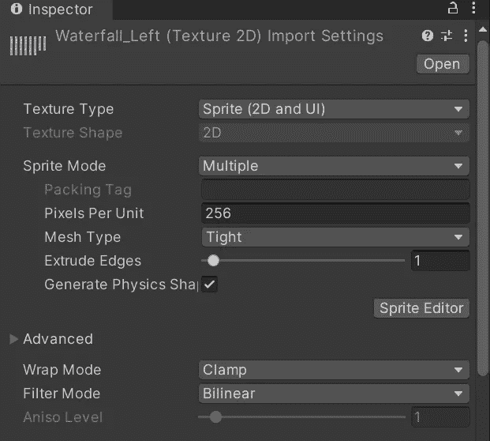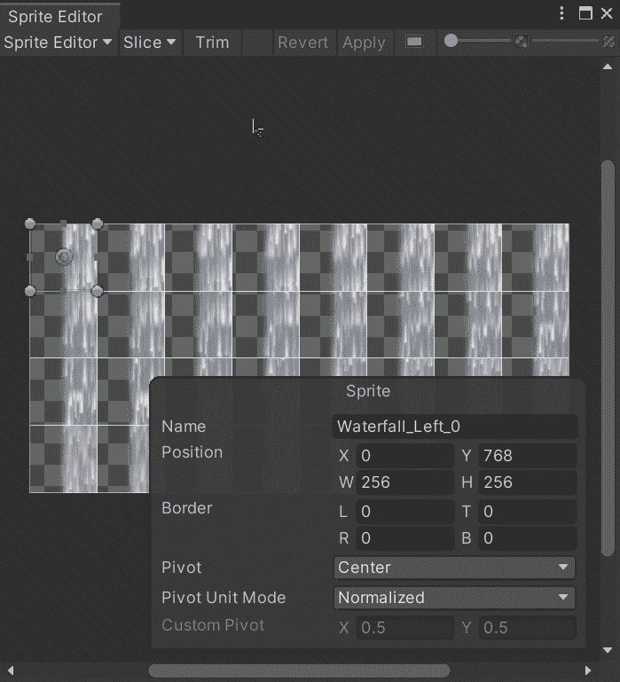

然后，要创建第一个动画区块，让我们用鼠标右键单击新文件夹上的**然后单击*创建> 2D >区块>动画区块*:**

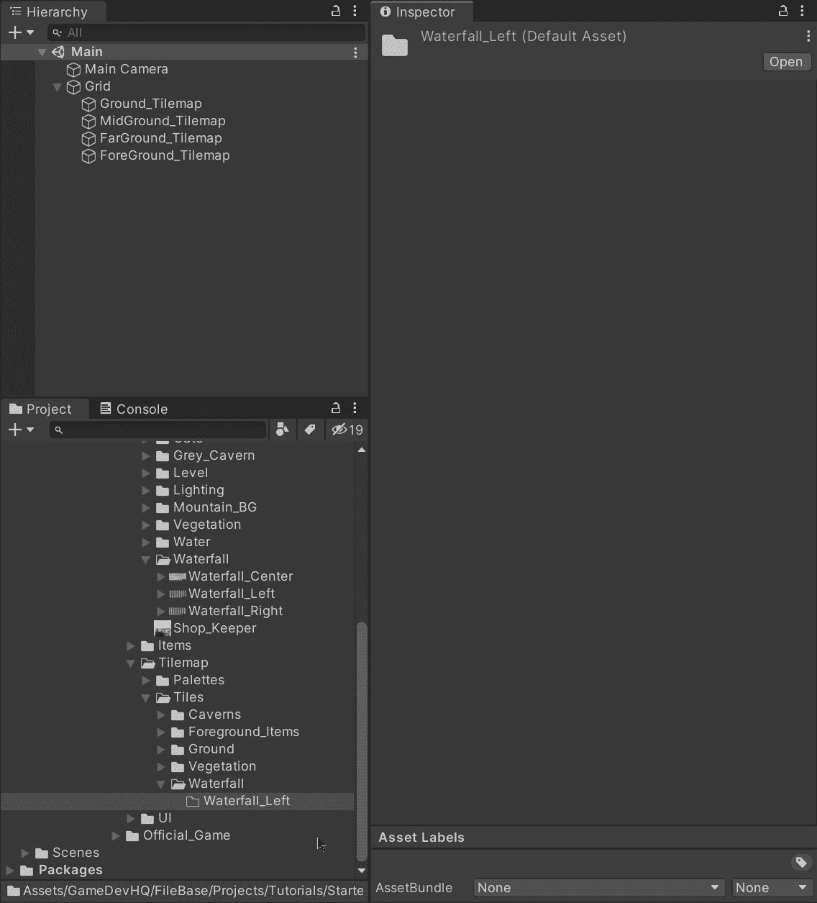

一旦动画瓷砖被创建，让我们选择它，并拖动各自的精灵表到检查器。这将设置游戏运行时图像显示动画帧的顺序。

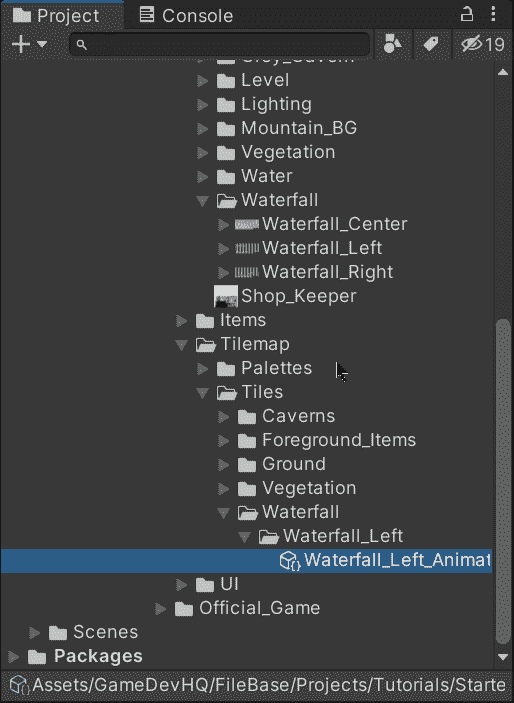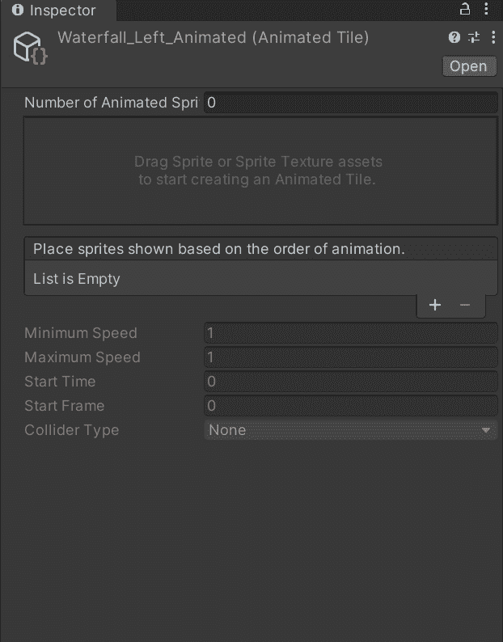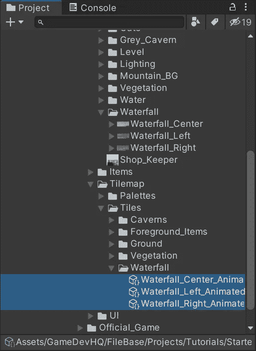

让我们对其他精灵表也做这些步骤。

# 使用动画单幅图块

现在，为了能够在我们的环境中使用动画图块，让我们在**图块调色板**窗口中创建新的调色板。创建完成后，让我们将动画图块文件拖动到窗口中:

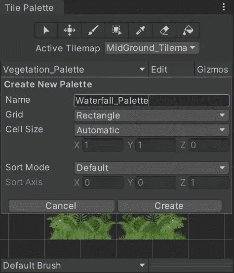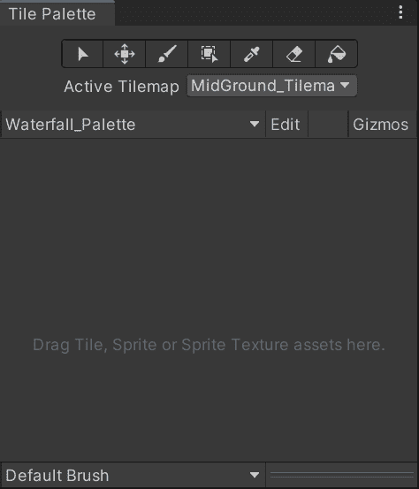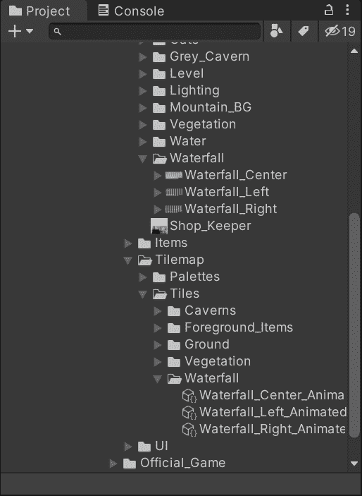

然后，我们可以使用平铺调色板窗口中的工具来 ***绘制*** 我们环境中的动画瀑布:

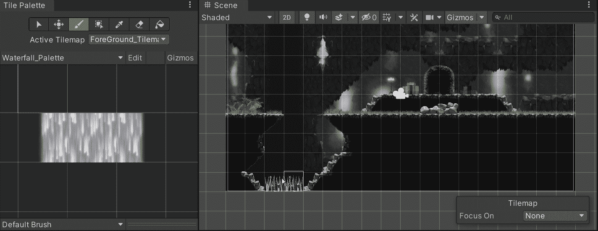

如果我们运行游戏，我们将能够看到动画瓷砖根据提供的精灵表更新它们的精灵:

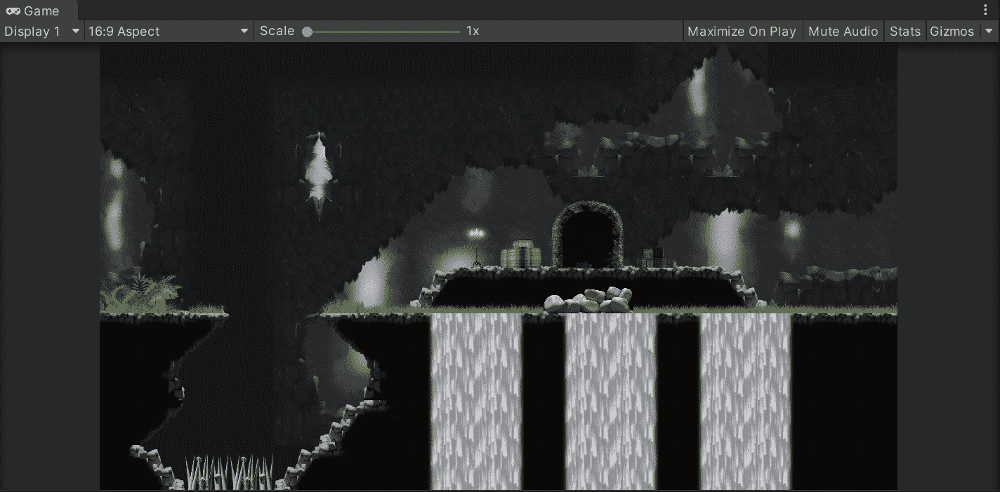

精灵以默认速度 1 更新。

# 修改动画速度

如果我们希望动画更快，我们可以通过选择动画平铺文件来修改速度，然后更改检查器底部的速度值:

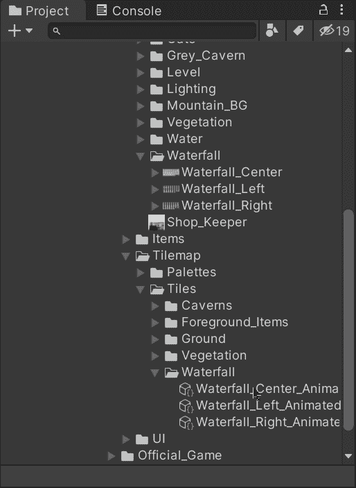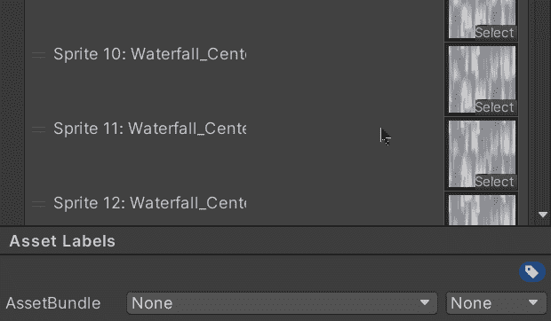

这将导致动画每秒更新 30 次。

现在，如果我们用 Unity 运行游戏，我们会看到动画效果更好，速度更快:

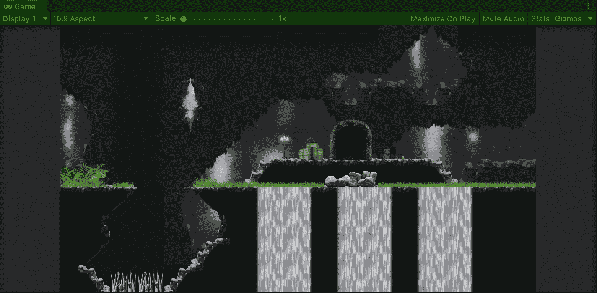

就这样，我们用 Unity 在 2D 手机游戏中引入了动画效果。:d .下一篇文章再见，我将展示如何在 Unity 中为 2D 环境设置我们的播放器。

> *如果你想更多地了解我，欢迎登陆*[***LinkedIn***](https://www.linkedin.com/in/fas444/)**或访问我的* [***网站***](http://fernandoalcasan.com/) *:D**