# 动画我们的球员第二部分和相机控制

> 原文：<https://medium.com/nerd-for-tech/animating-our-player-part-2-and-camera-control-d3a5e81a435e?source=collection_archive---------8----------------------->

现在我们已经实现了我们的基本动画，让我们来看看放入一些攻击动画。我们首先要练习的是剑在运行或空闲状态下的基本摆动。这是一个非常简单的设置，因为我们将它作为一个触发事件。首先，我们将把它放在我们的 animator 窗口中，并对不同事件的排列顺序进行一些调整，以使它更简洁:

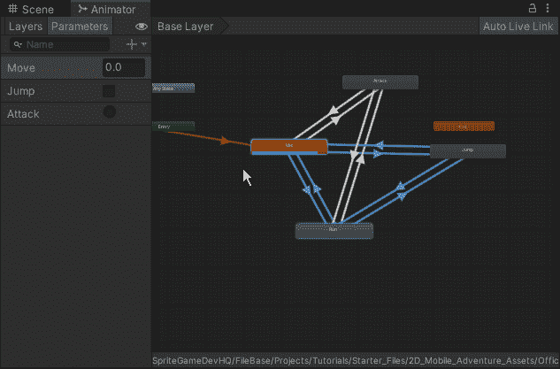

接下来，我们将进入脚本，创建攻击背后的逻辑:

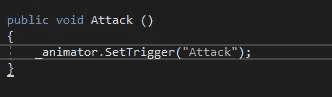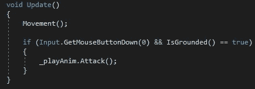

有了这个，我们现在可以检查它在我们游戏中的样子了:

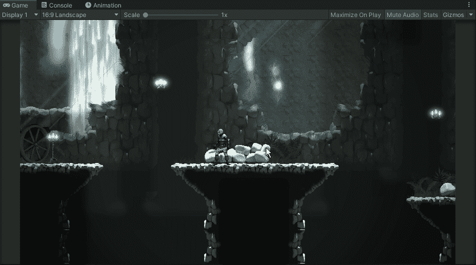

现在我们已经有了攻击动作，让我们看看如何实现一个方法来产生一些伴随着挥剑的效果。首先，我们将在玩家下面创建一个新精灵，并调整我们的剑弧的值和速度:

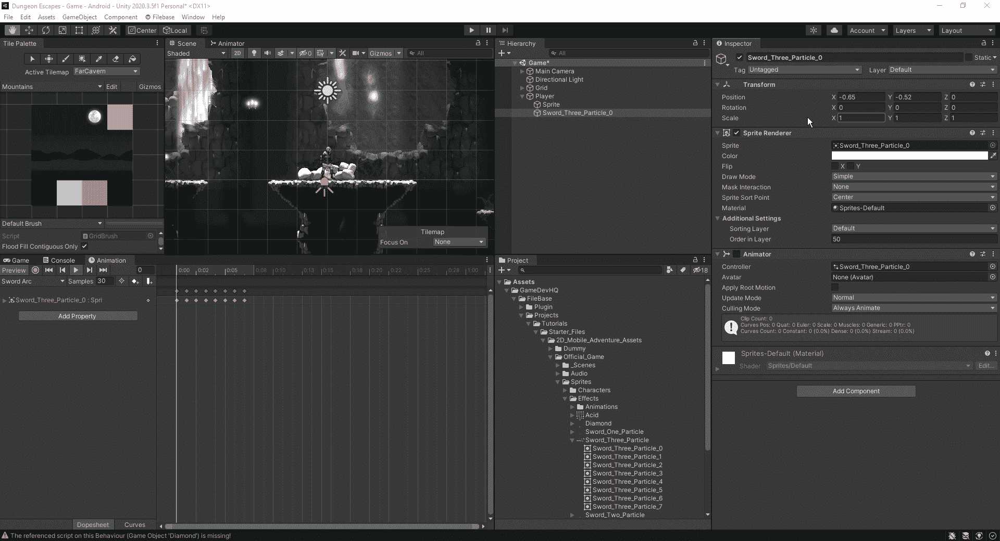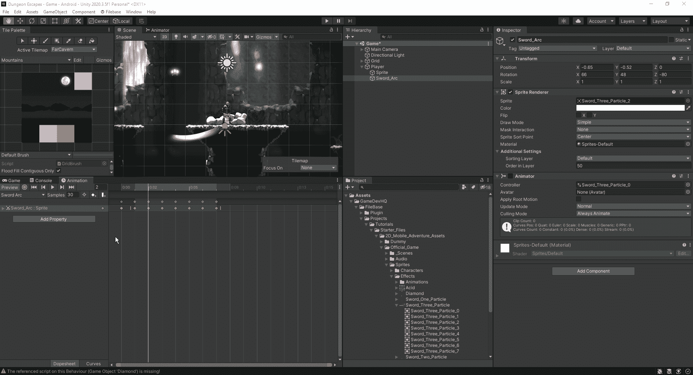

接下来，让我们通过首先创建激活它所需的参数来将它连接到我们的动画:

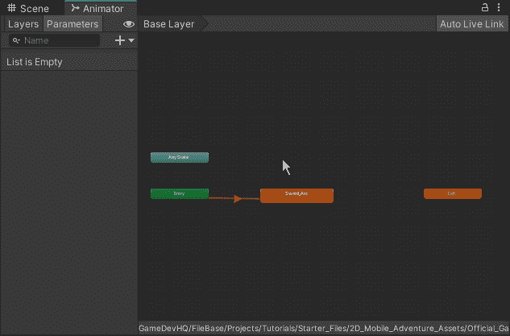

现在让我们来看看我们是如何进行编码的:

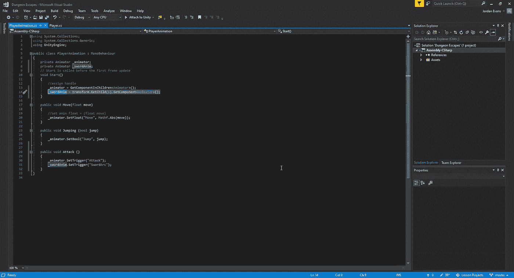

当我们希望从不同的子对象中获取动画时，我们需要稍微改变获取组件的方式。我们告诉 Unity 的是，我们想从一个指定的对象中抓取我们的动画师。现在我们已经设置好了，我们可以在我们的游戏中测试它:

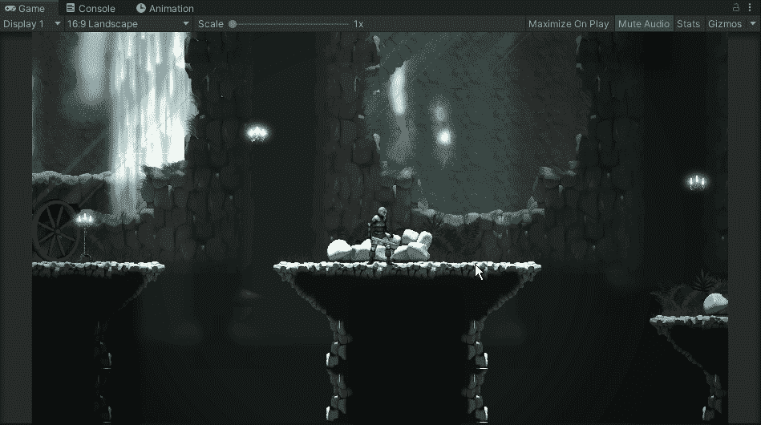

因此，我们有一个工作动画，但是它与我们的球员的挥杆不同步。为了调整这一点，我们可以看看一些不同的方法，让所有的工作在一起。最终，我们可以像这样排列我们的动画:

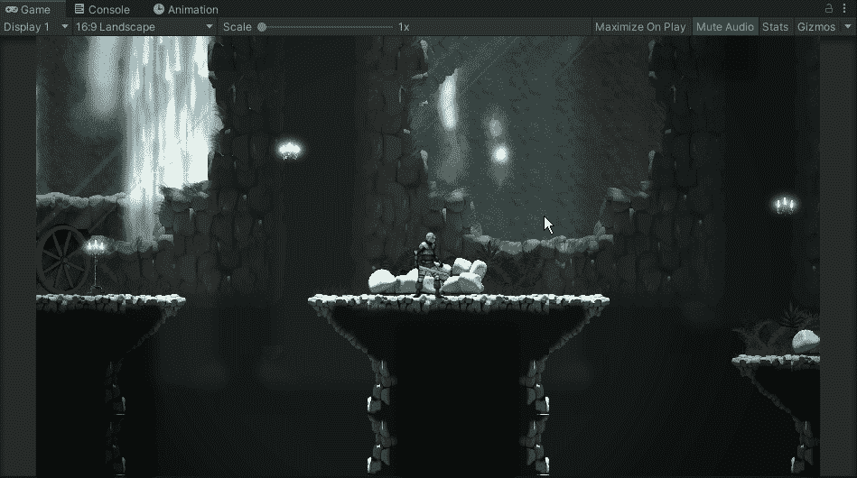

接下来，让我们使用我们的播放器，让剑弧动画在正确的一侧播放:

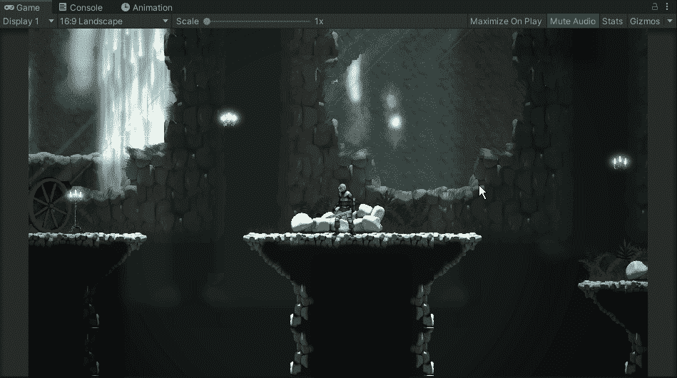

正如我们所见，它只在角色的一侧播放。要改变这一点，我们需要调整对象的一些方面，以便它可以在玩家改变方向时旋转:

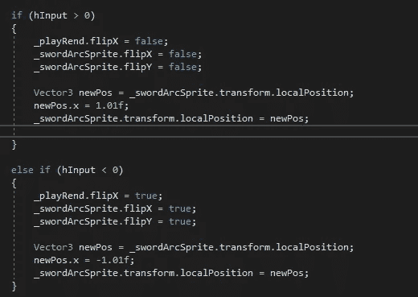

正如我们所看到的，我们只需在 x 和 y 轴上翻转我们的对象，并根据我们面对的方向将 x 轴上的精灵位置更改为正或负:

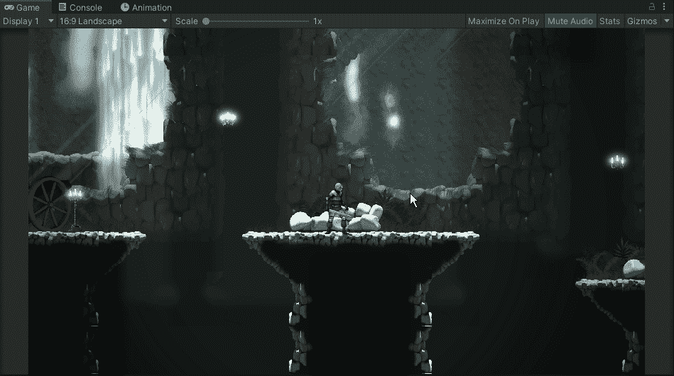

现在我们已经有了用剑攻击的动画，并且 vfx 正在工作，让我们快速添加一个 CineMachine 摄像机来跟随我们的玩家:

现在我们有了跟随玩家的摄像机和一个攻击动画，我们现在可以在游戏中加入一些敌人的元素了。