# 动画播放器| Unity

> 原文：<https://medium.com/nerd-for-tech/animating-player-unity-5e04ba44fb19?source=collection_archive---------4----------------------->

## 统一指南

## 关于如何在 Unity 中制作 3D 播放器动画的快速指南

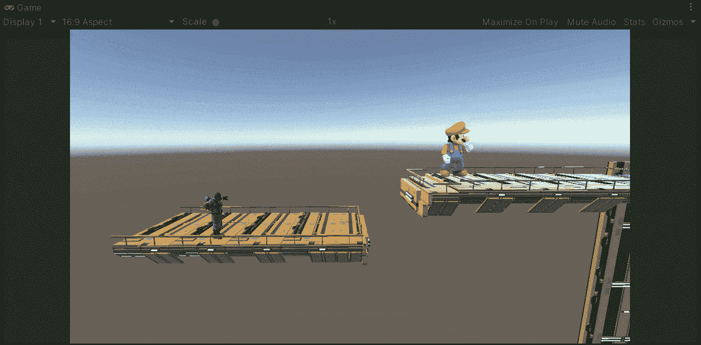

**目标**:用 Unity 制作我们玩家的 3D 模型动画。

在上一篇文章中，我介绍了[如何通过 Unity 从](https://fas444.medium.com/game-assets-via-filebase-unity-95cc7fdc05c8)[的 Filebase 插件](https://filebase.gamedevhq.com/)中获得高质量的游戏资产。现在，是时候为我们项目中的玩家实现一个跳跃动画了。

# 当前场景

在当前场景中，我们让玩家站在一个平台上，如果我们检查它的模型，我们会看到它已经包含了一个 **Animator 组件**来处理它的动画剪辑:

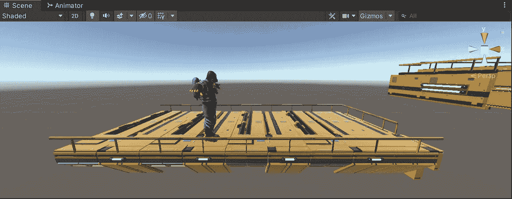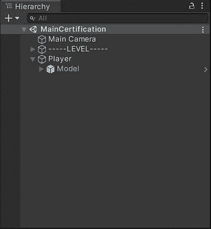

如果你不知道，我从 Filebase 得到了这个模型，我在这篇文章中解释了我是如何做到的:

 [## 通过 Filebase | Unity 获得游戏资产

### 关于如何在 Unity 中从 Filebase 引入游戏资源的快速指南

fas444.medium.com](https://fas444.medium.com/game-assets-via-filebase-unity-95cc7fdc05c8) 

如果我们在 Unity 中打开一个动画窗口，我们将能够根据控制器的状态看到当前正在执行的动画剪辑。如果你看下面的 gif，你会注意到玩家可以使用一个空闲、行走和奔跑的动画:

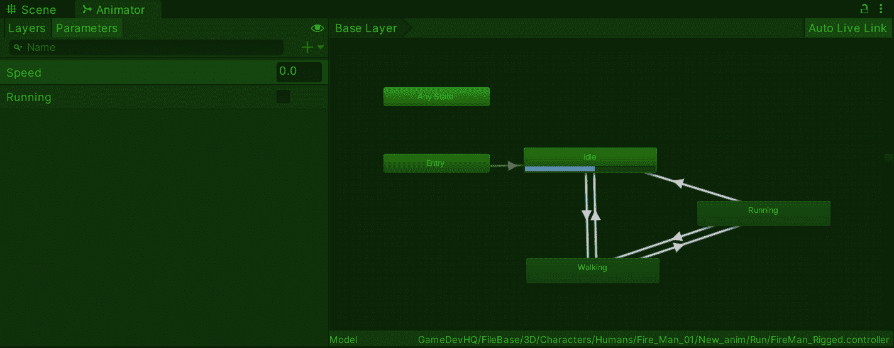

所以，为了不断改进我们的游戏，让我们引入一个新的动画来显示玩家在奔跑和跳跃的时候。

# 获取动画

如果我们需要为你的游戏获得动画或角色，那么一个好的选择是使用 Mixamo 资产。Mixamo 允许我们为个人、商业和非营利项目免费使用角色和动画。

你可以在这里查看 Mixamo 的常见问题:

 [## Mixamo 常见问题

### Mixamo 自动索具系统仅适用于人形角色，并有一些其他特定要求。检查…

helpx.adobe.com](https://helpx.adobe.com/creative-cloud/faq/mixamo-faq.html) 

因此，为了获得跳跃动画，让我们创建一个帐户来使用 [Mixamo](https://www.mixamo.com/#/) 并登录:

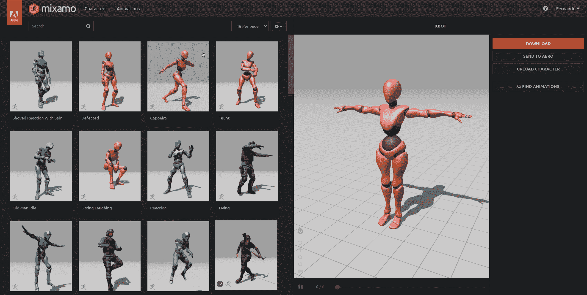

然后，让我们在搜索栏上写下并选择我们要寻找的动画:

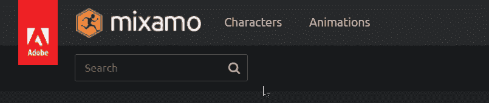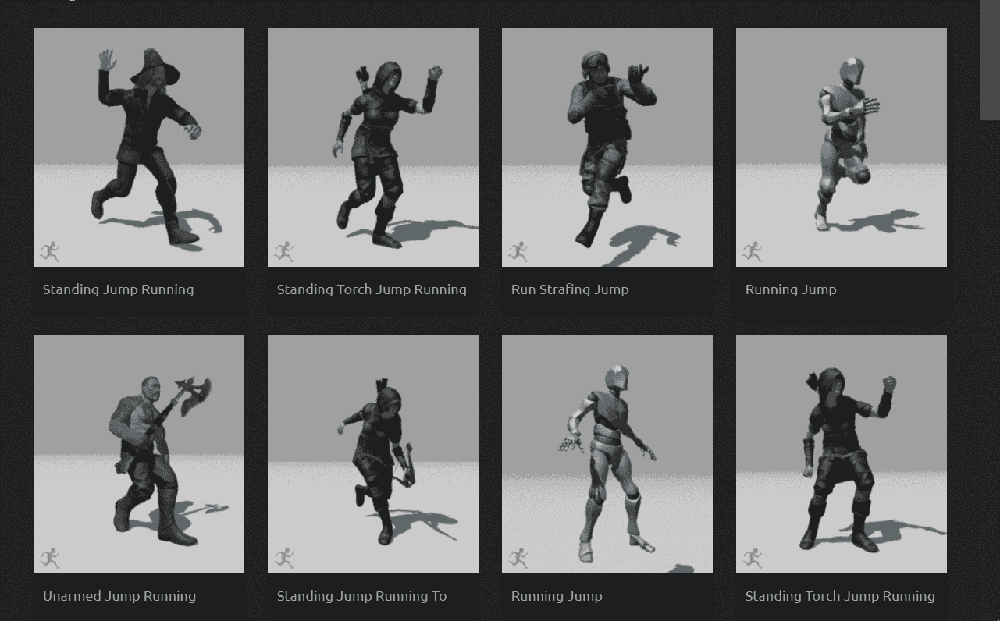

一旦选中，我们将能够看到动画在右边的粉红色模型上运行。此外，我们提供了不同的值来定制我们想要的动画。一旦我们对它满意了，让我们点击下载按钮:

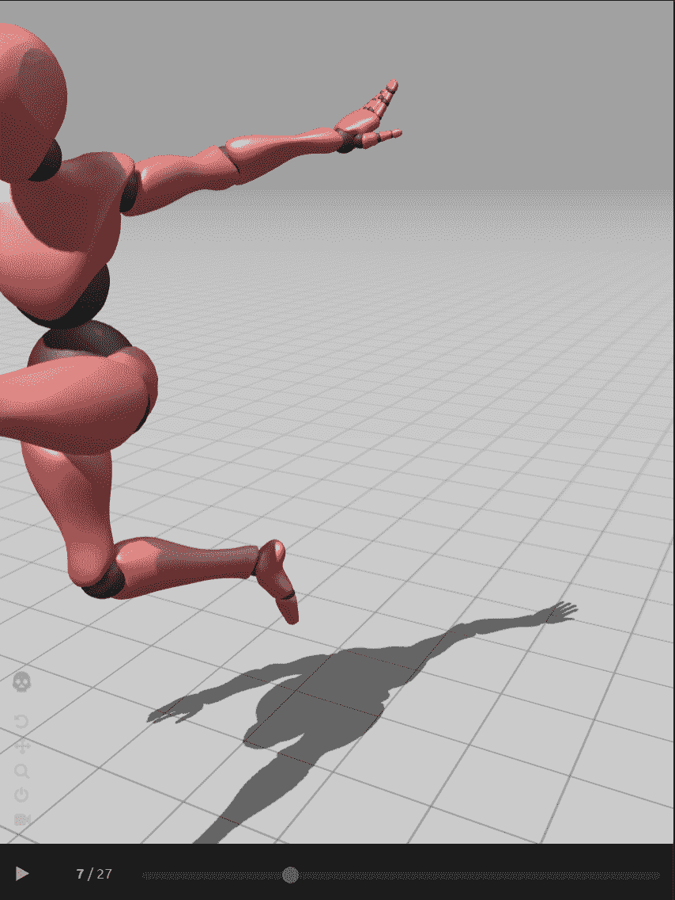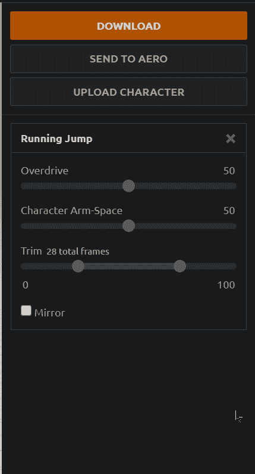

将出现一个窗口，提示选择动画的格式、FPS、皮肤和关键帧减少。因此，当我们使用 Unity 时，让我们选择 Unity 的 FBX 选项并继续下载:

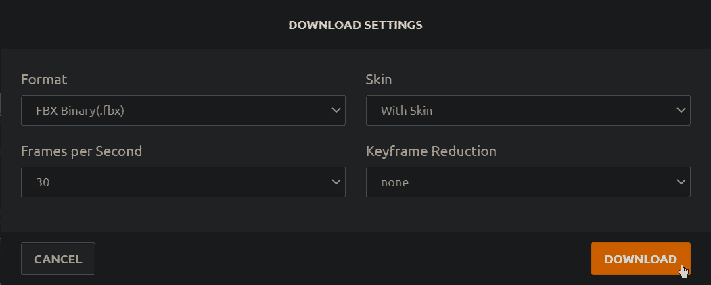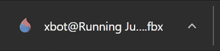

# 实现动画

现在，为了将来自 [Mixamo](https://www.mixamo.com/#/) 的动画实现到我们的项目中，让我们将文件导入到我们的项目文件夹中:

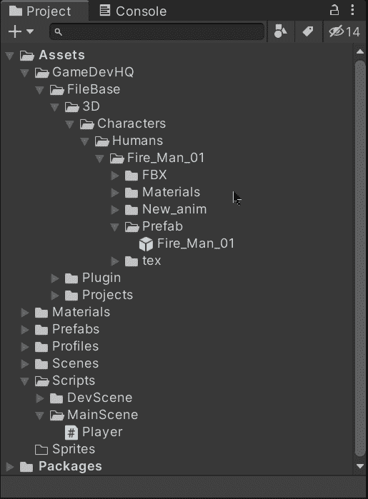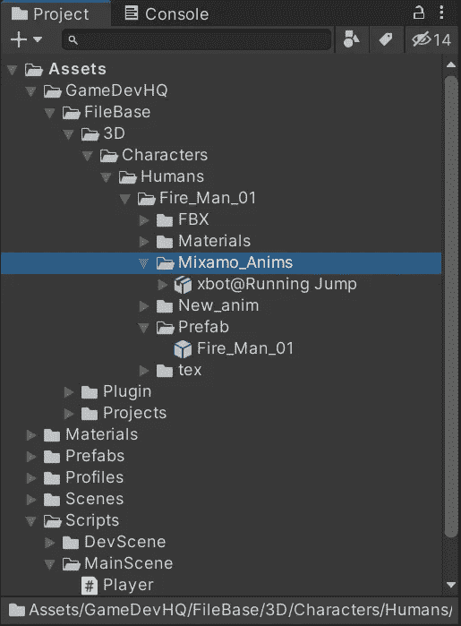

在 Unity 中，我们将能够看到文件包含我们需要在播放器中使用的动画剪辑。在使用它之前，让我们选择下载的文件并:

*   通过检查器选择**装备**选项卡。
*   改变动画类型为**人形**而不是普通。
*   点击**应用**应用更改。
*   在下载的文件中选择**动画剪辑**。
*   通过按键盘上的 Ctrl + D 复制动画剪辑，这样我们就可以通过检查器修改它的属性。

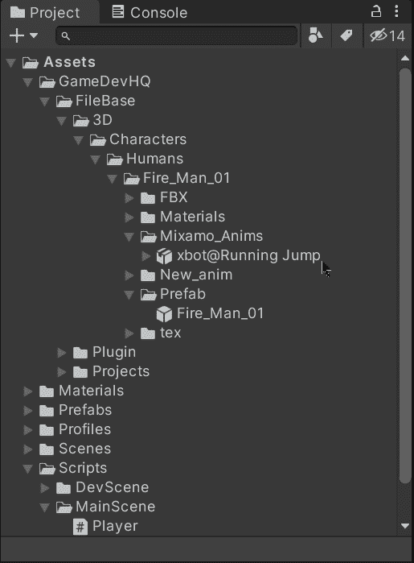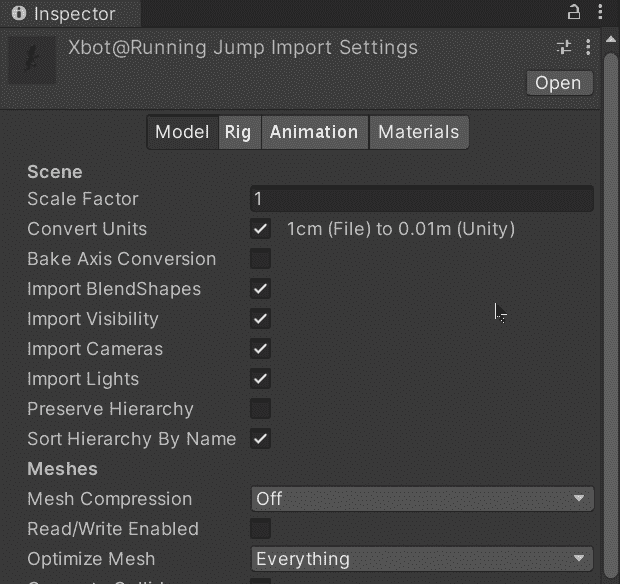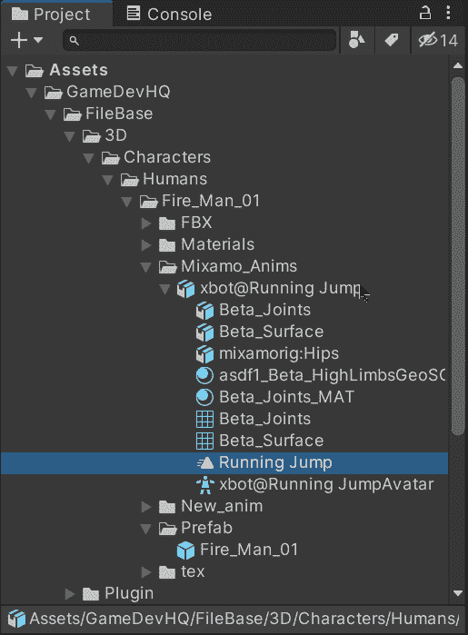

现在，让我们将复制的动画剪辑拖动到 Animator 窗口中，该窗口显示我们的播放器的动画控制器。添加完毕后，让我们创建相应的过渡来指示允许动画被触发和完成的状态:

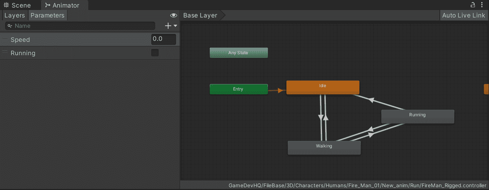

为了执行动画，我们可以创建一个 Trigger 类型的参数。创建完成后，让我们选择相应的过渡，然后:

*   禁用 ***有退出时间*** 属性，避免在执行跳转动画之前等待其他状态的动画结束。
*   添加**跳转**触发器作为进入动画控制器跳转状态并执行动画的条件。

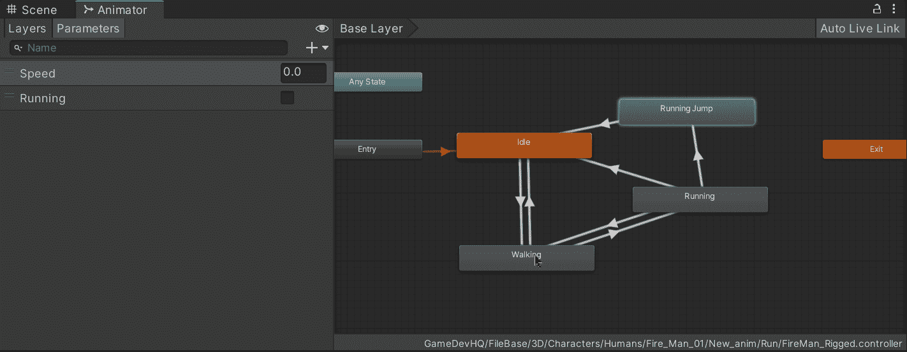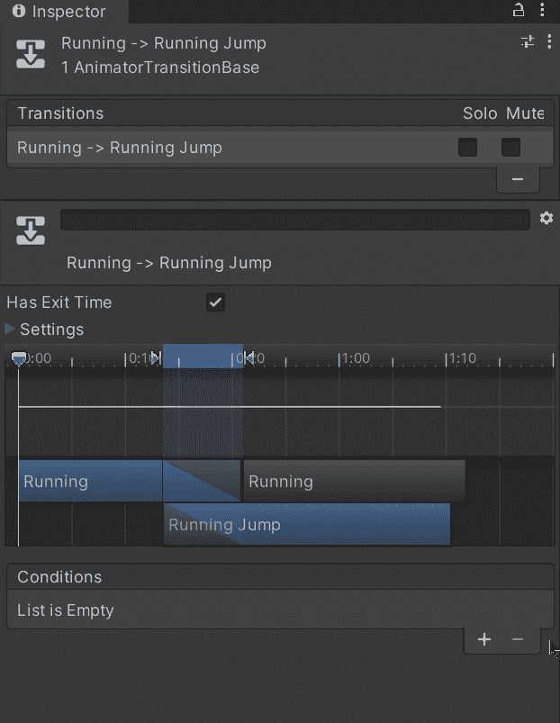

现在，为了触发动画，让我们打开**播放器**脚本并创建一对新变量:

*   动漫

这个变量将在我们玩家的模型中存储一个对**动画师组件**的引用。

*   运转

这个变量将指示播放器当前是否正在运行。

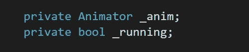

然后，在 **Start** 方法中，让我们初始化第一个变量，以获取我们的玩家(模型)的子游戏对象中的 animator 组件:

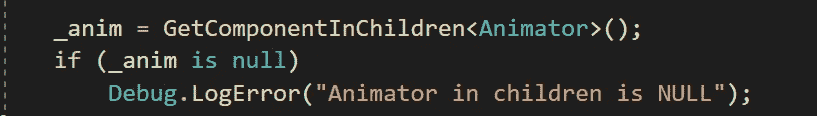

最后，让我们检查玩家何时按下空格键来施加相应的力以使我们的玩家跳跃，然后通过使用我们模型的 Animator 组件中的 **SetTrigger** 方法来触发动画:

如果我们用 Unity 运行游戏，我们将能够看到玩家跳跃时动画如我们预期的那样运行:

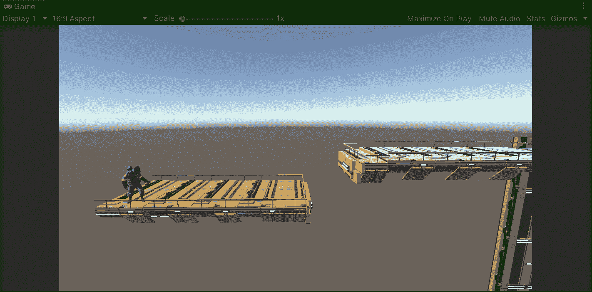

就这样，我们在我们的项目中制作了玩家的动画！:d .我会在下一篇文章中看到你，在那里我将展示如何用 Unity 创建一个壁架抓取机制。

> *如果你想更多地了解我，欢迎登陆*[***LinkedIn***](https://www.linkedin.com/in/fas444/)**或访问我的* [***网站***](http://fernandoalcasan.com/) *:D**