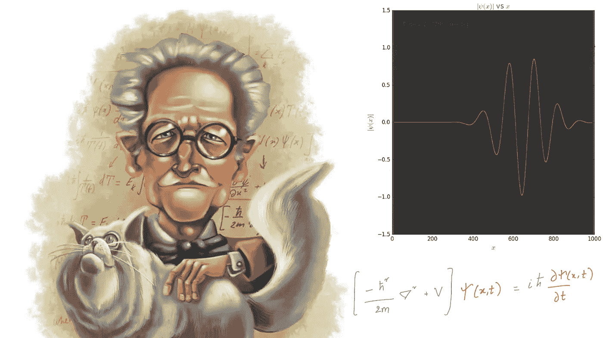
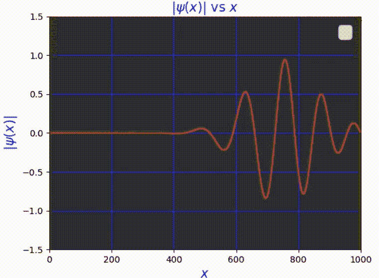
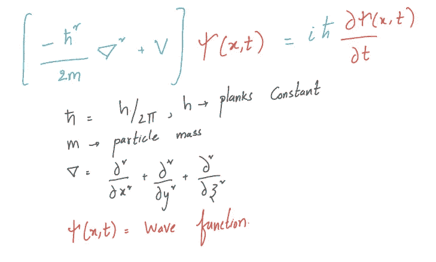
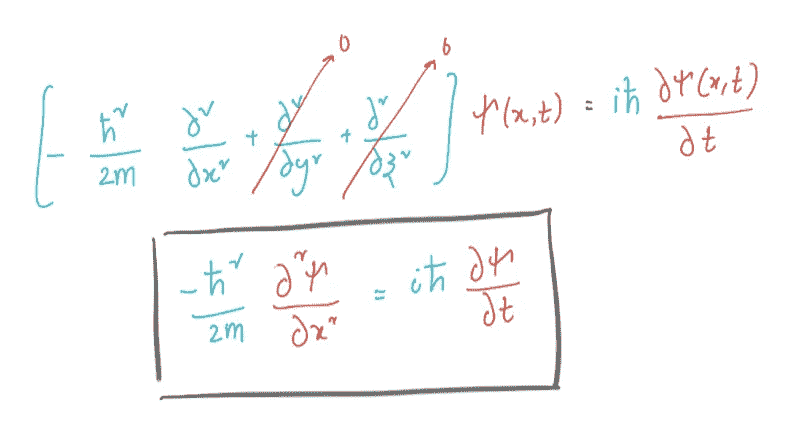
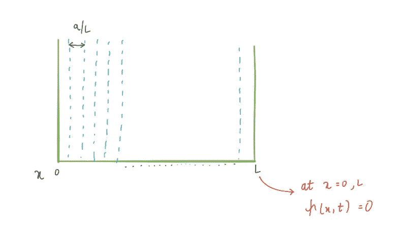
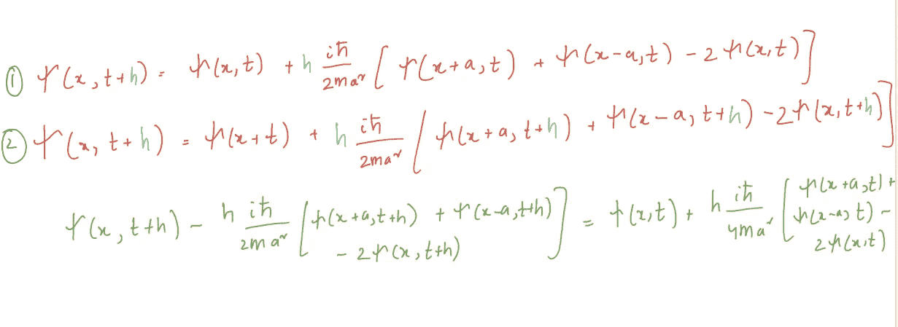
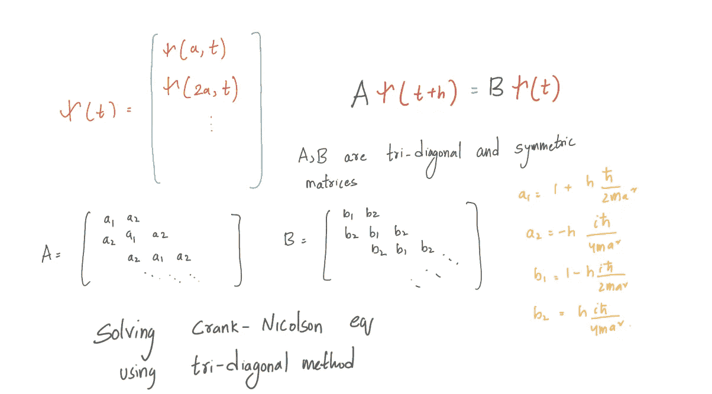
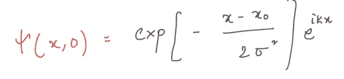

# 使用 Python 制作粒子的薛定谔波函数(ψ)动画(带全部代码)

> 原文：<https://medium.com/nerd-for-tech/animating-schrodinger-wave-function-%CF%88-of-a-particle-using-python-with-full-code-5ad9e4852906?source=collection_archive---------4----------------------->

## 用曲柄-梁君诺法求解盒中质点

左图:[来源](https://www.simplycharly.com/people/erwin-schrodinger)，右图:作者生成

盒子中粒子的波函数动画

# 介绍

物质的双重性在物理学家中是一个著名的概念。原子尺度的物质在某些情况下表现为粒子，而在某些情况下表现为波。为了解释这一点，我们引入波函数ψ(x，t ),它描述的不是粒子的实际位置，而是在给定点发现粒子的概率。满足或许是最重要的偏微分方程的波函数ψ(x，t)或概率场，至少对物理学家来说，是薛定谔方程。

薛定谔方程，由作者生成

# 一维薛定谔方程

我们将看看一维的薛定谔方程。二维或三维波函数的求解方法与一维波函数的求解方法基本相同。但是为了形象化和节省时间，我们将坚持一维。让我们推导一维情况下的薛定谔方程。

1D 薛定谔方程，由作者生成

## 用曲柄-梁君诺法求解盒中质点

框，由作者生成

我们将求解一个粒子的波动方程，这个粒子在一个有着密不透风的墙的盒子里。这个想法是在一个有限大小的空间里解这个方程。但是为什么在不可穿透的墙壁里？这种情况迫使波函数在壁上为零，我们将 x = 0 和 x = 1。我们将用有限差分代替薛定谔方程中的二阶导数，并应用欧拉方法。

欧拉方法在 1D 薛定谔方程中的应用

上述推导使我们能够递归求解薛定谔方程。在 x = 0 和 x = 1 处的边界条件对于所有 t 波函数ψ(x，t) = 0。在这些点之间，我们在 a、2a、3a 等处有网格点。让我们把这些内点的值ψ(x，t)排列成一个向量。

用作者提出的三对角线法解曲柄-梁君诺方程

现在事情很简单，我们有一个传播函数:
**A**ψ(t+h)=**B**ψ(t)，其中矩阵 **A** 和 **B** 都是对称的和三对角的。我们必须在时间步长 t= 0，ψ(0)初始化波函数。使用传播函数，我们可以近似ψ(h ),然后使用ψ(h ),我们可以近似ψ(2h ),以此类推。在时间 t = 0 时，粒子的波函数ψ(0)具有以下形式。

波函数ψ(0)

ψ(0)的表达式不是归一化的，实际上应该有一个总体倍增系数，以确保粒子的概率密度整合为一。

# 盒子中粒子的波函数动画

我们将尝试使用克兰克-梁君诺方法在一个有着不可穿透的墙壁的盒子里制作粒子动画。给定初始波函数ψ(0)并使用切片长度= L/N 的空间切片(N = 1000 ),我们将需要计算网格上所有时间步长的向量ψ(x，t)。

盒子中粒子的波函数动画，由作者生成

由作者生成

# 完整代码🤩