# 在 Unity 中制作精灵动画

> 原文：<https://medium.com/nerd-for-tech/animating-sprites-in-unity-9d02762bde96?source=collection_archive---------7----------------------->

## 统一指南

## 关于如何在 Unity 中制作精灵动画的快速指南

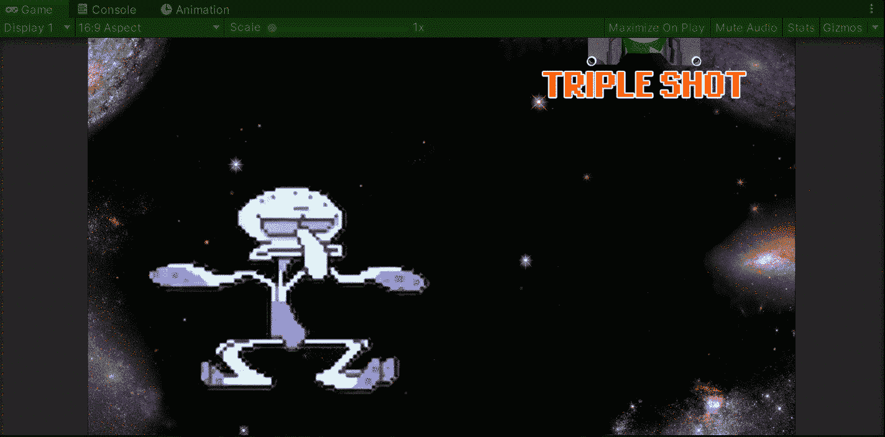

**目标**:在 Unity 中制作一个太空射击游戏的道具动画。

现在[已经在 Unity](/nerd-for-tech/creating-a-power-up-for-your-game-in-unity-6810d73376a1) 中为太空射击游戏实现了一个加电项目，我们需要突出显示它，让它更容易被玩家注意到。为了做到这一点，让我们使用 Unity 编辑器的工具来制作精灵的动画。

首先，我们需要选择将在场景中制作动画的开机项目:

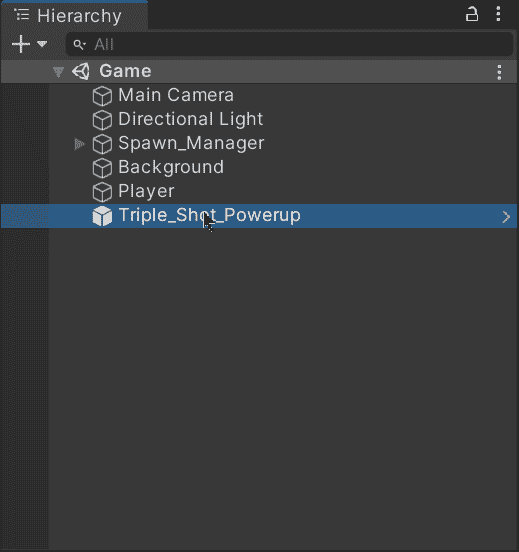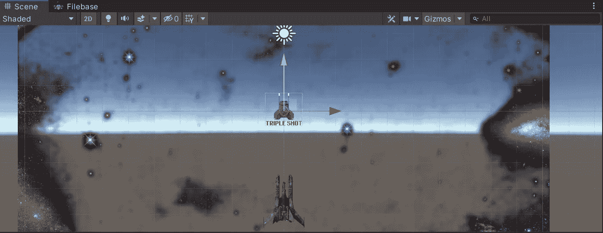

然后选择窗口>动画>**动画**，会提示一个新窗口。我们可以随意在布局中拖动它:

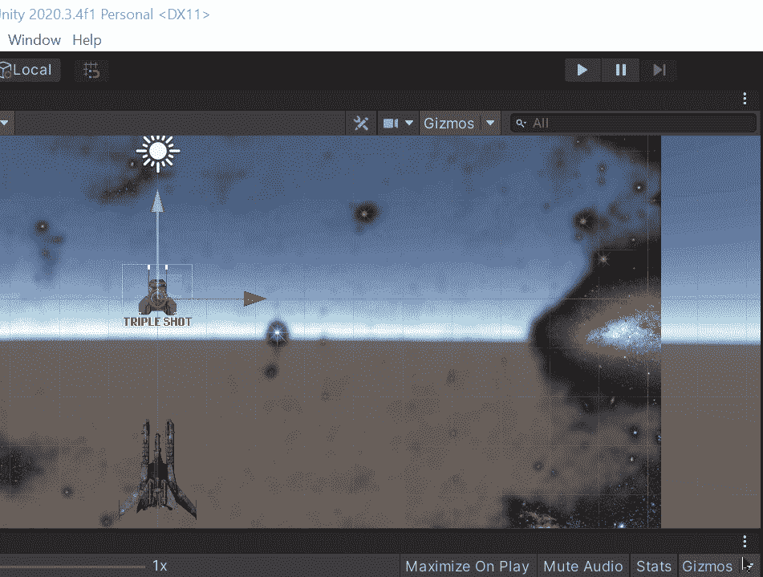

在这个新的**动画**视图中，我们将能够制作开机物品的精灵动画。

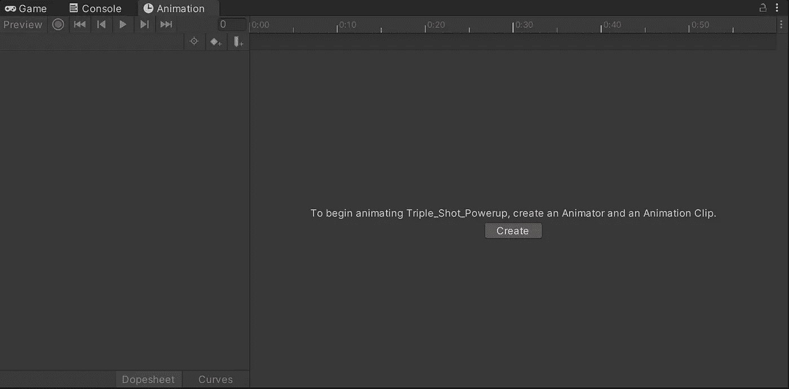

在创建动画之前，创建一个新文件夹来存储动画并保持资源有序。然后，单击“创建”按钮，为新动画命名:

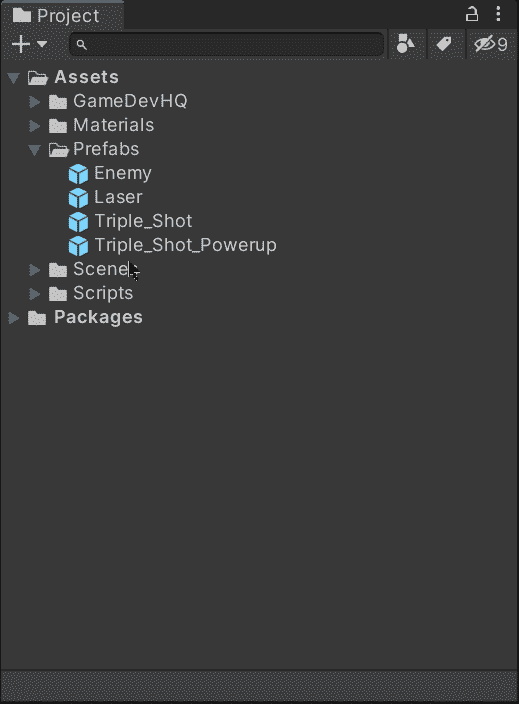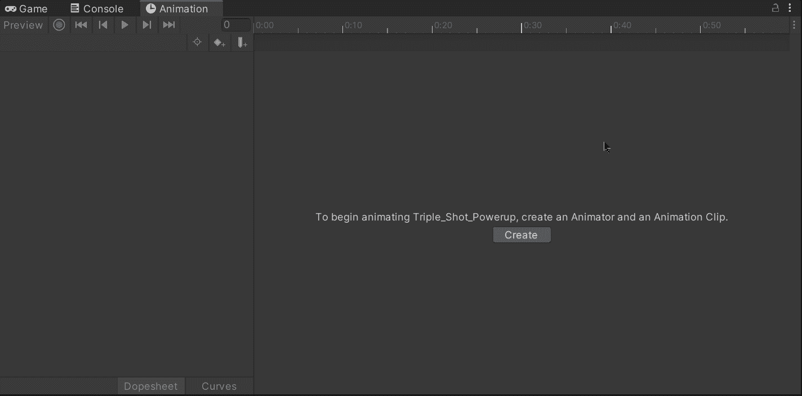

一旦我们创建了动画文件，让我们通过单击红灯开始记录精灵的动画，这将启用每个关键帧的记录:

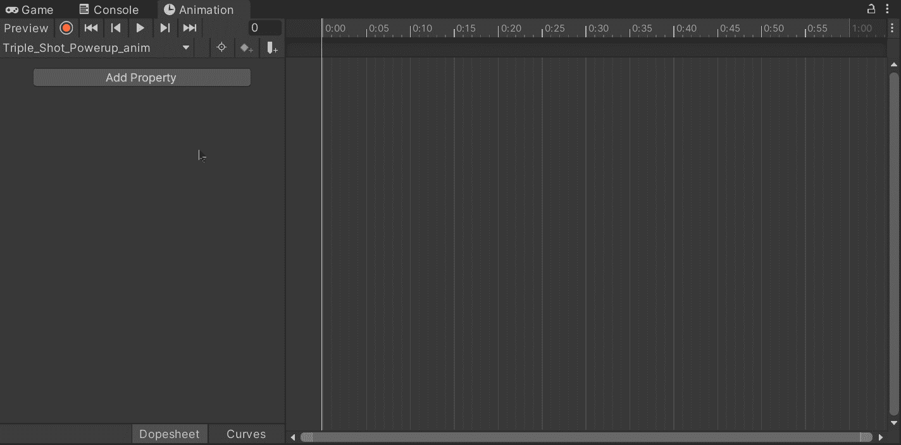

然后，选择将赋予每帧动画形状的不同精灵，并将它们拖动到 Dopesheet。如果动画的精灵是有序的，它们会自动适应:

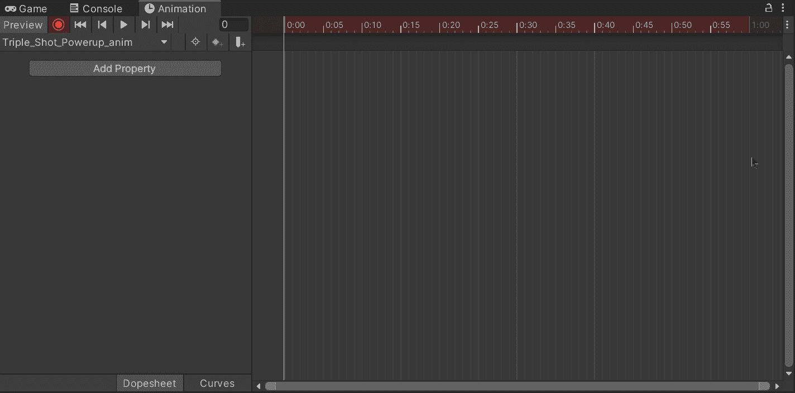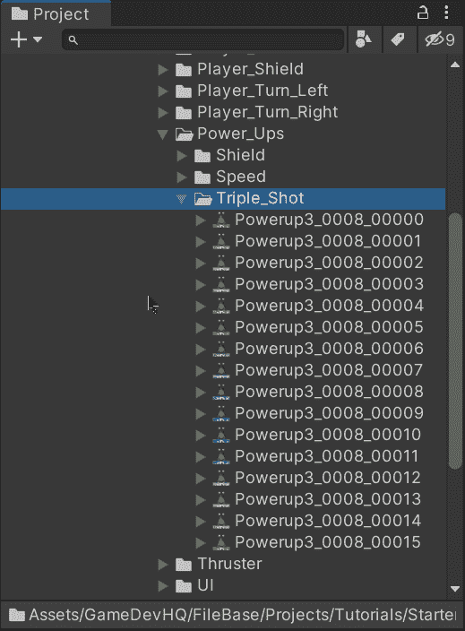

一旦关键帧正常，再次点按红灯停止录制。

要验证动画是否有效，请在场景视图中选择启动项目，然后单击播放按钮观看动画剪辑:

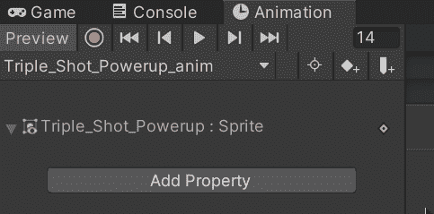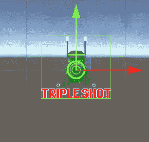

此外，如果您选择场景中的通电项，您会注意到有一个新的 Animator 组件，其中包括之前创建的动画的动画控制器:

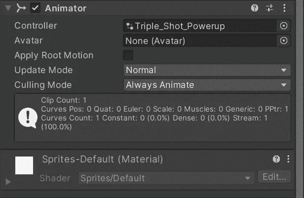

如果双击控制器，将出现一个新的 Animator 窗口，显示应用程序运行时如何处理动画剪辑:

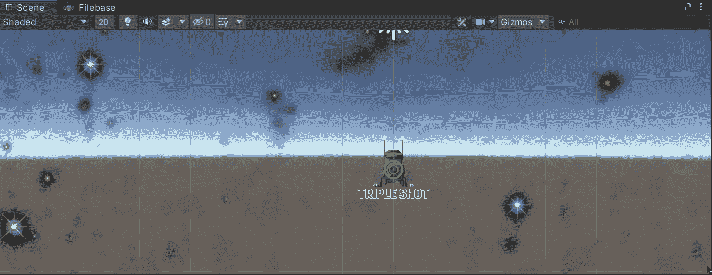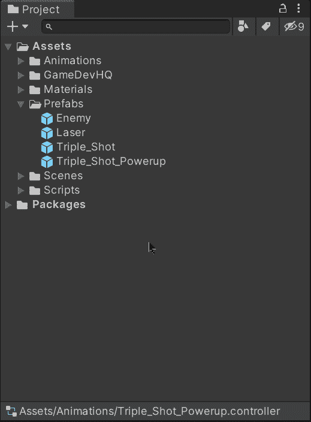

如果我们在 Unity 编辑器中运行游戏，我们会看到动画正在工作，并且循环播放:

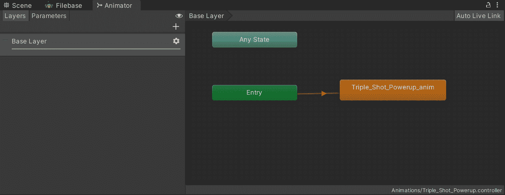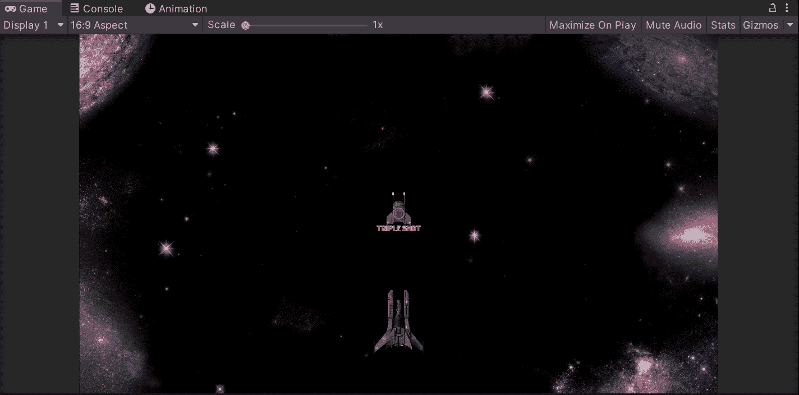

因此，如果我们不希望游戏运行时动画循环，我们需要禁用动画剪辑在检查器中显示的**循环时间**选项:

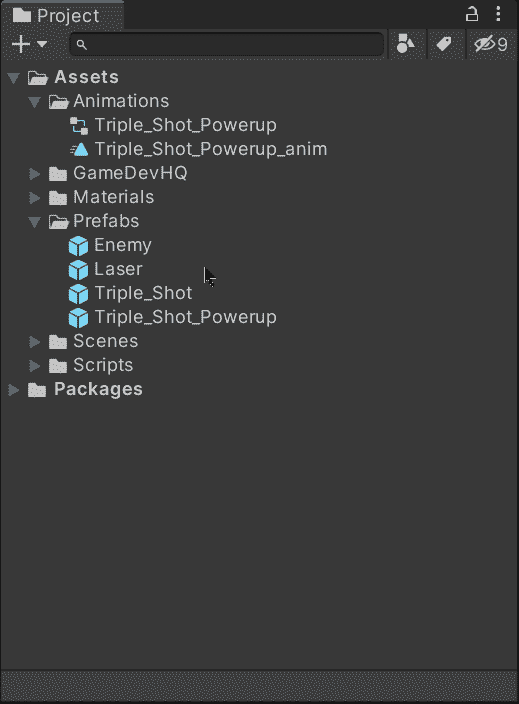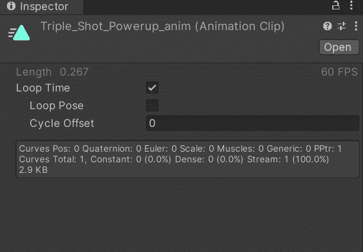

在这种情况下，我希望动画是一个循环。

现在，当游戏运行时，我们将能够看到每次在场景中产生的通电项目的动画:

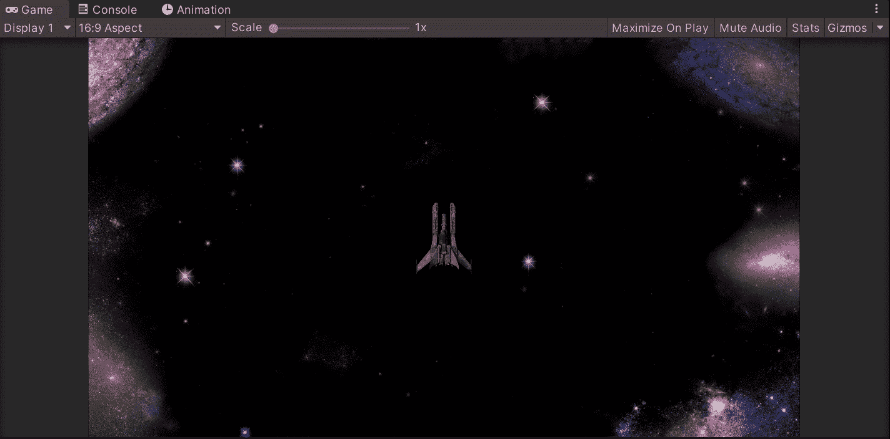

就是这样，你可以在 Unity 中激活一个精灵！:d .我将在下一篇文章中看到你，在那里我将展示如何为太空射击游戏创建模块化的电源系统。

> *如果你想更多地了解我，欢迎登陆*[***LinkedIn***](https://www.linkedin.com/in/fas444/)**或访问我的* [***网站***](http://fernandoalcasan.com/) *:D**