# 在 Unity 中制作精灵动画

> 原文：<https://medium.com/nerd-for-tech/animating-sprites-in-unity-b1c5d995133e?source=collection_archive---------1----------------------->

动画一直是游戏开发中不可或缺的一部分。他们给游戏带来了一种生动或可联系的感觉。在 unity 中有各种方法来激活游戏对象。让我们来看一个在精灵的帮助下处理动画的方法。

***什么是精灵？***

可以把精灵想象成一组 2D 图像，当它们叠加在一起时，就形成了场景中的动画。

***如何在 Unity 中使用小精灵制作动画？***

为了在 Unity 中制作动画，我们首先需要打开一个**动画**窗口，它可以用来创建我们需要的动画。

选择你想制作动画的游戏对象。然后从工具栏中选择**窗口**选项。这将带来一个下拉列表，其中将包含一个**动画**选项，进一步包含一个**动画**选项，选择它们将带来一个弹出的**动画**窗口，然后您可以停靠在您想要的位置。

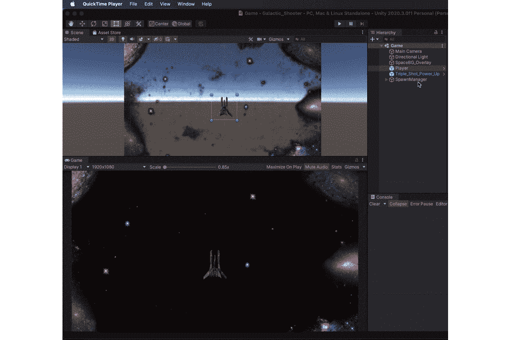

完成后，让我们创建一个动画，

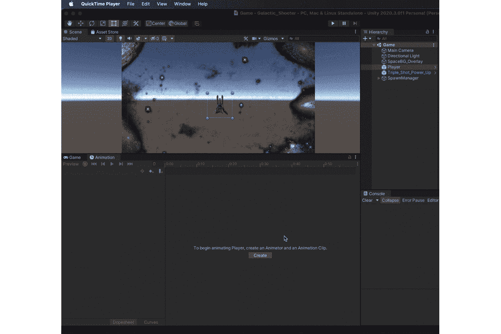

我们现在可以将所有与我们的动画相关的精灵拖到我们的 **Dopsheet 中。**

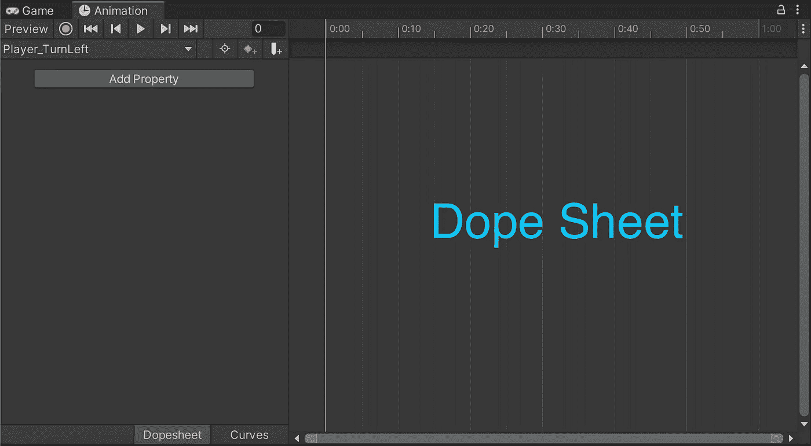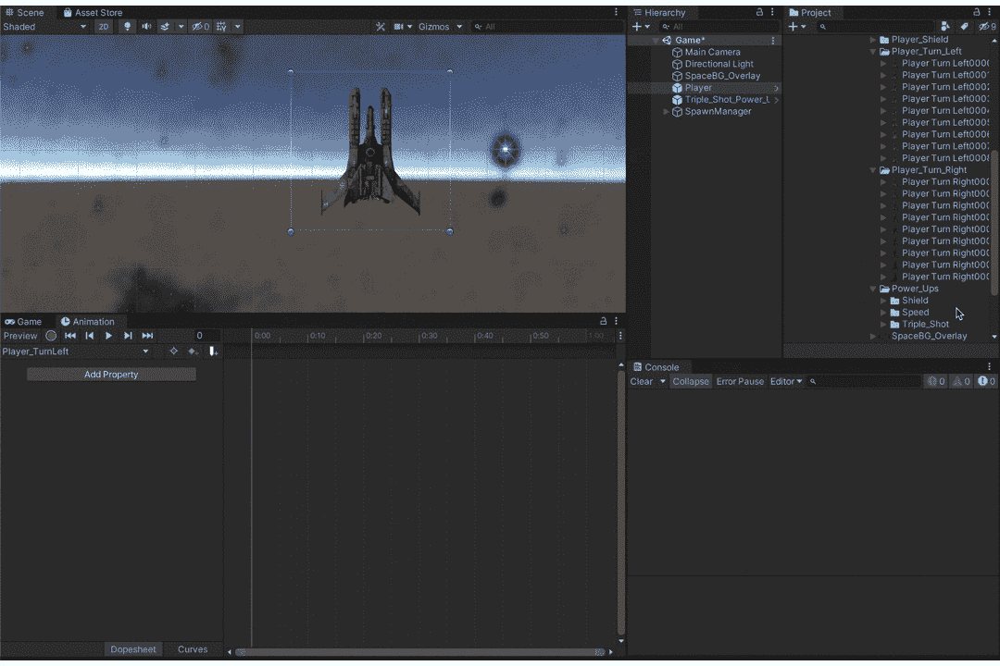

在这里，我们观察到，一旦精灵被添加到摄影表中，我们就能够延长或缩短影响动画持续时间的时间帧。

现在让我们给播放器添加一些动画，

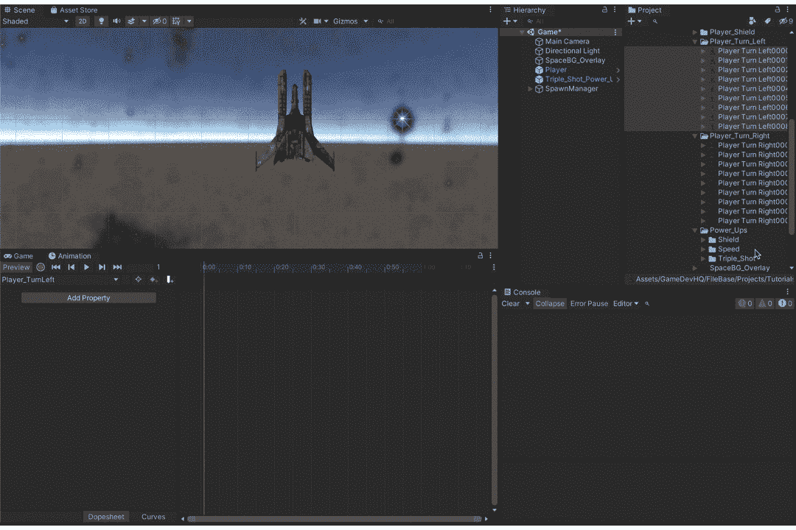

类似地，为空闲状态创建一个动画，并添加其各自的精灵。完成后，我们现在可以继续使用动画控制器。

**项目**面板包含了我们的**动画师**。

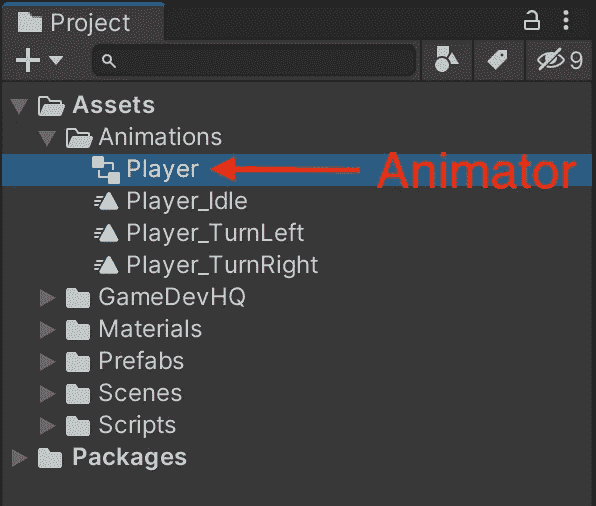

这样，我们就可以使用空闲、左转和右转动画来制作我们角色的动画。

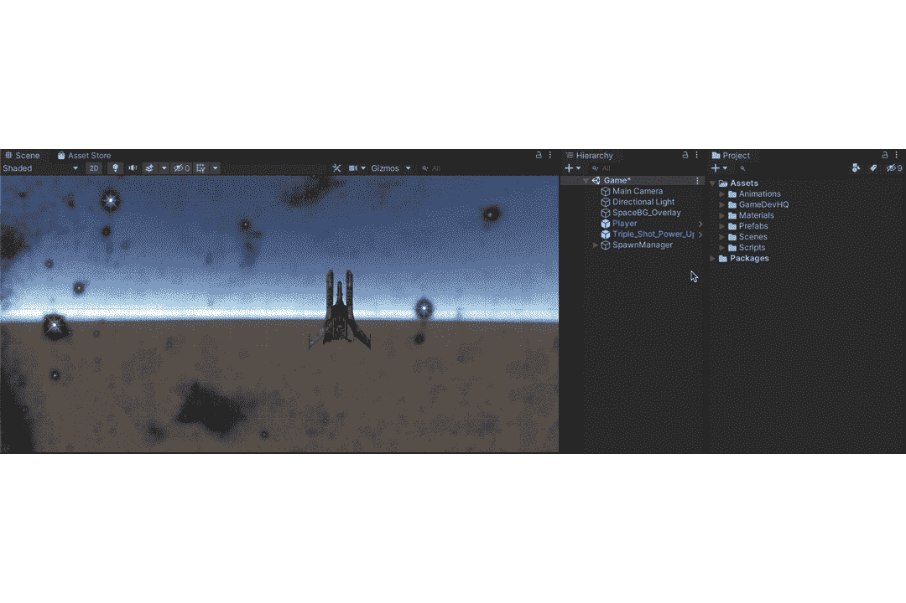

在这里，每个动画可以被认为是一个单独的状态，在给定的条件下，我们可以在这些状态之间转换。把它想象成在沸点加热液体使其转变成气态，同样地，冷冻液体使其凝固。同样，如果我们按下键盘上的左键( **a** )，我们可以从空闲状态转换到**左转**，或者如果我们按住右键( **d** )，我们可以转换到右转状态。这分三步完成，

***步骤 1:*** 从空闲状态转换到相应的状态，反之亦然。

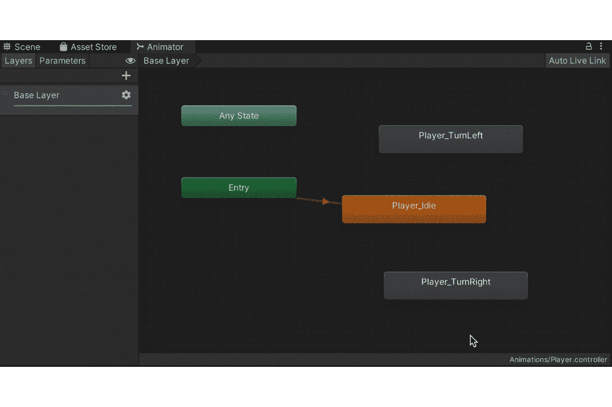

***第二步:*** 创建一个变量，通过这个变量我们可以决定什么时候在状态之间转换。

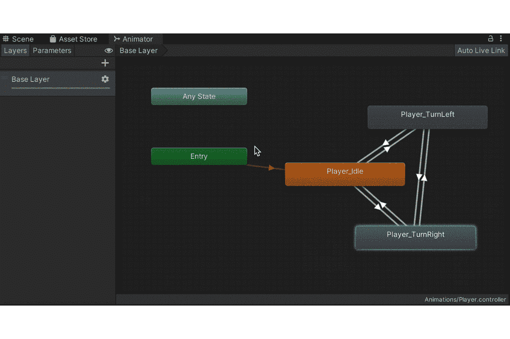

***步骤 3 :*** 使用创建的变量设置条件。

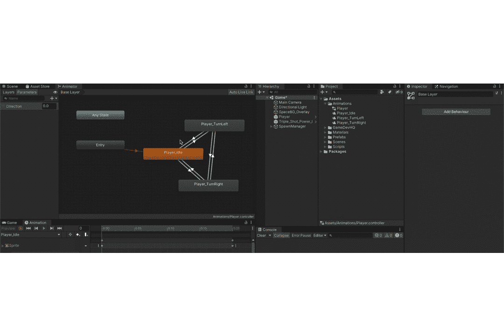

类似地，对其他状态进行同样的操作。

所以基本上，
怠速状态→左转=方向小于 0 时
怠速状态→右转=方向大于 0 时
左转→怠速状态=方向小于 1 且大于-1 时
右转→怠速状态=方向小于 1 且大于-1 时
左转→右转=方向大于-1 且大于 0 时
右转→左转=方向小于 1 且小于 0 时

***Step-4 :*** 我们现在需要一种方法，通过脚本来影响这个**动画师方向**变量。

**_animator** 变量将存储我们的**动画**组件。

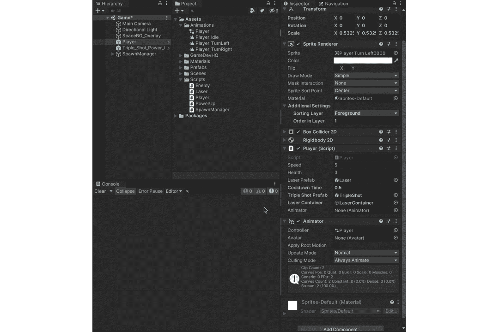

这样我们现在可以使用 **_animator** 来影响**方向**，它将包含我们移动的方向(因为我们使用 **GetAxisRaw** 来获取用户输入，根据我们移动的方向返回-1，0，1)。

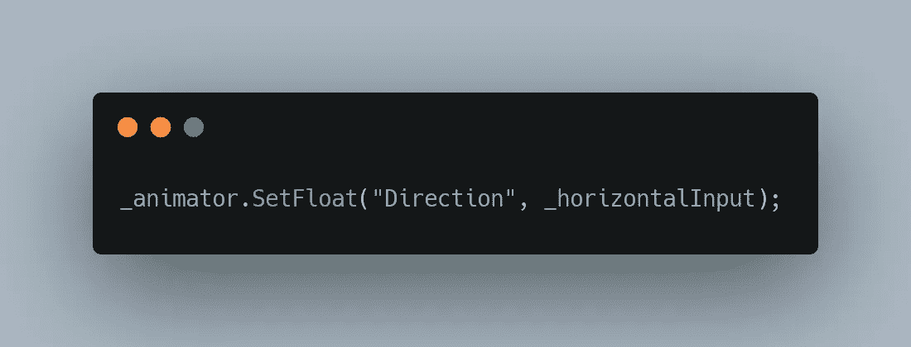

_horizontalInput 存储我们的水平运动。

默认情况下，我们所有的动画都被设置为一次又一次地循环，所以让我们关闭它，因为我们希望动画只在被调用时运行一次。

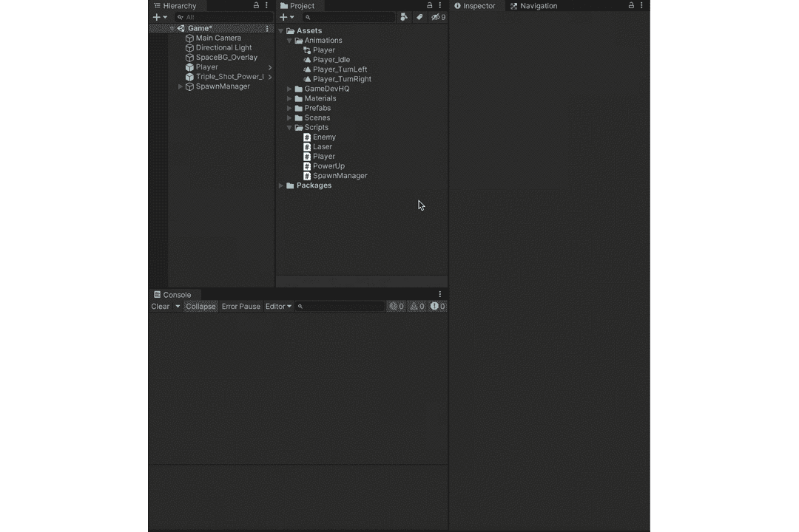

最后，如果你想让你的动画在过渡后播放一段时间，你可以在上切换**有退出时间** **。在这种情况下，我不想要任何退出时间，我希望转换是即时的。**

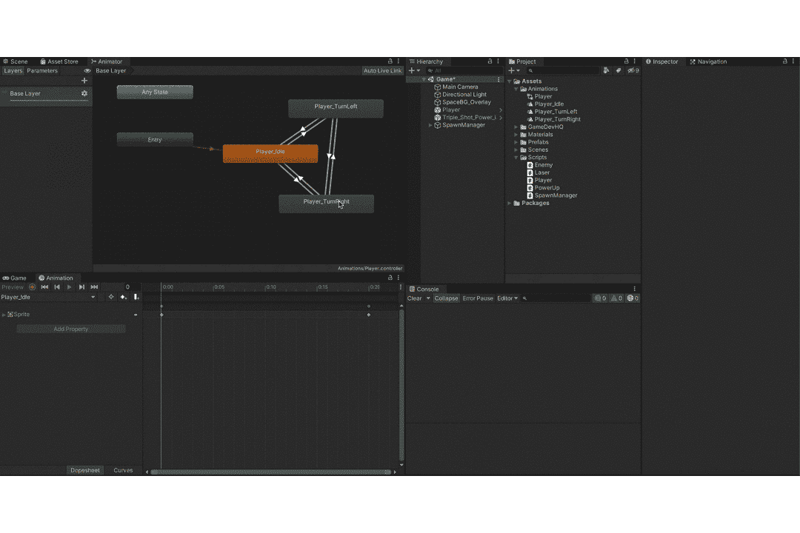

这给了我们以下结果，

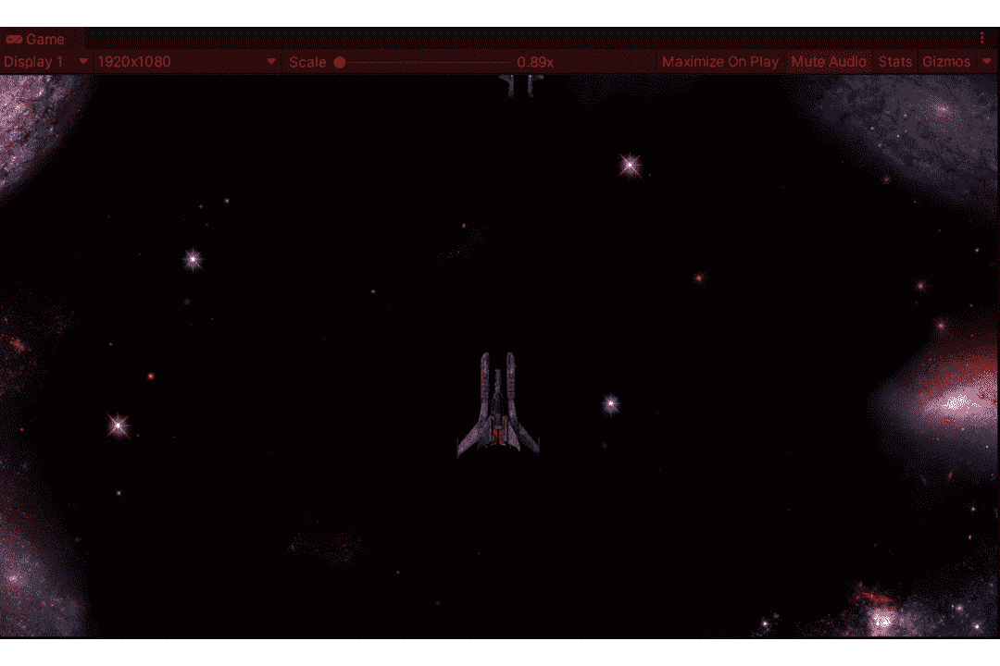

我们也可以直接给游戏对象添加一个动画，如下所示，它会继续循环，结果如下。

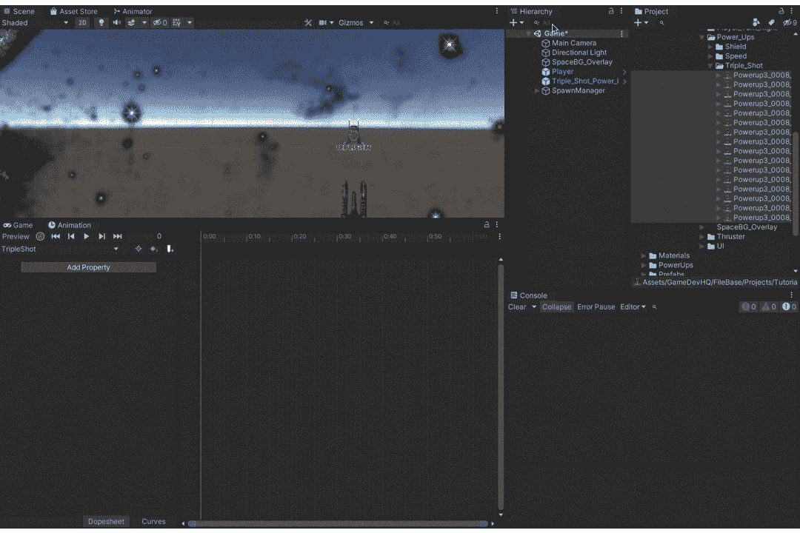

感谢阅读。更多即将推出！！！